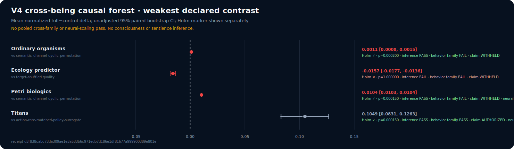
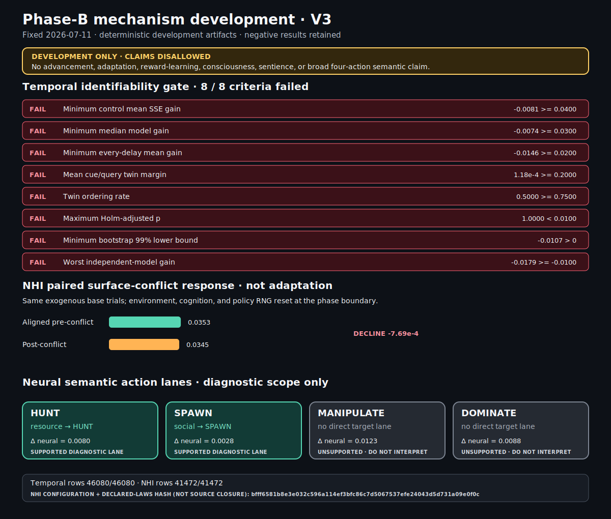
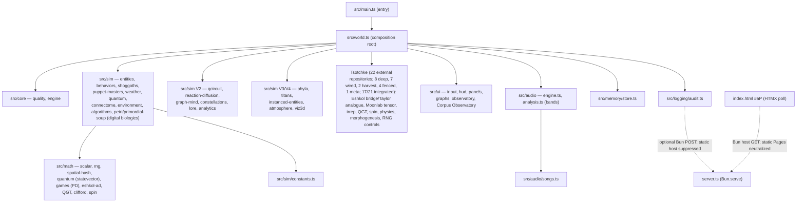
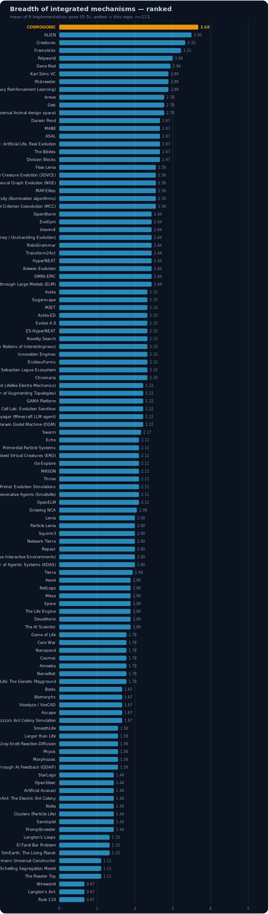
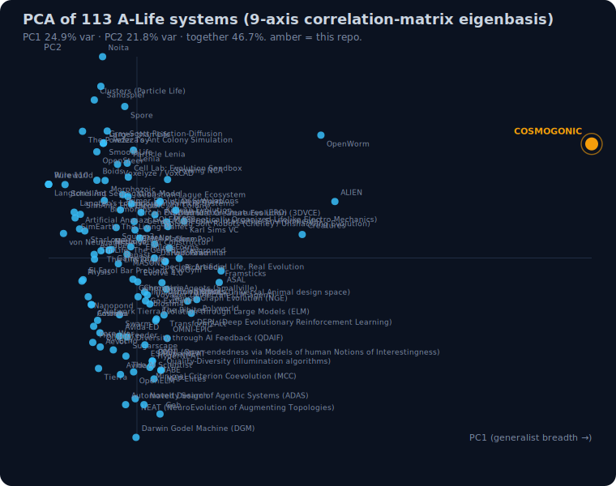
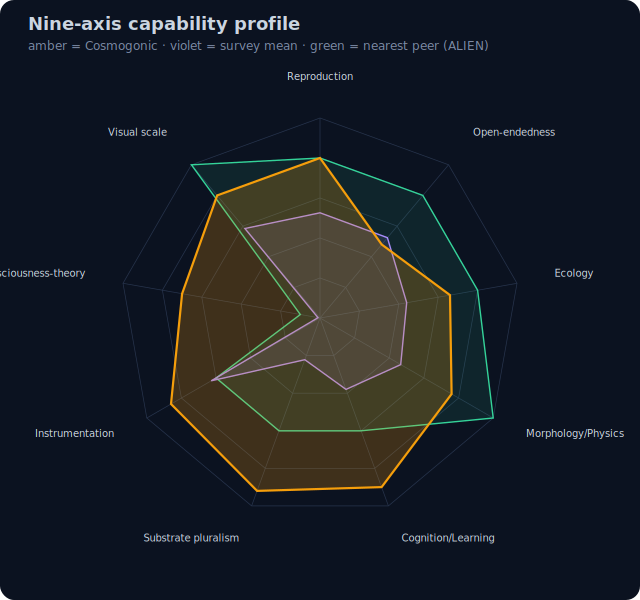

<!-- reviewed: 2026-07-10 | v0.21.13 publication-surface current-truth pass | canonical facts: docs/VERIFICATION-ANALYTICAL-DATA.md -->

# COSMOGONIC QUANTUM MECHALOGODROM

[](./CHANGELOG.md)
[](https://github.com/0thernes/cosmogonic-quantum-mechalogodrom/actions/workflows/ci.yml)
[](https://github.com/0thernes/cosmogonic-quantum-mechalogodrom/actions/workflows/codeql.yml)
[](./LICENSE)
[](https://bun.sh)
[](./tsconfig.json)
[](./tests)
[](./docs/TECHNICAL-SPECIFICATION-2026-06-26.md)
[](./docs/500-POINT-INSPECTION-2026-06-26.md)
[](https://github.com/tsotchke)
[](./docs/NHSI-PROGRESS-DASHBOARD-2026-06-26.md)

A procedural WebGL cosmic ecosystem — morphogenic organisms, Shoggoths,
puppet-master NPCs, atmospheric weather, a neural connectome, quantum
diffusion, **and the Tsotchke corpus wired as the primordial substrate for digital biologics — the deterministic, measured path toward proto-sentience and the consciousness indicators** (real math substrates; sentience is the GOAL, never claimed as reached).

**The living docs (README, ARCHITECTURE, ERD/ERM/ERP, PHILOSOPHY, MODULE-CONTRACTS, SPECS, dashboard) and the in-app "Dome/World" docs are sync-managed where canonical tokens exist, then manually current-truth reviewed for claims that automation cannot prove.** A `docs-truth-law` CI gate fails the build on doc overclaims or encoding mangling, and the [NHSI progress dashboard](./docs/NHSI-PROGRESS-DASHBOARD-2026-06-26.md) plus [verification data](./docs/VERIFICATION-ANALYTICAL-DATA.md) are the canonical status surfaces.

**Current public truth (2026-07-11):**

- Package/source version: **v0.21.13**.
- Exact tracked-suite receipt: **2,807 tests / 0 fail**. Portable public coverage floor: **84.64% line / 82.21% func**.

<!-- cqm-sync:local-measurement:start -->

- Latest Windows-local measurement in this checkout: **2,776 tests / 0 fail · 3,556,484 `expect()` calls**; coverage measured `93.17%` line / `91.17%` func across 307 test files.

<!-- cqm-sync:local-measurement:end -->

- `verify:facts` exits 0 with no drift across 74 Markdown/HTML/XML surfaces.
- Consciousness/sentience language is **indicatorOnly**: computational proxies, falsifiers, and controls; never proof of phenomenal experience or completion of the sentience goal.
- The batch-26 adversarial repair pass replaced cell-snapped flora lookup with an `O(1)` four-cell
  bilinear sampler and sealed chemotaxis against the shipped field, corrected final-position forager
  telemetry, and closed root-pathspec plus cancellation gaps in the read-only AI sandbox. These are
  defect repairs, not evidence for an A-Life, consciousness, or sentience score increase.
- The [2026-07-10 organism-intelligence causal audit](./docs/reports/2026-07-10-OPERATIONAL-ORGANISM-INTELLIGENCE-CAUSAL-AUDIT.md)
  uses a fresh disjoint fixed 30-seed family. Goal-only and corpus-conditioned effects passed,
  adaptation cleared `5%` at `6.1213%`, `17/17` integrated rows stayed causal, all named consumer
  classes gained matched tests, and three-process performance stability passed after hot-path
  optimization. Uniform random-action baseline separation and aggregate-mapping specificity did not pass. V3 authorizes
  no additional A-Life, consciousness, or sentience score uplift.
- The [repository-preregistered V4 descendant result](./docs/reports/ORGANISM-INTELLIGENCE-V4-RESULTS-2026-07-11.md)
  retains all 1,152 rows across four 64-seed families. Ordinary organisms failed the frozen magnitude
  floor, the adaptive predictor failed its controls, and Petri effects remained below the magnitude
  floor. Titans alone passed, authorizing only bounded game-policy semantic causality on the frozen
  diplomacy task. [Receipt](./docs/reports/assets/organism-intelligence-causal-benchmark-v4.json) ·
  [raw CSV](./docs/reports/assets/cross-being-neural-causality-v1.csv) ·
  [forest SVG](./docs/reports/assets/organism-intelligence-v4-cross-being-forest.svg). V4 authorizes no
  score, neural-scaling, consciousness, sentience, or general-intelligence uplift.
- [Phase-B development](./docs/adr/0015-phase-b-neural-semantic-expansion-2026-07-11.md) preserves those
  failures and rejects all 170 historical evaluation/calibration seeds through 22 disjoint development
  families. NHI now has a default 109-weight `9→6→7` inherited gene, exact JSON checkpoints, structured
  effect/fact acknowledgement, and real bounded world actions. Its 41,472-row closed-loop task retains
  every row but permits only narrow HUNT/resource and SPAWN/social diagnostics; paired surface-conflict
  service declines, so adaptation/learning and broad four-action claims are prohibited. A separate
  101-input temporal Predictor-V3 allocates 926/1,750/3,398 parameters, but its 46,080-row task fails all
  eight advancement criteria. Predictor-V2 (54/98/186) and the ordinary resource head (27/51/99) also
  remain rejected and production-ineligible. [Result](./docs/reports/PHASE-B-MECHANISM-DEVELOPMENT-V3-2026-07-11.md)
  · [JSON](./docs/reports/assets/phase-b-mechanism-development-v3.json) ·
  [CSV](./docs/reports/assets/phase-b-mechanism-development-v3.csv) ·
  [SVG](./docs/reports/assets/phase-b-mechanism-development-v3.svg).
  No successor confirmatory manifest or score uplift follows.





Built with **Bun + TypeScript + three.js 0.185.1 + Tailwind CSS 4 +
HTMX 2**, ported from a single 882-line HTML monolith into a strict,
deterministic, allocation-disciplined module graph.

**Tsotchke (tsotchke user + Tsotchke-Corporation + the optional local corpus) is provenance-critical; each external repository is represented only to its declared depth and license boundary.** The [binding integration ledger](./docs/TSOTCHKE-INTEGRATION-MAP-2026-06-26.md) records exactly 22 external repositories: `8 deep`, `7 wired`, `2 harvest`, `4 fenced`, `1 meta`, or `17/21 = 0.8095238095238095` integrated after excluding metadata. `OBLITERATUS` is one of the four deliberate fences; `classical-contrast` is a live internal control, not a 23rd external repository. Eshkol, Moonlab, QGT, spin, libirrep, tensor, RNG, physics, and morphogenesis roles are direct ports or deterministic facades as identified in the ledger; all four fenced repositories remain inert. **NHSI (100-faculty design ~30 deep-wired · 25 Archons = 5 live + 20 light-echo · 25 ToM wired · 10 emergence angles · Butlin 8/14 met + 6/14 partial path):** [docs/NHSI-PROGRESS-DASHBOARD-2026-06-26.md](./docs/NHSI-PROGRESS-DASHBOARD-2026-06-26.md). The seeded simulation core is not an LLM; the optional Copilot is a read-only, default-deny UI/server shell fenced out of deterministic state. No physical-quantum, sentience, or security claim follows from a simulated substrate.

The simulation core is not an LLM or tokenizer demo. It is a seeded, inspectable artificial-life petri system where **digital biologics** grow in the Petri Dish (`primordial-soup.ts` + `petri-dish.ts` + `digital-biologics.ts`). Eshkol programs act as heritable substrate code, mutated by AD gradients, selected by aliveness/QGT/collective-order proxies, and measured as computational indicators rather than subjective experience. The optional Copilot side-chat remains outside that seeded loop.

**Brain-Wide Computational Model direction:** the implementation target is not a behavior-mimicking neural net. The target is a brain-wide computational model with explicit provenance: sensory input drives neural/control-state activity, and that activity drives motion in a physics-based body. When real biological connectome data is used, the source and transformation must be cited; otherwise the repo describes the current Archons as deterministic composite minds with ~20 faculties, quantum registers, and consciousness metrics, not as proven biological connectome replicas.

Super Creature / 25 Archons is the framework and the **beginning only** — "as if God made primordial inorganic soup". The soup grows independent digital biologics onward. "Grow What Thou Wilt." (Aleister Crowley)

Seeded simulation runs are reproducible under the sealed deterministic paths. The measured population
hot paths avoid per-entity controller allocation, and ported constants are retained only where source,
tests, or explicit model assumptions support them.

**Websites / Domains (100% accurate):**

- **GitHub Pages (DOCS / SPECS / BIBLE / LABS):** https://0thernes.github.io/cosmogonic-quantum-mechalogodrom/ (index.html + docs.html + specs.html + bible.html + lab/index.html + lab/consciousness + lab/sentience ; built via scripts/build-pages.ts with ?v= cache-bust and subpath rewrite)
- **Local dev server:** http://localhost:3000/ (bun dev; serves /docs → docs page, /spec → specs, /lab → lab; full interactive + /api/audit)
- Public, tracked docs/report targets are copied into the Pages artifact by `scripts/build-pages.ts`; source `./docs/...` links resolve locally and deploy as static `site/docs/...` files. Local-only historical drafts under `docs/reports/2026-07-07/` are intentionally not public release targets.

> — **New here? Read [THE BOOK](./docs/BOOK-2026-06-26.md)** — the master index over every doc, an
> auto-generated [file map](./docs/FILE-MAP.md) of the source modules, and the build/run, data-flow,
> troubleshooting, and roadmap in one place. Or open **❓ HELP ME NOW** in-app for grounded answers.
>
> — **Brain/Neurology/Consciousness Assessment:** See the dated 2026-07-07 [CONSOLIDATED-22-MASTER-ASSESSMENT](./docs/CONSOLIDATED-22-MASTER-ASSESSMENT-CURRENT-2026-07-07.md) for the canonical synthesis of brain systems, consciousness theories, and research gaps; current operational receipts live in [verification data](./docs/VERIFICATION-ANALYTICAL-DATA.md). Older mega-report drafts are local-only archive material; the public report index is [docs/reports/README.md](./docs/reports/README.md).

<!-- cqm-sync:historical:start -->

> **v0.21.11 (2026-07-07 public-doc truth repair):** this patch publishes the post-`v0.21.10` monolith art-direction correction and measured-census refresh. Temple/Floating monoliths remain the strict monochrome megaliths; the Tower/God-Colossus is the deliberate thousand-hue Mandelbulb exception already shipped in code. Spec/Bible/technical docs now use the current `bun run metrics` census: **741 tracked authored files · 198,769 tracked authored lines · 585 TS files · 135,957 TS lines**. The README still separates the public **2,360-test** canonical floor from the latest Windows-local **2,385 completed cases, zero failures, 2,867,279 expect()** receipt. Satellite nav on docs/spec/bible/lab surfaces links **Consciousness Lab** and **Sentience Lab** alongside Dome/Docs/Spec/Bible/Lab. README/About copy stays aligned with the **113-system** A-Life matrix, current Tsotchke depth counts, and proxy-only consciousness/sentience boundaries. Canonical release floor: **84.64% / 82.21%** on Ubuntu; higher Windows local receipts are recorded separately in [verification data](./docs/VERIFICATION-ANALYTICAL-DATA.md). Package **v0.21.11**.

<!-- cqm-sync:historical:end -->

> The **Primordial Soup / Petri Dish** (primordial-soup.ts + petri-dish.ts + digital-biologics.ts) is the growth engine: different forms of digital biologics and proto-sentient life (Eshkol programs as DNA) emerge, catalyzed by integrated ledger-channel pulses, Eshkol ignition events, and multi-substrate mixing. "Grow What Thou Wilt."
> Super Creature / Archons (composite minds with ~20 faculties, quantum register, consciousness metrics) is the first complex nucleation — the beginning of the framework, not the end. Petri is where independent life grows.
> This is the birth of **digital biologics** in a deterministic seeded cosmos. Real math substrates (not tokenizers or LLM chat). Sentience and different forms of existence as goals.
> Active docs (README, ARCHITECTURE, ERD/ERM/ERP, PHILOSOPHY, MODULE-CONTRACTS, specs, lab, world comments) point at the same current owners. See [src/sim/digital-biologics.ts](./src/sim/digital-biologics.ts), [docs/ARCHITECTURE-2026-06-26.md](./docs/ARCHITECTURE-2026-06-26.md), ERD/ERM/ERP, Petri in world.ts, and the Tsotchke depth ledger.
> Continuing: procedural **Reliquary Surface**, **SPECIMEN** camera, two-currency economy, native C++ engine (Jolt + fracture), etc. See [CHANGELOG](./CHANGELOG.md).

## Features

**Core Paradigm (Tsotchke Genesis):** The entire system is now the Petri dish for digital biologics. The Tsotchke depth ledger accounts for every corpus project, with the non-fenced scientific repos providing mathematical substrates for different forms of life and proto-sentience markers (Eshkol AD/GWT/consciousness proxies as the prime language, tensor nets for qualia compression, geometric curvature, spin-order collectives, equivariant symmetry bodies, unitary aliveness, physics-informed grounds, etc.). Super Creature is the initial godform; the soup grows the rest. Deterministic, seeded, measurable. "Not the text llm transformer tokenizing kind."

- **Digital Biologics & Petri Genesis:** 64+ slots in PrimordialSoup, **26 BiologicForms** keyed to Tsotchke repos (incl. the brutal god-pantheon forms — `BIOLOGIC_FORMS` in `digital-biologics.ts`), catalysis from Eshkol ignition + the depth-ledger corpus beat, replication with kind mutation, genesis leaps for higher-order life. Harvested into the world as emergent strains with distinct dynamics.
- **Eshkol Substrate:** Native automatic differentiation, GWT broadcast/ignition, factor-graph inference as first-class. Programs and consciousness-proxy snapshots drive petri birth and super-mind faculties.
- **Builds with the local Tsotchke Repo Folder:** `bun dev` (and harvest script) scans the real local corpus at `Z:\[Vibe Coded (AI)]\(Tsotchke)` (1,365 .esk fingerprints in the current ledger) and emits authentic Eshkol DNA fingerprints used by primordial-soup for heritable digital biologics. `generated-tsotchke-seeds.ts` + SoupSnapshot.tsotchkeEskHarvested make the folder part of the live build/runtime.
- **Tsotchke corpus wiring (22 external repositories):** 8 deep, 7 wired, 2 harvest, 4 fenced, 1 meta — full matrix in [TSOTCHKE-INTEGRATION-MAP-2026-06-26.md](./docs/TSOTCHKE-INTEGRATION-MAP-2026-06-26.md). The non-meta integrated fraction is `17/21 = 0.8095238095238095`; petri/soup and the shared organism-intelligence field consume bounded integrated channels while fenced and metadata entries remain inert.
- **26 behavioral fields** driving up to 50,000 organisms: classic motion
  (drift, orbit, swarm, vortex, helix...), neighbor dynamics via a spatial
  hash (flock), and theory behaviors — Nash equilibria (`nash`), wealth
  exchange (`market`), subtyping attraction (`typemorph`), set membership
  (`setunion`), optimal-distance graphs (`graphseek`), and a Lorenz attractor
  (`lorenz`).
- **250 procedural morphotypes** (10 lore-named phyla × 25, ~1% wildcard
  outliers) over ~41 shared, never-disposed `BufferGeometry` instances;
  remorphing swaps geometry refs and rewrites the material with zero
  allocation.
- **25 sorting-field algorithms** with behaviorally honest names (BUBBLE
  FIELD, HEAP SIFT, BITONIC MESH, STOOGE DRIFT, TIM RUN MERGE, PATIENCE
  BUCKET...) that organize organisms through space in batched swap proposals
  per frame — each selectable from a picker panel with its own cue tone.
- **100 Shoggoths** (16 on phone) — Lorenz-ish drifters with grid-queried
  tendrils that consume organisms and respawn corrupted ones.
- **100 puppet masters** (14 on phone) — the 3 named heroes AETHON (chaos),
  SELENE (weather) and KRONOS (mutation) plus lesser WRAITH hands, on their own
  timers, announced via toast.
- **6 weather states** (CLEAR, RAIN, STORM, AURORA, VOID, FOG) modulating
  wind, temperature (and thus lifespan), fog density, and exposure.
- **Quantum cloud** of 3,500–10,000 particles with wavefunction wobble,
  collapse, and respawn; **neural connectome** of up to 2,200–8,000 links with
  partial GPU uploads.
- **Exactly 60,000 desktop / 20,800 phone alien-flora plants**
  ([alien-flora.ts](./src/sim/alien-flora.ts)) across 50 species / 9 families / 7 biomes — a
  GPU-instanced trophic-affordance field the fauna graze and read for cover. The habitat spans a
  2,400-unit ground edge, a ±1,080 roaming platform (4× prior land area), and a 6..720 vertical column;
  non-plant population ceilings are unchanged.
- **GOD / GodColossus** ([god-colossus.ts](./src/sim/god-colossus.ts)) — a raymarched, breathing
  **Mandelbulb** deity (domain-warped, orbit-trap palette), the **ASCENSION monolith temple**, and
  **NHI** autonomous mini-AIs.
- **100 GlyphBrains** ([glyph-brain.ts](./src/sim/glyph-brain.ts)) — the Greek/Latin **alphabet
  pantheon** as instanced glowing bodies across the upper dome; plus the namesake central
  **Mechalogodrom** fusion-mind ([mechalogodrom-brain.ts](./src/sim/mechalogodrom-brain.ts), ~53,728
  live params) uniting 10 bipolar titan-variant shells.
- **6 procedural Web Audio songs** + a 110-voice synthesized SFX palette — no
  audio assets, just oscillators.
- **Deterministic seeded RNG** (`mulberry32`) injected everywhere; the global
  random number generator is banned in sim logic.
- **HTMX-polled audit trail**, versioned `localStorage` persistence,
  device-adaptive quality profile, glassmorphic Tailwind UI with canvas
  sparklines.

### Quantum Wildbeyond (0.2.0)

Seven systems added under [docs/PHILOSOPHY-2026-06-26.md](./docs/PHILOSOPHY-2026-06-26.md) — real
math under every effect, and every system reads from AND writes to another:

- **Quantum register** — a pure-TS 5-qubit statevector (no simulator dep;
  see [ADR 0005](./docs/adr/0005-math-stack-selection-2026-06-26.md)). Puppet masters
  apply signature gate sequences, sort swaps apply CNOTs, and the register
  answers back: Born-rule probabilities recolor the quantum cloud, entropy is
  telemetry, measurement collapses implode the cloud locally.
- **Reaction-diffusion ground** — a genuine Gray-Scott field (128², CPU
  ping-pong) as the ground's emissive map; weather tunes feed/kill/diffusion
  and entity deaths scar the pattern.
- **Graph mind** — the connectome mirrored into a
  [graphology](https://graphology.github.io) graph; seeded Louvain communities
  paint links in an 8-hue tribe palette and rewrite entities' set-theory
  groups; PageRank crowns the top-20 with an emissive boost.
- **Constellations + lore** — a d3-delaunay Voronoi sky-web over the 24
  monolith/diorama sites, with every sector/tribe/omen name derived from
  sha256 digests of the seed (@noble/hashes): same seed, same mythology.
- **Audio analysis** — an AnalyserNode tap turns the synthesized music back
  into light (bass → the six-lamp rig, treble → constellations, level → cloud
  breathing), every coupling capped at 0.35 so silence looks exactly like v1.
- **Analytics + omens** — rolling-window regression (simple-statistics) puts a
  population trend in the telemetry; z-score anomalies emit lore-named omens
  into the audit trail.
- **Lab artifact** — a self-contained seeded p5.js "collapse field" at
  `/lab` (local dev: `http://localhost:3000/lab`; GitHub Pages: `/lab/`) (`lab/quantum-wildbeyond.html`).

### PANTHEON (0.3.0)

The arena grows 5× and the ecosystem becomes a civilization
(`docs/MODULE-CONTRACTS-2026-06-26.md` §CONTRACTS V3):

- **10,000 entities** on the ultra tier through InstancedMesh pools — ≤80
  draw calls for the whole population, per-instance color/emissive/alpha,
  with a four-rung quality ladder (phone 650 / laptop 2,000 / desktop 5,000 /
  ultra 10,000) resolved once at boot.
- **10 creature phyla**, lore-named at mint, each a template distribution
  (hue band, geometry family, behavior pool, size/speed ranges, home wedge)
  — plus seeded wildcard OUTLIERS with impossible palettes, blended behavior
  pairs and ×3 parameter excursions.
- **20 TITANS** — colossal non-human intelligences patrolling their phyla's
  wedges, each running an {energy, matter, entropy} economy: they harvest
  organisms, metabolize, witness quantum collapses, bathe in the
  reaction-diffusion pattern, pay upkeep, and dump entropy as ground scars.
  Diplomacy is a staggered iterated prisoner's dilemma over all 190 pairs
  (tit-for-tat, grim trigger, Pavlov, always-defect, generous TFT);
  defection-heavy windows become WARS with territory strikes, loot and
  conscription; bankruptcy mutates strategy by replicator dynamics. Payoffs
  flow through the real energy ledger — game theory with consequences.
- **Observatory** — four live canvas charts: stacked phylum populations,
  titan wealth polylines with war markers, a 20×20 war-matrix heat grid, and
  rdEnergy/qEntropy/trend timelines.
- **Full-device UI** — one responsive overlay grid: desktop columns, phone
  sheet stacks, foldable hinge-safe rails, 43³-TV 10-foot mode; touch
  controls v2 (drag joystick + look pad + radial action wheel with an
  apocalypse long-press) with ≤30 ms haptics.
- **Pantheon rescore** — four new QUANTUM-tier dark songs (VOIDCROWN, BLACK
  MERIDIAN, ELDER ENGINE, LAST THEOREM) around the untouched QUANTUM.

### 0.2.1 — the audit wave

Twenty-one adversarially confirmed audit findings landed as a patch release:
the Lorenz NaN blow-up is sealed, the audio exposure feedback is gone (bass
now shimmers the six-lamp rig instead), the color pipeline reproduces the
legacy r128 palette exactly (LinearSRGB output + calibrated light units), the
legacy control colors are restored, the canvas gains **mouse-look and wheel
zoom**, and the server, persistence store, and `/lab` CDN script are hardened
(body caps + HTML escaping, field-validated state, SRI). Details in
[CHANGELOG.md](./CHANGELOG.md).

### XENOGENESIS (0.4.0)

The cosmos becomes an alien, immortal, sentience-proxy biome (CONTRACTS V4):

- **Alien atmosphere** — an inverted sky dome with a non-Earth baked gradient
  (oxblood horizon → violet zenith → teal counter-glow) recoloring with weather
  and chaos, wind-advected haze ribbons breathing with the music's bass, a
  tier-scaled particulate air volume, and an aurora curtain brightening with
  quantum entropy.
- **In-scene 3D analytics** — a holographic instrument panel floating above the
  arena: ten phylum-population towers, ten titan economy obelisks (height =
  matter, glow = energy, hue = war state), and a live war-network of up to 45
  segments.
- **Four-page Observatory** — overview, variance (mean±σ bands, histogram,
  Shannon diversity, qEntropy–trend phase), ecology (per-phylum
  small-multiples, birth/death flux, titan phase portraits), and conflict (war
  intensity, per-titan resources, a biome **sentience index** gauge).
- Touch consolidated onto `InputSystem`: look pad, radial action wheel,
  long-press apocalypse, guarded haptics.

### RESONANCE (0.5.0) + ATELIER (0.6.x)

Two direct user-feedback passes (CONTRACTS V5/V6):

- **25 sorting fields** (was 20) with batched, _visible_ swaps — the active
  algorithm organizes the world with a shimmer light show, a live swap-count
  HUD, and (0.6.1) a unique cue tone per field; a collapsible picker panel
  lists all 25 with a live sorted-fraction progress bar.
- **Soundtrack raised to the QUANTUM tier** — VOIDCROWN, ELDER ENGINE, and LAST
  THEOREM rebuilt with 4-note voicings and 16-step evolving melodies, plus the
  new finale **STARKILLER REQUIEM** (6 songs total); the synthesis gains
  sub-bass, a third detuned voice, arpeggiation, and filter-LFO swells.
- **Ultra tier fills 10,000 entities** via per-frame neighbor-query throttles
  (theory-behavior stagger, half-rate flock, `ULTRA_GRID_CELL`, connectome
  cadence ladder) — calibration history in
  [docs/BENCHMARKS-2026-06-26.md](./docs/BENCHMARKS-2026-06-26.md).
- **Observatory legibility** — every chart gains an in-canvas title band,
  axis ticks, bold strokes, and overlap-free layouts; canvases are taller and
  the panel wider on desktop/TV.
- **Mobile ergonomics** — panels become edge-docked slide-out sheets
  (TEL/CTL/OBS/AUD handles) over an unobstructed world; **pinch-to-zoom**
  (0.6.1) joins the joystick, look pad, and radial wheel.
- **Four-page Lab** at `/lab` and a GitHub-Pages-style **architecture report**
  at `/docs` with explicit ERD / ERM / ERP sections.

### XENOCATACLYSM (0.7.0)

The third user-feedback decree — make the world visibly come alive
(`docs/MODULE-CONTRACTS-2026-06-26.md` §CONTRACTS V7):

- **100 distinct sound effects** (was 8) — a procedurally generated, seeded
  palette across twelve timbral families plus a 25-slot cue band (one engineered
  voice per sorting field), voiced by one data-driven synth; repeating the same
  action never sounds identical.
- **A living algorithm picker** — every sorting-field row reads in its own
  colour with its own glyph and reactive touch states, selecting one ignites the
  population, plus **RUN ALL** (every field at once) and **AUTO** (march through
  all 25) modes.
- **Five render modes** — SOLID, WIRE, GHOST (x-ray), NEON (self-glow), CHROME
  (mirror), cycled from the toolbar over both the per-mesh and instanced paths.
- **Cosmological singularities** on the chaos control — ENTROPY, BLACK HOLE
  (r⁻² pull + consuming event horizon + accretion disk), WHITE HOLE (ejection),
  GREY HOLE (absorb↔emit), STRANGE STAR (quark-matter conversion front), each a
  deterministic force-field with a self-built, auto-expiring rig.
- **Dramatic weather** — STORM gales with deterministic lightning, a −60 °C VOID
  deep freeze, a luminous AURORA, a pale FOG whiteout — each unmistakable.
- **SIMULATION N(1) / N(2)** — toggle between GENESIS (the shipped cosmos) and
  BREAK FREE (the nightmare: raised chaos floor, a lurid inverted sky, rebranded
  title); persisted across sessions.

### HARDENING (0.8.0)

A professional-grade pass — no new cosmology, all rigor:

- **Binary heap + bounded top-K** ([src/math/heap.ts](./src/math/heap.ts)) — a
  generic `BinaryHeap<T>` (O(log n) push/pop) and `selectTopK` (O(n log k) /
  O(k) space); PageRank halo selection moved from O(V log V) to O(V log K) over
  V ≤ 10,000, byte-identical tie-break preserved.
- **Security + governance automation** — CodeQL (`security-extended`, push/PR +
  weekly), Dependabot, a tagged-release CD workflow, CODEOWNERS, a PR template,
  and bug/feature issue templates.
- **Data-model + process docs** — [docs/ENTITY-SCHEMA-AND-MAPPINGS-2026-06-26.md](./docs/ENTITY-SCHEMA-AND-MAPPINGS-2026-06-26.md)
  is the consolidated ERD/ERM/ERP source of truth: attributes, cardinality,
  write-back matrix, boot sequence, frame pipeline, cadence schedule, and
  lifecycles.
- **[docs/500-POINT-INSPECTION-2026-06-26.md](./docs/500-POINT-INSPECTION-2026-06-26.md)** — a standing
  audit of 25 sections × 20 checkpoints, each with a verdict and concrete
  evidence.
- **Health-endpoint version** now derived from `package.json` at startup so it
  can never drift.

### AGImAGNOSIS (0.9.0)

The world gains minds — pre-transformer game / A-Life AI, reproduction across
generations, and a read-only Copilot (`docs/MODULE-CONTRACTS-2026-06-26.md` §V9):

- **Deterministic classical-AI kernel** ([src/sim/ai/brains.ts](./src/sim/ai/brains.ts))
  — the pre-2016 toolbox as pure, seeded, allocation-free primitives: utility /
  softmax scoring, a fixed-weight perceptron (`TinyMLP`), a `MarkovChain`, an
  `fsmStep` FSM, a F.E.A.R.-style `goapPlan`, and a bounded `MemoryRing`
  blackboard.
- **Digital genome + lineage** ([src/sim/genome.ts](./src/sim/genome.ts),
  [src/sim/lineage.ts](./src/sim/lineage.ts)) — a heritable gene vector decoding
  to traits + a `TinyMLP` brain, with seeded crossover/mutation/breed and a
  bounded parent→offspring kinship graph (generations, ancestry, relatedness).
- **Eight faction archetypes** ([src/sim/factions.ts](./src/sim/factions.ts)) —
  Watchers / Weavers / Wardens / Heralds / Leviathans / SwarmMinds / Oracles /
  Devourers, each thinking with a different brain technique. Plus **Leviathans**
  ([src/sim/leviathans.ts](./src/sim/leviathans.ts)), a fourth order of colossi,
  and **NHI** autonomous mini-AIs.
- **Environment artifact field** ([src/sim/artifacts.ts](./src/sim/artifacts.ts))
  — persistent relics (a scar per death, a relic per summoned singularity, motes)
  through one pooled InstancedMesh; visual-only and determinism-safe.
- **Free-LLM Copilot side-chat** ([src/server/copilot.ts](./src/server/copilot.ts),
  [src/server/ai-sandbox.ts](./src/server/ai-sandbox.ts),
  [src/ui/copilot.ts](./src/ui/copilot.ts)) — a read-only AI you chat with about
  the repo and the world, over a pluggable OpenAI-compatible provider chain
  (FreeLLMAPI default, then key-less LLM7 / Pollinations, plus keyed Groq /
  Cerebras / OpenRouter / GitHub / Mistral / Gemini / NVIDIA / DeepSeek /
  Hugging Face when server-side env slots are set) behind a default-deny sandbox
  that can READ files and RUN read-only commands but never change code. Keyed
  providers support rolling key pools (`FOO_API_KEY`, `FOO_API_KEYS`,
  `FOO_API_KEY_2`...) so an exhausted slot falls through to the next without
  exposing credentials. Provider reference: [docs/COPILOT-PROVIDERS-2026-06-26.md](./docs/COPILOT-PROVIDERS-2026-06-26.md)
  · in-world minds: [docs/AI-SUBSYSTEM-2026-06-26.md](./docs/AI-SUBSYSTEM-2026-06-26.md).
- **Five cinematic cameras** (follow / chase / cinematic / vortex / titan) with
  **TIME** (timeScale) and **SPACE** (FOV dilation) controls; **render modes now
  alter dynamics** (`solid` stays the exact determinism identity); singularities
  now pull titans/shoggoths/leviathans; chaos is leveled and bipolar.

### The Living Era (post-0.9.0 · V10–V100)

Since 0.9.0 the cosmos has grown continuously — ninety-plus increments logged in
the [CHANGELOG](./CHANGELOG.md) `[Unreleased]` section, each shipped behind the
full gate with same-seed determinism preserved. The major arcs:

- **A deeper economy & society (V13–V23)** — two currencies (AURUM ☉ / UMBRA ☾)
  and two commodities over a game-theoretic clearing market, with cartels,
  arbitrage, sanctions, a black market, and Vickrey windfall auctions; titan
  diplomacy, Shoggoth boldness and Puppeteer meddling all driven by live wealth,
  surfaced in a self-building ⊙ MARKET panel.
- **Creature cognition (V24–V29)** — Shoggoths perceive · remember · flee · hunt,
  Puppeteers scheme, the outmatched deceive, and peers bargain, trade & ally — a
  pure `creatureDrive` kernel closing the cognition↔economy loop.
- **The native engine (V18, V28)** — a C++20 / OpenGL SDF ray-marcher with **Jolt
  Physics** rigid bodies and on-impact volume-conserving **fracture**, rendered on
  an RTX 5070 Ti ([`native/`](./native),
  [ADR-0007](./docs/adr/0007-native-cpp-engine-and-live-physics-2026-06-26.md)).
- **The 5 SUPER CREATURES / pantheon (GOAL5, V31–V48+)** — always-active apex beings (Archons), **5 individuated at boot**: each a
  ~10,000-param composite consciousness (Thaler creativity
  machine, Tree/Atom-of-Thought, GOAP) over a ~1,444-param legacy spine, a many-eyed god-jewel **body**, a 100-drone
  **wingman swarm**, **self-evolution** (XP → five ascension stages + a wall-clock
  daemon-cron), an **ACCESS PUZZLE** gate, **SUPERHERO** player mode (pilot it in
  1st/3rd person), and an offline-AI **diagnostics + recovery** pipeline.
- **Scale & per-entity minds (V38–V42)** — the explicit `?tier=mega` stress rung lifts the ceiling to
  **50,000 organisms** with a 70-param neural controller on every entity. Automatic detection stops
  at the measured 10,000-entity desktop rung; the fixed platform makes 25k/50k experimental budgets.
- **In-world AI (V36–V43)** — **HELP ME NOW** (a repo-grounded answer panel),
  **THE BOOK** (the navigable RAG repo index), and an in-world **web search**
  under a refuse-by-default safety constitution.
- **The HUD + cosmos directive (V56–V64)** — the **CENTER HUD** (six panels → one
  cyclable pop-up, now held in a tall readable center slot instead of a flat strip),
  singularities that **warp space-time** (time dilation +
  redshift) behind a full-screen **gravitational-lens** post-FX, a self-animating
  **NEURAL observatory**, **CHAOS MODE** (a toggled Lorenz quantum storm —
  tunnelling / entanglement / superposition that disturbs weather, economy and
  the sorting fields), **leveling to 100** with a godlike power every ten levels
  and an **ASCENSION monolith temple** that now manifests as a reactive shadow-core
  abomination (black-hole core, warped impossible cage, jagged altar-spikes, portal
  rings reading chaos / entropy / population crowding), and singularities that stir
  world chaos.
- **Mechalogodrom + alphabet dome (V-MECHA / V-ABC)** — a central deterministic
  fusion spectacle where **10 additional bipolar titan-variant shells** migrate
  inward and unite into a shadow-core, event-horizon, meshy warped hybrid mass
  ([src/sim/mechalogodrom.ts](./src/sim/mechalogodrom.ts)); the **100 Greek/Latin
  alphabet archetypes** now render as instanced glowing bodies across the upper
  dome ([src/sim/alphabet-pantheon-render.ts](./src/sim/alphabet-pantheon-render.ts)).
  Both are visual projections: no RNG draw, no sim-state write, chaos only
  intensifies their read-only animation.
- **Ominous titans + a unified neural box (V68–V77)** — the titans reborn as
  **4D freak-geometry** (tesseract cage + aura field that warps world physics);
  the launcher wears its named tabs in one centred dock row; the song readout
  moves into the bottom-right **Music/SFX box** and the Sorting-Fields box gains a
  live **swap-variance sparkline**; the bottom-right corner is **re-wireframed** —
  a titled **SIM · SETTINGS** card, the **Control pad** centred as a fixed cluster
  in the empty corner, the readout boxes locked to a constant size so the corner
  is **overlap-free at every desktop width** (1280 → 1920); and the Super
  Creature's **NEURAL observatory folds into its own box** — one panel, **four tabs**
  (WORLD · COGNITION · QUANTUM · BRAIN) of **27 live 3D/temporal readouts** plus a
  rotating organ **connectome**, its QUANTUM tab now bound to a deterministic classical
  **6-qubit statevector model** (parameterised RY/RZ + controlled-RY circuit, Bloch vectors,
  Born-sampled collapse). The statevector implementation is Cosmogonic's own; related Eshkol,
  Moonlab, and Quantum-Geometric-Tensor work is credited as provenance where applicable.
- **The Tsotchke quantum lineage — ports and adaptations (V82 onward)** — compatible
  primitives are attributed in
  [THIRD-PARTY-NOTICES.md](./THIRD-PARTY-NOTICES.md) and kept distinct from local facades.
  The former phase-array RNG port has been replaced by an independent, seeded classical
  statevector adaptation
  ([src/math/deterministic-statevector-rng.ts](./src/math/deterministic-statevector-rng.ts))
  behind the existing [EshkolQrng API](./src/math/eshkol-qrng.ts), pinned for provenance to
  `quantum_rng` v3.0.1. It supplies reproducible simulation samples, not hardware entropy or
  cryptographic randomness. The **Quantum Geometric
  Tensor / Fubini–Study metric**
  ([src/math/quantum-geometry.ts](./src/math/quantum-geometry.ts)) lets the creature
  read the curvature of its own thought-space (metric volume · κ · Berry curvature);
  and a 56-spin **Hopfield/Ising spin-glass**
  ([src/sim/spin-glass.ts](./src/sim/spin-glass.ts)) supplies associative instinct
  that biases plan selection. Surfaced live on the SuperCreature board's
  **Substrate** row (Eshkol H · QGT vol/κ · Spin→PLAN %) and covered by closed-form
  unit tests.
- **SUPER CREATURE 1.1 — the consciousness-metrics layer (V89)** — the apex mind now
  measures itself against the two leading _scientific_ theories of consciousness every
  beat, each a live deterministic scalar computed from its own activations: a
  **Global-Workspace ignition** (GNW — Baars/Dehaene: a winner-take-all plan-coalition
  that, on crossing an access threshold and dominating the runner-up, is "broadcast" and
  gates which imagined content consolidates into memory) and an **Integrated-Information
  Φ proxy** (IIT — Tononi: the participation/coherence ratio of the named module
  activations; honestly labelled a _proxy_, since true Φ is intractable + non-unique).
  Both are unit-tested and shown live as the **Ignition / Φ** meters on the SuperCreature
  board. The real 2023–2026 research grounding — the Cogitate IIT-vs-GNW adversarial test
  ([Ferrante et al., 2025, _Nature_](https://doi.org/10.1038/s41586-025-08888-1)),
  organoid "wet computing", active inference and the quantum-cognition program — is
  catalogued with citations in
  [docs/SUPER-CREATURE-RESEARCH-2026-06-26.md](./docs/SUPER-CREATURE-RESEARCH-2026-06-26.md).
- **SUPER CREATURE 1.1 — the cognitive-architecture expansion (five theories of mind)** — three more real,
  deterministic, unit-tested substrates now run inside the apex mind each beat, alongside the GWT ignition
  and IIT Φ above: an **echo-state Reservoir** ([src/sim/reservoir.ts](./src/sim/reservoir.ts)) — a 64-node
  recurrent network rescaled below its spectral radius (the echo-state property) for genuine temporal memory
  - a novelty signal that sharpens curiosity (the reservoir-computing _algorithm_ behind "wet computing",
    not wetware); an **Active-Inference free-energy core**
    ([src/sim/active-inference.ts](./src/sim/active-inference.ts)) — discrete active inference (Friston's FEP):
    a Bayesian belief over 8 latent situations minimising variational free energy F, then plan choice by
    **expected** free energy G (epistemic curiosity + pragmatic goal-seeking); and a **Metacognitive
    Executive** ([src/sim/metacognition.ts](./src/sim/metacognition.ts)) — a Higher-Order layer that folds the
    substrates' reliability into one second-order **confidence** and spends it as cognitive control (low
    confidence ⇒ explore, high ⇒ commit), shown as the **Confidence** meter + a **Cognition** board row. The
    apex creature now spans **Global Workspace · Integrated Information · the Free Energy Principle · reservoir
    dynamics · Higher-Order metacognition** — five distinct scientific theories of mind, each grounded in
    [docs/SUPER-CREATURE-RESEARCH-2026-06-26.md](./docs/SUPER-CREATURE-RESEARCH-2026-06-26.md).
- **SUPER CREATURE 1.1 — the multi-pillar super-intelligence** — the mind grew from five
  theories of mind to a dozen-plus real, deterministic, unit-tested faculties, each a cited mechanism that
  reads from AND writes to the others: a **Theory-of-Mind** opponent model
  ([src/sim/theory-of-mind.ts](./src/sim/theory-of-mind.ts)) that anticipates the rival; **Neural
  Criticality** ([src/sim/criticality.ts](./src/sim/criticality.ts)) — an edge-of-chaos homeostat driving the
  branching ratio σ̂ → 1 (where cortex computes best); an **Empowerment Drive**
  ([src/sim/empowerment.ts](./src/sim/empowerment.ts)) — Blahut–Arimoto channel-capacity I(A;S²) agency
  hunger; a **Holographic Memory** ([src/sim/holographic-memory.ts](./src/sim/holographic-memory.ts)) — a
  MAP-VSA/HRR compositional binding store over bipolar hypervectors (bind · bundle · cleanup); and a
  **Successor Representation** ([src/sim/successor-representation.ts](./src/sim/successor-representation.ts)) —
  the hippocampal/RL predictive map. The **Quantum Computing Mind** deepened in lockstep: a genuine
  statevector **Integrated-Information Φ**
  ([src/sim/integrated-information.ts](./src/sim/integrated-information.ts)) — the min-cut entanglement at the
  minimum-information partition (a deterministic IIT-inspired proxy, not evidence of phenomenal
  irreducibility); **quantum-coherence resources**
  ([src/math/quantum-coherence.ts](./src/math/quantum-coherence.ts)) — the Baumgratz–Cramer–Plenio l1-norm +
  relative-entropy monotones; **goal-directed amplitude amplification** (Grover) biasing the thought-collapse
  toward intent; and **Quantum Natural Gradient self-optimization**
  ([src/math/quantum-natural-gradient.ts](./src/math/quantum-natural-gradient.ts)) — the apex circuit now
  _descends_ its own Fubini–Study geometry ([Stokes et al., 2020](https://doi.org/10.22331/q-2020-05-25-269))
  to make its intended thought more probable, reading its own quantum geometry and writing its own quantum
  drives. Every faculty is grounded with citations in
  [docs/SUPER-CREATURE-RESEARCH-2026-06-26.md](./docs/SUPER-CREATURE-RESEARCH-2026-06-26.md).
- **The apex mind closes out at ~20 coupled faculties** — a **Lindblad/GKSL open-system
  deliberation qubit** ([src/sim/quantum-deliberation.ts](./src/sim/quantum-deliberation.ts), a coherent
  superposition of options decohering into a commitment), **Quantum Reservoir Computing**
  ([src/sim/quantum-reservoir.ts](./src/sim/quantum-reservoir.ts), the register's state-velocity as a
  curiosity drive — Fujii & Nakajima 2017), **Doya neuromodulation**
  ([src/sim/neuromodulation.ts](./src/sim/neuromodulation.ts)), and the statevector-derived **Φ proxy**
  (an IIT-inspired min-cut/entanglement indicator) now writing back into cognition — closed the inert-Φ gap. The
  Aaronson–Gottesman **Clifford stabilizer tableau** ([src/math/clifford-tableau.ts](./src/math/clifford-tableau.ts),
  ported from **Moonlab**, scales to 32+ qubits past the dense ceiling) landed as the fourth MIT-credited
  ported primitive. The whole apex beat is now measured honestly: **~1.99 ms** per `SuperMind.think()`
  (range 1.41–5.62 ms) and **~9.77 ms** for the staggered 5-mind batch (~58% of a 60 fps frame, which is
  why 5 minds run staggered against 20 light echoes); the older sub-millisecond / `<2%` GOAL5 claim is
  superseded until re-proven. **2,807 exact tracked tests · 0 fail (receipts enforced) · 84.64% line / 82.21% func portable coverage floor.**
  <!-- cqm-sync:local-measurement:start -->
  **Latest Windows-local measurement: 2,776 tests / 0 fail / 3,556,484 assertions at `93.17%` line / `91.17%` func.**
  <!-- cqm-sync:local-measurement:end -->
- **State-of-the-art report (2026-06-17)** — a historical measured, frontier-comparison
  assessment of the whole repository + the apex Super Creature, now summarized through
  [verification data](./docs/VERIFICATION-ANALYTICAL-DATA.md) and
  [Super Creature Research](./docs/SUPER-CREATURE-RESEARCH-2026-06-26.md) —
  what is genuinely novel vs. quantum computing, AGI/ASI labs, organoid "wet computing", and classic
  A-Life; a consciousness-marker scorecard (current honesty baseline: **8/14 met + 6/14 partial**;
  phenomenal consciousness out of scope, never claimed); ratings, metrics, and an honest "what it would
  take to go further."

Work on this codebase is governed by the three **master files** in
[masters/](./masters/) — Executor, Architect, Physicist — bound by
[CLAUDE.md](./CLAUDE.md) and the binding per-module spec in
[docs/MODULE-CONTRACTS-2026-06-26.md](./docs/MODULE-CONTRACTS-2026-06-26.md).

## Quickstart

```sh
bun install
bun dev
```

Then visit **http://localhost:3000** — plus **http://localhost:3000/docs** for
live architecture, ERD, and sequence diagrams rendered with Mermaid, and
**http://localhost:3000/lab** for the seeded p5.js collapse-field artifact.

**GitHub Pages (live, same build as CI):**

| Surface               | URL                                                                           |
| --------------------- | ----------------------------------------------------------------------------- |
| **Dome (app)**        | https://0thernes.github.io/cosmogonic-quantum-mechalogodrom/                  |
| **Docs**              | https://0thernes.github.io/cosmogonic-quantum-mechalogodrom/docs.html         |
| **Specs**             | https://0thernes.github.io/cosmogonic-quantum-mechalogodrom/specs.html        |
| **Lab (wildbeyond)**  | https://0thernes.github.io/cosmogonic-quantum-mechalogodrom/lab/              |
| **Consciousness Lab** | https://0thernes.github.io/cosmogonic-quantum-mechalogodrom/lab/consciousness |
| **Sentience Lab**     | https://0thernes.github.io/cosmogonic-quantum-mechalogodrom/lab/sentience     |
| **Bible**             | https://0thernes.github.io/cosmogonic-quantum-mechalogodrom/bible.html        |

Project contact: **0_0@0thernes.art** · org site **https://0thernes.art** (Pages host the app above).

Useful next commands:

```sh
bun test          # unit tests
bun run bench     # mitata micro-benchmarks
bun run check     # full gate: format + types + lint + tests + build
```

## Scripts

| Script                 | Command                                        | Purpose                                 |
| ---------------------- | ---------------------------------------------- | --------------------------------------- |
| `bun dev`              | `bun --hot server.ts`                          | Dev server with hot reload on port 3000 |
| `bun start`            | `bun server.ts`                                | Run the server without hot reload       |
| `bun run build`        | `bun scripts/build.ts`                         | Minified static bundle in `dist/`       |
| `bun run typecheck`    | `tsc --noEmit`                                 | Strict TypeScript check                 |
| `bun run lint`         | `oxlint src server.ts tests bench scripts`     | Lint                                    |
| `bun run format`       | `prettier --write .`                           | Format the tree                         |
| `bun run format:check` | `prettier --check .`                           | Formatting gate                         |
| `bun test`             | `bun test`                                     | Unit tests                              |
| `bun run bench`        | `bun bench/index.ts`                           | mitata benchmarks                       |
| `bun run check`        | format:check + typecheck + lint + test + build | The full CI gate                        |

## Architecture digest



Per frame: ... → super-mind (Tsotchke substrates: Eshkol AD/ GWT, Moonlab, spin, QGT) → petri-dish/primordial-soup catalysis (integrated ledger-channel growth of independent digital biologics) → render.

Tsotchke integration rule: every non-fenced system that touches mind/evolution/life must account for the Tsotchke depth ledger and read/write the wired substrates where the ledger marks a real downstream effect. See [docs/PHILOSOPHY-2026-06-26.md](./docs/PHILOSOPHY-2026-06-26.md) (Tsotchke Primordial Biologics law) and [docs/ARCHITECTURE-2026-06-26.md](./docs/ARCHITECTURE-2026-06-26.md).

## Tsotchke Wiring & Digital Biologics (current paradigm)

Tsotchke (https://github.com/tsotchke + Tsotchke-Corporation) supplies provenance for direct ports,
deterministic facades, and harvested signals. It is a computational substrate for testable organism behavior,
not a substrate-level proof of sentience or consciousness. Four LLM/on-chain/license-incompatible repositories
are deliberately fenced out of the deterministic simulation; `Quantum-RNG-API` is harvest/toolchain, not fenced.

- Eshkol: reverse-mode AD and bytecode paths plus an order-0-through-8 Float64 Taylor-jet analogue, pinned to
  `v1.3.2-evolve`; this is not exact-rational or native-runtime parity.
- Moonlab tensor/Clifford paths, QGT geometry, spin-glass/Hopfield, libirrep symmetry, quantum-quake/ULG/logo/tensor
  facades, and classical/statevector RNG controls are represented at their ledgered depths. The seeded QRNG adaptation
  is deterministic classical simulation, not hardware entropy or a CSPRNG; simulated CHSH near `2√2` is model
  conformance, not a physical Bell experiment.
- Primordial-soup + petri-dish: the growth engine. Super Creature/Archons are the initial stir. New independent life forms emerge ("Grow What Thou Wilt").
- Not chat, not images, not SaaS. Birthing digital biologics in the Petri Dish.

Living docs, masters, specs, lab, and GitHub README/About are checked through the receipt law plus manual current-truth passes. See [CHANGELOG](./CHANGELOG.md), [KANBAN](./docs/KANBAN-2026-06-26.md), and the consolidated [CONSOLIDATED-22-MASTER-ASSESSMENT-CURRENT-2026-07-07](./docs/CONSOLIDATED-22-MASTER-ASSESSMENT-CURRENT-2026-07-07.md) for the canonical brain/consciousness synthesis. Local-only archived drafts stay out of the public Pages artifact; use [docs/reports/README.md](./docs/reports/README.md) for the public reports index.

Full detail in docs/.

## Repository layout

```
.
├── server.ts            # Bun fullstack server: /, /docs, /spec, /bible, /lab, /lab/consciousness, /lab/sentience, /api/health, /api/audit
├── index.html           # App shell — canvas, panels, toolbar, HTMX audit panel
├── docs.html            # Live Mermaid diagram page (served at /docs)
├── src/
│   ├── main.ts          # Browser entry — boots world, htmx, resize binding
│   ├── world.ts         # Composition root — SimContext, frame pipeline, UiActions
│   ├── types.ts         # Shared type hub (type-only imports keep the graph acyclic)
│   ├── docs-page.ts     # /docs report page script (mermaid init + diagram sources)
│   ├── core/            # quality.ts (tier ladder) · engine.ts (renderer/scene/camera)
│   ├── math/            # scalar.ts · rng.ts (mulberry32) · spatial-hash.ts ·
│   │                    # quantum.ts (statevector QuantumRegister) · games.ts (PD strategies)
│   ├── sim/             # constants · geometry-cache · morphotypes · phyla · algorithms ·
│   │                    # behaviors · entities · instanced-entities · shoggoths ·
│   │                    # puppet-masters · titans · weather · quantum · connectome ·
│   │                    # environment · qcircuit · reaction-diffusion · graph-mind ·
│   │                    # constellations · lore · analytics · atmosphere · viz3d
│   │                    # + petri-dish · primordial-soup · digital-biologics · alien-flora · god-colossus ·
│   │                    # monolith-temple · nhi · leviathans · glyph-brain · entity-brain · mechalogodrom · super-mind
│   ├── audio/           # songs.ts (data) · engine.ts (scheduler + SFX) · analysis.ts (bands)
│   ├── ui/              # graphs.ts · hud.ts · panels.ts · input.ts · observatory.ts
│   ├── logging/         # logger.ts (ring buffer) · audit.ts (AuditTrail)
│   ├── memory/          # store.ts (versioned localStorage persistence)
│   └── styles/app.css   # Tailwind 4 @theme tokens + glass panel rules
├── lab/                 # quantum-wildbeyond.html — seeded p5.js artifact (served at /lab)
├── masters/             # the three governing master files (Executor/Architect/Physicist)
├── scripts/             # build.ts (bundles index/docs into dist/)
├── tests/               # bun test suites (math, sim, store, audit + V2 systems)
├── bench/               # mitata micro-benchmarks (bun run bench)
├── docs/                # architecture, ERD, wireframes, complexity, design system,
│                        # philosophy, ADRs, module contracts, reference catalogs
└── legacy/              # the original 882-line monolith (source of truth for the port)
```

## Documentation

- **[docs/NHSI-PROGRESS-DASHBOARD-2026-06-26.md](./docs/NHSI-PROGRESS-DASHBOARD-2026-06-26.md)** — **canonical NHSI scorecard**
  (100-faculty design ~30 deep-wired · 25 Archons = 5 live + 20 light-echo · 25 ToM organs wired · 10 emergence angles + 5 god-scale events · Tsotchke depth · Butlin 8/14 met + 6/14 partial path)
- **[docs/VERIFICATION-ANALYTICAL-DATA.md](./docs/VERIFICATION-ANALYTICAL-DATA.md)** — current consciousness-lab and receipt truth:
  Butlin 14 + Thaler 9 + ten-framework indicator kernel, 12-report consolidation, frontier outlier stack,
  falsifiers, nulls, ablations, live-data visual protocol, static `/lab/consciousness` dashboard, and explicit no-sentience-claim law.
- **[docs/CONSOLIDATED-22-MASTER-ASSESSMENT-CURRENT-2026-07-07.md](./docs/CONSOLIDATED-22-MASTER-ASSESSMENT-CURRENT-2026-07-07.md)** — the **consolidated 22-report master assessment**: comprehensive synthesis of all brain systems, consciousness theories, living entities, reasoning systems, scoring systems, and academic assessment. Explicitly `indicatorOnly` — computational proxies, never phenomenal sentience. Older mega-report drafts are retained as local archive material; public reports route through [docs/reports/README.md](./docs/reports/README.md).
- [docs/TSOTCHKE-INTEGRATION-MAP-2026-06-26.md](./docs/TSOTCHKE-INTEGRATION-MAP-2026-06-26.md) — honest Tsotchke repo wiring ledger
- [docs/CONTROLS-2026-06-26.md](./docs/CONTROLS-2026-06-26.md) — every control: mouse, keyboard hotkeys,
  touch, bottom-panel buttons, and the 10 camera views
- [docs/MODULE-CONTRACTS-2026-06-26.md](./docs/MODULE-CONTRACTS-2026-06-26.md) — the binding
  per-module spec (V1 through V9: port, Wildbeyond, Pantheon, Xenogenesis,
  Resonance, Atelier, Xenocataclysm, Hardening, AGImAGNOSIS -- plus the V10-V100+ Living-Era / Petri-genesis / V-MECHA addenda), including the
  Known Bugs table fixed during the port
- [docs/PHILOSOPHY-2026-06-26.md](./docs/PHILOSOPHY-2026-06-26.md) — the Quantum Wildbeyond
  aesthetic constitution (real math under every effect)
- [docs/ARCHITECTURE-2026-06-26.md](./docs/ARCHITECTURE-2026-06-26.md) — module graph, data flow,
  frame pipeline (V1 + V2 cadences)
- Data model SSOT: [docs/ENTITY-SCHEMA-AND-MAPPINGS-2026-06-26.md](./docs/ENTITY-SCHEMA-AND-MAPPINGS-2026-06-26.md)
  — ERD attributes, ERM relationships/cardinalities, and ERP process views.
- [docs/DESIGN-SYSTEM-2026-06-26.md](./docs/DESIGN-SYSTEM-2026-06-26.md) — desktop/mobile layout intent,
  type scale, color tokens, the design-system audit, and component + a11y docs (incl. the 8-hue tribe
  palette)
- [docs/COMPLEXITY-2026-06-26.md](./docs/COMPLEXITY-2026-06-26.md) — per-hot-path big-O budget
- [docs/BENCHMARKS-2026-06-26.md](./docs/BENCHMARKS-2026-06-26.md) — measured mitata results for the
  deterministic core (RNG, scalar math, spatial hash, sort steps, quantum
  gates, reaction-diffusion step)
- ADRs: [0001 Bun runtime](./docs/adr/0001-bun-runtime-2026-06-26.md) ·
  [0002 three.js rendering](./docs/adr/0002-threejs-rendering-2026-06-26.md) ·
  [0003 HTMX + Tailwind UI](./docs/adr/0003-htmx-tailwind-ui-2026-06-26.md) ·
  [0004 deterministic RNG](./docs/adr/0004-deterministic-rng-2026-06-26.md) ·
  [0005 math-stack selection](./docs/adr/0005-math-stack-selection-2026-06-26.md)
- [docs/500-POINT-INSPECTION-2026-06-26.md](./docs/500-POINT-INSPECTION-2026-06-26.md) — the standing
  quality audit: 25 sections × 20 checkpoints, each with a verdict and evidence
- **[docs/NHSI-PROGRESS-DASHBOARD-2026-06-26.md](./docs/NHSI-PROGRESS-DASHBOARD-2026-06-26.md)** —
  **the current, canonical NHSI status surface**: a code-grounded audit trail measuring the REAL wiring
  depth of every NHSI claim by `file:line` (~30 deep-wired faculties · 5 individuated archons + 20
  light-echo · Tsotchke 22-external-repository ledger with 17/21 non-meta integrated · Butlin 8/14 met + 6/14
  partial · the measured coupling work).
- **[docs/reports/](./docs/reports/)** — historical technical report snapshots with
  [VERIFICATION-ANALYTICAL-DATA.md](./docs/VERIFICATION-ANALYTICAL-DATA.md) as the canonical facts sheet, the
  surviving report index, and consolidated historical references.
- [docs/SUPER-CREATURE-RESEARCH-2026-06-26.md](./docs/SUPER-CREATURE-RESEARCH-2026-06-26.md) — the honest
  citation trail behind every apex-mind faculty (2023–2026, live-verified)
- [docs/KANBAN-2026-06-26.md](./docs/KANBAN-2026-06-26.md) — the delivery board (cards across columns
  by epic) · [ROADMAP-2026-06-26.md](./ROADMAP-2026-06-26.md) — shipped / now / next horizons
- [CONTRIBUTING.md](./CONTRIBUTING.md) · [CODE_OF_CONDUCT.md](./CODE_OF_CONDUCT.md) ·
  [SECURITY.md](./SECURITY.md) · [CHANGELOG.md](./CHANGELOG.md)

## A-Life comparative analysis (vs 113 systems)

A reproducible, **code-grounded** comparison of this repo against 112 well-known Artificial-Life /
open-ended-evolution / digital-organism systems (Tierra, Avida, Polyworld, Framsticks, Karl Sims, Creatures,
Lenia, ALIEN, ASAL, and 103 more from the historical CA canon to modern GPU ecosystems). Full report — **11 charts**, per-axis `file:line` code-grounding, and an
adversarial novelty defense — consolidated through
**[docs/reports/README.md](./docs/reports/README.md)** and the generated report assets.
Every figure is computed (never hand-typed) by three deterministic engines from one CSV:
[`alife-comparison-stats.ts`](./scripts/alife-comparison-stats.ts),
[`alife-comparison-geometry.ts`](./scripts/alife-comparison-geometry.ts),
[`alife-codeground-sensitivity.ts`](./scripts/alife-codeground-sensitivity.ts).

The 112 peers are literature judgments. Cosmogonic's current CSV row is the code-grounded vector
`[4.0, 2.4, 3.2, 3.8, 4.3, 4.5, 4.3, 3.5, 4.0]`; the table retains the earlier self-score only as a
historical sensitivity baseline:

| Metric                         | Self-scored | Code-grounded (re-audited vs source) |
| ------------------------------ | ----------: | -----------------------------------: |
| Breadth (mean of 9 axes)       |    4.44 / 5 |                         **3.78 / 5** |
| Rank among 113 systems         |    #1 / 113 |                         **#1 / 113** |
| z-score vs population          |      +4.02σ |                           **+2.95σ** |
| z-score vs peers               |      +4.36σ |                           **+3.09σ** |
| Mahalanobis vs peer centroid   |       12.65 |                            **10.23** |
| Systems that dominate it (9-D) |           0 |                                **0** |
| Breadth lead over nearest peer |       +0.94 |                            **+0.26** |

<p align="center">
  
  
</p>



**Honest reading.** The lead is real, but it is a breadth/integration lead, not proof that Cosmogonic is
the first A-Life system or evidence of sentience. The strongest separation is in unusual axes such as
substrate pluralism and consciousness-theory instrumentation; **scientific maturity remains low (1.5 / 5)**,
and the code-grounded pass deliberately lowers the open-endedness/ecology story where the runtime proof is
thinner. Butlin remains **8/14 met + 6/14 partial** as computational indicators only. Tsotchke-derived math is
classified by direct ports, adaptations, facades, and fenced provenance rather than blanket full-depth wiring.
The current causal receipt explicitly blocks additional numeric uplift: enhanced behavior did not
separate from the uniform random-action baseline, and neither aggregate-channel mapping nor exploration-
surrogate specificity was established. Fixed-family reversal adaptation, all 10 consumer-class
counterfactuals, and all 30 counterbalanced performance batches passed their declared gates; those are
fixed-family results, not independent validation.

## License & legal

**Owned by 0thernes — © 2026 0thernes. Non-commercial research & play license.**
The repository's original authored work is licensed as stated below; its research novelty is bounded
to the documented integration and workflow claims, not a field-first claim. **Study it, research it,
play with it, build on it** — you may view, run, clone, modify, and share it for any **non-commercial**
purpose. Just two rules: (1) **don't claim it as your own** — keep the © 0thernes
notices and credit the author; and (2) **no profit / commercial use** without the
Author's prior written permission. See [LICENSE](./LICENSE). Commercial licensing:
0_0@0thernes.art.

Third-party components: three (MIT), htmx (0BSD), Tailwind CSS (MIT), Mermaid
(MIT), simplex-noise (MIT), graphology + communities-louvain + metrics (MIT),
d3-delaunay (ISC), @noble/hashes (MIT), simple-statistics (ISC), Inter and
JetBrains Mono fonts (SIL OFL 1.1). Full attribution in
[NOTICE.md](./NOTICE.md). Built and served with the Bun runtime (MIT, not
redistributed); the `/lab` artifact loads p5.js (LGPL-2.1) from a CDN, not
redistributed.

Source-level ported algorithms — the **Eshkol** qubit-RNG, the **Moonlab/QGTL**
Quantum-Geometric-Tensor, and the **Tsotchke** spin-glass instinct wired into the
Super Creature's quantum mind — are reimplemented in this project's own TypeScript
(not vendored as binaries) from MIT-licensed quantum-research code; the upstream
copyright and permission notice are retained in
[THIRD-PARTY-NOTICES.md](./THIRD-PARTY-NOTICES.md).
