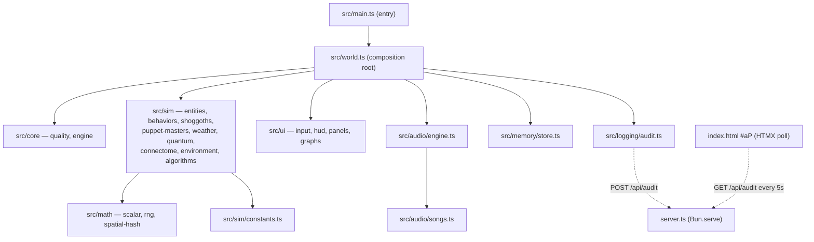

# COSMOGONIC QUANTUM MECHALOGODROM

A procedural WebGL cosmic ecosystem — morphogenic organisms, Shoggoths,
puppet-master NPCs, atmospheric weather, a neural connectome, and quantum
diffusion. Built with **Bun + TypeScript + three.js 0.184 + Tailwind CSS 4 +
HTMX 2**, ported from a single 882-line HTML monolith into a strict,
deterministic, allocation-disciplined module graph.

Every run is reproducible from a seed. Every hot path is allocation-free.
Every magic number survived the port.

## Features

- **26 behavioral fields** driving up to 1,000 organisms: classic motion
  (drift, orbit, swarm, vortex, helix...), neighbor dynamics via a spatial
  hash (flock), and theory behaviors — Nash equilibria (`nash`), wealth
  exchange (`market`), subtyping attraction (`typemorph`), set membership
  (`setunion`), optimal-distance graphs (`graphseek`), and a Lorenz attractor
  (`lorenz`).
- **100 procedural morphotypes** over ~41 shared, never-disposed
  `BufferGeometry` instances; remorphing swaps geometry refs and rewrites the
  material with zero allocation.
- **20 sorting-field algorithms** with behaviorally honest names (BUBBLE
  FIELD, HEAP SIFT, BITONIC MESH, STOOGE DRIFT...) that nudge organisms
  through space one swap proposal per frame.
- **3 Shoggoths** — Lorenz-ish drifters with grid-queried tendrils that
  consume organisms and respawn corrupted ones.
- **3 puppet masters** — AETHON stokes chaos, SELENE shifts weather, KRONOS
  reshapes organisms — on their own timers, announced via toast.
- **6 weather states** (CLEAR, RAIN, STORM, AURORA, VOID, FOG) modulating
  wind, temperature (and thus lifespan), fog density, and exposure.
- **Quantum cloud** of 3,500–6,000 particles with wavefunction wobble,
  collapse, and respawn; **neural connectome** of up to 2,200–4,000 links with
  partial GPU uploads.
- **5 procedural Web Audio songs** + 8 synthesized SFX — no audio assets, just
  oscillators.
- **Deterministic seeded RNG** (`mulberry32`) injected everywhere; the global
  random number generator is banned in sim logic.
- **HTMX-polled audit trail**, versioned `localStorage` persistence,
  device-adaptive quality profile, glassmorphic Tailwind UI with canvas
  sparklines.

## Quickstart

```sh
bun install
bun dev
```

Then visit **http://localhost:3000** — and **http://localhost:3000/docs** for
live architecture, ERD, and sequence diagrams rendered with Mermaid.

Useful next commands:

```sh
bun test          # unit tests
bun run bench     # mitata micro-benchmarks
bun run check     # full gate: format + types + lint + tests + build
```

## Scripts

| Script                 | Command                                                     | Purpose                                 |
| ---------------------- | ----------------------------------------------------------- | --------------------------------------- |
| `bun dev`              | `bun --hot server.ts`                                       | Dev server with hot reload on port 3000 |
| `bun start`            | `bun server.ts`                                             | Run the server without hot reload       |
| `bun run build`        | `bun build ./index.html ./docs.html --outdir=dist --minify` | Minified static bundle in `dist/`       |
| `bun run typecheck`    | `tsc --noEmit`                                              | Strict TypeScript check                 |
| `bun run lint`         | `oxlint src server.ts tests bench`                          | Lint                                    |
| `bun run format`       | `prettier --write .`                                        | Format the tree                         |
| `bun run format:check` | `prettier --check .`                                        | Formatting gate                         |
| `bun test`             | `bun test`                                                  | Unit tests                              |
| `bun run bench`        | `bun bench/index.ts`                                        | mitata benchmarks                       |
| `bun run check`        | format:check + typecheck + lint + test + build              | The full CI gate                        |

## Architecture digest



Per frame: camera → weather → puppet masters → grid rebuild (every 2nd
frame) → shoggoths → sort step → entities → connectome → quantum →
environment → telemetry (every 8th frame) → render. Full detail in
[docs/ARCHITECTURE.md](./docs/ARCHITECTURE.md).

## Repository layout

```
.
├── server.ts            # Bun fullstack server: /, /docs, /api/health, /api/audit
├── index.html           # App shell — canvas, panels, toolbar, HTMX audit panel
├── docs.html            # Live Mermaid diagram page (served at /docs)
├── src/
│   ├── main.ts          # Browser entry — boots world, htmx, resize binding
│   ├── world.ts         # Composition root — SimContext, frame pipeline, UiActions
│   ├── types.ts         # Shared type hub (type-only imports keep the graph acyclic)
│   ├── core/            # quality.ts (device profile) · engine.ts (renderer/scene/camera)
│   ├── math/            # scalar.ts · rng.ts (mulberry32) · spatial-hash.ts
│   ├── sim/             # constants · geometry-cache · morphotypes · algorithms ·
│   │                    # behaviors · entities · shoggoths · puppet-masters ·
│   │                    # weather · quantum · connectome · environment
│   ├── audio/           # songs.ts (data) · engine.ts (scheduler + SFX synthesis)
│   ├── ui/              # graphs.ts · hud.ts · panels.ts · input.ts
│   ├── logging/         # logger.ts (ring buffer) · audit.ts (AuditTrail)
│   ├── memory/          # store.ts (versioned localStorage persistence)
│   └── styles/app.css   # Tailwind 4 @theme tokens + glass panel rules
├── tests/               # bun test suites (scalar, rng, spatial-hash, algorithms, store, audit)
├── bench/               # mitata micro-benchmarks (bun run bench)
├── docs/                # architecture, ERD, wireframes, complexity, ADRs, module contracts
└── legacy/              # the original 882-line monolith (source of truth for the port)
```

## Documentation

- [docs/MODULE-CONTRACTS.md](./docs/MODULE-CONTRACTS.md) — the binding
  per-module spec, including the Known Bugs table fixed during the port
- [docs/ARCHITECTURE.md](./docs/ARCHITECTURE.md) — module graph, data flow,
  frame pipeline
- [docs/ERD.md](./docs/ERD.md) — entity-relationship model + process models
  (sequence and state diagrams)
- [docs/WIREFRAMES.md](./docs/WIREFRAMES.md) — desktop/mobile wireframes,
  type scale, color tokens
- [docs/COMPLEXITY.md](./docs/COMPLEXITY.md) — per-hot-path big-O budget
- [docs/BENCHMARKS.md](./docs/BENCHMARKS.md) — measured mitata results for the
  deterministic core (RNG, scalar math, spatial hash, sort steps)
- ADRs: [0001 Bun runtime](./docs/adr/0001-bun-runtime.md) ·
  [0002 three.js rendering](./docs/adr/0002-threejs-rendering.md) ·
  [0003 HTMX + Tailwind UI](./docs/adr/0003-htmx-tailwind-ui.md) ·
  [0004 deterministic RNG](./docs/adr/0004-deterministic-rng.md)
- [CONTRIBUTING.md](./CONTRIBUTING.md) · [SECURITY.md](./SECURITY.md) ·
  [CHANGELOG.md](./CHANGELOG.md)

## License & legal

MIT — Copyright (c) 2026 0thernes. See [LICENSE](./LICENSE).

Third-party components: three (MIT), htmx (0BSD), Tailwind CSS (MIT), Mermaid
(MIT), simplex-noise (MIT), Inter and JetBrains Mono fonts (SIL OFL 1.1).
Full attribution in [NOTICE.md](./NOTICE.md). Built and served with the Bun
runtime (MIT, not redistributed).
