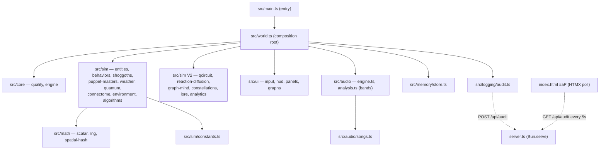

# COSMOGONIC QUANTUM MECHALOGODROM

A procedural WebGL cosmic ecosystem — morphogenic organisms, Shoggoths,
puppet-master NPCs, atmospheric weather, a neural connectome, and quantum
diffusion. Built with **Bun + TypeScript + three.js 0.184 + Tailwind CSS 4 +
HTMX 2**, ported from a single 882-line HTML monolith into a strict,
deterministic, allocation-disciplined module graph.

Every run is reproducible from a seed. Every hot path is allocation-free.
Every magic number survived the port.

## Features

- **26 behavioral fields** driving up to 10,000 organisms: classic motion
  (drift, orbit, swarm, vortex, helix...), neighbor dynamics via a spatial
  hash (flock), and theory behaviors — Nash equilibria (`nash`), wealth
  exchange (`market`), subtyping attraction (`typemorph`), set membership
  (`setunion`), optimal-distance graphs (`graphseek`), and a Lorenz attractor
  (`lorenz`).
- **250 procedural morphotypes** (10 lore-named phyla × 25, ~1% wildcard
  outliers) over ~41 shared, never-disposed `BufferGeometry` instances;
  remorphing swaps geometry refs and rewrites the material with zero
  allocation.
- **20 sorting-field algorithms** with behaviorally honest names (BUBBLE
  FIELD, HEAP SIFT, BITONIC MESH, STOOGE DRIFT...) that nudge organisms
  through space one swap proposal per frame.
- **3 Shoggoths** — Lorenz-ish drifters with grid-queried tendrils that
  consume organisms and respawn corrupted ones.
- **3 puppet masters** — AETHON stokes chaos, SELENE shifts weather, KRONOS
  reshapes organisms — on their own timers, announced via toast.
- **6 weather states** (CLEAR, RAIN, STORM, AURORA, VOID, FOG) modulating
  wind, temperature (and thus lifespan), fog density, and exposure.
- **Quantum cloud** of 3,500–6,000 particles with wavefunction wobble,
  collapse, and respawn; **neural connectome** of up to 2,200–4,000 links with
  partial GPU uploads.
- **5 procedural Web Audio songs** + 8 synthesized SFX — no audio assets, just
  oscillators.
- **Deterministic seeded RNG** (`mulberry32`) injected everywhere; the global
  random number generator is banned in sim logic.
- **HTMX-polled audit trail**, versioned `localStorage` persistence,
  device-adaptive quality profile, glassmorphic Tailwind UI with canvas
  sparklines.

### Quantum Wildbeyond (0.2.0)

Seven systems added under [docs/PHILOSOPHY.md](./docs/PHILOSOPHY.md) — real
math under every effect, and every system reads from AND writes to another:

- **Quantum register** — a pure-TS 5-qubit statevector (no simulator dep;
  see [ADR 0005](./docs/adr/0005-math-stack-selection.md)). Puppet masters
  apply signature gate sequences, sort swaps apply CNOTs, and the register
  answers back: Born-rule probabilities recolor the quantum cloud, entropy is
  telemetry, measurement collapses implode the cloud locally.
- **Reaction-diffusion ground** — a genuine Gray-Scott field (128², CPU
  ping-pong) as the ground's emissive map; weather tunes feed/kill/diffusion
  and entity deaths scar the pattern.
- **Graph mind** — the connectome mirrored into a
  [graphology](https://graphology.github.io) graph; seeded Louvain communities
  paint links in an 8-hue tribe palette and rewrite entities' set-theory
  groups; PageRank crowns the top-20 with an emissive boost.
- **Constellations + lore** — a d3-delaunay Voronoi sky-web over the 24
  monolith/diorama sites, with every sector/tribe/omen name derived from
  sha256 digests of the seed (@noble/hashes): same seed, same mythology.
- **Audio analysis** — an AnalyserNode tap turns the synthesized music back
  into light (bass → the six-lamp rig, treble → constellations, level → cloud
  breathing), every coupling capped at 0.35 so silence looks exactly like v1.
- **Analytics + omens** — rolling-window regression (simple-statistics) puts a
  population trend in the telemetry; z-score anomalies emit lore-named omens
  into the audit trail.
- **Lab artifact** — a self-contained seeded p5.js "collapse field" at
  [/lab](http://localhost:3000/lab) (`lab/quantum-wildbeyond.html`).

### PANTHEON (0.3.0)

The arena grows 5× and the ecosystem becomes a civilization
(`docs/MODULE-CONTRACTS.md` §CONTRACTS V3):

- **10,000 entities** on the ultra tier through InstancedMesh pools — ≤80
  draw calls for the whole population, per-instance color/emissive/alpha,
  with a four-rung quality ladder (phone 650 / laptop 2,000 / desktop 5,000 /
  ultra 10,000) resolved once at boot.
- **10 creature phyla**, lore-named at mint, each a template distribution
  (hue band, geometry family, behavior pool, size/speed ranges, home wedge)
  — plus seeded wildcard OUTLIERS with impossible palettes, blended behavior
  pairs and ×3 parameter excursions.
- **10 TITANS** — colossal non-human intelligences patrolling their phyla's
  wedges, each running an {energy, matter, entropy} economy: they harvest
  organisms, metabolize, witness quantum collapses, bathe in the
  reaction-diffusion pattern, pay upkeep, and dump entropy as ground scars.
  Diplomacy is a staggered iterated prisoner's dilemma over all 45 pairs
  (tit-for-tat, grim trigger, Pavlov, always-defect, generous TFT);
  defection-heavy windows become WARS with territory strikes, loot and
  conscription; bankruptcy mutates strategy by replicator dynamics. Payoffs
  flow through the real energy ledger — game theory with consequences.
- **Observatory** — four live canvas charts: stacked phylum populations,
  titan wealth polylines with war markers, a 10×10 war-matrix heat grid, and
  rdEnergy/qEntropy/trend timelines.
- **Full-device UI** — one responsive overlay grid: desktop columns, phone
  sheet stacks, foldable hinge-safe rails, 43″-TV 10-foot mode; touch
  controls v2 (drag joystick + look pad + radial action wheel with an
  apocalypse long-press) with ≤30 ms haptics.
- **Pantheon rescore** — four new QUANTUM-tier dark songs (VOIDCROWN, BLACK
  MERIDIAN, ELDER ENGINE, LAST THEOREM) around the untouched QUANTUM.

### 0.2.1 — the audit wave

Twenty-one adversarially confirmed audit findings landed as a patch release:
the Lorenz NaN blow-up is sealed, the audio exposure feedback is gone (bass
now shimmers the six-lamp rig instead), the color pipeline reproduces the
legacy r128 palette exactly (LinearSRGB output + calibrated light units), the
legacy control colors are restored, the canvas gains **mouse-look and wheel
zoom**, and the server, persistence store, and `/lab` CDN script are hardened
(body caps + HTML escaping, field-validated state, SRI). Details in
[CHANGELOG.md](./CHANGELOG.md).

Work on this codebase is governed by the three **master files** in
[masters/](./masters/) — Executor, Architect, Physicist — bound by
[CLAUDE.md](./CLAUDE.md) and the binding per-module spec in
[docs/MODULE-CONTRACTS.md](./docs/MODULE-CONTRACTS.md).

## Quickstart

```sh
bun install
bun dev
```

Then visit **http://localhost:3000** — plus **http://localhost:3000/docs** for
live architecture, ERD, and sequence diagrams rendered with Mermaid, and
**http://localhost:3000/lab** for the seeded p5.js collapse-field artifact.

Useful next commands:

```sh
bun test          # unit tests
bun run bench     # mitata micro-benchmarks
bun run check     # full gate: format + types + lint + tests + build
```

## Scripts

| Script                 | Command                                        | Purpose                                 |
| ---------------------- | ---------------------------------------------- | --------------------------------------- |
| `bun dev`              | `bun --hot server.ts`                          | Dev server with hot reload on port 3000 |
| `bun start`            | `bun server.ts`                                | Run the server without hot reload       |
| `bun run build`        | `bun scripts/build.ts`                         | Minified static bundle in `dist/`       |
| `bun run typecheck`    | `tsc --noEmit`                                 | Strict TypeScript check                 |
| `bun run lint`         | `oxlint src server.ts tests bench scripts`     | Lint                                    |
| `bun run format`       | `prettier --write .`                           | Format the tree                         |
| `bun run format:check` | `prettier --check .`                           | Formatting gate                         |
| `bun test`             | `bun test`                                     | Unit tests                              |
| `bun run bench`        | `bun bench/index.ts`                           | mitata benchmarks                       |
| `bun run check`        | format:check + typecheck + lint + test + build | The full CI gate                        |

## Architecture digest



Per frame: camera → weather → puppet masters → grid rebuild (every 2nd
frame) → shoggoths → sort step → entities → connectome → quantum circuit
(every 30th frame, bands → cloud every 6th) → quantum cloud →
reaction-diffusion (every 2nd frame, offset 1) → graph mind (communities
every 240th, rank every 600th offset 300) → constellations → environment →
telemetry + analytics push (every 8th frame) → analytics analyze (every
60th) → render. Full detail in
[docs/ARCHITECTURE.md](./docs/ARCHITECTURE.md).

## Repository layout

```
.
├── server.ts            # Bun fullstack server: /, /docs, /lab, /api/health, /api/audit
├── index.html           # App shell — canvas, panels, toolbar, HTMX audit panel
├── docs.html            # Live Mermaid diagram page (served at /docs)
├── src/
│   ├── main.ts          # Browser entry — boots world, htmx, resize binding
│   ├── world.ts         # Composition root — SimContext, frame pipeline, UiActions
│   ├── types.ts         # Shared type hub (type-only imports keep the graph acyclic)
│   ├── core/            # quality.ts (device profile) · engine.ts (renderer/scene/camera)
│   ├── math/            # scalar.ts · rng.ts (mulberry32) · spatial-hash.ts ·
│   │                    # quantum.ts (statevector QuantumRegister)
│   ├── sim/             # constants · geometry-cache · morphotypes · algorithms ·
│   │                    # behaviors · entities · shoggoths · puppet-masters ·
│   │                    # weather · quantum · connectome · environment ·
│   │                    # qcircuit · reaction-diffusion · graph-mind ·
│   │                    # constellations · lore · analytics
│   ├── audio/           # songs.ts (data) · engine.ts (scheduler + SFX) · analysis.ts (bands)
│   ├── ui/              # graphs.ts · hud.ts · panels.ts · input.ts
│   ├── logging/         # logger.ts (ring buffer) · audit.ts (AuditTrail)
│   ├── memory/          # store.ts (versioned localStorage persistence)
│   └── styles/app.css   # Tailwind 4 @theme tokens + glass panel rules
├── lab/                 # quantum-wildbeyond.html — seeded p5.js artifact (served at /lab)
├── masters/             # the three governing master files (Executor/Architect/Physicist)
├── scripts/             # build.ts (bundles index/docs into dist/)
├── tests/               # bun test suites (math, sim, store, audit + V2 systems)
├── bench/               # mitata micro-benchmarks (bun run bench)
├── docs/                # architecture, ERD, wireframes, complexity, design system,
│                        # philosophy, ADRs, module contracts, reference catalogs
└── legacy/              # the original 882-line monolith (source of truth for the port)
```

## Documentation

- [docs/MODULE-CONTRACTS.md](./docs/MODULE-CONTRACTS.md) — the binding
  per-module spec (V1 + the Wildbeyond V2 contracts), including the Known
  Bugs table fixed during the port
- [docs/PHILOSOPHY.md](./docs/PHILOSOPHY.md) — the Quantum Wildbeyond
  aesthetic constitution (real math under every effect)
- [docs/ARCHITECTURE.md](./docs/ARCHITECTURE.md) — module graph, data flow,
  frame pipeline (V1 + V2 cadences)
- [docs/ERD.md](./docs/ERD.md) — entity-relationship model + process models
  (sequence and state diagrams)
- [docs/WIREFRAMES.md](./docs/WIREFRAMES.md) — desktop/mobile wireframes,
  type scale, color tokens
- [docs/DESIGN-SYSTEM.md](./docs/DESIGN-SYSTEM.md) — design-system audit,
  tokens (incl. the 8-hue tribe palette), component + a11y docs
- [docs/COMPLEXITY.md](./docs/COMPLEXITY.md) — per-hot-path big-O budget
- [docs/BENCHMARKS.md](./docs/BENCHMARKS.md) — measured mitata results for the
  deterministic core (RNG, scalar math, spatial hash, sort steps, quantum
  gates, reaction-diffusion step)
- [docs/reference/](./docs/reference/math-libs-catalog.md) — the imported
  20-domain math-library catalog + per-domain adoption status CSV
- ADRs: [0001 Bun runtime](./docs/adr/0001-bun-runtime.md) ·
  [0002 three.js rendering](./docs/adr/0002-threejs-rendering.md) ·
  [0003 HTMX + Tailwind UI](./docs/adr/0003-htmx-tailwind-ui.md) ·
  [0004 deterministic RNG](./docs/adr/0004-deterministic-rng.md) ·
  [0005 math-stack selection](./docs/adr/0005-math-stack-selection.md)
- [CONTRIBUTING.md](./CONTRIBUTING.md) · [SECURITY.md](./SECURITY.md) ·
  [CHANGELOG.md](./CHANGELOG.md)

## License & legal

MIT — Copyright (c) 2026 0thernes. See [LICENSE](./LICENSE).

Third-party components: three (MIT), htmx (0BSD), Tailwind CSS (MIT), Mermaid
(MIT), simplex-noise (MIT), graphology + communities-louvain + metrics (MIT),
d3-delaunay (ISC), @noble/hashes (MIT), simple-statistics (ISC), Inter and
JetBrains Mono fonts (SIL OFL 1.1). Full attribution in
[NOTICE.md](./NOTICE.md). Built and served with the Bun runtime (MIT, not
redistributed); the `/lab` artifact loads p5.js (LGPL-2.1) from a CDN, not
redistributed.
