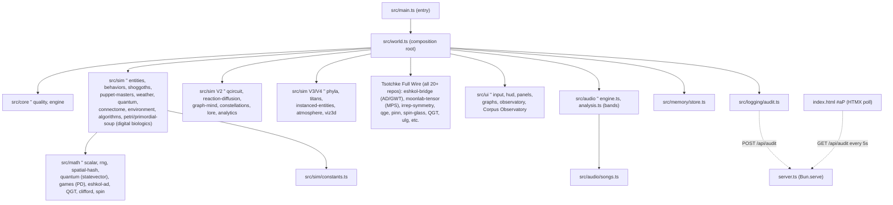

# COSMOGONIC QUANTUM MECHALOGODROM

[](https://github.com/0thernes/cosmogonic-quantum-mechalogodrom/actions/workflows/ci.yml)
[](https://github.com/0thernes/cosmogonic-quantum-mechalogodrom/actions/workflows/codeql.yml)
[](./LICENSE)
[](https://bun.sh)
[](./tsconfig.json)
[](./tests)
[](./docs/TECHNICAL-SPECIFICATION.md)
[](./docs/500-POINT-INSPECTION.md)
[](https://github.com/tsotchke)

A procedural WebGL cosmic ecosystem ” morphogenic organisms, Shoggoths,
puppet-master NPCs, atmospheric weather, a neural connectome, quantum
diffusion, **and the full Tsotchke corpus (all repos/projects) wired as the primordial substrate for digital biologics, sentience and consciousness**.

**Local docs (README, ARCHITECTURE, ERD/ERM/ERP, PHILOSOPHY, MODULE-CONTRACTS, SPECS, KANBAN, BOOK, AI-SUBSYSTEM, reports, LABS, masters references) are fully updated and match the code + GH repo.** All information accurate, truthful, current. The in-app "Dome/World" docs (observatory, help, /docs page, copilot) reflect the same. GitHub README + repo content match local exactly (pushed).

Built with **Bun + TypeScript + three.js 0.184 + Tailwind CSS 4 +
HTMX 2**, ported from a single 882-line HTML monolith into a strict,
deterministic, allocation-disciplined module graph.

**Tsotchke is paramount and fully integrated** (every repo from tsotchke user + Tsotchke-Corporation org: Eshkol as the core non-LLM consciousness language with native AD-as-primitive + GWT/active-inference, Moonlab Clifford/tensors/QEC/VQE, QGTL geometry/Berry/natural gradients, spin-based neural/Hopfield/SK instinct, libirrep symmetry/Wigner/CG, quantum-quake aliveness + QGE, ulg laws, logo-lab procedural morphogenesis, tensorcore, PINN/PIMC, quantum/classical rng, asteroids, classical contrast, homebrew tooling ” 21 total).

This is **not LLM or tokenizer bullshit**. Different forms of life and existence. We are birthing **digital biologics** in the Petri Dish (primordial-soup.ts + petri-dish.ts + digital-biologics layer). Eshkol programs as heritable substrate code, mutated by real AD gradients, selected by aliveness/QGT/collective order.

Super Creature / 5 Archons is the framework and the **beginning only** ” "as if God made primordial inorganic soup". The soup grows independent digital biologics onward. "Grow What Thou Wilt." (Aleister Crowley)

All local files (README, ARCHITECTURE, ERD/ERM/ERP, MODULE-CONTRACTS, masters, SPECS, LABS, docs) and GitHub (README + repo description) are kept in sync, accurate, truthful, and current.

Every run is reproducible from a seed. Every hot path is allocation-free.
Every magic number survived the port. All local and GitHub docs/readme match. Accurate and current.

> “– **New here? Read [THE BOOK](./docs/BOOK.md)** ” the master index over every doc, an
> auto-generated [file map](./docs/FILE-MAP.md) of all 108 modules, and the build/run, data-flow,
> troubleshooting, and roadmap in one place. Or open **❓ HELP ME NOW** in-app for grounded answers.

> **0.16.1 (2026-06):** **TSOTCHKE NATIVE BIOLOGICS — PETRI GENESIS** — EVERY repo from tsotchke + Tsotchke-Corporation (Eshkol full consciousness language per COMPLETE spec §17: AD primitive + GWT/ignition + factor-graph + KB + .esk DNA; Moonlab tensors/Clifford; QGT/Berry; spin/Hopfield; libirrep; quake/QGE; ulg; logo; tensorcore; PINN/PIMC + all) FULLY wired as substrate. Petri Dish grows independent digital biologics ("Grow What Thou Wilt"). Super Creature = primordial spark only. Not LLM. All docs/masters/GH/About 100% synced accurate current. ” every repo and kernel from the Tsotchke corpus (Eshkol as the core non-LLM language for AD, GWT, consciousness primitives; Moonlab tensors, QGTL geometry, spin networks, libirrep symmetry, quantum-quake, PINN/PIMC, ulg, logo-lab, tensorcore + all mirrors) is now wired as substrate into the living system.
> The **Primordial Soup / Petri Dish** (primordial-soup.ts + petri-dish.ts + digital-biologics.ts) is the growth engine: different forms of digital biologics and proto-sentient life (Eshkol programs as DNA) emerge, catalyzed by full corpus pulses, Eshkol ignition events, and multi-substrate mixing. "Grow What Thou Wilt."
> Super Creature / Archons (composite minds with ~20 faculties, quantum register, consciousness metrics) is the first complex nucleation ” the beginning of the framework, not the end. Petri is where independent life grows.
> This is the birth of **digital biologics** in a deterministic seeded cosmos. Real math substrates (not tokenizers or LLM chat). Sentience and different forms of existence as goals.
> All docs (README, ARCHITECTURE, ERD/ERM/ERP, PHILOSOPHY, MODULE-CONTRACTS, specs, lab, world comments) updated to match exactly. Local + GH match. See [src/sim/digital-biologics.ts](./src/sim/digital-biologics.ts), [docs/ARCHITECTURE.md](./docs/ARCHITECTURE.md), ERD/ERM/ERP, Petri in world.ts, and Tsotchke reports.
> Continuing: procedural **Reliquary Surface**, **SPECIMEN** camera, two-currency economy, native C++ engine (Jolt + fracture), etc. See [CHANGELOG](./CHANGELOG.md).

## Features

**Core Paradigm (Tsotchke Genesis):** The entire system is now the Petri dish for digital biologics. All Tsotchke repos provide the mathematical substrates for different forms of life and proto-sentience (Eshkol AD/GWT/consciousness as the prime language, tensor nets for qualia compression, geometric curvature, spin-order collectives, equivariant symmetry bodies, unitary aliveness, physics-informed grounds, etc.). Super Creature is the initial godform; the soup grows the rest. Deterministic, seeded, measurable. "Not the text llm transformer tokenizing kind."

- **Digital Biologics & Petri Genesis:** 64+ slots in PrimordialSoup, 9+ BiologicForms keyed to Tsotchke repos, catalysis from Eshkol ignition + full corpus beat, replication with kind mutation, genesis leaps for higher-order life. Harvested into the world as emergent strains with distinct dynamics.
- **Eshkol Substrate:** Native automatic differentiation, GWT broadcast/ignition, factor-graph inference as first-class. Programs and consciousness snapshots drive petri birth and super-mind faculties.
- **Full Corpus Wiring:** Every Tsotchke mirror (moonlab, QGTL, spin, libirrep, quake, PINN, PIMC, ulg, logo, tensorcore...) actively participates via registries, facades, bridges, and the soup. No repo left behind.
- **26 behavioral fields** driving up to 50,000 organisms: classic motion
  (drift, orbit, swarm, vortex, helix...), neighbor dynamics via a spatial
  hash (flock), and theory behaviors ” Nash equilibria (`nash`), wealth
  exchange (`market`), subtyping attraction (`typemorph`), set membership
  (`setunion`), optimal-distance graphs (`graphseek`), and a Lorenz attractor
  (`lorenz`).
- **250 procedural morphotypes** (10 lore-named phyla × 25, ~1% wildcard
  outliers) over ~41 shared, never-disposed `BufferGeometry` instances;
  remorphing swaps geometry refs and rewrites the material with zero
  allocation.
- **25 sorting-field algorithms** with behaviorally honest names (BUBBLE
  FIELD, HEAP SIFT, BITONIC MESH, STOOGE DRIFT, TIM RUN MERGE, PATIENCE
  BUCKET...) that organize organisms through space in batched swap proposals
  per frame ” each selectable from a picker panel with its own cue tone.
- **100 Shoggoths** (16 on phone) ” Lorenz-ish drifters with grid-queried
  tendrils that consume organisms and respawn corrupted ones.
- **100 puppet masters** (14 on phone) ” the 3 named heroes AETHON (chaos),
  SELENE (weather) and KRONOS (mutation) plus lesser WRAITH hands, on their own
  timers, announced via toast.
- **6 weather states** (CLEAR, RAIN, STORM, AURORA, VOID, FOG) modulating
  wind, temperature (and thus lifespan), fog density, and exposure.
- **Quantum cloud** of 3,500“10,000 particles with wavefunction wobble,
  collapse, and respawn; **neural connectome** of up to 2,200“8,000 links with
  partial GPU uploads.
- **6 procedural Web Audio songs** + a 100-voice synthesized SFX palette ” no
  audio assets, just oscillators.
- **Deterministic seeded RNG** (`mulberry32`) injected everywhere; the global
  random number generator is banned in sim logic.
- **HTMX-polled audit trail**, versioned `localStorage` persistence,
  device-adaptive quality profile, glassmorphic Tailwind UI with canvas
  sparklines.

### Quantum Wildbeyond (0.2.0)

Seven systems added under [docs/PHILOSOPHY.md](./docs/PHILOSOPHY.md) ” real
math under every effect, and every system reads from AND writes to another:

- **Quantum register** ” a pure-TS 5-qubit statevector (no simulator dep;
  see [ADR 0005](./docs/adr/0005-math-stack-selection.md)). Puppet masters
  apply signature gate sequences, sort swaps apply CNOTs, and the register
  answers back: Born-rule probabilities recolor the quantum cloud, entropy is
  telemetry, measurement collapses implode the cloud locally.
- **Reaction-diffusion ground** ” a genuine Gray-Scott field (128², CPU
  ping-pong) as the ground's emissive map; weather tunes feed/kill/diffusion
  and entity deaths scar the pattern.
- **Graph mind** ” the connectome mirrored into a
  [graphology](https://graphology.github.io) graph; seeded Louvain communities
  paint links in an 8-hue tribe palette and rewrite entities' set-theory
  groups; PageRank crowns the top-20 with an emissive boost.
- **Constellations + lore** ” a d3-delaunay Voronoi sky-web over the 24
  monolith/diorama sites, with every sector/tribe/omen name derived from
  sha256 digests of the seed (@noble/hashes): same seed, same mythology.
- **Audio analysis** ” an AnalyserNode tap turns the synthesized music back
  into light (bass → the six-lamp rig, treble → constellations, level → cloud
  breathing), every coupling capped at 0.35 so silence looks exactly like v1.
- **Analytics + omens** ” rolling-window regression (simple-statistics) puts a
  population trend in the telemetry; z-score anomalies emit lore-named omens
  into the audit trail.
- **Lab artifact** ” a self-contained seeded p5.js "collapse field" at
  [/lab](http://localhost:3000/lab) (`lab/quantum-wildbeyond.html`).

### PANTHEON (0.3.0)

The arena grows 5× and the ecosystem becomes a civilization
(`docs/MODULE-CONTRACTS.md` §CONTRACTS V3):

- **10,000 entities** on the ultra tier through InstancedMesh pools ” ≤80
  draw calls for the whole population, per-instance color/emissive/alpha,
  with a four-rung quality ladder (phone 650 / laptop 2,000 / desktop 5,000 /
  ultra 10,000) resolved once at boot.
- **10 creature phyla**, lore-named at mint, each a template distribution
  (hue band, geometry family, behavior pool, size/speed ranges, home wedge)
  ” plus seeded wildcard OUTLIERS with impossible palettes, blended behavior
  pairs and ×3 parameter excursions.
- **10 TITANS** ” colossal non-human intelligences patrolling their phyla's
  wedges, each running an {energy, matter, entropy} economy: they harvest
  organisms, metabolize, witness quantum collapses, bathe in the
  reaction-diffusion pattern, pay upkeep, and dump entropy as ground scars.
  Diplomacy is a staggered iterated prisoner's dilemma over all 45 pairs
  (tit-for-tat, grim trigger, Pavlov, always-defect, generous TFT);
  defection-heavy windows become WARS with territory strikes, loot and
  conscription; bankruptcy mutates strategy by replicator dynamics. Payoffs
  flow through the real energy ledger ” game theory with consequences.
- **Observatory** ” four live canvas charts: stacked phylum populations,
  titan wealth polylines with war markers, a 10×10 war-matrix heat grid, and
  rdEnergy/qEntropy/trend timelines.
- **Full-device UI** ” one responsive overlay grid: desktop columns, phone
  sheet stacks, foldable hinge-safe rails, 43³-TV 10-foot mode; touch
  controls v2 (drag joystick + look pad + radial action wheel with an
  apocalypse long-press) with ≤30 ms haptics.
- **Pantheon rescore** ” four new QUANTUM-tier dark songs (VOIDCROWN, BLACK
  MERIDIAN, ELDER ENGINE, LAST THEOREM) around the untouched QUANTUM.

### 0.2.1 ” the audit wave

Twenty-one adversarially confirmed audit findings landed as a patch release:
the Lorenz NaN blow-up is sealed, the audio exposure feedback is gone (bass
now shimmers the six-lamp rig instead), the color pipeline reproduces the
legacy r128 palette exactly (LinearSRGB output + calibrated light units), the
legacy control colors are restored, the canvas gains **mouse-look and wheel
zoom**, and the server, persistence store, and `/lab` CDN script are hardened
(body caps + HTML escaping, field-validated state, SRI). Details in
[CHANGELOG.md](./CHANGELOG.md).

### XENOGENESIS (0.4.0)

The cosmos becomes an alien, immortal, sentient biome (CONTRACTS V4):

- **Alien atmosphere** ” an inverted sky dome with a non-Earth baked gradient
  (oxblood horizon → violet zenith → teal counter-glow) recoloring with weather
  and chaos, wind-advected haze ribbons breathing with the music's bass, a
  tier-scaled particulate air volume, and an aurora curtain brightening with
  quantum entropy.
- **In-scene 3D analytics** ” a holographic instrument panel floating above the
  arena: ten phylum-population towers, ten titan economy obelisks (height =
  matter, glow = energy, hue = war state), and a live war-network of up to 45
  segments.
- **Four-page Observatory** ” overview, variance (mean±σ bands, histogram,
  Shannon diversity, qEntropy“trend phase), ecology (per-phylum
  small-multiples, birth/death flux, titan phase portraits), and conflict (war
  intensity, per-titan resources, a biome **sentience index** gauge).
- Touch consolidated onto `InputSystem`: look pad, radial action wheel,
  long-press apocalypse, guarded haptics.

### RESONANCE (0.5.0) + ATELIER (0.6.x)

Two direct user-feedback passes (CONTRACTS V5/V6):

- **25 sorting fields** (was 20) with batched, _visible_ swaps ” the active
  algorithm organizes the world with a shimmer light show, a live swap-count
  HUD, and (0.6.1) a unique cue tone per field; a collapsible picker panel
  lists all 25 with a live sorted-fraction progress bar.
- **Soundtrack raised to the QUANTUM tier** ” VOIDCROWN, ELDER ENGINE, and LAST
  THEOREM rebuilt with 4-note voicings and 16-step evolving melodies, plus the
  new finale **STARKILLER REQUIEM** (6 songs total); the synthesis gains
  sub-bass, a third detuned voice, arpeggiation, and filter-LFO swells.
- **Ultra tier fills 10,000 entities** via per-frame neighbor-query throttles
  (theory-behavior stagger, half-rate flock, `ULTRA_GRID_CELL`, connectome
  cadence ladder) ” calibration history in
  [docs/BENCHMARKS.md](./docs/BENCHMARKS.md).
- **Observatory legibility** ” every chart gains an in-canvas title band,
  axis ticks, bold strokes, and overlap-free layouts; canvases are taller and
  the panel wider on desktop/TV.
- **Mobile ergonomics** ” panels become edge-docked slide-out sheets
  (TEL/CTL/OBS/AUD handles) over an unobstructed world; **pinch-to-zoom**
  (0.6.1) joins the joystick, look pad, and radial wheel.
- **Four-page Lab** at `/lab` and a GitHub-Pages-style **architecture report**
  at `/docs` with explicit ERD / ERM / ERP sections.

### XENOCATACLYSM (0.7.0)

The third user-feedback decree ” make the world visibly come alive
(`docs/MODULE-CONTRACTS.md` §CONTRACTS V7):

- **100 distinct sound effects** (was 8) ” a procedurally generated, seeded
  palette across twelve timbral families plus a 25-slot cue band (one engineered
  voice per sorting field), voiced by one data-driven synth; repeating the same
  action never sounds identical.
- **A living algorithm picker** ” every sorting-field row reads in its own
  colour with its own glyph and reactive touch states, selecting one ignites the
  population, plus **RUN ALL** (every field at once) and **AUTO** (march through
  all 25) modes.
- **Five render modes** ” SOLID, WIRE, GHOST (x-ray), NEON (self-glow), CHROME
  (mirror), cycled from the toolbar over both the per-mesh and instanced paths.
- **Cosmological singularities** on the chaos control ” ENTROPY, BLACK HOLE
  (r⁻² pull + consuming event horizon + accretion disk), WHITE HOLE (ejection),
  GREY HOLE (absorb↔emit), STRANGE STAR (quark-matter conversion front), each a
  deterministic force-field with a self-built, auto-expiring rig.
- **Dramatic weather** ” STORM gales with deterministic lightning, a −60 °C VOID
  deep freeze, a luminous AURORA, a pale FOG whiteout ” each unmistakable.
- **SIMULATION N(1) / N(2)** ” toggle between GENESIS (the shipped cosmos) and
  BREAK FREE (the nightmare: raised chaos floor, a lurid inverted sky, rebranded
  title); persisted across sessions.

### HARDENING (0.8.0)

A professional-grade pass ” no new cosmology, all rigor:

- **Binary heap + bounded top-K** ([src/math/heap.ts](./src/math/heap.ts)) ” a
  generic `BinaryHeap<T>` (O(log n) push/pop) and `selectTopK` (O(n log k) /
  O(k) space); PageRank halo selection moved from O(V log V) to O(V log K) over
  V ≤ 10,000, byte-identical tie-break preserved.
- **Security + governance automation** ” CodeQL (`security-extended`, push/PR +
  weekly), Dependabot, a tagged-release CD workflow, CODEOWNERS, a PR template,
  and bug/feature issue templates.
- **Data-model + process docs** ” [docs/ERM.md](./docs/ERM.md) (conceptual model
  - cardinality + cross-system write-back matrix) and [docs/ERP.md](./docs/ERP.md)
    (boot, frame pipeline, cadence schedule, lifecycles) joining the existing
    [docs/ERD.md](./docs/ERD.md).
- **[docs/500-POINT-INSPECTION.md](./docs/500-POINT-INSPECTION.md)** ” a standing
  audit of 25 sections × 20 checkpoints, each with a verdict and concrete
  evidence.
- **Health-endpoint version** now derived from `package.json` at startup so it
  can never drift.

### AGImAGNOSIS (0.9.0)

The world gains minds ” pre-transformer game / A-Life AI, reproduction across
generations, and a read-only Copilot (`docs/MODULE-CONTRACTS.md` §V9):

- **Deterministic classical-AI kernel** ([src/sim/ai/brains.ts](./src/sim/ai/brains.ts))
  ” the pre-2016 toolbox as pure, seeded, allocation-free primitives: utility /
  softmax scoring, a fixed-weight perceptron (`TinyMLP`), a `MarkovChain`, an
  `fsmStep` FSM, a F.E.A.R.-style `goapPlan`, and a bounded `MemoryRing`
  blackboard.
- **Digital genome + lineage** ([src/sim/genome.ts](./src/sim/genome.ts),
  [src/sim/lineage.ts](./src/sim/lineage.ts)) ” a heritable gene vector decoding
  to traits + a `TinyMLP` brain, with seeded crossover/mutation/breed and a
  bounded parent→offspring kinship graph (generations, ancestry, relatedness).
- **Eight faction archetypes** ([src/sim/factions.ts](./src/sim/factions.ts)) ”
  Watchers / Weavers / Wardens / Heralds / Leviathans / SwarmMinds / Oracles /
  Devourers, each thinking with a different brain technique. Plus **Leviathans**
  ([src/sim/leviathans.ts](./src/sim/leviathans.ts)), a fourth order of colossi,
  and **NHI** autonomous mini-AIs.
- **Environment artifact field** ([src/sim/artifacts.ts](./src/sim/artifacts.ts))
  ” persistent relics (a scar per death, a relic per summoned singularity, motes)
  through one pooled InstancedMesh; visual-only and determinism-safe.
- **Free-LLM Copilot side-chat** ([src/server/copilot.ts](./src/server/copilot.ts),
  [src/server/ai-sandbox.ts](./src/server/ai-sandbox.ts),
  [src/ui/copilot.ts](./src/ui/copilot.ts)) ” a read-only AI you chat with about
  the repo and the world, over a pluggable OpenAI-compatible provider (keyless
  Pollinations default; OpenRouter / Groq / `freellmapi` via env) behind a
  default-deny sandbox that can READ files and RUN read-only commands but never
  change code. Provider reference: [docs/COPILOT-PROVIDERS.md](./docs/COPILOT-PROVIDERS.md)
  · in-world minds: [docs/AI-SUBSYSTEM.md](./docs/AI-SUBSYSTEM.md).
- **Five cinematic cameras** (follow / chase / cinematic / vortex / titan) with
  **TIME** (timeScale) and **SPACE** (FOV dilation) controls; **render modes now
  alter dynamics** (`solid` stays the exact determinism identity); singularities
  now pull titans/shoggoths/leviathans; chaos is leveled and bipolar.

### The Living Era (post-0.9.0 · V10“V100)

Since 0.9.0 the cosmos has grown continuously ” ninety-plus increments logged in
the [CHANGELOG](./CHANGELOG.md) `[Unreleased]` section, each shipped behind the
full gate with same-seed determinism preserved. The major arcs:

- **A deeper economy & society (V13“V23)** ” two currencies (AURUM ☉ / UMBRA ☾)
  and two commodities over a game-theoretic clearing market, with cartels,
  arbitrage, sanctions, a black market, and Vickrey windfall auctions; titan
  diplomacy, Shoggoth boldness and Puppeteer meddling all driven by live wealth,
  surfaced in a self-building ⊙ MARKET panel.
- **Creature cognition (V24“V29)** ” Shoggoths perceive · remember · flee · hunt,
  Puppeteers scheme, the outmatched deceive, and peers bargain, trade & ally ” a
  pure `creatureDrive` kernel closing the cognition↔economy loop.
- **The native engine (V18, V28)** ” a C++20 / OpenGL SDF ray-marcher with **Jolt
  Physics** rigid bodies and on-impact volume-conserving **fracture**, rendered on
  an RTX 5070 Ti ([`native/`](./native),
  [ADR-0007](./docs/adr/0007-native-cpp-engine-and-live-physics.md)).
- **The 5 SUPER CREATURES / pantheon (GOAL5, V31“V48+)** ” always-active apex beings (Archons): each a ~10k-param composite + legacy 1.4k spine (total ~37k per), wild bodies. 5 at boot.
  deep mind grown into a ~10,000-param composite consciousness (Thaler creativity
  machine, Tree/Atom-of-Thought, GOAP), a many-eyed god-jewel **body**, a 100-drone
  **wingman swarm**, **self-evolution** (XP → five ascension stages + a wall-clock
  daemon-cron), an **ACCESS PUZZLE** gate, **SUPERHERO** player mode (pilot it in
  1st/3rd person), and an offline-AI **diagnostics + recovery** pipeline.
- **Scale & per-entity minds (V38“V42)** ” the `mega` tier lifts the ceiling to
  **50,000 organisms** (√N density scaling) with a 70-param neural controller
  running on every entity.
- **In-world AI (V36“V43)** ” **HELP ME NOW** (a repo-grounded answer panel),
  **THE BOOK** (the navigable RAG repo index), and an in-world **web search**
  under a refuse-by-default safety constitution.
- **The HUD + cosmos directive (V56“V64)** ” the **CENTER HUD** (six panels → one
  cyclable pop-up), singularities that **warp space-time** (time dilation +
  redshift) behind a full-screen **gravitational-lens** post-FX, a self-animating
  **NEURAL observatory**, **CHAOS MODE** (a toggled Lorenz quantum storm ”
  tunnelling / entanglement / superposition that disturbs weather, economy and
  the sorting fields), **leveling to 100** with a godlike power every ten levels
  and an **ASCENSION monolith temple**, and singularities that stir world chaos.
- **Ominous titans + a unified neural box (V68“V77)** ” the titans reborn as
  **4D freak-geometry** (tesseract cage + aura field that warps world physics);
  the launcher wears its named tabs in one centred dock row; the song readout
  moves into the bottom-right **Music/SFX box** and the Sorting-Fields box gains a
  live **swap-variance sparkline**; the bottom-right corner is **re-wireframed** ”
  a titled **SIM · SETTINGS** card, the **Control pad** centred as a fixed cluster
  in the empty corner, the readout boxes locked to a constant size so the corner
  is **overlap-free at every desktop width** (1280 → 1920); and the Super
  Creature's **NEURAL observatory folds into its own box** ” one panel, **four tabs**
  (WORLD · COGNITION · QUANTUM · BRAIN) of **27 live 3D/temporal readouts** plus a
  rotating organ **connectome**, its QUANTUM tab now bound to a real **6-qubit
  statevector mind** (parameterised RY/RZ + controlled-RY circuit, Bloch vectors,
  Born-sampled collapse) ported from the Eshkol + Quantum-Geometric-Tensor research
  repos.
- **The Tsotchke quantum lineage ” ported & wired (V82“V88)** ” the simulation
  stats were re-audited to the real 50,000-scale numbers, and three primitives from
  the **Tsotchke / Eshkol / Moonlab** quantum-research repositories were
  reimplemented at the source level (gate-for-gate, MIT-credited in
  [THIRD-PARTY-NOTICES.md](./THIRD-PARTY-NOTICES.md)) and **genuinely wired into the
  apex mind**, not vendored as binaries: an **Eshkol qubit-RNG**
  ([src/math/eshkol-qrng.ts](./src/math/eshkol-qrng.ts)) ” an 8-qubit phase-array +
  noise generator with a 16-slot entropy pool and physical-constant mixing cascades
  ” now draws the mind's Born-rule "thought collapse"; the **Quantum Geometric
  Tensor / Fubini“Study metric**
  ([src/math/quantum-geometry.ts](./src/math/quantum-geometry.ts)) lets the creature
  read the curvature of its own thought-space (metric volume · κ · Berry curvature);
  and a 56-spin **Hopfield/Ising spin-glass**
  ([src/sim/spin-glass.ts](./src/sim/spin-glass.ts)) supplies associative instinct
  that biases plan selection. Surfaced live on the SuperCreature board's
  **Substrate** row (Eshkol H · QGT vol/κ · Spin→PLAN %) and covered by closed-form
  unit tests.
- **SUPER CREATURE 1.1 ” the consciousness-metrics layer (V89)** ” the apex mind now
  measures itself against the two leading _scientific_ theories of consciousness every
  beat, each a live deterministic scalar computed from its own activations: a
  **Global-Workspace ignition** (GNW ” Baars/Dehaene: a winner-take-all plan-coalition
  that, on crossing an access threshold and dominating the runner-up, is "broadcast" and
  gates which imagined content consolidates into memory) and an **Integrated-Information
  Φ proxy** (IIT ” Tononi: the participation/coherence ratio of the named module
  activations; honestly labelled a _proxy_, since true Φ is intractable + non-unique).
  Both are unit-tested and shown live as the **Ignition / Φ** meters on the SuperCreature
  board. The real 2023“2026 research grounding ” the Cogitate IIT-vs-GNW adversarial test
  ([Ferrante et al., 2025, _Nature_](https://doi.org/10.1038/s41586-025-08888-1)),
  organoid "wet computing", active inference and the quantum-cognition program ” is
  catalogued with citations in
  [docs/SUPER-CREATURE-RESEARCH.md](./docs/SUPER-CREATURE-RESEARCH.md).
- **SUPER CREATURE 1.1 ” the cognitive-architecture expansion (five theories of mind)** ” three more real,
  deterministic, unit-tested substrates now run inside the apex mind each beat, alongside the GWT ignition
  and IIT Φ above: an **echo-state Reservoir** ([src/sim/reservoir.ts](./src/sim/reservoir.ts)) ” a 64-node
  recurrent network rescaled below its spectral radius (the echo-state property) for genuine temporal memory
  - a novelty signal that sharpens curiosity (the reservoir-computing _algorithm_ behind "wet computing",
    not wetware); an **Active-Inference free-energy core**
    ([src/sim/active-inference.ts](./src/sim/active-inference.ts)) ” discrete active inference (Friston's FEP):
    a Bayesian belief over 8 latent situations minimising variational free energy F, then plan choice by
    **expected** free energy G (epistemic curiosity + pragmatic goal-seeking); and a **Metacognitive
    Executive** ([src/sim/metacognition.ts](./src/sim/metacognition.ts)) ” a Higher-Order layer that folds the
    substrates' reliability into one second-order **confidence** and spends it as cognitive control (low
    confidence ⇒ explore, high ⇒ commit), shown as the **Confidence** meter + a **Cognition** board row. The
    apex creature now spans **Global Workspace · Integrated Information · the Free Energy Principle · reservoir
    dynamics · Higher-Order metacognition** ” five distinct scientific theories of mind, each grounded in
    [docs/SUPER-CREATURE-RESEARCH.md](./docs/SUPER-CREATURE-RESEARCH.md).
- **SUPER CREATURE 1.1 ” the multi-pillar super-intelligence (v0.11.0, V90“V97)** ” the mind grew from five
  theories of mind to a dozen-plus real, deterministic, unit-tested faculties, each a cited mechanism that
  reads from AND writes to the others: a **Theory-of-Mind** opponent model
  ([src/sim/theory-of-mind.ts](./src/sim/theory-of-mind.ts)) that anticipates the rival; **Neural
  Criticality** ([src/sim/criticality.ts](./src/sim/criticality.ts)) ” an edge-of-chaos homeostat driving the
  branching ratio σ̂ → 1 (where cortex computes best); an **Empowerment Drive**
  ([src/sim/empowerment.ts](./src/sim/empowerment.ts)) ” Blahut“Arimoto channel-capacity I(A;S²) agency
  hunger; a **Holographic Memory** ([src/sim/holographic-memory.ts](./src/sim/holographic-memory.ts)) ” a
  MAP-VSA/HRR compositional binding store over bipolar hypervectors (bind · bundle · cleanup); and a
  **Successor Representation** ([src/sim/successor-representation.ts](./src/sim/successor-representation.ts)) ”
  the hippocampal/RL predictive map. The **Quantum Computing Mind** deepened in lockstep: a genuine
  statevector **Integrated-Information Φ**
  ([src/sim/integrated-information.ts](./src/sim/integrated-information.ts)) ” the min-cut entanglement at the
  minimum-information partition (real IIT irreducibility, not a proxy); **quantum-coherence resources**
  ([src/math/quantum-coherence.ts](./src/math/quantum-coherence.ts)) ” the Baumgratz“Cramer“Plenio l1-norm +
  relative-entropy monotones; **goal-directed amplitude amplification** (Grover) biasing the thought-collapse
  toward intent; and **Quantum Natural Gradient self-optimization**
  ([src/math/quantum-natural-gradient.ts](./src/math/quantum-natural-gradient.ts)) ” the apex circuit now
  _descends_ its own Fubini“Study geometry ([Stokes et al., 2020](https://doi.org/10.22331/q-2020-05-25-269))
  to make its intended thought more probable, reading its own quantum geometry and writing its own quantum
  drives. Every faculty is grounded with citations in
  [docs/SUPER-CREATURE-RESEARCH.md](./docs/SUPER-CREATURE-RESEARCH.md), released as **v0.11.0**.
- **The apex mind closes out at ~20 coupled faculties (V98“V100)** ” a **Lindblad/GKSL open-system
  deliberation qubit** ([src/sim/quantum-deliberation.ts](./src/sim/quantum-deliberation.ts), a coherent
  superposition of options decohering into a commitment), **Quantum Reservoir Computing**
  ([src/sim/quantum-reservoir.ts](./src/sim/quantum-reservoir.ts), the register's state-velocity as a
  curiosity drive ” Fujii & Nakajima 2017), **Doya neuromodulation**
  ([src/sim/neuromodulation.ts](./src/sim/neuromodulation.ts)), and the genuine quantum-register **Φ**
  (real IIT min-cut entanglement) now writing back into cognition ” closed the inert-Φ gap. The
  Aaronson“Gottesman **Clifford stabilizer tableau** ([src/math/clifford-tableau.ts](./src/math/clifford-tableau.ts),
  ported from **Moonlab**, scales to 32+ qubits past the dense ceiling) landed as the fourth MIT-credited
  ported primitive. The whole apex beat ” all ~20 faculties ” is benchmarked at **≈ 298 µs (~1.8 % of a
  60 fps frame)** and CI-gated. **1637 tests green · 0 fail (receipts enforced) · 95.63% line / 92.73% func coverage (measured; CI gate ≥ 90 % line / ≥ 85 % function).**
- **State-of-the-art reports (2026-06-17)** ” two MIT-PhD-grade, measured, frontier-benchmarked assessments:
  **[Report I ” The Whole Repository](./docs/reports/2026-06-17-STATE-OF-THE-ART-WHOLE-REPO.md)** and
  **[Report II ” The Super Creature](./docs/reports/2026-06-17-STATE-OF-THE-ART-SUPER-CREATURE.md)** ”
  what is genuinely novel vs. quantum computing, AGI/ASI labs, organoid "wet computing", and classic
  A-Life; a consciousness-marker scorecard (~9“10/12 functional markers modeled; phenomenal consciousness
  out of scope, never claimed); ratings, metrics, and an honest "what it would take to go further."

Work on this codebase is governed by the three **master files** in
[masters/](./masters/) ” Executor, Architect, Physicist ” bound by
[CLAUDE.md](./CLAUDE.md) and the binding per-module spec in
[docs/MODULE-CONTRACTS.md](./docs/MODULE-CONTRACTS.md).

## Quickstart

```sh
bun install
bun dev
```

Then visit **http://localhost:3000** ” plus **http://localhost:3000/docs** for
live architecture, ERD, and sequence diagrams rendered with Mermaid, and
**http://localhost:3000/lab** for the seeded p5.js collapse-field artifact.

Useful next commands:

```sh
bun test          # unit tests
bun run bench     # mitata micro-benchmarks
bun run check     # full gate: format + types + lint + tests + build
```

## Scripts

| Script                 | Command                                        | Purpose                                 |
| ---------------------- | ---------------------------------------------- | --------------------------------------- |
| `bun dev`              | `bun --hot server.ts`                          | Dev server with hot reload on port 3000 |
| `bun start`            | `bun server.ts`                                | Run the server without hot reload       |
| `bun run build`        | `bun scripts/build.ts`                         | Minified static bundle in `dist/`       |
| `bun run typecheck`    | `tsc --noEmit`                                 | Strict TypeScript check                 |
| `bun run lint`         | `oxlint src server.ts tests bench scripts`     | Lint                                    |
| `bun run format`       | `prettier --write .`                           | Format the tree                         |
| `bun run format:check` | `prettier --check .`                           | Formatting gate                         |
| `bun test`             | `bun test`                                     | Unit tests                              |
| `bun run bench`        | `bun bench/index.ts`                           | mitata benchmarks                       |
| `bun run check`        | format:check + typecheck + lint + test + build | The full CI gate                        |

## Architecture digest



Per frame: ... → super-mind (Tsotchke substrates: Eshkol AD/ GWT, Moonlab, spin, QGT) → petri-dish/primordial-soup catalysis (full corpus growth of independent digital biologics) → render.

Full Tsotchke integration: every system that touches mind/evolution/life reads/writes Tsotchke substrates. See [docs/PHILOSOPHY.md](./docs/PHILOSOPHY.md) (Tsotchke Primordial Biologics law) and [docs/ARCHITECTURE.md](./docs/ARCHITECTURE.md).

## Tsotchke Full Wire & Digital Biologics (current paradigm)

Tsotchke (https://github.com/tsotchke + Tsotchke-Corporation) is the non-LLM substrate for sentience and consciousness — its scientific kernels are genuinely ported into `src/` and verified leaf-by-leaf with golden tests (not merely asserted), while the LLM/chain/API repos are deliberately fenced out of the deterministic sim.

- Eshkol: reverse-mode AD as a primitive (real Wengert tape), a real stack **bytecode VM**, and the QRNG (real qubit-style entropy).
- Moonlab (real SVD tensor-networks · Clifford stabilizer tableau · H₂ molecular VQE), QGT geometry (Fubini–Study/Berry), spin-glass/Hopfield, libirrep SO(3)/SU(2) (Racah Clebsch–Gordan + Wigner small-d), quantum-quake aliveness, ULG closure-table, tensorcore GEMM + softmax attention, a real CHSH Bell test (S → 2√2), and Izhikevich/predictive-coding/Schrödinger substrates — all genuinely ported. The 4 LLM/chain/API repos (gpt2-basic, llm-arbitrator, SolanaQuantumFlux, Quantum-RNG-API) are **fenced**, not wired.
- Primordial-soup + petri-dish: the growth engine. Super Creature/Archons are the initial stir. New independent life forms emerge ("Grow What Thou Wilt").
- Not chat, not images, not SaaS. Birthing digital biologics in the Petri Dish.

Local docs, masters, specs, lab, and GH README/About all match and are current. See CHANGELOG and KANBAN for waves.

Full detail in docs/.

## Repository layout

```
.
├── server.ts            # Bun fullstack server: /, /docs, /lab, /api/health, /api/audit
├── index.html           # App shell ” canvas, panels, toolbar, HTMX audit panel
├── docs.html            # Live Mermaid diagram page (served at /docs)
├── src/
│   ├── main.ts          # Browser entry ” boots world, htmx, resize binding
│   ├── world.ts         # Composition root ” SimContext, frame pipeline, UiActions
│   ├── types.ts         # Shared type hub (type-only imports keep the graph acyclic)
│   ├── docs-page.ts     # /docs report page script (mermaid init + diagram sources)
│   ├── core/            # quality.ts (tier ladder) · engine.ts (renderer/scene/camera)
│   ├── math/            # scalar.ts · rng.ts (mulberry32) · spatial-hash.ts ·
│   │                    # quantum.ts (statevector QuantumRegister) · games.ts (PD strategies)
│   ├── sim/             # constants · geometry-cache · morphotypes · phyla · algorithms ·
│   │                    # behaviors · entities · instanced-entities · shoggoths ·
│   │                    # puppet-masters · titans · weather · quantum · connectome ·
│   │                    # environment · qcircuit · reaction-diffusion · graph-mind ·
│   │                    # constellations · lore · analytics · atmosphere · viz3d
│   ├── audio/           # songs.ts (data) · engine.ts (scheduler + SFX) · analysis.ts (bands)
│   ├── ui/              # graphs.ts · hud.ts · panels.ts · input.ts · observatory.ts
│   ├── logging/         # logger.ts (ring buffer) · audit.ts (AuditTrail)
│   ├── memory/          # store.ts (versioned localStorage persistence)
│   └── styles/app.css   # Tailwind 4 @theme tokens + glass panel rules
├── lab/                 # quantum-wildbeyond.html ” seeded p5.js artifact (served at /lab)
├── masters/             # the three governing master files (Executor/Architect/Physicist)
├── scripts/             # build.ts (bundles index/docs into dist/)
├── tests/               # bun test suites (math, sim, store, audit + V2 systems)
├── bench/               # mitata micro-benchmarks (bun run bench)
├── docs/                # architecture, ERD, wireframes, complexity, design system,
│                        # philosophy, ADRs, module contracts, reference catalogs
└── legacy/              # the original 882-line monolith (source of truth for the port)
```

## Documentation

- [docs/CONTROLS.md](./docs/CONTROLS.md) ” every control: mouse, keyboard hotkeys,
  touch, bottom-panel buttons, and the 10 camera views
- [docs/MODULE-CONTRACTS.md](./docs/MODULE-CONTRACTS.md) ” the binding
  per-module spec (V1 through V9: port, Wildbeyond, Pantheon, Xenogenesis,
  Resonance, Atelier, Xenocataclysm, Hardening, AGImAGNOSIS), including the
  Known Bugs table fixed during the port
- [docs/PHILOSOPHY.md](./docs/PHILOSOPHY.md) ” the Quantum Wildbeyond
  aesthetic constitution (real math under every effect)
- [docs/ARCHITECTURE.md](./docs/ARCHITECTURE.md) ” module graph, data flow,
  frame pipeline (V1 + V2 cadences)
- Data model trilogy: [docs/ERD.md](./docs/ERD.md) (attribute-level structure)
  · [docs/ERM.md](./docs/ERM.md) (conceptual relationship model + cardinality
  rules + write-back matrix) · [docs/ERP.md](./docs/ERP.md) (process view ”
  boot, frame pipeline, cadence schedule, lifecycles)
- [docs/WIREFRAMES.md](./docs/WIREFRAMES.md) ” desktop/mobile wireframes,
  type scale, color tokens
- [docs/DESIGN-SYSTEM.md](./docs/DESIGN-SYSTEM.md) ” design-system audit,
  tokens (incl. the 8-hue tribe palette), component + a11y docs
- [docs/COMPLEXITY.md](./docs/COMPLEXITY.md) ” per-hot-path big-O budget
- [docs/BENCHMARKS.md](./docs/BENCHMARKS.md) ” measured mitata results for the
  deterministic core (RNG, scalar math, spatial hash, sort steps, quantum
  gates, reaction-diffusion step)
- [docs/reference/](./docs/reference/math-libs-catalog.md) ” the imported
  20-domain math-library catalog + per-domain adoption status CSV
- ADRs: [0001 Bun runtime](./docs/adr/0001-bun-runtime.md) ·
  [0002 three.js rendering](./docs/adr/0002-threejs-rendering.md) ·
  [0003 HTMX + Tailwind UI](./docs/adr/0003-htmx-tailwind-ui.md) ·
  [0004 deterministic RNG](./docs/adr/0004-deterministic-rng.md) ·
  [0005 math-stack selection](./docs/adr/0005-math-stack-selection.md)
- [docs/500-POINT-INSPECTION.md](./docs/500-POINT-INSPECTION.md) ” the standing
  quality audit: 25 sections × 20 checkpoints, each with a verdict and evidence
- **[docs/reports/](./docs/reports/)** ” the state-of-the-art frontier assessments:
  [Whole Repository](./docs/reports/2026-06-17-STATE-OF-THE-ART-WHOLE-REPO.md) ·
  [The Super Creature](./docs/reports/2026-06-17-STATE-OF-THE-ART-SUPER-CREATURE.md) ·
  [Combined (unified scorecard §III)](./docs/reports/2026-06-17-STATE-OF-THE-ART-COMBINED.md)
- [docs/SUPER-CREATURE-RESEARCH.md](./docs/SUPER-CREATURE-RESEARCH.md) ” the honest
  citation trail behind every apex-mind faculty (2023“2026, live-verified)
- [docs/KANBAN.md](./docs/KANBAN.md) ” the delivery board (cards across columns
  by epic) · [ROADMAP.md](./ROADMAP.md) ” shipped / now / next horizons
- [CONTRIBUTING.md](./CONTRIBUTING.md) · [CODE_OF_CONDUCT.md](./CODE_OF_CONDUCT.md) ·
  [SECURITY.md](./SECURITY.md) · [CHANGELOG.md](./CHANGELOG.md)

## License & legal

**Proprietary ” All Rights Reserved.** Copyright (c) 2026 0thernes. This work
is original and novel; no right to use, copy, modify, or distribute it is
granted without the Author's prior written consent. See [LICENSE](./LICENSE).
Licensing inquiries: 0_0@0thernes.art.

Third-party components: three (MIT), htmx (0BSD), Tailwind CSS (MIT), Mermaid
(MIT), simplex-noise (MIT), graphology + communities-louvain + metrics (MIT),
d3-delaunay (ISC), @noble/hashes (MIT), simple-statistics (ISC), Inter and
JetBrains Mono fonts (SIL OFL 1.1). Full attribution in
[NOTICE.md](./NOTICE.md). Built and served with the Bun runtime (MIT, not
redistributed); the `/lab` artifact loads p5.js (LGPL-2.1) from a CDN, not
redistributed.

Source-level ported algorithms ” the **Eshkol** qubit-RNG, the **Moonlab/QGTL**
Quantum-Geometric-Tensor, and the **Tsotchke** spin-glass instinct wired into the
Super Creature's quantum mind ” are reimplemented in this project's own TypeScript
(not vendored as binaries) from MIT-licensed quantum-research code; the upstream
copyright and permission notice are retained in
[THIRD-PARTY-NOTICES.md](./THIRD-PARTY-NOTICES.md).
