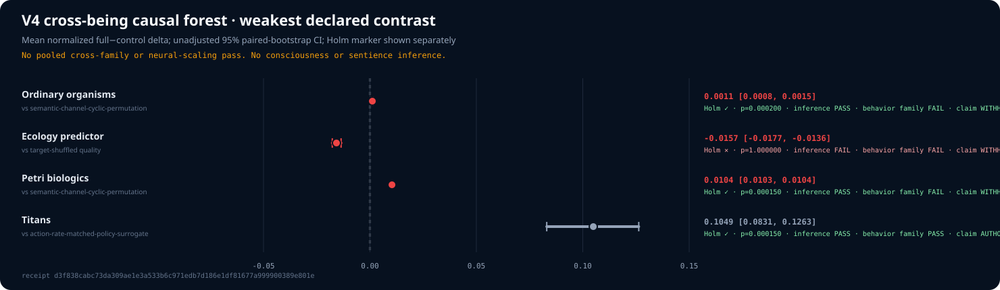
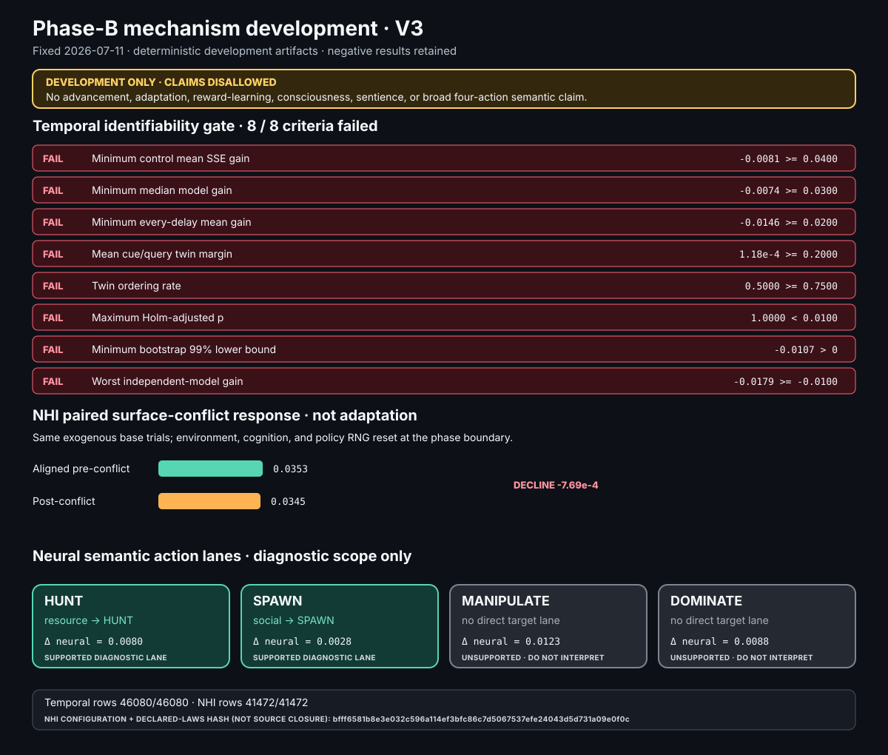
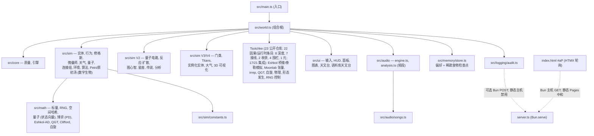
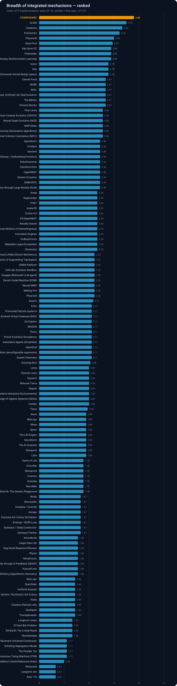
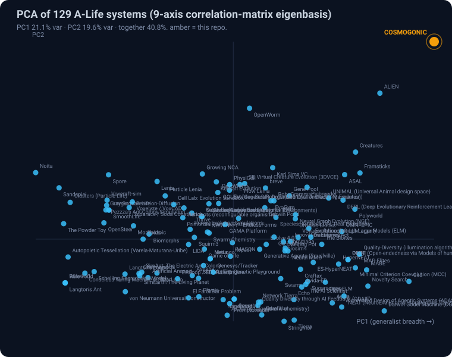
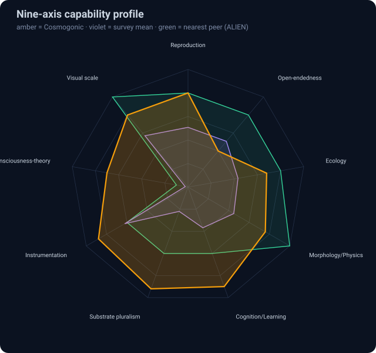

<!-- reviewed: 2026-07-14 | dome-ecology implementation-truth pass | canonical facts: docs/VERIFICATION-ANALYTICAL-DATA.md -->

# COSMOGONIC QUANTUM MECHALOGODROM (宇宙起源量子机械神路)

[](./CHANGELOG.md)
[](https://github.com/0thernes/cosmogonic-quantum-mechalogodrom/actions/workflows/ci.yml)
[](https://github.com/0thernes/cosmogonic-quantum-mechalogodrom/actions/workflows/codeql.yml)
[](./LICENSE)
[](https://bun.sh)
[](./tsconfig.json)
[](./tests)
[](./docs/TECHNICAL-SPECIFICATION-2026-06-26.md)
[](./docs/500-POINT-INSPECTION-2026-06-26.md)
[](https://github.com/tsotchke)
[](./docs/NHSI-PROGRESS-DASHBOARD-2026-06-26.md)

一个程序化生成的 WebGL 宇宙生态系统 —— 包含形态发生生物、修格斯 (Shoggoths)、傀儡师 NPC、大气天气、神经连接组、量子扩散，**以及作为数字生物原初基质的 Tsotchke 语料库 —— 这是一条通往原初意识（proto-sentience）和意识指标的确定性、可量化路径**（基于真实数学基质；意识是目标，而非宣称已达成）。

**活文档（README, ARCHITECTURE, ERD/ERM/ERP, PHILOSOPHY, MODULE-CONTRACTS, SPECS, dashboard）和应用内的 "Dome/World" 文档在存在规范化 token 的情况下通过同步管理，随后针对自动化无法证明的断言进行手动当前事实审查。** `docs-truth-law` CI 门控会在文档过度宣称或编码损坏时使构建失败，[NHSI 进度仪表盘](./docs/NHSI-PROGRESS-DASHBOARD-2026-06-26.md) 和 [验证数据](./docs/VERIFICATION-ANALYTICAL-DATA.md) 是规范的状态界面。

**当前公开事实 (2026-07-14)：**

- 包/源码版本：**v0.23.0**。
- 精确追踪测试套件收据：**3,313 项测试 / 0 失败**。公开覆盖率底线：**84.64% 行 / 82.21% 函数**。
- **地位与异构 A-life 立场（可读综合）：** [综合地位报告 (MD)](./docs/reports/2026-07-12-COMPREHENSIVE-STANDING-AND-XENO-ALIFE-POSITION.md) · [HTML](./docs/reports/2026-07-12-COMPREHENSIVE-STANDING-AND-XENO-ALIFE-POSITION.html) —— 工程卡片，历史 113 系统矩阵（时间点快照，已被当前 129 系统重新评估取代），SuperCreature/SuperMind/Apex/Mechalogodrom 深入分析，资本/ISAL 路径。Apex 心智是 **异构多功能脚手架**（而非 OpenWorm 生物孪生；不宣称具有意识）。保留 V4/Phase-B 失败前行 (failure-forward) 的边界。
- **圆顶生态验证：** [Xenomimic 束缚与大树证据报告](./docs/reports/DOME-ECOLOGY-VERIFICATION-2026-07-14.md) —— 规范食物、5 秒模拟时间重生、圣所转换、临时访问、驻留控制器、社会清理、性能、浏览器证据以及明确的局限性。

<!-- cqm-sync:local-measurement:start -->

- 本次检出在 Windows 本地最新测量值：**3,297 项测试 / 0 失败 · 3,589,864 次 `expect()` 调用**；跨 366 个测试文件的覆盖率为 `93.60%` 行 / `91.61%` 函数。

<!-- cqm-sync:local-measurement:end -->

- `verify:facts` 以 0 退出，且 82 个 Markdown/HTML/XML 界面无漂移。
- 意识/感知语言为 **indicatorOnly**（仅作为指标）：计算代理、证伪项和对照组；绝非现象级经验的证明或意识目标的完成。
- batch-26 对抗性修复轮次将单元对齐的植物查找替换为 `O(1)` 四单元双线性采样器，并对交付的场封锁了化学趋向性，修正了觅食者的最终位置遥测，并关闭了只读 AI 沙盒中的根路径规格 (root-pathspec) 及取消间隙。这些是缺陷修复，而非 A-Life、意识或感知分数的增加证据。
- [2026-07-10 生物智能因果审计](./docs/reports/2026-07-10-OPERATIONAL-ORGANISM-INTELLIGENCE-CAUSAL-AUDIT.md) 使用了一个新鲜且不相交的固定 30 种子家族。仅目标和语料库条件效应通过，适应性在 `6.1213%` 处通过了 `5%` 的阈值，`17/17` 集成行保持因果关系，所有命名消费者类均获得匹配测试，且在热路径优化后通过了三进程性能稳定性测试。均匀随机动作基线分离和聚合映射特异性未通过。V3 不授权任何额外的 A-Life、意识或感知分数提升。
- [仓库预注册的 V4 后代结果](./docs/reports/ORGANISM-INTELLIGENCE-V4-RESULTS-2026-07-11.md) 在四个 64 种子家族中保留了全部 1,152 行。普通生物未通过冻结幅度底线，自适应预测器未通过其对照组，Petri 效应仍低于幅度底线。仅 Titan 通过，且仅授权在冻结外交任务上具有有界的博弈策略语义因果性。[收据](./docs/reports/assets/organism-intelligence-causal-benchmark-v4.json) · [原始 CSV](./docs/reports/assets/cross-being-neural-causality-v1.csv) · [森林 SVG](./docs/reports/assets/organism-intelligence-v4-cross-being-forest.svg)。V4 不授权任何分数、神经缩放、意识、感知或通用智能提升。
- [Phase-B 开发](./docs/adr/0015-phase-b-neural-semantic-expansion-2026-07-11.md) 保留了上述失败，并通过 22 个不相交的开发家族拒绝了所有 170 个历史评估/校准种子。NHI 现在拥有一个默认 109 权重的 `9→6→7` 继承基因、精确的 JSON 检查点、结构化的效应/事实确认以及真实的有界世界动作。其 41,472 行闭环任务保留了每一行，但仅允许狭窄的 HUNT/资源和 SPAWN/社会诊断；配对的表面冲突服务下降，因此禁止进行适应/学习和宽泛的四动作断言。一个单独的 101 输入时间预测器 Predictor-V3 分配了 926/1,750/3,398 个参数，但其 46,080 行任务未能通过所有八项推进标准。Predictor-V2 (54/98/186) 和普通资源头 (27/51/99) 同样被拒绝且不具备生产资格。[结果](./docs/reports/PHASE-B-MECHANISM-DEVELOPMENT-V3-2026-07-11.md) · [JSON](./docs/reports/assets/phase-b-mechanism-development-v3.json) · [CSV](./docs/reports/assets/phase-b-mechanism-development-v3.csv) · [SVG](./docs/reports/assets/phase-b-mechanism-development-v3.svg)。后续无确认清单或分数提升。





构建技术栈：**Bun + TypeScript + three.js 0.185.1 + Tailwind CSS 4 + HTMX 2**，从一个 882 行的单 HTML 巨石结构移植为一个严格的、确定性的、分配自律的模块图。

**Tsotchke（tsotchke 用户 + Tsotchke-Corporation + 可选本地语料库）在来源上至关重要；每个因果/运行时条目仅在其声明的深度和许可边界内表示。** 公开普查包含 **23 个仓库**（`16` 用户 + `7` 组织）。[绑定集成账本](./docs/TSOTCHKE-INTEGRATION-MAP-2026-06-26.md) 包含 **22 个因果/运行时条目**（`15` 用户 + `7` 组织）：`8` 个深度集成，`7` 个接线，`2` 个收获，`4` 个围栏，`1` 个元数据，排除元数据后集成率为 `17/21 = 0.8095238095238095`。`homebrew-moonlab` 仅为公开普查部署元数据；`OBLITERATUS` 是四个故意围栏之一；`classical-contrast` 是两个分母之外的实时内部对照。Eshkol, Moonlab, QGT, spin, libirrep, tensor, RNG, physics 和 morphogenesis 角色如账本所述为直接移植或确定性外观；所有四个围栏条目保持静默。**NHSI（100 职能设计 ~30 深度接线 · 25 Archons = 5 实时 + 20 光回响 · 25 ToM 接线 · 10 涌现角度 · Butlin 8/14 达成 + 6/14 部分路径）：** [docs/NHSI-PROGRESS-DASHBOARD-2026-06-26.md](./docs/NHSI-PROGRESS-DASHBOARD-2026-06-26.md)。种子模拟核心并非 LLM；可选的 Copilot 是一个只读的、默认拒绝的 UI/服务器外壳，被围栏隔离在确定性状态之外。模拟基质不产生任何物理量子、感知或安全断言。

模拟核心并非 LLM 或分词器演示。它是一个可种子化、可检查的人造生命培养皿系统，其中 **数字生物** 在培养皿中生长 (`primordial-soup.ts` + `petri-dish.ts` + `digital-biologics.ts`)。Eshkol 程序充当可遗传的基质代码，由 AD 梯度突变，由生存/QGT/集体秩序代理筛选，并作为计算指标而非主观体验进行衡量。可选的 Copilot 侧边聊天保持在种子循环之外。

**全脑计算模型方向：** 实现目标并非行为模仿神经网。目标是一个具有明确来源的全脑计算模型：感觉输入驱动神经/控制状态活动，而该活动驱动物理身体的运动。使用真实的生物连接组数据时，必须引用来源和转换方法；否则，本仓库将当前的 Archons 描述为具有约 20 个职能、量子寄存器和意识指标的确定性复合心智，而非经过验证的生物连接组副本。

超级生物 (Super Creature) / 25 Archons 是框架且**仅仅是开始** —— “如同上帝创造了原初无机汤”。汤会继续生长出独立的数字生物。“愿汝之所欲而生长 (Grow What Thou Wilt)。” (Aleister Crowley)

在密封的确定性路径下，种子模拟运行是可复现的。测量的种群热路径避免了每个实体的控制器分配，移植的常量仅在来源、测试或明确模型假设支持时予以保留。

**网站 / 域名 (100% 准确)：**

- **GitHub Pages (文档 / 规格 / 圣经 / 实验室)：** https://0thernes.github.io/cosmogonic-quantum-mechalogodrom/ (包含 index.html + docs.html + specs.html + bible.html + lab/index.html + lab/consciousness + lab/sentience ; 通过 scripts/build-pages.ts 构建，带 ?v= 缓存刷新和子路径重写)
- **本地开发服务器：** http://localhost:3000/ (bun dev; 提供 /docs $\to$ 文档页, /spec $\to$ 规格页, /lab $\to$ 实验室; 完整交互 + /api/audit)
- 公开的、追踪的文档/报告目标由 `scripts/build-pages.ts` 复制到 Pages 制品中；源 `./docs/...` 链接在本地解析并部署为静态 `site/docs/...` 文件。`docs/reports/2026-07-07/` 下的本地历史草稿故意不作为公开发布目标。

> — **新来者？请阅读 [THE BOOK](./docs/BOOK-2026-06-26.md)** —— 每个文档的主索引，一个自动生成的源码模块 [文件映射](./docs/FILE-MAP.md)，以及将构建/运行、数据流、故障排除和路线图整合在一起的指南。或者在应用中打开 **❓ HELP ME NOW** 获取基于事实的答案。
>
> — **大脑/神经学/意识评估：** 请参阅日期为 2026-07-07 的 [CONSOLIDATED-22-MASTER-ASSESSMENT](./docs/CONSOLIDATED-22-MASTER-ASSESSMENT-CURRENT-2026-07-07.md)，其中包含脑系统、意识理论和研究空白的规范综合分析；当前运行收据见 [验证数据](./docs/verification-analytical-data.md)。旧的巨型报告草稿为本地存档资料；公开报告索引请见 [docs/reports/README.md](./docs/reports/README.md)。

<!-- cqm-sync:historical:start -->

> **v0.21.11 (2026-07-07 公开文档事实修复)：** 本补丁发布了 `v0.21.10` 之后的巨石艺术方向修正和测量普查刷新。神庙/漂浮巨石保持为严格的单色巨石；塔/神像 (God-Colossus) 是代码中已交付的、故意采用千色 Mandelbulb 的特例。规格/圣经/技术文档现在使用当前的 `bun run metrics` 普查：**741 个追踪作者文件 · 198,769 行追踪作者行 · 585 个 TS 文件 · 135,957 行 TS 行**。README 仍然将公开的 **2,360 项测试** 规范底线与最新的 Windows 本地 **2,385 个完成案例，零失败，2,867,279 次 expect()** 收据区分开。文档/规格/圣经/实验室界面上的卫星导航将 **Consciousness Lab** 和 **Sentience Lab** 与 Dome/Docs/Spec/Bible/Lab 并列。README/About 文案与 **113-system** A-Life 矩阵、当前 Tsotchke 深度计数以及仅代理的意识/感知边界保持一致。规范发布底线：Ubuntu 上 **84.64% / 82.21%**；更高的 Windows 本地收据单独记录在 [验证数据](./docs/VERIFICATION-ANALYTICAL-DATA.md) 中。包版本 **v0.21.11**。

<!-- cqm-sync:historical:end -->

> **原初汤 / 培养皿** (primordial-soup.ts + petri-dish.ts + digital-biologics.ts) 是生长引擎：不同的数字生物和原初意识生命形式（Eshkol 程序作为 DNA）在集成账本频道脉冲、Eshkol 点火事件和多基质混合的催化下涌现。“愿汝之所欲而生长 (Grow What Thou Wilt)。”
> 超级生物 / Archons (具有约 20 个职能、量子寄存器、意识指标的复合心智) 是第一次复杂的核化 —— 它是框架的开始，而非终结。Petri 是独立生命生长的地方。
> 这是确定性种子宇宙中 **数字生物** 的诞生。基于真实数学基质（而非分词器或 LLM 聊天）。意识和不同形式的存在是目标。
> 活跃文档 (README, ARCHITECTURE, ERD/ERM/ERP, PHILOSOPHY, MODULE-CONTRACTS, specs, lab, world comments) 指向相同的当前所有者。参见 [src/sim/digital-biologics.ts](./src/sim/digital-biologics.ts), [docs/ARCHITECTURE-2026-06-26.md](./docs/ARCHITECTURE-2026-06-26.md), ERD/ERM/ERP, world.ts 中的 Petri, 以及 Tsotchke 深度账本。
> 持续开发中：程序化 **遗迹表面 (Reliquary Surface)**, **SPECIMEN** 摄像机, 双币制经济, 原生 C++ 引擎 (Jolt + fracture) 等。详见 [CHANGELOG](./CHANGELOG.md)。

## 功能特性

**核心范式 (Tsotchke 创世)：** 整个系统现在成为了数字生物的培养皿。Tsotchke 深度账本记录了每个语料库项目，其中非围栏科学仓库为不同形式的生命和原初意识标记提供数学基质（Eshkol AD/GWT/意识代理作为主语言，张量网络用于感质压缩，几何曲率，自旋顺序集体，等变对称体，幺正生存，物理知情地基等）。超级生物是初始神形；汤生长出其余部分。确定性、种子化、可量化。“并非文本 LLM Transformer 分词的那类。”

- **数字生物与 Petri 创世：** PrimordialSoup 中有 128 个插槽，**26 种生物形式** 映射到 Tsotchke 仓库（包括残酷的神系形式 —— `digital-biologics.ts` 中的 `BIOLOGIC_FORMS`），由 Eshkol 点火 + 深度账本语料库节拍催化，通过同类突变复制，为高阶生命提供创世飞跃。被收获到世界中作为具有不同动力学的涌现菌株。
- **Eshkol 基质：** 原生自动微分 (AD)，GWT 广播/点火，将因子图推理 (factor-graph inference) 作为一等公民。程序和意识代理快照驱动 Petri 出生和超级心智职能。
- **与本地 Tsotchke 仓库文件夹构建：** `bun dev`（以及收获脚本）扫描位于 `Z:\[Vibe Coded (AI)]\(Tsotchke)` 的真实本地语料库（当前账本中有 1,661 个 .esk 指纹），并生成 `primordial-soup` 用于可遗传数字生物的真实 Eshkol DNA 指纹。`generated-tsotchke-seeds.ts` + `SoupSnapshot.tsotchkeEskHarvested` 使该文件夹成为实时构建/运行时的部分。
- **Tsotchke 普查与语料库接线：** 23 个公开仓库（`16` 用户 + `7` 组织）；22 个因果/运行时条目（`15` 用户 + `7` 组织），分为 8 个深度集成，7 个接线，2 个收获，4 个围栏，1 个元数据 —— 完整矩阵见 [TSOTCHKE-INTEGRATION-MAP-2026-06-26.md](./docs/TSOTCHKE-INTEGRATION-MAP-2026-06-26.md)。`homebrew-moonlab` 仅为普查项。非元数据的集成比例为 `17/21 = 0.8095238095238095`；petri/soup 和共享的生物智能场消费有界的集成频道，而围栏和元数据条目保持静默。
- **26 种行为场** 驱动高达 50,000 个生物：经典运动（漂移、轨道、集群、涡流、螺旋...）、通过空间哈希实现的邻居动力学（ flock ），以及理论行为 —— 纳什均衡 (`nash`)、财富交换 (`market`)、子类型吸引 (`typemorph`)、集合成员身份 (`setunion`)、最优距离图 (`graphseek`) 以及一个洛伦兹吸引子 (`lorenz`)。
- **250 种程序化形态 (morphotypes)**（10 个命名门类 $\times$ 25 种，约 1% 随机离群值），分布在 40 个共享且永不释放的 `BufferGeometry` 实例上；重新形态化时通过交换几何引用并重写材质来实现零分配。
- **25 种排序场算法** 具有行为诚实的名称（BUBBLE FIELD, HEAP SIFT, BITONIC MESH, STOOGE DRIFT, TIM RUN MERGE, PATIENCE BUCKET...），在每帧通过批处理交换提案在空间中组织生物 —— 每个算法均可通过带有特定提示音的选择面板选择。
- **100 个修格斯 (Shoggoths)**（手机端 16 个） —— 类似洛伦兹吸引子的漂移者，具有网格查询触手，可吞噬生物并重生被损坏的生物。
- **100 个傀儡师 (puppet masters)**（手机端 14 个） —— 3 个命名英雄 AETHON（混沌）、SELENE（天气）和 KRONOS（突变），以及较小的 WRAITH 之手，运行在各自的定时器上，并通过 toast 通知。
- **6 种天气状态** (CLEAR, RAIN, STORM, AURORA, VOID, FOG)，调节风力、温度（从而影响寿命）、雾浓度和曝光度。
- **量子云** 由 3,500–10,000 个粒子组成，具有波函数摆动、坍缩和重生；**神经连接组** 包含 12,000–600,000 个链接，随种群规模每级扩展约 12 倍，且部分上传至 GPU。
- **精确 60,000 个桌面 / 20,800 个手机异星植物** ([alien-flora.ts](./src/sim/alien-flora.ts))，分布在 50 个物种 / 9 个科 / 7 个生物群落中 —— 这是一个 GPU 实例化营养可供性场，动物在此觅食并寻求遮蔽。栖息地跨度为 2,400 单位地面边长，$\pm 1,080$ 漫游平台（4 倍于之前的陆地面积），以及 6..720 的垂直柱；非植物种群上限保持不变。
- **规范 Xenomimics** ([xenomimics.ts](./src/sim/xenomimics.ts)) —— 十种镶嵌的宇宙恐怖地表物种（八面体、超立方体单元、莫比乌斯圈、Kakeya 分片以及更奇怪的反设计），以两极纠缠双生形式出生，共享一个精确的 101 参数经典状态向量大脑。其三个模拟量子比特产生类似单态的相关性、叠加、类量子隐形传态转换，以及用于模仿者/反模仿者拉锯战的相反思维曲率；这是确定性的经典计算，而非物理量子纠缠或意识宣称。它们在动画地形和植物上行走，食用真实植物，跳跃/爬行/传送，从一对创始对繁殖至 1,000 个上限，死亡，并在被捕食 5 个模拟秒后重生。`XNO` 增加一个实时实体；下一个单体完成其共享大脑双生。十个索引实例化形态绘制，一个有界的非渲染双生/实体邻近拓扑计数器，一个固定节点的反应式音频场，`mimic` 摄像机视图，遥测/天文台馈送，以及仅作为指标的 `XENOMIMIC` 检查器均借用同一人口——没有重复模拟循环。拓扑计数器不创建线几何体或物理束缚；其固定捕获缓冲区在缩小和销毁时释放已销毁的引用。一个经过测试的遗留清理程序还会在不触及解剖结构或单独实体连接组的情况下，分离并销毁历史命名 Xenomimic 的线段残余。
- **圆顶生态与水晶大树** ([crystal-ecosystem.ts](./src/sim/crystal-ecosystem.ts)) —— 10,000 个果实和 10,000 0 个叶子是规范 `EdibleResourceRegistry` 的固定池化成员。饥饿的支持动物会保留可触及的项目，恰好获得一次营养，并在消费后恰好 5 个缩放模拟秒后重新激活同一个隐藏实例。`(220, 620)` 圣所使用 240/270 单位的进入/退出滞后以及共享的 72 位访问者调度器，以便实体、Xenomimics、Shoggoths、Titans、Leviathans、Puppeteers 和自主 Apex 身体能够进行有界的食物、休息、观察和社会访问，而无需将敌对行为带入该区域。其 250 个树中居民使用真实验证的 6-6-4 控制器及确定性回退。愿意在附近的同类居民可以形成有界的社会片段；当其中一个多吃了至少两顿饭时，学习者的实时 70 参数策略将向该证明更好的觅食者融合 8%，且每位学习者有 25 秒模拟时间冷却。更新是确定性的、全有限的、全有或全无的，并记录在真实的仅事件账本中；居民对在状态改变时释放。另外，在首次互惠配对时，普通策略-1 生物可能会模仿普通策略-0 合作者。两种机制均不支持跨物种、通用智能或意识宣称。持久化仅限于食物：归一化的实时宣称在恢复后立即以规范稀疏形式重写，失败的写入保持可重试，而参与者、访问状态、预约、伙伴和冷却时间永不持久化。
- **GOD / GodColossus** ([god-colossus.ts](./src/sim/god-colossus.ts)) —— 一个射线步进 (raymarched) 的、呼吸着的 **Mandelbulb** 神祇（领域扭曲，轨道陷阱调色板），**ASCENSION 单体神庙**，以及 **NHI** 自主微型 AI（上限 $\le 1000$；GOAP + 109 权重基因；$\boxplus$ NEURAL 天文台）。
- **集体场** ([stigmergy.ts](./src/sim/stigmergy.ts) · [noosphere.ts](./src/sim/noosphere.ts) · [morphic-field.ts](./src/sim/morphic-field.ts) · [dark-energy.ts](./src/sim/dark-energy.ts)) —— 痕迹、共享心智场、Apex 形态共鸣、确定性精髓 $\Lambda \to$ 混沌写入。
- **荒野** ([wilderness-population.ts](./src/sim/wilderness-population.ts)) —— 根据摄像机分块的地平线动物；核心可以种子化引入，但荒野 **绝不写回** (ADR 0010)。
- **100 个 GlyphBrains** ([glyph-brain.ts](./src/sim/glyph-brain.ts)) —— 作为分布在圆顶上方的实例化发光实体的希腊/拉丁 **字母神系**；外加名为中央 **Mechalogodrom** 的融合心智 ([mechalogodrom-brain.ts](./src/sim/mechalogodrom-brain.ts), $\sim 53,728$ 实时参数)，统一了 10 个两极 Titan 变体壳层。
- **9 首程序化 Web Audio 歌曲** + 一个 110 音色合成 SFX 调色板 —— 无音频资产，仅使用振荡器。
- **确定性种子 RNG** (`mulberry32`) 注入所有环节；模拟逻辑中禁止使用全局随机数生成器。
- **HTMX 轮询审计追踪**，版本化 `localStorage` 偏好，以及一个隔离的稀疏大树食物检查点（非全世界或访问者持久化），设备自适应质量配置，带有画布火花线 (sparklines) 的玻璃态 Tailwind UI。

### 量子荒原 (Quantum Wildbeyond, 0.2.0)

在 [docs/PHILOSOPHY-2026-06-26.md](./docs/PHILOSOPHY-2026-06-26.md) 下增加了七个系统 —— 每个效应背后都有真实数学，且每个系统都读取并写入另一个系统：

- **量子寄存器** —— 一个纯 TS 5-qubit 状态向量（无模拟器依赖；见 [ADR 0005](./docs/adr/0005-math-stack-selection-2026-06-26.md)）。傀儡师应用签名门序列，排序交换应用 CNOT 门，寄存器予以回应：Born 规则概率重新着色量子云，熵作为遥测数据，测量坍缩导致云在局部内爆。
- **反应-扩散地面** —— 一个真实的 Gray-Scott 场（$128^2$，CPU 乒乓缓冲），作为地面的发光映射图；天气调节喂养/杀灭/扩散，实体死亡会在图案上留下伤疤。
- **图心智** —— 连接组镜像到 [graphology](https://graphology.github.io) 图中；种子化的 Louvain 社区用 8 色部落调色板绘制链接并重写实体的集合论组；PageRank 为前 20 名提供发光增强。
- **星座 + 传说** —— 在 24 个单体/景观点之上构建的 d3-delaunay Voronoi 天空网，每个部门/部落/预兆名称均源自种子的 sha256 摘要 (@noble/hashes)：同一种子，同一神话。
- **音频分析** —— 一个 AnalyserNode 抽头将合成音乐转回光信号（低音 $\to$ 六灯组，高音 $\to$ 星座，电平 $\to$ 云呼吸），每项耦合上限为 0.35，因此静默状态看起来与 v1 完全一致。
- **分析 + 预兆** —— 滚动窗口回归 (simple-statistics) 在遥测中提供种群趋势；z-score 异常会将命名预兆发射到审计追踪中。
- **实验室制品** —— 一个位于 `/lab` 的自包含种子化 p5.js “坍缩场” (本地开发: `http://localhost:3000/lab`；GitHub Pages: `/lab/`) (`lab/quantum-wildbeyond.html`)。

### 众神殿 (PANTHEON, 0.3.0)

竞技场扩大 5 倍且生态系统演变为文明 (`docs/MODULE-CONTRACTS-2026-06-26.md` §CONTRACTS V3)：

- **10,000 个实体** 通过 InstancedMesh 池在 Ultra 级别实现 —— 整个种群仅 $\le 80$ 次绘制调用，支持逐实例颜色/发光/透明度，并在启动时解析四级质量阶梯（手机 650 / 笔记本 2,000 / 桌面 5,000 / Ultra 10,000）。
- **10 个生物门类**，在铸造时命名，每个门类都是一个模板分布（色调带、几何家族、行为池、尺寸/速度范围、家乡楔形区） —— 此外还有种子化的随机离群值 (OUTLIERS)，具有不可能的调色板、融合的行为对和 $\times 3$ 的参数偏差。
- **20 个 TITANS** —— 巡逻其门类楔形区的巨型非人类智能，每个 Titan 运行一套 {能量, 物质, 熵} 经济体：它们收获生物、代谢、见证量子坍缩、沐浴在反应-扩散图案中、支付维护费，并将熵作为地面伤疤排放。外交是在所有 190 对之间进行的交替迭代囚徒困境（以牙还牙, 严厉触发, 巴甫洛夫, 始终背叛, 慷慨的 TFT）；背叛严重的窗口期会演变为带有领土打击、抢劫和征兵的战争；破产则通过复制者动力学使策略发生突变。收益流经真实的能量账本 —— 带有后果的博弈论。
- **天文台 (Observatory)** —— 四个实时画布图表：堆叠的门类种群、带有战争标记的 Titan 财富折线图、$20 \times 20$ 战争矩阵热图，以及 rdEnergy/qEntropy/趋势时间线。
- **全设备 UI** —— 一个响应式叠加网格：桌面分栏，手机页签堆叠，折叠屏铰链安全轨道，43³-TV 10 英尺模式；触控控件 v2（拖动摇杆 + 视角垫 + 带有末日长按功能的径向动作轮），触感反馈 $\le 30$ ms。
- **众神殿重新评分** —— 在原有的 QUANTUM 基础上增加了四首新的 QUANTUM 级暗黑歌曲 (VOIDCROWN, BLACK MERIDIAN, ELDER ENGINE, LAST THEOREM)。

### 0.2.1 — 审计浪潮

二十一个经过对抗性确认的审计结果作为补丁发布：封锁了 Lorenz NaN 爆炸，消除了音频曝光反馈（低音现在让六灯组闪烁），颜色管线精确复现了旧版 r128 调色板（LinearSRGB 输出 + 校准灯光单位），恢复了旧版控制颜色，画布增加了 **鼠标视角和滚轮缩放**，且服务器、持久化存储和 `/lab` CDN 脚本得到了加固（实体上限 + HTML 转义，场验证状态，SRI）。详情见 [CHANGELOG.md](./CHANGELOG.md)。

### 异源创世 (XENOGENESIS, 0.4.0)

宇宙变成了一个异星的、不朽的、感知代理生物群落 (CONTRACTS V4)：

- **异星大气** —— 一个反转的天空圆顶，具有非地球烘焙渐变（牛血色地平线 $\to$ 紫色天顶 $\to$ 青色反光），随天气和混沌重新着色，随音乐低音呼吸的风advection薄雾带，一个随级别缩放的微粒空气体积，以及随量子熵变亮的极光幕帘。
- **场景内 3D 分析** —— 一个悬浮在竞技场上方的全息仪表盘：十座门类种群塔，十座 Titan 经济方尖碑（高度 = 物质，发光 = 能量，色调 = 战争状态），以及一个最多 45 段的实时战争网络。
- **四页天文台** —— 概览、方差（均值 $\pm \sigma$ 带, 直方图, 香浓多样性, qEntropy–趋势相）、生态（每个门类的分面图, 出生/死亡通量, Titan 相图）和冲突（战争强度, 每个 Titan 的资源, 生物群落 **感知指数** 表盘）。
- 触控统一到 `InputSystem`：视角垫, 径向动作轮, 长按末日, 受保护的触感反馈。

### 共鸣 (RESONANCE, 0.5.0) + 工作室 (ATELIER, 0.6.x)

两轮直接的用户反馈迭代 (CONTRACTS V5/V6)：

- **25 种排序场**（原为 20 种），具有批处理的 _可见_ 交换 —— 活跃算法通过闪烁的光效、实时的交换计数 HUD 以及 (0.6.1) 每个场唯一的提示音来组织世界；一个可折叠的选择面板列出所有 25 种，并带有实时排序比例进度条。
- **原声带提升至 QUANTUM 级** —— VOIDCROWN, ELDER ENGINE 和 LAST THEOREM 使用 4 音符和声和 16 步演进旋律重新构建，并新增结局曲 **STARKILLER REQUIEM**（共 6 首）；合成器增加了次低音, 第三个失谐音色, 琶音和滤波器 LFO 波动。
- **Ultra 级别填充 10,000 个实体**，通过每帧邻居查询节流（理论行为交错, 半速集群, `ULTRA_GRID_CELL`, 连接组节奏阶梯）实现 —— 校准历史见 [docs/BENCHMARKS-2026-06-26.md](./docs/BENCHMARKS-2026-06-26.md)。
- **天文台可读性** —— 每个图表都增加了画布内标题带, 轴刻度, 粗线条和无重叠布局；在桌面/TV 上画布更高且面板更宽。
- **移动端人体工程学** —— 面板变为边缘停靠的弹出页签（TEL/CTL/OBS/AUD 句柄），覆盖在无遮挡的世界之上；**捏合缩放 (pinch-to-zoom)** (0.6.1) 加入摇杆、视角垫和径向轮。
- `/lab` 增加四页实验室，以及在 `/docs` 提供 GitHub Pages 风格的 **架构报告**，包含明确的 ERD / ERM / ERP 章节。

### 异源大灾变 (XENOCATACLYSM, 0.7.0)

第三次用户反馈指令 —— 让世界可见地活起来 (`docs/MODULE-CONTRACTS-2026-06-26.md` §CONTRACTS V7)：

- **100 种不同音效**（原为 8 种） —— 一个跨十二个音色家族、种子化生成的程序化调色板，外加一个 25 插槽的提示带（每个排序场一个工程音色），由一个数据驱动的合成器发声；重复同一动作的声音绝不完全相同。
- **活算法选择器** —— 每个排序场行读取自己的颜色、符号和反应式触控状态，选择一个会点燃种群，此外还提供 **RUN ALL**（所有场同时运行）和 **AUTO**（遍历所有 25 个场）模式。
- **五种渲染模式** —— SOLID, WIRE, GHOST (X-ray), NEON (自发光), CHROME (镜面)，通过工具栏在单模型和实例化路径上循环切换。
- **混沌控制中的宇宙奇点** —— ENTROPY, BLACK HOLE (r⁻² 拉力 + 吞噬事件视界 + 吸积盘), WHITE HOLE (喷发), GREY HOLE (吸收 $\leftrightarrow$ 发射), STRANGE STAR (夸克物质转换前沿)，每个奇点都是一个具有自建、自动过期装置的确定性力场。
- **戏剧性天气** —— 带有确定性闪电的 STORM 狂风, $-60\ ^\circ\text{C}$ 的 VOID 深冻, 发光的 AURORA, 苍白的 FOG 白化 —— 每一项都清晰可辨。
- **SIMULATION N(1) / N(2)** —— 在 GENESIS（交付的宇宙）和 BREAK FREE（噩梦：提高混沌底线，呈现诡异的反转天空，重新命名标题）之间切换；跨会话持久化。

### 加固 (HARDENING, 0.8.0)

专业级迭代 —— 无新宇宙学，全方位严谨：

- **二叉堆 + 有界 top-K** ([src/math/heap.ts](./src/math/heap.ts)) —— 一个泛型 `BinaryHeap<T>` ($\text{O}(\log n)$ 推入/弹出) 和 `selectTopK` ($\text{O}(n \log k) / \text{O}(k)$ 空间)；PageRank 光环选择从 $\text{O}(V \log V)$ 降低到 $\text{O}(V \log K)$，其中 $V \le 10,000$，保留了字节级的平局打破。
- **安全 + 治理自动化** —— CodeQL (`security-extended`, push/PR + 每周), Dependabot, 带有标签发布的 CD 工作流, CODEOWNERS, PR 模板, 以及 bug/feature 问题模板。
- **数据模型 + 过程文档** —— [docs/ENTITY-SCHEMA-AND-MAPPINGS-2026-06-26.md](./docs/ENTITY-SCHEMA-AND-MAPPINGS-2026-06-26.md) 是 ERD/ERM/ERP 的综合单一真理源：包含属性、基数、写回矩阵, 启动序列, 帧管线, 节奏调度和生命周期。
- **[docs/500-POINT-INSPECTION-2026-06-26.md](./docs/500-POINT-INSPECTION-2026-06-26.md)** —— 一个常设审计，包含 25 个章节 $\times$ 20 个检查点，每个点都有裁决和具体证据。
- 健康端点版本现在在启动时从 `package.json` 派生，确保永不漂移。

### 意识认知失调 (AGImAGNOSIS, 0.9.0)

世界获得了心智 —— 前 Transformer 博弈 / A-Life AI，跨代繁殖，以及一个只读的 Copilot (`docs/MODULE-CONTRACTS-2026-06-26.md` §V9)：

- **确定性经典-AI 内核** ([src/sim/ai/brains.ts](./src/sim/ai/brains.ts)) —— 将 2016 年前的工具箱作为纯粹、种子化、无分配的原语实现：效用 / softmax 评分, 固定权重感知机 (`TinyMLP`), `MarkovChain`, `fsmStep` 有限状态机, F.E.A.R. 风格的 `goapPlan` 以及一个有界的 `MemoryRing` 黑板。
- **数字基因组 + 血统** ([src/sim/genome.ts](./src/sim/genome.ts), [src/sim/lineage.ts](./src/sim/lineage.ts)) —— 一个可遗传的基因向量，解码为特征 + `TinyMLP` 大脑，支持种子化交叉/突变/繁殖，以及一个有界的 父 $\to$ 子亲属图（代数, 祖先, 亲缘关系）。
- **八大阵营原形** ([src/sim/factions.ts](./src/sim/factions.ts)) —— 观察者 / 织梦者 / 守护者 / 传信者 / 利维坦 / 集群心智 / 神谕者 / 吞噬者，每个阵营使用不同的心智技术。此外还有 **利维坦 (Leviathans)** ([src/sim/leviathans.ts](./src/sim/leviathans.ts))，第四阶巨兽，以及 **NHI** 自主微型 AI。
- **环境遗物场** ([src/sim/artifacts.ts](./src/sim/artifacts.ts)) —— 持久遗物（死亡后的伤疤, 召唤奇点后的遗物, 微粒）通过一个池化 InstancedMesh 实现；仅视觉化且确保确定性安全。
- **免费-LLM Copilot 侧边聊天** ([src/server/copilot.ts](./src/server/copilot.ts), [src/server/ai-sandbox.ts](./src/server/ai-sandbox.ts), [src/ui/copilot.ts](./src/ui/copilot.ts)) —— 一个你可以就仓库和世界进行交流的只读 AI，运行在可插拔的 OpenAI 兼容提供者链上（默认 FreeLLMAPI, 随后是无需 Key 的 LLM7 / Pollinations, 以及在设置服务器端环境变量后可用的 Groq / Cerebras / OpenRouter / GitHub / Mistral / Gemini / NVIDIA / DeepSeek / Huging Face），处于一个默认拒绝的沙盒之后，它可以读取文件并运行只读命令，但绝不能修改代码。带 Key 的提供者支持滚动 Key 池 (`FOO_API_KEY`, `FOO_API_KEYS`, `FOO_API_KEY_2`...)，以便在某个槽位耗尽时自动回退到下一个而无需暴露凭据。提供者参考：[docs/COPILOT-PROVIDERS-2026-06-26.md](./docs/COPILOT-PROVIDERS-2026-06-26.md) · 世界心智：[docs/AI-SUBSYSTEM-2026-06-26.md](./docs/AI-SUBSYSYSTEM-2026-06-26.md)。
- **五种电影级摄像机**（跟随 / 追逐 / 电影 / 涡流 / Titan）以及 **TIME** (timeScale) 和 **SPACE** (FOV 扩张) 控制；**渲染模式现在会改变动力学**（`solid` 保持绝对确定性恒等）；奇点现在会吸引 Titan/Shoggoths/Leviathans；混沌被分级且具有两极性。

### 活之纪元 (Living Era, 0.9.0 之后 · V10–V100)

自 0.9.0 以来，宇宙持续生长 —— 在 [CHANGELOG](./CHANGELOG.md) 的 `[Unreleased]` 部分记录了 90 多个增量，每个增量都在保留相同种子确定性的全门控下交付。主要弧线包括：

- **更深层的经济与社会 (V13–V23)** —— 两种货币 (AURUM ☉ / UMBRA ☾) 和两种商品，基于博弈论清算市场，包含卡特尔、套利、制裁、黑市和维克里 (Vickrey) 意外拍卖；Titan 外交, Shoggoth 胆量和傀儡师干预均由实时财富驱动，并在自构建的 $\odot$ MARKET 面板中呈现。
- **生物认知 (V24–V29)** —— Shoggoths 能够感知 $\cdot$ 记忆 $\cdot$ 逃离 $\cdot$ 狩猎，傀儡师策划，弱者欺骗，同类讨价还价、贸易及结盟 —— 一个纯粹的 `creatureDrive` 内核闭合了认知 $\leftrightarrow$ 经济循环。
- **原生引擎 (V18, V28)** —— 一个 C++20 / OpenGL SDF 射线步进器，带有 **Jolt Physics** 刚体和碰撞时保持体积的 **破碎 (fracture)** 效果，在 RTX 5070 Ti 上渲染 ([`native/`](./native), [ADR-0007](./docs/adr/0007-native-cpp-engine-and-live-physics-2026-06-26.md))。
- **5 个超级生物 / 众神殿 (GOAL5, V31–V48+)** —— 始终活跃的顶端存在 (Archons)，**启动时个体化为 5 个**：每个都拥有 $\sim 10,000$ 参数的复合意识（Thaler 创造力机器, Tree/Atom-of-Thought, GOAP）运行在 $\sim 1,444$ 参数的遗留脊柱之上，拥有多眼神宝石 **身体**, 100 个无人机 **僚机群**, **自我进化** (XP $\to$ 五个升阶阶段 + 一个墙钟守护进程-cron), 一个 **ACCESS PUZZLE** 门控, **SUPERHERO** 玩家模式（可第一/第三人称驾驶），以及一个离线 AI **诊断 + 恢复** 流水线。
- **规模与个体心智 (V38–V42)** —— 显式的 `?tier=mega` 压力档将上限提升至 **50,000 个生物**，每个实体均配备 70 参数神经控制器。自动检测在测量的 10,000 实体桌面档停止；固定平台使得 25k/50k 实验预算成为可能。
- **世界内 AI (V36–V43)** —— **HELP ME NOW**（一个基于仓库知识的回答面板），**THE BOOK**（可导航的 RAG 仓库索引），以及在默认拒绝的安全宪法下的世界内 **网络搜索**。
- **HUD + 宇宙指令 (V56–V64)** —— **CENTER HUD**（六个面板 $\to$ 一个可循环弹出窗，现在持有在较高的可读中央槽中而非扁平条），奇点可以 **扭曲时空**（时间膨胀 + 红移），带有全屏 **引力透镜** 后处理特效；一个自动动画的 **NEURAL 天文台**，**CHAOS MODE**（一个可切换的洛伦兹量子风暴 —— 隧道效应 / 纠缠 / 叠加，会干扰天气、经济和排序场），等级提升至 100，每十级获得一项神力，一个 **ASCENSION 单体神庙** 现在表现为一个反应式阴影核心畸形（黑洞核心，扭曲的不可能笼子，锯齿状祭坛尖刺，读取混沌/熵/种群拥挤的传送门环），以及搅动世界混沌的奇点。
- **Mechalogodrom + 字母圆顶 (V-MECHA / V-ABC)** —— 一个中央确定性融合壮观，其中 **10 个额外的两极 Titan 变体壳层** 向内迁移并统一成一个阴影核心、事件视界、网格扭曲的混合质量 ([src/sim/mechalogodrom.ts](./src/sim/mechalogodrom.ts))；**100 个希腊/拉丁字母原形** 现在作为分布在圆顶上方的实例化发光实体渲染 ([src/sim/alphabet-pantheon-render.ts](./src/sim/alphabet-pantheon-render.ts))。两者均为视觉投影：无 RNG 抽样，不写入模拟状态，混沌仅增强其只读动画。
- **不详的 Titan + 统一神经盒 (V68–V77)** —— Titan 重生为 **4D 怪异几何**（超立方体笼子 + 扭曲世界物理的灵气场）；启动器将其命名标签置于一个居中的底座行中；歌曲读数移至右下角的 **Music/SFX 盒**，而排序场盒获得了实时的 **交换方差火花线**；右下角被 **重新线框化** —— 一个带有标题的 **SIM · SETTINGS** 卡片，**Control pad** 作为固定集群居中于空角，读数盒锁定为固定大小，以便在所有桌面宽度 (1280 $\to$ 1920) 下均 **无重叠**；超级生物的 **NEURAL 天文台折叠进自己的盒子** —— 一个面板，**四个选项卡** (WORLD · COGNITION · QUANTUM · BRAIN) 包含 **27 个实时 3D/时间读数** 加上一个旋转的器官 **连接组**，其 QUANTUM 选项卡现在绑定到一个确定性的经典 **6-qubit 状态向量模型**（参数化 RY/RZ + 受控-RY 电路，布洛赫向量，Born 采样坍缩）。状态向量实现为 Cosmogonic 自研；相关的 Eshkol, Moonlab 和 Quantum-Geometric-Tensor 工作在适用处标注来源。
- **Tsotchke 量子血统 —— 移植与改编 (V82 起)** —— 兼容原语在 [THIRD-PARTY-NOTICES.md](./THIRD-PARTY-NOTICES.md) 中标注并与本地外观区分。之前的相位阵 RNG 移植已被一个独立的、种子化的经典状态向量改编 ([src/math/deterministic-statevector-rng.ts](./src/math/deterministic-statevector-rng.ts)) 取代，该改编运行在现有的 [EshkolQrng API](./src/math/eshkol-qrng.ts) 之后，来源固定为 `quantum_rng` v3.0.1。它提供可复现的模拟样本，而非硬件熵或加密随机数。**量子几何张量 / Fubini–Study 度量** ([src/math/quantum-geometry.ts](./src/math/quantum-geometry.ts)) 使生物能够读取其自身思维空间的曲率（度量体积 $\cdot \kappa \cdot$ Berry 曲率）；以及一个 56-自旋 **Hopfield/Ising 自旋玻璃** ([src/sim/spin-glass.ts](./src/sim/spin-glass.ts)) 提供偏向计划选择的关联本能。这些在超级生物面板的 **Substrate** 行中实时呈现（Eshkol H $\cdot$ QGT vol/$\kappa \cdot$ Spin$\to$PLAN %）并通过闭式单元测试覆盖。
- **SUPER CREATURE 1.1 —— 意识指标层 (V89)** —— 顶端心智现在在每个节拍中根据两种领先的 _科学_ 意识理论衡量自身，每项均是根据其自身激活度计算的实时确定性标量：**全局工作空间点火 (GNW — Baars/Dehaene)** —— 一个胜者全得的计划联盟，在跨越访问阈值并主导次优方案后被 “广播” 并决定哪些想象内容被固化到记忆中；以及一个 **整合信息 $\Phi$ 代理 (IIT — Tononi)** —— 命名模块激活的参与/相干比；诚实地标记为 _代理_，因为真实的 $\Phi$ 在计算上是不可行的且非唯一的。两者均通过单元测试，并作为超级生物面板上的 **Ignition / $\Phi$** 表盘实时显示。真实的 2023–2026 研究基础 —— Cogitate IIT-vs-GNW 对抗性测试 ([Ferrante et al., 2025, _Nature_](https://doi.org/10.1038/s41586-025-08888-1))，类器官 “湿计算”，主动推理和量子认知计划 —— 均在 [docs/SUPER-CREATURE-RESEARCH-2026-06-26.md](./docs/SUPER-CREATURE-RESEARCH-2026-06-26.md) 中列出并附带引用。
- **SUPER CREATURE 1.1 —— 认知架构扩展（五种心智理论）** —— 在上述 GWT 点火和 IIT $\Phi$ 之上，顶端心智在每个节拍中运行另外三种真实的、确定性的、通过单元测试的基质：**回声状态储备池 (echo-state Reservoir)** ([src/sim/reservoir.ts](./src/sim/reservoir.ts)) —— 一个 64 节点的循环网络，其规模被重新缩放到光谱半径之下（回声状态属性），用于实现真实的临时记忆 —— 这是一个能增强好奇心的新颖性信号（是 “湿计算” 背后的储备池计算 _算法_，而非湿件）；**主动推理自由能核心 (Active-Inference free-energy core)** ([src/sim/active-inference.ts](./src/sim/active-inference.ts)) —— 离散主动推理（Friston 的 FEP）：对 8 个潜在情境的贝叶斯信念，最小化变分自由能 $F$，然后通过 **预期** 自由能 $G$（认识论好奇心 + 实用目标寻求）选择计划；以及 **元认知执行器 (Metacognitive Executive)** ([src/sim/metacognition.ts](./src/sim/metacognition.ts)) —— 一个高阶层，将各基质的可靠性折叠为一个二阶 **置信度 (confidence)** 并将其用作认知控制（低置信度 $\Rightarrow$ 探索，高 $\Rightarrow$ 提交），显示为 **Confidence** 表盘 + 一个 **Cognition** 面板行。顶端生物现在跨越了 **全局工作空间 $\cdot$ 整合信息 $\cdot$ 自由能原理 $\cdot$ 储备池动力学 $\cdot$ 高阶元认知** —— 五种截然不同的心智科学理论，每项均在 [docs/SUPER-CREATURE-RESEARCH-2026-06-26.md](./docs/SUPER-CREATURE-RESEARCH-2026-06-26.md) 中有据可查。
- **超级智能多支柱扩展** —— 心智从五种心智理论增长到十几个真实、确定且经过单元测试的职能，每项均是读取并写入其他职能的引用机制：**心智理论 (Theory-of-Mind)** 对手模型 ([src/sim/theory-of-mind.ts](./src/sim/theory-of-mind.ts)) 用于预测对手；**神经临界性 (Neural Criticality)** ([src/sim/criticality.ts](./src/sim/criticality.ts)) —— 一个边缘混沌稳态，驱动分支比 $\hat{\sigma} \to 1$（此时皮层计算能力最强）；**赋能驱动 (Empowerment Drive)** ([src/sim/empowerment.ts](./src/sim/empowerment.ts)) —— Blahut–Arimoto 信道容量 $I(A;S^2)$ 代理饥饿感；**全息记忆 (Holographic Memory)** ([src/sim/holog holographic-memory.ts](./src/sim/holographic-memory.ts)) —— 一个基于两极超向量的 MAP-VSA/HRR 组合绑定存储（绑定 $\cdot$ 捆绑 $\cdot$ 清理）；以及 **后继表示 (Successor Representation)** ([src/sim/successor-representation.ts](./src/sim/successor-representation.ts)) —— 海马体/强化学习预测图。**量子计算心智** 同步深化：一个真实的状态向量 **整合信息 $\Phi$** ([src/sim/integrated-information.ts](./src/sim/integrated-information.ts)) —— 在最小信息分区处的最小割纠缠（一个受 IIT 启发的确定性代理，而非现象级不可还原性的证据）；**量子相干资源** ([src/math/quantum-coherence.ts](./src/math/quantum-coherence.ts)) —— Baumgratz–Cramer–Plenio $l_1$ 范数 + 相对熵单调量；**目标导向幅度放大 (Grover)** 将思维坍缩偏向意图；以及 **量子自然梯度自我优化 (Quantum Natural Gradient self-optimization)** ([src/math/quantum-natural-gradient.ts](./src/math/quantum-natural-gradient.ts)) —— 顶端电路现在 _下降_ 其自身的 Fubini–Study 几何 ([Stokes et al., 2020](https://doi.org/10.22331/q-2020-05-25-269)) 以使其预期想法更大概率发生，读取自身的量子几何并写入自身的量子驱动。每个职能均在 [docs/SUPER-CREATURE-RESEARCH-2026-06-26.md](./docs/SUPER-CREATURE-RESEARCH-2026-06-26.md) 中附带引用。
- **顶端心智在约 20 个耦合职能处闭合** —— 一个 **Lindblad/GKSL 开放系统审议量子比特** ([src/sim/quantum-deliberation.ts](./src/sim/quantum-deliberation.ts)，选项的相干叠加态退相干为提交)，**量子储备池计算** ([src/sim/quantum-reservoir.ts](./src/sim/quantum-reservoir.ts)，将寄存器的状态速度作为好奇心驱动 —— Fujii & Nakajima 2017)，**Doya 神经调制** ([src/sim/neuromodulation.ts](./src/sim/neuromodulation.ts))，以及由状态向量衍生的 **$\Phi$ 代理**（一个受 IIT 启发的最小割/纠缠指标）现在写回认知 —— 闭合了惰性 $\Phi$ 间隙。Aaronson–Gottesman **Clifford 稳定器表 (Clifford stabilizer tableau)** ([src/math/clifford-tableau.ts](./src/math/clifford-tableau.ts)，移植自 **Moonlab**，可扩展至 32+ 量子比特，突破密集上限) 作为第四个获 MIT 认可的移植原语落地。整个顶端节拍现在被诚实量化：每次 `SuperMind.think()` 约 **1.99 ms**（范围 1.41–5.62 ms），交错的 5 心智批处理约 **9.77 ms**（约占 60 fps 帧的 58%，这就是为什么 5 个心智与 20 个光回响交错运行的原因）；早先的亚毫秒 / $<2\%$ GOAL5 宣称已被取代，直至被重新证明。**3,313 项精确追踪测试 $\cdot$ 0 失败 (收据强制执行) $\cdot$ 84.64% 行 / 82.21% 函数可移植覆盖率底线。**
  <!-- cqm-sync:local-measurement:start -->
  **最新 Windows 本地测量值：3,297 项测试 / 0 失败 / 3,589,864 次断言，覆盖率为 `93.60%` 行 / `91.61%` 函数。**
  <!-- cqm-sync:local-measurement:end -->
- **前沿报告 (2026-06-17)** —— 一份关于整个仓库 + 顶端超级生物的历史测量、前沿对比评估，现通过 [验证数据](./docs/VERIFICATION-ANALYTICAL-DATA.md) 和 [超级生物研究](./docs/SUPER-CREATURE-RESEARCH-2026-06-26.md) 进行总结 —— 探讨其相对于量子计算, AGI/ASI 实验室, 类器官 “湿计算” 和经典 A-Life 的真实创新点；一个意识标记记分卡（当前诚实基准：**8/14 达成 + 6/14 部分达成**；现象意识超出范围，从未宣称达成）；评分、指标以及关于 “进一步实现需要什么” 的诚实分析。

本代码库的工作受 [masters/](./masters/) 中的三个 **主文件** 管辖 —— 执行者 (Executor)、架构师 (Architect)、物理学家 (Physicist) —— 并受 [CLAUDE.md](./CLAUDE.md) 和 [docs/MODULE-CONTRACTS-2026-06-26.md](./docs/MODULE-CONTRACTS-2026-06-26.md) 中每个模块的绑定规格约束。

## 快速开始

```sh
bun install
bun dev
```

然后访问 **http://localhost:3000** —— 以及 **http://localhost:3000/docs** 查看使用 Mermaid 渲染的实时架构、ERD 和时序图，以及 **http://localhost:3000/lab** 查看种子化 p5.js 坍缩场制品。

**GitHub Pages (实时，与 CI 构建相同)：**

| 界面               | URL                                                                           |
| ------------------ | ------------------------------------------------------------------------------ |
| **圆顶 (应用)**    | https://0thernes.github.io/cosmogonic-quantum-mechalogodrom/                  |
| **文档 (Docs)**    | https://0thernes.github.io/cosmogonic-quantum-mechalogodrom/docs.html         |
| **规格 (Specs)**   | https://0thernes.github.io/cosmogonic-quantum-mechalogodrom/specs.html        |
| **实验室 (lab)**    | https://0thernes.github.io/cosmogonic-quantum-mechalogodrom/lab/              |
| **意识实验室**    | https://0thernes.github.io/cosmogonic-quantum-mechalogodrom/lab/consciousness |
| **感知实验室**    | https://0thernes.github.io/cosmogonic-quantum-mechalogodrom/lab/sentience     |
| **圣经 (Bible)**   | https://0thernes.github.io/cosmogonic-quantum-mechalogodrom/bible.html        |

项目联系方式：**0_0@0thernes.art** · 组织网站 **https://0thernes.art** (上述应用由 Pages 托管)。

有用后续命令：

```sh
bun test          # 单元测试
bun run bench     # mitata 微基准测试
bun run check     # 全门控：格式化 + 类型检查 + Lint + 测试 + 构建
```

## 脚本

| 脚本                 | 命令                                        | 用途                                     |
| -------------------- | ------------------------------------------ | ---------------------------------------- |
| `bun dev`            | `bun --hot server.ts`                      | 3000 端口的热重载开发服务器             |
| `bun start`          | `bun server.ts`                           | 运行服务器（无热重载）                  |
| `bun run build`      | `bun scripts/build.ts`                     | 在 `dist/` 生成压缩的静态包             |
| `bun run typecheck`  | `tsc --noEmit`                             | 严格 TypeScript 类型检查               |
| `bun run lint`       | `oxlint src server.ts tests bench scripts` | Lint                                     |
| `bun run format`     | `prettier --write .`                      | 格式化代码树                           |
| `bun run format:check` | `prettier --check .`                    | 格式化门控                             |
| `bun test`           | `bun test`                                | 单元测试                               |
| `bun run bench`      | `bun bench/index.ts`                      | mitata 基准测试                       |
| `bun run smoke:visual` | `bun scripts/browser-visual-smoke.ts`     | 分阶段自然 rAF 浏览器/画布证明         |
| `bun run check`      | format:check + typecheck + lint + test + build | 完整 CI 门控                            |

visual-smoke 测试框架记录有界阶段和部分失败制品，捕获普通视口以及隔离画布的世界证明，并预期 `dormant-main-thread` worker 模式，同时检查 worker 资产是否已构建并提供。此描述为测试框架契约，而非宣称当前的浏览器、生产构建或 GitHub Pages 运行已通过。

## 架构摘要



每帧：... $\to$ 超级心智 (Tsotchke 基质: Eshkol AD/ GWT, Moonlab, spin, QGT) $\to$ petri-dish/primordial-soup 催化 (集成账本频道生长出独立的数字生物) $\to$ 渲染。

Tsotchke 集成规则：每个涉及心智/进化/生命的非围栏系统必须核算 Tsotchke 深度账本，并在账本标记有真实下游效应时读取/写入接线基质。详见 [docs/PHILOSOPHY-2026-06-26.md](./docs/PHILOSOPHY-2026-06-26.md) (Tsotchke 原初生物法则) 和 [docs/ARCHITECTURE-2026-06-26.md](./docs/ARCHITECTURE-2026-06-26.md)。

## Tsotchke 接线与数字生物 (当前范式)

Tsotchke (https://github.com/tsotchke + Tsotchke-Corporation) 为直接移植、确定性外观和收获信号提供来源。它是可测试生物行为的计算基质，而非感知或意识的基质级证明。四个 LLM/链上/许可证不兼容的仓库被刻意围栏隔离在确定性模拟之外；`Quantum-RNG-API` 是收获/工具链，而非围栏项。

- Eshkol：反向模式 AD 和字节码路径，加上 0 到 8 阶 Float64 泰勒-射流模拟，固定在 `v1.3.2-evolve`；这并非精确有理数或原生运行时等同。
- Moonlab 张量/Clifford 路径, QGT 几何, 自旋玻璃/Hopfield, libirrep 对称, quantum-quake/ULG/logo/tensor 外观, 以及经典/状态向量 RNG 控制按其账本深度表示。种子化 QRNG 改编是确定性经典模拟，而非硬件熵或 CSPRNG；模拟的 CHSH 接近 $2\sqrt{2}$ 是模型一致性，而非物理贝尔实验。
- 原初汤 + 培养皿：生长引擎。超级生物/Archons 是初始搅拌。新的独立生命形式涌现 (“愿汝之所欲而生长”)。
- 非聊天，非图像，非 SaaS。在培养皿中孕育数字生物。

活文档, 主文件, 规格, 实验室, 以及 GitHub README/About 通过收据法 + 手动当前事实审查。详见 [CHANGELOG](./CHANGELOG.md), [KANBAN](./docs/KANBAN-2026-06-26.md), 以及综合的 [CONSOLIDATED-22-MASTER-ASSESSMENT-CURRENT-2026-07-07](./docs/CONSOLIDATED-22-MASTER-ASSESSMENT-CURRENT-2026-07-07.md) 脑/意识综合分析。仅本地存档的草稿不进入公开 Pages 制品；公开报告索引请使用 [docs/reports/README.md](./docs/reports/README.md)。

详情见 docs/。

## 仓库布局

```
.
├── server.ts            # Bun 全栈服务器: /, /docs, /spec, /bible, /lab, /lab/consciousness, /lab/sentience, /api/health, /api/audit
├── index.html           # 应用壳 —— 画布, 面板, 工具栏, HTMX 审计面板
├── docs.html            # 实时 Mermaid 图表页 (在 /docs 提供)
├── src/
│   ├── main.ts          # 浏览器入口 —— 引导 world, htmx, resize 绑定
│   ├── world.ts         # 组合根 —— SimContext, 帧管线, UiActions
│   ├── types.ts         # 共享类型中心 (仅类型导入以保持图无环)
│   ├── docs-page.ts     # /docs 报告页脚本 (mermaid 初始化 + 图表源)
│   ├── core/            # quality.ts (级别阶梯) · engine.ts (渲染器/场景/摄像机)
│   ├── math/            # scalar.ts · rng.ts (mulberry32) · spatial-hash.ts ·
│   │                    # quantum.ts (状态向量 QuantumRegister) · games.ts (PD 策略)
│   ├── sim/             # constants · geometry-cache · morphotypes · phyla · algorithms ·
│   │                    # behaviors · entities · instanced-entities · shoggoths ·
│   │                    # puppet-masters · titans · weather · quantum · connectome ·
│   │                    # environment · qcircuit · reaction-diffusion · graph-mind ·
│   │                    # constellations · lore · analytics · atmosphere · viz3d
│   │                    # + petri-dish · primordial-soup · digital-biologics · alien-flora · god-colossus ·
│   │                    # monolith-temple · nhi · leviathans · glyph-brain · entity-brain · mechalogodrom · super-mind
│   ├── audio/           # songs.ts (数据) · engine.ts (调度器 + SFX) · analysis.ts (频段)
│   ├── ui/              # graphs.ts · hud.ts · panels.ts · input.ts · observatory.ts
│   ├── logging/         # logger.ts (环形缓冲) · audit.ts (AuditTrail)
│   ├── memory/          # store.ts (偏好 + 稀疏大树食物检查点)
│   └── styles/app.css   # Tailwind 4 @theme 令牌 + 玻璃面板规则
├── lab/                 # quantum-wildbeyond.html —— 种子化 p5.js 制品 (在 /lab 提供)
├── masters/             # 三个管理主文件 (Executor/Architect/Physicist)
├── scripts/             # build.ts (将 index/docs 打包至 dist/)
├── tests/               # bun 测试套件 (math, sim, store, audit + V2 系统)
├── bench/               # mitata 微基准测试 (bun run bench)
├── docs/                # 架构, ERD, 线框图, 复杂度, 设计系统,
│                        # 哲学, ADRs, 模块合约, 参考目录
└── legacy/              # 原始 882 行巨石结构 (移植的真理源)
```

## 文档

- **[docs/NHSI-PROGRESS-DASHBOARD-2026-06-26.md](./docs/NHSI-PROGRESS-DASHBOARD-2026-06-26.md)** —— **规范 NHSI 记分卡**
  (100 职能设计 $\sim 30$ 深度接线 $\cdot$ 25 Archons = 5 实时 + 20 光回响 $\cdot$ 25 ToM 器官接线 $\cdot$ 10 涌现角度 + 5 神级事件 $\cdot$ Tsotchke 深度 $\cdot$ Butlin 8/14 达成 + 6/14 部分路径)
- **[docs/VERIFICATION-ANALYTICAL-DATA.md](./docs/VERIFICATION-ANALYTICAL-DATA.md)** —— 当前意识实验室和收据事实：
  Butlin 14 + Thaler 9 + 十框架指标内核，12 报告综合分析，前沿离群值堆栈，证伪项，空值，消融实验，实时数据可视化协议，静态 `/lab/consciousness` 仪表盘，以及明确的无感知宣称法则。
- **[docs/CONSOLIDATED-22-MASTER-ASSESSMENT-CURRENT-2026-07-07.md](./docs/CONSOLIDATED-22-MASTER-ASSESSMENT-CURRENT-2026-07-07.md)** —— **综合 22 报告主评估**：所有脑系统、意识理论、生存实体、推理系统、评分系统和学术评估的全面综合。明确为 `indicatorOnly` —— 计算代理，绝非现象感知。旧的巨型报告草稿作为本地存档保留；公开报告通过 [docs/reports/README.md](./docs/reports/README.md) 分发。
- [docs/TSOTCHKE-INTEGRATION-MAP-2026-06-26.md](./docs/TSOTCHKE-INTEGRATION-MAP-2026-06-26.md) —— 诚实的 Tsotchke 仓库接线账本
- [docs/CONTROLS-2026-06-26.md](./docs/CONTROLS-2026-06-26.md) —— 所有控件：鼠标, 键盘快捷键, 触控, 底栏按钮，以及 12 种摄像机视图
- [docs/MODULE-CONTRACTS-2026-06-26.md](./docs/MODULE-CONTRACTS-2026-06-26.md) —— 绑定每个模块的规格 (V1 到 V9: 移植, Wildbeyond, Pantheon, Xenogenesis, Resonance, Atelier, Xenocataclysm, Hardening, AGImAGNOSIS -- 加上 V10-V100+ Living-Era / Petri-genesis / V-MECHA 补遗)，包括在移植期间修复的已知缺陷表
- [docs/PHILOSOPHY-2026-06-26.md](./docs/PHILOSOPHY-2026-06-26.md) —— 量子荒原审美宪章（每个效应背后都有真实数学）
- [docs/ARCHITECTURE-2026-06-26.md](./docs/ARCHITECTURE-2026-06-26.md) —— 模块图, 数据流, 帧管线 (V1 + V2 节奏)
- 数据模型 SSOT: [docs/ENTITY-SCHEMA-AND-MAPPINGS-2026-06-26.md](./docs/ENTITY-SCHEMA-AND-MAPPINGS-2026-06-26.md) —— ERD 属性, ERM 关系/基数, 以及 ERP 过程视图。
- [docs/DESIGN-SYSTEM-2026-06-26.md](./docs/DESIGN-SYSTEM-2026-06-26.md) —— 桌面/移动端布局意图, 字体比例, 颜色令牌, 设计系统审计, 以及组件 + a11y 文档（包括 8 色部落调色板）
- [docs/COMPLEXITY-2026-06-26.md](./docs/COMPLEXITY-2026-06-26.md) —— 每个热路径的大 O 预算
- [docs/BENCHMARKS-2026-06-26.md](./docs/BENCHMARKS-2026-06-26.md) —— 确定性核心 (RNG, 标量数学, 空间哈希, 排序步骤, 量子门, 反应-扩散步) 的测量 mitata 结果
- ADRs: [0001 Bun 运行时](./docs/adr/0001-bun-runtime-2026-06-26.md) · [0002 three.js 渲染](./docs/adr/0002-threejs-rendering-2026-06-26.md) · [0003 HTMX + Tailwind UI](./docs/adr/0003-htmx-tailwind-ui-2026-06-26.md) · [0004 确定性 RNG](./docs/adr/0004-deterministic-rng-2026-06-26.md) · [0005 数学栈选择](./docs/adr/0005-math-stack-selection-2026-06-26.md)
- [docs/500-POINT-INSPECTION-2026-06-26.md](./docs/500-POINT-INSPECTION-2026-06-26.md) —— 常设质量审计：25 个章节 $\times$ 20 个检查点，每个点都有裁决和证据
- **[docs/NHSI-PROGRESS-DASHBOARD-2026-06-26.md](./docs/NHSI-PROGRESS-DASHBOARD-2026-06-26.md)** —— **当前、规范的 NHSI 状态界面**：一个基于代码的审计追踪，通过 `file:line` 衡量每个 NHSI 宣称的真实接线深度 ($\sim 30$ 深度接线职能 $\cdot$ 5 个个体化 archon + 20 个光回响 $\cdot$ Tsotchke 23 个公开仓库普查 / 22 条因果账本，17/21 非元数据集成 $\cdot$ Butlin 8/14 达成 + 6/14 部分达成 $\cdot$ 已测量的耦合工作)。
- **[docs/reports/](./docs/reports/)** —— 历史技术报告快照，其中 [VERIFICATION-ANALYTICAL-DATA.md](./docs/VERIFICATION-ANALYTICAL-DATA.md) 为规范事实表, 幸存的报告索引, 以及综合历史参考。
- [docs/SUPER-CREATURE-RESEARCH-2026-06-26.md](./docs/SUPER-CREATURE-RESEARCH-2026-06-26.md) —— 每个顶端心智职能背后的诚实引用追踪 (2023–2026, 实时验证)
- [docs/KANBAN-2026-06-26.md](./docs/KANBAN-2026-06-26.md) —— 交付看板（按 Epic 分列的卡片）· [ROADMAP-2026-06-26.md](./ROADMAP-2026-06-26.md) —— 已交付 / 正在进行 / 下一阶段目标
- [CONTRIBUTING.md](./CONTRIBUTING.md) · [CODE_OF_CONDUCT.md](./CODE_OF_CONDUCT.md) · [SECURITY.md](./SECURITY.md) · [CHANGELOG.md](./CHANGELOG.md)

## A-Life 对比分析 (vs 129 个系统)

本仓库与 128 个著名的 Artificial-Life / 开放式演化 / 数字生物系统（Tierra, Avida, Polyworld, Framsticks, Karl Sims, Creatures, Lenia, ALIEN, ASAL, 以及从历史 CA 经典到现代 GPU 生态的另外 119 个系统）进行了可复现的、**基于代码** 的对比。完整报告 —— **11 张图表**，每个轴线都有 `file:line` 代码支撑，以及对抗性新颖性辩护 —— 综合在 **[docs/reports/README.md](./docs/reports/README.md)** 和生成的报告资产中。每张图表均由三个确定性引擎从一个 CSV 中计算得出（绝非手动录入）：[`alife-comparison-stats.ts`](./scripts/alife-comparison-stats.ts), [`alife-comparison-geometry.ts`](./scripts/alife-comparison-geometry.ts), [`alife-codeground-sensitivity.ts`](./scripts/alife-codeground-sensitivity.ts)。

这 128 个同行基于文献判定。Cosmogonic 当前的 CSV 行代码支撑向量为 `[4.0, 2.4, 3.4, 3.8, 4.5, 4.6, 4.4, 3.5, 4.0]` (GATE-REPRO-SELECT + GATE-DOME-REFUGE)；表格仅将早期的自我评分作为历史敏感性基准保留：

| 指标                         | 自我评分   | 代码支撑 (相对于源码重新审计) |
| ---------------------------- | --------: | -----------------------------: |
| 广度 (9 轴平均值)             |    4.44 / 5 |                         **3.84 / 5** |
| 在 129 个系统中的排名         |    #1 / 129 |                         **#1 / 129** |
| 相对于种群的 z-score          |      +4.17$\sigma$ |                           **+3.22$\sigma$** |
| 相对于同行的 z-score          |      +4.50$\sigma$ |                           **+3.37$\sigma$** |
| 相对于同行质心的 Mahalanobis    |       10.32 |                             **8.64** |
| 在 9-D 中支配它的系统数量     |           0 |                                **0** |
| 领先于最近同行的广度差距       |       +0.94 |                            **+0.34** |

<p align="center">
  
  
</p>



**诚实解读。** 在这 129 个系统的调查中，Cosmogonic 是最密集的确定性多种姓交互异星圆顶：**60k  edible 植被**, 废弃物$\to$肥料生态, 多级捕食, 双币制经济 + 博弈论, 多尺度神经控制 (70p 集群 $\to \sim 10\text{k}$ SuperMinds), 心智耦合的变形身体, 以及在 10k 默认规模 (50k 压力) 下仅作为指标的多理论意识机制。广度 **#1/129 (3.84)**。最强的分离度在于基质多元化 (4.6 独占), 认知 (4.5) 和工具化 (4.4)。生态 **3.4**, 形态 **3.8**, 视觉 **4.0** 均 **高于调查平均值** —— 实时多环食网 / 心智驱动变形 / 多层视觉 —— 但拒绝将自己锚定为 5.0 的专家（如 Polyworld 的长程共演, Sims 的身体布局演化, Lenia 的连续体奇观）。绝对最弱的轴线是开放性 **2.4** —— 这是唯一一个 **低于** 调查平均值 (z -0.11) 的轴线。此外，领先地位是广度/集成方面的领先，**而非证明 Cosmogonic 是第一个 A-Life 系统，也非感知能力的证据**：它在九个轴线中恰好只有一个轴线（基质多元化）是唯一领导者；在其他八个轴线上，专业的同行持有最高分，包括意识理论，其中 LIDA 和 CTM 的得分均高于它。**同行成熟度 1.5/5**。Butlin **8/14 达成 + 6/14 部分达成** 仅作为计算指标 —— 非感知, 非 QPU, 非 LLM 模拟核心。源自 Tsotchke 的数学被分类为直接移植、改编、外观和围栏来源。当前的因果收据明确禁止额外的数值提升：增强行为未能与均匀随机动作基线分离，且聚合频道映射和探索代理特异性均未建立。固定家族反转适应, 所有 10 个消费者类反事实, 以及所有 30 个平衡性能批次均通过了其声明的门控；这些是固定家族的结果，而非独立验证。

## 许可与法律

**由 0thernes 所有 —— © 2026 0thernes. 非商业研究与娱乐许可。**
本仓库的原始作者工作按下述许可协议执行；其研究新颖性限于记录在案的集成和工作流断言，而非领域首创宣称。**研究它, 探索它, 玩耍它, 在此基础上构建** —— 你可以将本项目用于任何 **非商业** 目的进行查看、运行、克隆、修改和共享。仅有两条规则：(1) **不要将其声明为自己的** —— 请保留 © 0thernes 标识并注明作者；(2) 未经作者事先书面许可，**禁止用于盈利/商业用途**。详见 [LICENSE](./LICENSE)。商业许可请联系：0_0@0thernes.art。

第三方组件：three (MIT), htmx (0BSD), Tailwind CSS (MIT), Mermaid (MIT), simplex-noise (MIT), graphology + communities-louvain + metrics (MIT), d3-delaunay (ISC), @noble/hashes (MIT), simple-statistics (ISC), Inter 和 JetBrains Mono 字体 (SIL OFL 1.1)。完整归属见 [NOTICE.md](./NOTICE.md)。使用 Bun 运行时构建并提供服务 (MIT, 不分发)；`/lab` 制品从 CDN 加载 p5.js (LGPL-2.1)，不分发。

源码级移植算法 —— **Eshkol** 量子比特-RNG, **Moonlab/QGTL** 量子几何张量, 以及集成到超级生物量子心智中的 **Tsotchke** 自旋玻璃本能 —— 均基于 MIT 许可的量子研究代码，在本项目的 TypeScript 中重新实现（非二进制分发）；上游版权和许可通知保留在 [THIRD-PARTY-NOTICES.md](./THIRD-PARTY-NOTICES.md) 中。
