<!-- reviewed: 2026-06-26 | repo-wide consistency audit | canonical facts: docs/VERIFICATION-ANALYTICAL-DATA.md -->

# Architecture

How the Cosmogonic Quantum Mechalogodrom is wired. The binding per-module API
spec lives in [MODULE-CONTRACTS.md](./MODULE-CONTRACTS.md); this document is
the map.

**License:** Owned by 0thernes (© 2026); patent-pending; commercial rights reserved.
Released under a **non-commercial research & play** license: study, research, run,
modify, and share it freely for any non-commercial purpose, provided you keep the
© 0thernes notices (don't claim it as your own). Commercial / for-profit use needs
written permission. See [LICENSE](../LICENSE).

**Tsotchke Paramount (MASTER FULL WIRE):** the 20-project Tsotchke corpus (~16 wired) from tsotchke user + Tsotchke-Corporation org (Eshkol COMPLETE spec: AD primitive + Consciousness Engine §17 KB/factor-graph/GWT/ignition/broadcast + .esk programs as heritable substrate; Moonlab; QGTL; spin nets; libirrep; quantum-quake; PINN/PIMC; ulg; logo-lab; tensorcore; rngs; asteroids; etc.) are the non-negotiable primordial substrate. Petri (primordial-soup + petri-dish + digital-biologics) grows independent digital biologics/sentience proxies. 25 Archons with brutal god powers (Valkorion, Thanos, Dark Phoenix, Galactus, Broly, Azathoth, Chaos Gods, Shuma Gorath, Mad Jim Jaspers, Pennywise, Anti-Monitor, Knull, Mr Mxyzptlk, Joker, Zod, Gilgamesh, Alucard, Griffith, EVA-01, Gurren Lagann, Sephiroth, Vergil, Dante, Starkiller, Riddick) — 5 individuated apex minds + 20 live light-echo. Super Creature = initial Godform/spark only. "Grow What Thou Wilt."

**Build with the actual Tsotchke folder:** `scripts/harvest-tsotchke-corpus.ts` walks the real local corpus and emits authentic .esk DNA (see generated-tsotchke-seeds.ts + ESK_SAMPLE_PROGRAMS). 26 BIOLOGIC_FORMS keyed across the corpus. Multi-theory consciousness (GNW + real IIT Φ + FEP + Berry/QGT geometry + spin order + irrep symmetry) measurable live. Full bleeding-edge novelty assessment: [AUDIT-LOG.md](AUDIT-LOG.md). Every system reads AND writes Tsotchke (PHILOSOPHY). All local/GH/Dome docs + masters match exactly, accurate, current. Fenced LLM repos never enter sim. 0.18.0+ master expansion.

## Design rules (enforced, not aspirational)

**Documentation sync note (all must match):** README, this ARCHITECTURE.md, ERD/ERM/ERP.md, PHILOSOPHY.md, MODULE-CONTRACTS.md, TECHNICAL-SPECIFICATION.md / SPECS, KANBAN, BOOK-2026-06-26.md, AI-SUBSYSTEM-2026-06-26.md, reports, masters/ references, LABS (lab/), and in-app "Dome/World" docs (observatory, help-system, copilot, /docs page via docs-page.ts + mermaid) are fully updated and consistent with code + GitHub. Local == GH. Accurate, truthful, current. Tsotchke full wiring + digital biologics petri as core.

**Tsotchke Petri Genesis (current paradigm):** Tsotchke's _scientific_ repos (Eshkol primary for AD/VM/QRNG, Moonlab for SVD tensor-networks/Clifford/H₂ VQE, QGTL geometry, spin-based NN, libirrep, quantum-quake, PINN, PIMC, ulg, logo-lab, tensorcore) are genuinely ported into `src/` and wired as the substrate for digital biologics — each verified leaf-by-leaf with golden tests, not asserted. The four LLM/chain/API repos (gpt2-basic, llm-arbitrator, SolanaQuantumFlux, Quantum-RNG-API) are **deliberately fenced** out of the deterministic sim (registry wiring 0), never "wired." The primordial soup / petri dish (primordial-soup.ts + digital-biologics.ts) grows different forms of life from these real kernels. Super Creature is the first spark / initial architecture. Sentience and consciousness via real mathematical substrates in a seeded deterministic world. "Grow What Thou Wilt." A leaf still using a heuristic rather than a full port (e.g. classical-contrast, eshkol-workspace) is tracked honestly in the audit, not credited as a real port.

1. **Acyclic runtime module graph.** `src/types.ts` is a type-only hub —
   every module may `import type` from it, but leaf modules never import it at
   runtime (`verbatimModuleSyntax` erases the type edges at emit).
2. **Leaf modules are DOM-free.** `src/math/*`, `src/logging/logger.ts`,
   `src/sim/constants.ts`, `src/audio/songs.ts` run under `bun test` with no
   browser. Browser globals are confined to `src/ui/*`, `src/core/engine.ts`,
   `src/audio/engine.ts`, `src/logging/audit.ts`, `src/memory/store.ts`, and
   `src/main.ts`.
3. **Composition root owns the wiring.** `src/world.ts` constructs the single
   `SimContext` (scene, quality, rng, grid, morphs, geos, state, audit, sfx),
   instantiates every system, implements `UiActions`, and runs the frame
   pipeline. `src/main.ts` boots it and binds window-level events.
4. **Determinism.** One `mulberry32` stream, seeded from `PersistedState.seed`,
   injected via `SimContext.rng`. No sim module touches the global random
   number generator.

## Module graph

```mermaid
graph TD
  subgraph entry["Entry & composition"]
    main["src/main.ts"]
    world["src/world.ts"]
  end

  subgraph corel["src/core"]
    quality["quality.ts<br/>detectQuality()"]
    engine["engine.ts<br/>Engine (renderer/scene/camera)"]
  end

  subgraph siml["src/sim"]
    constants["constants.ts (leaf)<br/>WEATHERS · BEHAVIORS · VIEW_MODES<br/>MONOLITH_CONFIG · PIPE_LINKS · DIORAMA_CONFIG"]
    geocache["geometry-cache.ts<br/>~41 shared BufferGeometries"]
    morphotypes["morphotypes.ts<br/>250 MorphTypes (10 phyla × 25)"]
    algorithms["algorithms.ts<br/>ALGOS (25 sort fields)"]
    behaviors["behaviors.ts<br/>26 behavioral fields"]
    entities["entities.ts<br/>EntityManager"]
    shoggoths["shoggoths.ts<br/>ShoggothSystem"]
    puppets["puppet-masters.ts<br/>PuppetMasterSystem"]
    weather["weather.ts<br/>WeatherSystem"]
    quantum["quantum.ts<br/>QuantumCloud"]
    connectome["connectome.ts<br/>Connectome"]
    environment["environment.ts<br/>EnvironmentSystem"]
    soup["primordial-soup.ts + petri-dish.ts<br/>Full Tsotchke digital biologics (Eshkol AD/GWT, Moonlab tensor, irrep, QGT, spin, QGE...)"]
  end

  subgraph simv2["src/sim — Wildbeyond V2"]
    qcircuit["qcircuit.ts<br/>QuantumCircuitSystem"]
    rd["reaction-diffusion.ts<br/>ReactionDiffusionSystem (Gray-Scott 128²)"]
    graphmind["graph-mind.ts<br/>GraphMind (graphology · louvain · pagerank)"]
    constellations["constellations.ts<br/>ConstellationSystem (d3-delaunay)"]
    lore["lore.ts<br/>LoreEngine (@noble/hashes sha256)"]
    analytics["analytics.ts<br/>AnalyticsSystem (simple-statistics)"]
  end

  subgraph simv34["src/sim — Pantheon V3 + Xenogenesis V4"]
    phyla["phyla.ts<br/>10 lore-named phyla + outliers"]
    instanced["instanced-entities.ts<br/>InstancedEntityRenderer (≤80 pools)"]
    titans["titans.ts<br/>TitanSystem (economy · diplomacy · war)"]
    atmosphere["atmosphere.ts<br/>AtmosphereSystem (sky dome · haze · aurora)"]
    viz3d["viz3d.ts<br/>Viz3DSystem (holographic data sculptures)"]
  end

  subgraph tsotchke["Tsotchke Full Corpus Wiring (paramount, non-negotiable — ALL repos)"]
    registry["tsotchke-registry.ts<br/>20 corpus projects: ~16 wired+verified (Eshkol flagship + Moonlab + QGTL + spin + libirrep + quake + PINN/PIMC + ulg + logo-lab + tensorcore + ...), 4 LLM/chain/API fenced (wiring 0)"]
    facade["tsotchke-facade.ts<br/>Re-exports + bridges"]
    eshkolb["eshkol-bridge.ts + workspace<br/>Consciousness engine (AD primitive, GWT broadcast/ignition, inference)"]
    soup["primordial-soup.ts + petri-dish.ts + digital-biologics<br/>Petri dish birthing digital biologics (EshkolProgram genomes + full corpus catalysis + AD mutation)"]
    godf["godform.ts + super-*<br/>Archon biases + faculties from Tsotchke substrates"]
    moonlabt["moonlab-tensor + qge-physics + irrep-symmetry + ...<br/>Every Tsotchke repo contributes real kernels to life, physics, form, aliveness"]
  end

  subgraph simv12["src/sim — Tsotchke Petri Genesis (0.12+) — Digital Biologics"]
    biologics["digital-biologics.ts<br/>BiologicForm enum (26 kinds from all Tsotchke repos)<br/>birthBiologic · fullCorpusSentience"]
    soup["primordial-soup.ts<br/>Petri Dish / Primordial Soup (128 slots)<br/>catalysis from Eshkol ignition + full corpus<br/>replicate · genesisBoost · harvestEmergent"]
    tsotchke["tsotchke-*.ts (registry/facade/corpus/bridge)<br/>Full wiring of Eshkol + Moonlab + QGTL + spin + libirrep + quake + PINN + PIMC + ulg + logo + tensorcore + ..."]
    petriDish["Petri as growth engine — Super Creature is only the first spark"]
  end

  subgraph mathl["src/math (leaves)"]
    scalar["scalar.ts"]
    rng["rng.ts<br/>mulberry32 · hashSeed"]
    shash["spatial-hash.ts<br/>SpatialHash"]
    qreg["quantum.ts<br/>QuantumRegister (statevector, n ≤ 8)"]
    games["games.ts<br/>PD strategies · replicator step"]
  end

  subgraph audiol["src/audio"]
    songs["songs.ts (leaf)<br/>SONGS · SFX_TYPES"]
    aengine["engine.ts<br/>AudioEngine"]
    analysis["analysis.ts<br/>AudioAnalysis (AnalyserNode bands)"]
  end

  subgraph uil["src/ui"]
    input["input.ts<br/>InputSystem (keys · touch · look · zoom)"]
    hud["hud.ts<br/>Hud"]
    panels["panels.ts<br/>TelemetryPanel"]
    graphs["graphs.ts<br/>Sparkline"]
    observatory["observatory.ts<br/>Observatory (4 pages · 16 canvases)"]
  end

  subgraph persist["src/logging + src/memory"]
    logger["logging/logger.ts (leaf)"]
    audit["logging/audit.ts<br/>AuditTrail"]
    store["memory/store.ts<br/>MemoryStore"]
  end

  subgraph serverl["Server"]
    server["server.ts (Bun.serve)"]
    indexhtml["index.html"]
    docshtml["docs.html"]
    labhtml["lab/quantum-wildbeyond.html<br/>(/lab, static)"]
  end

  main --> world
  world --> quality
  world --> engine
  world --> geocache
  world --> morphotypes
  world --> algorithms
  world --> entities
  world --> shoggoths
  world --> puppets
  world --> weather
  world --> quantum
  world --> connectome
  world --> environment
  world --> aengine
  world --> input
  world --> hud
  world --> panels
  world --> store
  world --> audit
  world --> shash
  world --> rng
  world --> qcircuit
  world --> rd
  world --> graphmind
  world --> constellations
  world --> analytics
  world --> analysis
  world --> phyla
  world --> instanced
  world --> titans
  world --> atmosphere
  world --> viz3d
  world --> observatory

  titans --> games
  morphotypes --> phyla

  titans -. "waste scars → rd.perturb · conscription remorphs" .-> entities
  titans -. "entropy relief ← RD pattern energy (60f)" .-> rd
  instanced -. "sync(list) LAST in frame" .-> entities
  atmosphere -. "reads weather/wind/chaos · bass + qEntropy" .-> analysis
  viz3d -. "reads phylumCounts/titanLedger/warMatrix" .-> titans

  %% Tsotchke Petri core loop (0.12+)
  super-mind -. "Archon consc + substrates" .-> petri
  petri -. "catalysis + Eshkol ignition + full corpus" .-> digital-biologics
  digital-biologics -. "harvest emergent life" .-> entities
  digital-biologics -. "new forms (sentience goals)" .-> world

  entities --> behaviors
  behaviors --> scalar
  behaviors --> constants
  morphotypes --> constants
  environment --> constants
  panels --> graphs
  aengine --> songs

  qcircuit --> qreg
  graphmind --> connectome
  graphmind --> entities
  constellations --> lore
  analysis --> aengine

  qcircuit -. "bands() → setQuantumBands (every 6f) · collapse → implodeAt" .-> quantum
  rd -. "DataTexture → attachGroundEmissiveMap" .-> environment
  analytics -. "record('omen', …) on |z| > 2.5, lore-named via nameOmen" .-> audit
  puppets -. "PuppetEvent → gate sequence" .-> qcircuit
  entities -. "onDeath → perturb(u, v)" .-> rd
  graphmind -. "setCommunityOf → tribe link palette" .-> connectome
  analysis -. "bass → setAudioBass (rig shimmer ≤ 0.35)" .-> environment
  analysis -. "treble → cell pulse" .-> constellations
  analysis -. "level → setBreath (point size ≤ 0.35)" .-> quantum

  server --> indexhtml
  server --> docshtml
  server --> labhtml
  server --> logger

  audit -. "fire-and-forget POST /api/audit" .-> server
  indexhtml -. "HTMX GET /api/audit every 5s" .-> server

  %% ── V10–V75 Living Era (post-0.9.0; per-version detail in CHANGELOG) ──
  subgraph living["src/sim — Living Era V10–V75"]
    economy["economy.ts<br/>Economy (2 currencies · 2 commodities · clearing market)"]
    factions["factions.ts<br/>8 faction archetypes"]
    genome["genome.ts<br/>heritable gene vector + TinyMLP"]
    lineage["lineage.ts<br/>kinship graph"]
    entitybrain["entity-brain.ts<br/>EntityBrainField (70-param NN per entity)"]
    brains["ai/brains.ts<br/>pre-2016 AI kernel (MLP·Markov·FSM·GOAP)"]
    artifacts["artifacts.ts<br/>ArtifactField (relics, visual-only)"]
    cognition["cognition.ts<br/>creatureDrive kernel"]
    leviathans["leviathans.ts<br/>LeviathanSystem"]
    nhi["nhi · nhi-system · nhi-body<br/>NHI autonomous minds + bodies"]
    singularities["singularities.ts<br/>SingularitySystem (5 holes · warp · lens)"]
    chaosfield["chaos-field.ts<br/>ChaosField (Lorenz quantum storm, V62)"]
    supercreature["5× super-creatures (GOAL5 Archons/Godforms: ORACLE-Σ etc) · super-body · super-mind<br/>super-evolution · super-wingmen<br/>apex beings (~10k-param each, Clifford+AST/HOT wired)"]
    monolith["monolith-temple.ts<br/>MonolithTemple (LV100 ascension portal)"]
    lattices["cosmic-web · gold-lattice · quantum-lattice<br/>(far-field visuals)"]
  end

  subgraph ail["src/server — AI organ (V9, opt-in)"]
    copilot["copilot.ts<br/>free-LLM bridge + bounded agent loop"]
    sandbox["ai-sandbox.ts<br/>default-deny read-only tools"]
    websearch["web-search.ts<br/>query-only · safety constitution"]
  end

  postfx["core/postfx.ts<br/>gravitational-lens pass (V60)"]

  world --> economy
  world --> factions
  world --> entitybrain
  world --> artifacts
  world --> leviathans
  world --> nhi
  world --> singularities
  world --> chaosfield
  world --> supercreature
  world --> monolith
  world --> lattices
  world --> postfx
  entitybrain --> genome
  genome --> brains
  nhi --> brains
  factions --> brains
  shoggoths --> cognition
  puppets --> cognition
  server --> copilot
  copilot --> sandbox
  sandbox --> websearch

  %% feedback couplings (PHILOSOPHY: every system reads AND writes another)
  economy -. "wealth → diplomacy/boldness; trades → wealth" .-> titans
  economy -. "market stress ← state.chaos" .-> chaosfield
  shoggoths -. "attachTrade → transferWorth" .-> economy
  singularities -. "r⁻² force + time-dilation; raises state.chaos (V64)" .-> entities
  chaosfield -. "tunnel/entangle/superpose · storm-band chaos · weather/algo kicks" .-> entities
  supercreature -. "consciousness/quantum drive body + powers; LV100 → reveal" .-> monolith
  postfx -. "lens centre ← active singularity (screen-projected)" .-> singularities
```

Notes:

- `src/types.ts` is omitted from the graph on purpose: all of its edges are
  `import type` and vanish at emit.
- Neighbor lookups inside `behaviors.ts`, `shoggoths.ts`, and `connectome.ts`
  go through `ctx.grid` (the shared `SpatialHash<Entity>`), which `world.ts`
  rebuilds — systems never own the grid.
- The `hunt` behavior is the one sim consumer that imports `MONOLITH_CONFIG`
  directly from `constants.ts` (it steers toward the nearest of 16 monoliths).
- `math/quantum.ts` (QuantumRegister), `sim/lore.ts` (LoreEngine), and the
  dotted V2 edges express PHILOSOPHY.md rule 4 — every Wildbeyond system reads
  from AND writes to at least one existing system. The dotted arrows are the
  feedback web: register bands recolor the quantum cloud, the RD field lights
  the ground, Louvain tribes recolor connectome links and rewrite entity
  set-groups, analytics omens land in the audit ring, audio bands shimmer the
  lights/constellations/cloud.
- New external dependencies stay behind owned facades (ADR 0005): graphology +
  louvain + metrics inside `graph-mind.ts`, d3-delaunay inside
  `constellations.ts`, @noble/hashes inside `lore.ts`, simple-statistics inside
  `analytics.ts`. No other module imports them.

## Frame pipeline

Owned by `world.ts`, driven by `requestAnimationFrame`:

```mermaid
flowchart LR
  rAF([rAF]) --> dt["dt = min(clock.delta, 0.05)<br/>× timeScale"]
  dt --> camera["camera<br/>(free/orbit/fly/top)"]
  camera --> wx["weather.apply"]
  wx --> pm["puppetMasters.update"]
  pm --> grid["grid rebuild<br/>(every 2nd frame)"]
  grid --> shog["shoggoths.update"]
  shog --> sort["sort step<br/>ALGOS[algoIdx]"]
  sort --> ents["entities.update"]
  ents --> conn["connectome.update<br/>(cadence by n)"]
  conn --> qc["qcircuit.update<br/>(every 30th frame)"]
  qc --> q["quantum.update"]
  q --> rd["rd.step<br/>(every 2nd frame, offset 1)"]
  rd --> gm["graphMind<br/>communities 240f · rank 600f+300"]
  gm --> cons["constellations.update<br/>(every frame, O(1))"]
  cons --> env["environment.update"]
  env --> telem["telemetry + analytics.push<br/>(every 8th frame)"]
  telem --> an["analytics.analyze<br/>(every 60th frame)"]
  an --> render([engine.render])

  pm -. "PuppetEvent → onPuppetEvent" .-> qc
  sort -. "swap → onSortSwap(a, b)" .-> qc
  qc -. "bands() every 6f · collapse → implodeAt" .-> q
  ents -. "onDeath → rd.perturb(u, v)" .-> rd
  ab["audio bands<br/>(polled every frame)"] -. "treble → pulse" .-> cons
  ab -. "bass → setAudioBass" .-> env
  ab -. "level → setBreath" .-> q
```

The flowchart above is the **V1/V2 core**. The V10–V75 systems interleave on their own cadences
(verified against `world.ts`); the full as-built per-stage frame order is in
[BOOK-2026-06-26.md §A](./BOOK-2026-06-26.md). Cadences — V1 rows from the legacy loop, V2 rows from MODULE-CONTRACTS.md
§Frame pipeline V2, V10+ rows verified against `world.ts`:

| Step                         | Cadence                                                                                                                                  |
| ---------------------------- | ---------------------------------------------------------------------------------------------------------------------------------------- |
| Grid rebuild                 | Every 2nd frame (halves the O(n) rebuild cost)                                                                                           |
| Connectome                   | Every frame (n ≤ 400), every 2nd (≤ 700), every 3rd (> 700)                                                                              |
| Quantum colors               | Every 6th frame (positions upload every frame)                                                                                           |
| Telemetry text               | Every 8th frame                                                                                                                          |
| Sparkline redraw             | Every 18th frame                                                                                                                         |
| Quantum circuit (V2)         | `update()` every 30th frame (ry drift + entropy); measures every 8th update (≈ 240f); gate events (puppet / sort swap) as they occur     |
| Register bands → cloud (V2)  | Every 6th frame, aligned with the cloud's color pass                                                                                     |
| Reaction-diffusion (V2)      | `step()` every 2nd frame, offset 1 from the grid rebuild (the two never share a frame)                                                   |
| Louvain communities (V2)     | Every 240th frame                                                                                                                        |
| PageRank (V2)                | Every 600th frame, offset 300 — never shares a frame with the 240f Louvain pass (offset 120 would, at frame 720 and every 1,200f)        |
| Analytics (V2)               | `push()` every 8th frame (with telemetry); `analyze()` every 60th frame                                                                  |
| Constellations (V2)          | Every frame — O(1) opacity/pulse only (Voronoi built once at construction)                                                               |
| Audio band poll (V2)         | Every frame — O(128) analyser read, zeros until audio is initialized                                                                     |
| Economy tick (V13)           | Every 30th frame, offset 15 — sanctions + clearing market on its own `econRng` sub-stream                                                |
| Chaos-field (V62)            | Every frame when engaged (Lorenz + tunnel/entangle/superpose on a stride-3 slice); inert + rng-silent when off                           |
| Singularity force (V7.4)     | Every frame while a hole is summoned — r⁻² force + time-dilation; raises `state.chaos` (V64)                                             |
| NHI beat (V10)               | Each launched NHI mind thinks every 18th frame; bodies steer every frame                                                                 |
| Super-creature minds (GOAL5) | Every 4th frame — 5× (distinct seeds/archetypes): per-pos percept → think (Clifford reflex + AST/HOT scaffolds + memory) → bodies + roam |
| Gravitational lens (V60)     | Every frame — full-screen post-FX pass; pixel-exact passthrough when no hole is active                                                   |

## Data flow

Three loops run concurrently:

**1. Simulation loop (per frame).** `InputSystem` exposes `keys`, `camVel`,
and `touch` as read-only state; `world.ts` reads them in the camera step.
Systems communicate only through `SimContext` (shared mutable `SimState`,
shared `SpatialHash`, shared `Rng`) and explicit constructor references
(`EntityManager` is handed to shoggoths, puppet masters, and the connectome).

## Tsotchke Full Integration (the paramount substrate — 2026-06)

**Eshkol** (the main non-transformer language for consciousness/sentience): AD-as-compiler-primitive, GWT workspace, active inference factor graphs, .esk programs. Wired as the core "consciousness engine" in `eshkol-bridge.ts` (with real tape AD path), driving sentience proxies, soup growth, and Archon minds.

**All repos wired**: Moonlab (tensors/MPO/Clifford), quantum_geometric_tensor (QGT/Berry), spin_based (instinct glass), libirrep (symmetry/forms), quantum-quake (aliveness/physics), ulg (laws), logo-lab (morph), PINN/PIMC (physics), tensorcore, etc. Mapped in `tsotchke-registry.ts` (22 slug entries, wiring scores, substrate vectors). Fenced LLM ones stay out of sim.

**Petri Dish / Primordial Soup**: The growth engine. `primordial-soup.ts` + `petri-dish.ts` use full corpus for catalysis, mutation (Eshkol AD-inspired), GWT ignition births, speciation. Super Creature/Archons are the initial sparks; independent digital biologics emerge ("Grow What Thou Wilt").

**Super Creature / Godform**: Starting framework only. Expanded to use Eshkol sentience, full Tsotchke for "biologics" beyond classic ecosystem. New life forms via soup.

**Flows**: corpusBeat + consc + quake + tensor → soup strains → influence entities, phyla, evolution, super minds. Every system reads/writes Tsotchke substrates per PHILOSOPHY.

See README, docs/TSOTCHKE-\*, MODULE-CONTRACTS for contracts, reports for receipts. Local + GH README/docs always synced.
`EntityManager.update` returns `UpdateStats`; `world.ts` assembles the
`TelemetrySnapshot` (including the once write-only `mutations` counter, Known
Bug 14) and feeds `TelemetryPanel` every 8th frame.

**2. Audit loop (event-driven + polled).** User actions and puppet-master
events call `AuditTrail.record(action, detail)`, which appends to a local
ring (mirrored to `localStorage` key `cqm.audit.v1`) and fire-and-forget
POSTs JSON to `/api/audit`. The server keeps its own in-memory ring (cap
200). The `#aP` panel in `index.html` polls `GET /api/audit` via HTMX
(`hx-trigger="load, every 5s"`) and swaps in the returned `<ol>` fragment —
no client-side rendering code involved.

**3. Persistence loop (boot/exit).** `MemoryStore.load()` returns a versioned
`PersistedState` (or `null` on corruption — it never throws), from which
`world.ts` seeds the RNG and restores song/algorithm/view/weather/SFX
preferences; preference-changing actions call `save()`.

**4. Feedback web (V2).** The Wildbeyond systems close loops between
previously independent subsystems, all fanned out by `world.ts`:

- Entity deaths fire `EntityManager.onDeath`, which `world.ts` wires to
  `rd.perturb(u, v)` at the death position normalized to ground UV — the
  population's mortality literally scars the ground texture.
- `PuppetEvent`s fan out to `qcircuit.onPuppetEvent` (characteristic gate
  sequences: AETHON → rx(chaos·π/4), SELENE → h+cz, KRONOS → x+swap) and to a
  `LoreEngine` epithet rendered in the HUD toast.
- Sort swaps call `qcircuit.onSortSwap(a, b)` (parity-chosen cx targets) — the
  sorting field drives the register, the register's bands recolor the quantum
  cloud, and each measurement collapse implodes it locally via
  `QuantumCloud.implodeAt(basis)`.
- `GraphMind` reads `connectome.pairs`, writes community indices into entity
  `setGroup`s (making the set-theory behavior tribe-aware) and installs the
  8-hue link palette via `connectome.setCommunityOf`.
- `AudioAnalysis` bands are polled once per frame and fan out to exactly three
  couplings: bass shimmers the six-light rig via
  `EnvironmentSystem.setAudioBass`, treble pulses the constellation cells
  (passed into `constellations.update`), and level breathes the quantum-cloud
  point size via `QuantumCloud.setBreath` — all with multipliers ≤ 0.35 so a
  silent world is visually identical to v1. Exposure belongs to the weather
  alone (an earlier exposure-offset coupling was removed in 0.2.1 after it
  accumulated and white-washed the tone mapping).
- `AnalyticsSystem` watches telemetry rings and emits lore-named omens into
  the same audit pipeline as user actions (loop 2 above); the name comes from
  the world-injected `nameOmen` hook (`lore.name('omen', i)`).

## Quality profile

`detectQuality()` resolves once at boot — `matchMedia` + viewport heuristics
decide phone, then `hardwareConcurrency` + `deviceMemory` (assumed 8 GB when
hidden) climb the five-rung ladder (CONTRACTS V3.1; the legacy binary split
lives on as the phone rung). `mega` AUTO-selects on a high-end box (≥ 16 cores
AND ≥ 8 GB; `?tier=` forces any rung; V38/V40). The tier never switches at
runtime — the instanced/per-mesh render paths must not swap mid-session.

| Knob           | Phone | Laptop | Desktop | Ultra  | Mega   |
| -------------- | ----- | ------ | ------- | ------ | ------ |
| `dprCap`       | 1.25  | 2      | 2       | 2      | 2      |
| `maxEntities`  | 650   | 2,000  | 5,000   | 10,000 | 50,000 |
| `quantumCount` | 3,500 | 4,500  | 6,000   | 8,000  | 10,000 |
| `maxLinks`     | 2,200 | 3,000  | 4,000   | 6,000  | 8,000  |
| `shadows`      | off   | on     | on      | on     | on     |
| `starCount`    | 2,000 | 3,000  | 4,500   | 6,000  | 8,000  |
| `instanced`    | off   | on     | on      | on     | on     |

`targetEntities === maxEntities` on every tier (the ultra 6,500 adaptive
throttle was retired in 0.5.0; the per-frame neighbor-query throttles in
docs/BENCHMARKS.md carry the 10k ceiling instead).

`Engine.onResize()` reapplies `setPixelRatio(min(devicePixelRatio, dprCap))`
on every resize (Known Bug 6 — the legacy version set it once and went blurry
when the window moved between monitors).

## Server

`server.ts` is a Bun fullstack server: it imports `index.html` and
`docs.html` directly (Bun bundles their TypeScript and Tailwind on the fly)
and routes `/`, `/docs`, `/spec`, `/lab` (the self-contained p5.js artifact,
served static and unbundled by design), `GET /api/health`, `GET|POST /api/audit`,
plus the V9 Copilot surface — `GET /api/copilot`, `GET /api/copilot/health`,
`POST /api/chat`, `POST /api/tool` — all gated behind `COPILOT_ENABLED` (OFF in
production), with a 404 fallback. Hardening (0.2.1): `POST /api/audit` bodies are capped
at 8 KB (413 beyond), and the HTMX audit fragment HTML-escapes every
user-controlled string with details truncated at storage time. Port
`Number(process.env.PORT) || 3000`. Requests are logged via
`createLogger('server')` into the shared 512-entry ring.
