# Architecture

How the Cosmogonic Quantum Mechalogodrom is wired. The binding per-module API
spec lives in [MODULE-CONTRACTS.md](./MODULE-CONTRACTS.md); this document is
the map.

## Design rules (enforced, not aspirational)

1. **Acyclic runtime module graph.** `src/types.ts` is a type-only hub —
   every module may `import type` from it, but leaf modules never import it at
   runtime (`verbatimModuleSyntax` erases the type edges at emit).
2. **Leaf modules are DOM-free.** `src/math/*`, `src/logging/logger.ts`,
   `src/sim/constants.ts`, `src/audio/songs.ts` run under `bun test` with no
   browser. Browser globals are confined to `src/ui/*`, `src/core/engine.ts`,
   `src/audio/engine.ts`, `src/logging/audit.ts`, `src/memory/store.ts`, and
   `src/main.ts`.
3. **Composition root owns the wiring.** `src/world.ts` constructs the single
   `SimContext` (scene, quality, rng, grid, morphs, geos, state, audit, sfx),
   instantiates every system, implements `UiActions`, and runs the frame
   pipeline. `src/main.ts` boots it and binds window-level events.
4. **Determinism.** One `mulberry32` stream, seeded from `PersistedState.seed`,
   injected via `SimContext.rng`. No sim module touches the global random
   number generator.

## Module graph

```mermaid
graph TD
  subgraph entry["Entry & composition"]
    main["src/main.ts"]
    world["src/world.ts"]
  end

  subgraph corel["src/core"]
    quality["quality.ts<br/>detectQuality()"]
    engine["engine.ts<br/>Engine (renderer/scene/camera)"]
  end

  subgraph siml["src/sim"]
    constants["constants.ts (leaf)<br/>WEATHERS · BEHAVIORS · VIEW_MODES<br/>MONOLITH_CONFIG · PIPE_LINKS · DIORAMA_CONFIG"]
    geocache["geometry-cache.ts<br/>~41 shared BufferGeometries"]
    morphotypes["morphotypes.ts<br/>100 MorphTypes"]
    algorithms["algorithms.ts<br/>ALGOS (20 sort fields)"]
    behaviors["behaviors.ts<br/>26 behavioral fields"]
    entities["entities.ts<br/>EntityManager"]
    shoggoths["shoggoths.ts<br/>ShoggothSystem"]
    puppets["puppet-masters.ts<br/>PuppetMasterSystem"]
    weather["weather.ts<br/>WeatherSystem"]
    quantum["quantum.ts<br/>QuantumCloud"]
    connectome["connectome.ts<br/>Connectome"]
    environment["environment.ts<br/>EnvironmentSystem"]
  end

  subgraph mathl["src/math (leaves)"]
    scalar["scalar.ts"]
    rng["rng.ts<br/>mulberry32 · hashSeed"]
    shash["spatial-hash.ts<br/>SpatialHash"]
  end

  subgraph audiol["src/audio"]
    songs["songs.ts (leaf)<br/>SONGS · SFX_TYPES"]
    aengine["engine.ts<br/>AudioEngine"]
  end

  subgraph uil["src/ui"]
    input["input.ts<br/>InputSystem"]
    hud["hud.ts<br/>Hud"]
    panels["panels.ts<br/>TelemetryPanel"]
    graphs["graphs.ts<br/>Sparkline"]
  end

  subgraph persist["src/logging + src/memory"]
    logger["logging/logger.ts (leaf)"]
    audit["logging/audit.ts<br/>AuditTrail"]
    store["memory/store.ts<br/>MemoryStore"]
  end

  subgraph serverl["Server"]
    server["server.ts (Bun.serve)"]
    indexhtml["index.html"]
    docshtml["docs.html"]
  end

  main --> world
  world --> quality
  world --> engine
  world --> geocache
  world --> morphotypes
  world --> algorithms
  world --> entities
  world --> shoggoths
  world --> puppets
  world --> weather
  world --> quantum
  world --> connectome
  world --> environment
  world --> aengine
  world --> input
  world --> hud
  world --> panels
  world --> store
  world --> audit
  world --> shash
  world --> rng

  entities --> behaviors
  behaviors --> scalar
  behaviors --> constants
  morphotypes --> constants
  environment --> constants
  panels --> graphs
  aengine --> songs

  server --> indexhtml
  server --> docshtml
  server --> logger

  audit -. "fire-and-forget POST /api/audit" .-> server
  indexhtml -. "HTMX GET /api/audit every 5s" .-> server
```

Notes:

- `src/types.ts` is omitted from the graph on purpose: all of its edges are
  `import type` and vanish at emit.
- Neighbor lookups inside `behaviors.ts`, `shoggoths.ts`, and `connectome.ts`
  go through `ctx.grid` (the shared `SpatialHash<Entity>`), which `world.ts`
  rebuilds — systems never own the grid.
- The `hunt` behavior is the one sim consumer that imports `MONOLITH_CONFIG`
  directly from `constants.ts` (it steers toward the nearest of 16 monoliths).

## Frame pipeline

Owned by `world.ts`, driven by `requestAnimationFrame`:

```mermaid
flowchart LR
  rAF([rAF]) --> dt["dt = min(clock.delta, 0.05)<br/>× timeScale"]
  dt --> camera["camera<br/>(free/orbit/fly/top)"]
  camera --> wx["weather.apply"]
  wx --> pm["puppetMasters.update"]
  pm --> grid["grid rebuild<br/>(every 2nd frame)"]
  grid --> shog["shoggoths.update"]
  shog --> sort["sort step<br/>ALGOS[algoIdx]"]
  sort --> ents["entities.update"]
  ents --> conn["connectome.update<br/>(cadence by n)"]
  conn --> q["quantum.update"]
  q --> env["environment.update"]
  env --> telem["telemetry<br/>(every 8th frame)"]
  telem --> render([engine.render])
```

Cadences, straight from the legacy loop:

| Step             | Cadence                                                     |
| ---------------- | ----------------------------------------------------------- |
| Grid rebuild     | Every 2nd frame (halves the O(n) rebuild cost)              |
| Connectome       | Every frame (n ≤ 400), every 2nd (≤ 700), every 3rd (> 700) |
| Quantum colors   | Every 6th frame (positions upload every frame)              |
| Telemetry text   | Every 8th frame                                             |
| Sparkline redraw | Every 18th frame                                            |

## Data flow

Three loops run concurrently:

**1. Simulation loop (per frame).** `InputSystem` exposes `keys`, `camVel`,
and `touch` as read-only state; `world.ts` reads them in the camera step.
Systems communicate only through `SimContext` (shared mutable `SimState`,
shared `SpatialHash`, shared `Rng`) and explicit constructor references
(`EntityManager` is handed to shoggoths, puppet masters, and the connectome).
`EntityManager.update` returns `UpdateStats`; `world.ts` assembles the
`TelemetrySnapshot` (including the once write-only `mutations` counter, Known
Bug 14) and feeds `TelemetryPanel` every 8th frame.

**2. Audit loop (event-driven + polled).** User actions and puppet-master
events call `AuditTrail.record(action, detail)`, which appends to a local
ring (mirrored to `localStorage` key `cqm.audit.v1`) and fire-and-forget
POSTs JSON to `/api/audit`. The server keeps its own in-memory ring (cap
200). The `#aP` panel in `index.html` polls `GET /api/audit` via HTMX
(`hx-trigger="load, every 5s"`) and swaps in the returned `<ol>` fragment —
no client-side rendering code involved.

**3. Persistence loop (boot/exit).** `MemoryStore.load()` returns a versioned
`PersistedState` (or `null` on corruption — it never throws), from which
`world.ts` seeds the RNG and restores song/algorithm/view/weather/SFX
preferences; preference-changing actions call `save()`.

## Quality profile

`detectQuality()` resolves once at boot from `matchMedia` + viewport
heuristics (legacy lines 153–162, 457):

| Knob           | Mobile | Desktop |
| -------------- | ------ | ------- |
| `dprCap`       | 1.25   | 2       |
| `maxEntities`  | 650    | 1,000   |
| `quantumCount` | 3,500  | 6,000   |
| `maxLinks`     | 2,200  | 4,000   |
| `shadows`      | off    | on      |
| `starCount`    | 2,000  | 4,000   |

`Engine.onResize()` reapplies `setPixelRatio(min(devicePixelRatio, dprCap))`
on every resize (Known Bug 6 — the legacy version set it once and went blurry
when the window moved between monitors).

## Server

`server.ts` is a Bun fullstack server: it imports `index.html` and
`docs.html` directly (Bun bundles their TypeScript and Tailwind on the fly)
and routes `/`, `/docs`, `GET /api/health`, `GET|POST /api/audit`, with a 404
fallback. Port `Number(process.env.PORT) || 3000`. Requests are logged via
`createLogger('server')` into the shared 512-entry ring.
