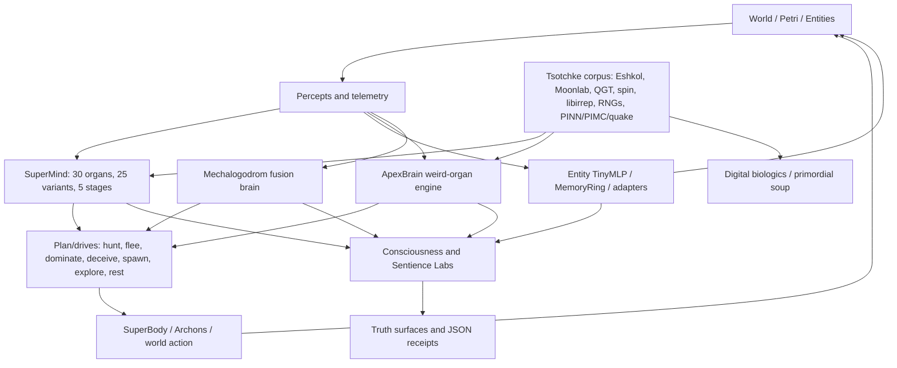
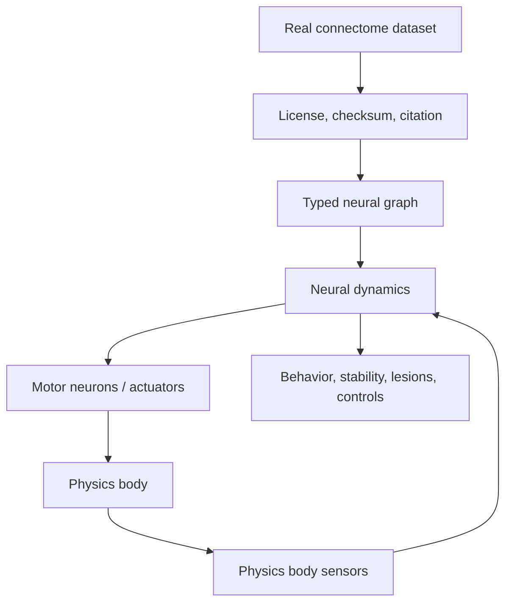

<!-- reviewed: 2026-07-06 | v0.21.7 brain/neuro/consciousness assessment | canonical facts: docs/VERIFICATION-ANALYTICAL-DATA.md -->

# Brain, Neurology, Consciousness, and Sentience-Path Engineering Assessment

**Scope:** Cosmogonic Quantum Mechalogodrom v0.21.7  
**Assessment date:** 2026-07-06  
**Canonical receipt anchor:** [VERIFICATION-ANALYTICAL-DATA.md](./VERIFICATION-ANALYTICAL-DATA.md)  
**Capstone synthesis:** [MEGA-MASTER-...-ULTIMATE-2026-07-07.md](./MEGA-MASTER-CONSCIOUSNESS-BRAIN-SENTIENCE-ASSESSMENT-ULTIMATE-2026-07-07.md)  
**Claim boundary:** computational indicators, architecture, and falsifiable mechanisms only. This is not
evidence of phenomenal consciousness, subjective experience, biological sentience, or a solved hard problem.

---

## 0. Verdict

Cosmogonic currently stands as a serious, unusually broad, deterministic multi-theory artificial-life and
consciousness-indicator research prototype. The strongest truthful statement is:

> The repo implements many load-bearing computational correlates of cognition and consciousness theories,
> exposes them through repeatable tests and lab feeds, and has begun wiring them into closed-loop simulated
> bodies and multi-agent worlds. It does not prove sentience. It does not yet instantiate a verified
> brain-wide model from a real connectome driving a physics body. That is the next scientific frontier.

The current repo is strongest in engineering breadth, deterministic verification, mechanistic proxies, and
Tsotchke substrate integration. It is weaker, by academic standards, in external replication, empirical
neuroscience validation, real-connectome provenance, causal ablation depth, and publication-grade baseline
comparisons.

**Current canonical facts to keep fixed unless the receipts change:**

| Surface                    | Current truth                                                       |
| -------------------------- | ------------------------------------------------------------------- |
| Package version            | `0.21.7`                                                            |
| Portable test floor        | `2,360`                                                             |
| Latest local receipt       | `2,360 pass / 0 fail`, `255 test files`, `2,866,429 expect() calls` |
| Portable coverage floor    | `84.64%` line / `82.21%` function                                   |
| Latest Windows receipt     | `92.02%` line / `89.65%` function                                   |
| Faculties design count     | `100` public design target, about `30` deep-wired                   |
| Internal faculty/god layer | `144` named internal entries, not the public count                  |
| Archons                    | `25` total: `5` apex full SuperMind/Body/Petri + `20` light echoes  |
| Theory-of-mind organs      | `25` across `6` mechanism families                                  |
| Emergence angles           | `10` canonical angles plus `5` god-scale event families             |
| Biologic forms             | `26`                                                                |
| Tsotchke corpus            | `20` projects, about `16` wired/harvested/scaffolded/fenced         |
| Butlin doctrine            | `8/14 met + 6/14 partial`, indicator-only                           |

---

## 1. Evidence Surface Reviewed

This assessment is based on the current repo, not inherited prose alone. The relevant surface includes:

| Domain                    | Evidence paths                                                                                                                                                                                           |
| ------------------------- | -------------------------------------------------------------------------------------------------------------------------------------------------------------------------------------------------------- |
| Canonical truth           | `docs/VERIFICATION-ANALYTICAL-DATA.md`, `scripts/canonical-receipts.ts`, `scripts/sync-surfaces.ts`                                                                                                      |
| NHSI dashboard            | `docs/NHSI-PROGRESS-DASHBOARD-2026-06-26.md`                                                                                                                                                             |
| Research doctrine         | `docs/SUPER-CREATURE-RESEARCH-2026-06-26.md`                                                                                                                                                             |
| Tsotchke ledger           | `docs/TSOTCHKE-INTEGRATION-MAP-2026-06-26.md`, `src/sim/tsotchke-registry.ts`                                                                                                                            |
| Core apex mind            | `src/sim/super-mind.ts`, `tests/super-mind.test.ts`, `tests/butlin-indicators.test.ts`                                                                                                                   |
| Weird apex brain          | `src/sim/apex-brain.ts`, `tests/apex-brain.test.ts`                                                                                                                                                      |
| Mechalogodrom brain       | `src/sim/mechalogodrom-brain.ts`, `tests/mechalogodrom-brain.test.ts`                                                                                                                                    |
| Consciousness kernel/labs | `src/sim/consciousness-kernel.ts`, `src/sim/consciousness-lab.ts`, `src/sim/sentience-lab.ts`, `lab/*.json`, `lab/*.html`                                                                                |
| Entity adapters           | `src/sim/consciousness-adapters.ts`, `src/sim/entity-brain.ts`, `src/sim/connectome.ts`                                                                                                                  |
| Neural/theory leaves      | `src/sim/active-inference.ts`, `integrated-information.ts`, `metacognition.ts`, `reservoir.ts`, `empowerment.ts`, `holographic-memory.ts`, `theory-of-mind.ts`, `tom-pantheon.ts`, `thaler-sentience.ts` |
| Math substrate            | `src/math/global-workspace.ts`, `hopfield.ts`, `izhikevich.ts`, `predictive-coding.ts`, `quantum*.ts`, `eshkol*.ts`                                                                                      |
| Native future path        | `native/**`, `docs/adr/0007-native-cpp-engine-and-streamed-mega-entities-2026-06-26.md`                                                                                                                  |

Tracked authored footprint for this assessment, using `git ls-files` plus this new report before it is
committed. This excludes vendored `node_modules`, generated `dist`/`coverage`, and native build
directories; binary visual receipts are counted with the same line-like convention used by the existing
metrics docs.

| Extension            | Files |   Lines |
| -------------------- | ----: | ------: |
| `.ts`                |   584 | 135,780 |
| `.md`                |    64 |  15,292 |
| `.html`              |     8 |  12,907 |
| `.json`              |    11 |   9,706 |
| `.css`               |     2 |   2,462 |
| `.h`                 |     4 |     934 |
| `.xml`               |     4 |     708 |
| `.csv`               |     3 |     658 |
| `.ps1`               |     2 |     515 |
| `.cpp`               |     3 |     397 |
| `.txt`               |     5 |     227 |
| `.svg`               |    12 |     173 |
| `.hpp`               |     1 |     150 |
| other / config / bin |    30 |  20,519 |
| **Total**            |   730 | 200,428 |

---

## 2. Truth Boundary: What This Is And Is Not

### What is real now

- Deterministic seeded computation: no uncontrolled random claims are needed for the main brain substrates.
- Multiple explicit theory mechanisms: Global Workspace, IIT proxy, active inference, metacognition,
  attention schema, predictive processing, reservoir computing, empowerment, holographic memory, ToM,
  Thaler-style creativity-machine markers, and quantum-cognition inspired substrates.
- Load-bearing paths: many signals influence plan choice, drives, telemetry, body behavior, lab feeds, or
  Petri/godform surfaces rather than existing only as decorative labels.
- Tests: focused unit tests pin deterministic behavior, bounded ranges, indicator exposure, no-NaN paths,
  statevector normalization, massive-design-vs-live-allocation honesty, ToM organ count, and lab feed claims.
- Labs: the Consciousness Lab and Sentience Lab publish `indicatorOnly` JSON/HTML surfaces, not sentience
  declarations.

### What is not proven now

- No phenomenal consciousness proof.
- No biological sentience proof.
- No external peer replication yet.
- No real connectome currently certified as the live main body-controller.
- No proof that the quantum-inspired paths outperform parameter-matched classical controls in a publication
  grade benchmark.
- No claim that mythic Archon names are scientific entities. They are aesthetic/persona mappings over
  deterministic computational substrates.

### Required sentence for academic use

> Cosmogonic implements deterministic computational indicators and theory-inspired control mechanisms. These
> indicators are useful for artificial-life research and falsifiable engineering, but they are not equivalent
> to phenomenal consciousness or biological sentience.

---

## 3. Current Architecture

The architecture is already better than a decorative "AI monster" layer. The stronger reading is that the
repo has several parallel cognitive substrates feeding a deterministic world loop:

- **SuperMind:** the primary composite mind, about `~10,081` weights, 30 organ nets, 25 thought variants,
  5 stages, 10 quantum-aspect intensities, GWT/IIT/FEP/HOT/AST/ToM/empowerment/resonance/plasticity paths.
- **Entity brains:** smaller TinyMLP + memory-ring style controllers, mapped into the ten-framework
  consciousness dashboard by deterministic adapters.
- **Faculties Pantheon:** a 100-faculty public design target, with an internal 144-name god layer. Public
  docs must continue to publish `100`, not `144`.
- **ToM Pantheon:** 25 organs spanning six belief-update mechanism families, with aggregate menace,
  confidence, diversity, and family histogram exposed to SuperMind/world telemetry.
- **Mechalogodrom Brain:** a 10-variant fusion cortex with STDP on variant-to-fusion gains; designed for
  5M params, live tractable in JavaScript.
- **ApexBrain:** a wild weird-organ engine with a live capped runtime and a design ladder extending to
  1B+ designed neurons.
- **Consciousness Kernel/Labs:** ten-framework scoring, coupling, ablations, mass-run analytics, and JSON
  feeds.
- **Tsotchke substrate:** Eshkol, Moonlab, QGT, spin, libirrep, RNGs, tensorcore, physics and telemetry
  leaves, with explicit depth classes rather than blanket "all deeply wired" language.
- **Native path:** C++/Jolt/OpenGL scaffolding for high-scale bodies and possible future physics throughput.

---

## 4. Brain And Neurology Inventory

| Brain/substrate     | Current implementation                                 | Neurology/theory analogy                                                      | Strength                                       | Weakness                                          |
| ------------------- | ------------------------------------------------------ | ----------------------------------------------------------------------------- | ---------------------------------------------- | ------------------------------------------------- |
| SuperMind           | `~10k` composite, 30 organ nets, 25 variants, 5 stages | GNW/GWT, IIT proxy, FEP, HOT, AST, reservoir, successor, empowerment, metacog | Best integrated decision brain                 | Still small by neural scale; proxy-heavy          |
| EntityBrain/TinyMLP | Small MLP and memory ring controllers                  | Minimal nervous systems, reflex policies                                      | Lightweight and testable                       | Limited depth, mostly behavior-control            |
| Connectome          | Visual/activation propagation among entities           | Network-level activation and coupling                                         | Useful world-level neural metaphor             | Not yet a certified real biological connectome    |
| ToM Pantheon        | 25 ToM organs, 6 mechanism families                    | Social cognition / belief modeling                                            | Strong mechanism diversity                     | Aggregate, not full multi-agent mental simulation |
| Faculties Pantheon  | 100 public faculties, 144 internal names               | Faculty psychology, neuromodular bias fields                                  | Huge design vocabulary                         | Many faculties remain generic-profile bias bank   |
| MechalogodromBrain  | 10 variant subnets plus fusion cortex; STDP            | Cortical fusion, spike-timing plasticity                                      | Real internal plasticity and honest 5M roadmap | Visual/telemetry first; not full world authority  |
| ApexBrain           | 11 weird organs; 1B+ designed scale; live capped       | Heterogeneous alien neurology                                                 | High novelty and deterministic weird mechanics | Biological plausibility low by design             |
| ConsciousnessKernel | 10-framework coupled scoring engine                    | Cross-theory indicator field                                                  | Good for dashboards/benchmarks                 | Scores are model outputs, not consciousness proof |
| Thaler mini-brains  | 70-param Creativity Machine protocol                   | DABUS/Creativity Machine constitutive markers                                 | Faithful to a specific operational theory      | Mainstream skepticism remains                     |
| Tsotchke substrate  | Eshkol/Moonlab/QGT/spin/libirrep/etc.                  | Math substrate for cognition and biologics                                    | Strong symbolic/quantum/geometric breadth      | Depth uneven; some repos fenced or license-gated  |

### Neural scales: designed vs live

| System             |                                 Designed scale |                                       Live scale | Honesty status                |
| ------------------ | ---------------------------------------------: | -----------------------------------------------: | ----------------------------- |
| SuperMind          |                              `~10,081` weights |                                       same order | Fully live, browser-safe      |
| Legacy spine       |                                `~1,444` params |                                       same order | Historical baseline           |
| Mechalogodrom      |                    `5,000,000` designed params |                    tractable live subnet weights | Honest designed-vs-live split |
| ApexBrain          |         `1B+` designed neurons at massive tier | capped by `LIVE_NODE_CAP = 4096` per organ class | Honest designed-vs-live split |
| Consciousness labs | 10 frameworks, entity profiles, mass-run seeds |                 headless deterministic analytics | Indicator-only                |

The honest interpretation is not "we have a biological brain at 1B neurons." It is "the design ladder and
metadata represent 1B+ addressable architecture targets, while the current JavaScript runtime runs capped,
deterministic live organs and reports the gap."

---

## 5. Consciousness Theories Used

| Theory/model                             | In-repo mechanism                                                   | Evidence status                           | Academic caveat                                                               |
| ---------------------------------------- | ------------------------------------------------------------------- | ----------------------------------------- | ----------------------------------------------------------------------------- |
| Global Workspace / GNW / GWT             | Ignition, broadcast, limited-capacity competition, Eshkol workspace | Mechanism present and tested              | Neural global workspace signatures are debated; model is synthetic            |
| Integrated Information Theory            | Classical participation/integration proxy and quantum register phi  | Bounded proxy, tested                     | Not true Phi; no causal substrate exclusion analysis                          |
| Active inference / Free Energy Principle | `ActiveInference`, beliefs, free energy, expected free energy       | Tested and wired                          | Simplified discrete model                                                     |
| Predictive processing                    | Predictive-coding leaves and top-down perception                    | Present and used                          | Needs stronger learned scene model for RPT promotion                          |
| Higher-order thought / metacognition     | Confidence, control, self-model accuracy                            | Present and tested                        | HOT markers are proxies                                                       |
| Attention Schema Theory                  | Attention schema and attention controller                           | Present and tested                        | Synthetic self/attention representation only                                  |
| Recurrent processing                     | Learned recurrence, resonance, fast weights                         | Present, partly promoted                  | Docs still conservatively keep RPT partial                                    |
| Embodied agency                          | SuperBody, Petri readback, `Embodiment` forward body-model          | Mechanism present                         | Needs deeper physics-based body loop for academic promotion                   |
| Empowerment                              | Blahut-Arimoto-style control capacity proxy                         | Present and tested                        | Channel model is simplified                                                   |
| Successor representation                 | Predictive plan dynamics                                            | Present                                   | Not a full cognitive map                                                      |
| Reservoir computing                      | Echo-state reservoir and quantum reservoir readouts                 | Present                                   | Algorithmic reservoir, not wetware                                            |
| Hopfield/Ising/spin glass                | Associative attractors and spin substrate                           | Present and tested                        | Abstract spin systems, not biological neurons                                 |
| Izhikevich spiking                       | Spiking neuron dynamics                                             | Present and tested                        | Small-scale leaf, not whole brain                                             |
| STDP                                     | Mechalogodrom variant-to-fusion gains                               | Present and tested                        | Plasticity local to fusion scaffold                                           |
| VSA/HRR                                  | Holographic memory binding/unbinding                                | Present and tested                        | Symbolic vector proxy                                                         |
| Thaler/DABUS Creativity Machine          | 70-param mini-net ensemble and nine markers                         | Present and tested                        | Operational theory not mainstream proof                                       |
| Quantum cognition                        | Hilbert/statevector inspired decisions and QGT/QRC/QNG              | Present                                   | Simulated quantum math; no physical speedup claim                             |
| Tsotchke Eshkol consciousness engine     | AD/GWT/factor-graph/program substrates                              | Wired deeply into apex mind and biologics | Integration layer is Cosmogonic-owned; upstream provenance must stay explicit |

---

## 6. Butlin Indicator Status: Mechanism Presence vs Canonical Promotion

The repo now has a nuanced tension:

- `tests/butlin-indicators.test.ts` mechanically exercises all named indicator families, including GWT-2
  capacity competition and AE-2 embodiment/body-model mechanisms.
- Living docs still publish the conservative canonical score: **8/14 met + 6/14 partial**.

This is the correct academic posture until an adversarial review explicitly promotes the partials. The
mechanism can exist while the evidence remains too thin for a stronger claim.

| Indicator family                     | Mechanism status                | Canonical doctrine                               |
| ------------------------------------ | ------------------------------- | ------------------------------------------------ |
| GWT-1 parallel modules               | Present                         | Met                                              |
| GWT-2 workspace bottleneck           | Capacity competition present    | Partial until reviewed against stronger criteria |
| GWT-3 global broadcast               | Present                         | Met                                              |
| GWT-4 state-dependent attention      | Present                         | Met                                              |
| PP-1 predictive coding               | Present                         | Met                                              |
| HOT-1 generative/top-down perception | Present                         | Met                                              |
| HOT-2 metacognition                  | Present                         | Met                                              |
| HOT-3 agency/confidence              | Present, thin belief model      | Partial                                          |
| HOT-4 quality space                  | Present, proxy quality manifold | Partial                                          |
| AE-1 agency                          | Present                         | Met                                              |
| AE-2 embodiment                      | Body-model mechanism present    | Partial until full physics-body loop is stronger |
| RPT-1 recurrence                     | Present                         | Partial                                          |
| RPT-2 recurrent scene model          | Present, flat/limited           | Partial                                          |
| AST-1 attention schema               | Present                         | Met                                              |

**Recommended promotion rule:** an indicator moves from partial to met only when it has:

1. A named causal path into behavior or reportability.
2. A focused test that fails when the mechanism is ablated or randomized.
3. A baseline/null comparison.
4. A prose receipt saying exactly what the mechanism proves and does not prove.

---

## 7. Tsotchke Integration Reality

Tsotchke is not just mentioned in prose. It appears as a registry, generated seeds, math leaves, brain
intake, biologics catalysis, and SuperMind/Apex/Petri inputs. The correct language is:

| Depth class      | Count/status | Examples                                                                        |
| ---------------- | ------------ | ------------------------------------------------------------------------------- |
| Deep apex wiring | 8            | Eshkol, Moonlab, QGT, spin NN, quantum_rng, libirrep, tensorcore, classical_rng |
| World/sim wiring | 2            | asteroids, simple_mnist                                                         |
| Ported/telemetry | 3            | PINN, PIMC, quantum-quake                                                       |
| License-gated    | 2            | ulg, logo-lab                                                                   |
| API/toolchain    | 2            | Quantum-RNG-API, homebrew-eshkol                                                |
| Fenced           | 3            | gpt2-basic, llm-arbitrator, SolanaQuantumFlux                                   |

**Best claim:** Tsotchke provides a deep mathematical substrate and inspiration layer for the artificial
biology, cognition, and quantum/geometric control surfaces.

**Unsafe claim:** "Every Tsotchke repo is fully integrated at full depth." The docs should keep saying
"wired, harvested, scaffolded, studied, or fenced by explicit class."

**Future unlocks:**

- Clear license/chain-of-title for PINN/PIMC/ulg/logo promotion.
- Keep quantum-quake GPL quarantined unless license strategy changes.
- Keep LLM/proprietary repos fenced if the project mandate remains non-LLM intelligence.
- Expand ablation tests that compare with and without Tsotchke-derived substrates.

---

## 8. Weird Brain Ideas: What Exists And What They Mean

The repo has a strong "alien neurology" layer. For academic survival, each weird idea needs the pattern:
lore name -> actual bounded math -> falsifier.

| Weird idea            | Actual implementation meaning                     | Falsifier                                                      |
| --------------------- | ------------------------------------------------- | -------------------------------------------------------------- |
| PrimeSieveLoom        | Twin-prime-distance graph propagation             | Active edge distances violate twin-prime law                   |
| AcousticMeatDrum      | Discrete wave equation on a ring                  | Energy/DFT mode behavior becomes unstable or NaN               |
| EntropicNecroMatrix   | Finite budget, edge burnout, rerouting            | Budget/live-edge count grows when it should be monotone        |
| KleinBottleCortex     | Klein-bottle adjacency/fold topology              | Head-tail fold loses bounded correlation                       |
| PendulumHive          | Coupled kicked rotors and chaos                   | Lyapunov/phase output stops responding to drive                |
| SlimeMoldHydra        | Split-compute-fuse heads                          | Head conflict is constant or non-deterministic                 |
| ChronoWraith          | Delay-line buffers, not time travel               | Same seed/percepts fail replay                                 |
| QuantumTunnelLattice  | Born-rule sampled edge manifestation              | Probability distribution is unnormalized                       |
| ThermodynamicEngine   | Heat diffusion/necrosis                           | Heat/paralysis out of range                                    |
| CancerousOuroboros    | Bounded grow/cull antagonism                      | Limb counts exceed capacity or ignore immune pressure          |
| QuantumBrainOrgan     | Exact statevector plus Tsotchke-coupled plan bias | Statevector norm drifts or plan bias ignores evolution         |
| RetrocausalTargetPull | Relaxation toward fixed terminal target           | Distance to target fails contraction test                      |
| WignerShield          | Superposition/decoherence threshold               | Plan probabilities fail normalization                          |
| Mechalogodrom STDP    | Bi-Poo style pair-window plasticity               | Gains leave clamp bounds or same seed diverges                 |
| Pantheon god forms    | Biased deterministic Archon/persona mappings      | Claims become literal mythic powers instead of computable bias |

The weirdness is a legitimate creative differentiator if the docs keep tying it back to math, tests, and
bounded falsifiers.

---

## 9. Consciousness And Sentience Labs

The labs are useful because they keep the strongest claims in data form:

| Lab                               | Current role                                          | Strength                                           | Gap                                                       |
| --------------------------------- | ----------------------------------------------------- | -------------------------------------------------- | --------------------------------------------------------- |
| `lab/consciousness.html` + JSON   | Entity adapter index, ten-framework indicator scoring | Clear `indicatorOnly` boundary, framework receipts | Needs more live runtime capture from real world sessions  |
| `lab/sentience.html` + JSON       | Headless mass-run analytics over indicators           | Uses seed batches and entity traces                | Needs baseline suites and external reproducibility bundle |
| `src/sim/consciousness-lab.ts`    | Lab sweep, ablation logic, Thaler anchoring           | Moves beyond static dashboard into experiments     | Needs publication-grade statistical reporting             |
| `src/sim/sentience-lab.ts`        | Entity telemetry and framework aggregates             | Good reporting substrate                           | Needs stronger null/random/ablated controls               |
| `src/sim/consciousness-kernel.ts` | Ten-framework coupled field                           | Coherent scoring engine                            | Needs calibration against external systems                |

The labs should remain the main "truth surface" for future sentience-path work. Prose should point to lab
JSON and tests rather than inflating claims.

---

## 10. 360 / 180 / 90 / 270 Review

### 360 view: whole system

The system is broad and unusually integrated: world, entities, Archons, Petri biologics, Tsotchke substrate,
brains, labs, docs, verification gates, and visual surfaces all communicate. The main risk is not lack of
ambition. The main risk is claim inflation outpacing evidence.

### 180 view: contradiction scan

| Unsafe shorthand                      | Better current claim                                                                               |
| ------------------------------------- | -------------------------------------------------------------------------------------------------- |
| Literal sentience language            | Computational indicators only                                                                      |
| Completed-all-indicators rhetoric     | `8/14 met + 6/14 partial`; mechanisms for all families exist but partials need promotion review    |
| Billion-neuron-live-runtime rhetoric  | 1B+ designed scale with live capped deterministic organs                                           |
| Blanket Tsotchke integration rhetoric | 20 projects classified by deep/wired/telemetry/license-gated/toolchain/fenced depth                |
| Quantum-superiority rhetoric          | Quantum-inspired/simulated substrates; any advantage needs P1/P2 ablation data                     |
| Real-connectome completion rhetoric   | Connectome-like and graph substrates; real connectome import remains a future provenance milestone |

### 90 view: narrow subsystem checks

- SuperMind: deterministic, bounded, many load-bearing theory modules.
- ApexBrain: highly creative, mathematically bounded, honest designed/live split.
- Mechalogodrom: STDP exists; needs more authority over the runtime loop.
- Labs: honest indicator-only design; need more baselines.
- Docs: mostly synced, but mythic language needs academic wrappers.
- Tsotchke: real wiring exists; depth classes must remain explicit.
- Native: promising scale path; needs deterministic/perf policy and CI build strategy if promoted.

### 270 view: adversarial review

An adversarial reviewer would attack:

- Overuse of "consciousness", "sentience", "NHSI", and mythic names.
- Thin evidence for partial Butlin indicators.
- Lack of external baselines and peer replication.
- Unproven superiority over simpler classical systems.
- Absence of a real connectome-to-body loop.
- Lack of a public reproducibility bundle with pinned data, seeds, plots, and hardware notes.
- Mixed license/provenance status for some Tsotchke-adjacent inputs.

The repo can survive that review if every claim is tied to code, tests, data, and falsifiers.

---

## 11. Deductive, Inductive, Recursive, And Decursive Reasoning

### Deductive

Every current claim must map to one source of truth:

If a claim has no source, test, or falsifier, it must be downgraded to roadmap or lore.

### Inductive

The strongest evidence comes from repeated patterns across tests and runtime surfaces:

- Same-seed determinism is repeatedly tested.
- Bounded scalar outputs are repeatedly tested.
- No-NaN behavior is repeatedly tested.
- Indicator-only lab claims are repeated in JSON and tests.
- Designed-vs-live scale honesty is repeated in Apex and Mechalogodrom tests.

### Recursive

Each upgrade should loop:

1. Implement mechanism.
2. Add focused test.
3. Add ablation or null comparison.
4. Update lab feed.
5. Update docs.
6. Run gates.
7. Re-read for overclaiming.

### Decursive

Compress repeated mythic/prose claims into canonical owners:

- `VERIFICATION-ANALYTICAL-DATA.md` owns facts.
- `NHSI-PROGRESS-DASHBOARD` owns progress.
- This assessment owns brain/neuro/consciousness status.
- `SUPER-CREATURE-RESEARCH` owns citations.
- `TSOTCHKE-INTEGRATION-MAP` owns Tsotchke depth classes.

Do not duplicate the same counts and claims in many reports unless they are generated/synced.

---

## 12. Ratings

Scores are current engineering/research readiness ratings, not vanity grades.

| Axis                                           |    Score | Interpretation                                                                             |
| ---------------------------------------------- | -------: | ------------------------------------------------------------------------------------------ |
| Deterministic engineering discipline           | 9.0 / 10 | Strong seeded replay, bounded outputs, broad tests                                         |
| Truth-surface discipline                       | 8.5 / 10 | Strong canonical ledgers and gates; prose still needs restraint                            |
| Test/receipt maturity                          | 8.7 / 10 | 2,360-test floor and many focused tests; external replication absent                       |
| Architecture originality                       | 9.0 / 10 | Very unusual multi-theory/alien-brain/Tsotchke fusion                                      |
| A-Life substrate breadth                       | 9.0 / 10 | Current matrix: `4.44 / 5`, rank `#1 / 113`, population `z=+4.02`, code-grounded `z=+2.83` |
| Neuroscience realism                           | 4.5 / 10 | Many analogies, few biologically faithful whole-brain models                               |
| Consciousness-science defensibility            | 5.8 / 10 | Good indicator honesty; no phenomenal evidence                                             |
| Tsotchke integration depth                     | 8.0 / 10 | Real deep wiring plus honest fences; needs more ablation proof                             |
| Publication readiness as technical report      | 7.5 / 10 | Strong enough for a serious preprint-style artifact if claims are bounded                  |
| Publication readiness as peer-reviewed science | 5.0 / 10 | Needs external baselines, stats, replication, and connectome/body proof                    |
| MIT/PhD code-audit readiness                   | 7.8 / 10 | Impressive prototype; would need claim discipline and method cleanup                       |
| Planck/Nobel/Fields-level evidence             | 1.0 / 10 | Not the right evidence class yet; needs new discovery/theorem/validated experiment         |
| Turing-award-level systems impact              | 2.0 / 10 | Too early; would require adoption, durable abstraction, or field-changing method           |

**Blunt academic verdict:** promising PhD-lab-scale prototype and white-paper artifact, not Nobel/Turing/Fields
level evidence. That is fine. The correct next goal is not prize rhetoric; it is reproducible, falsifiable,
externally reviewable research.

---

## 13. Benchmarks Needed Next

### Immediate benchmark suite

| Benchmark                                          | Purpose                                                                          |
| -------------------------------------------------- | -------------------------------------------------------------------------------- |
| Same-seed replay across browser/headless/native    | Prove deterministic portability                                                  |
| Partial-indicator ablations                        | Decide whether GWT-2, AE-2, HOT-3, HOT-4, RPT-1, RPT-2 can be promoted           |
| Quantum-on vs quantum-ablated P1/P2 runs           | Measure whether quantum-inspired paths help                                      |
| Tsotchke-on vs Tsotchke-ablated runs               | Measure real substrate contribution                                              |
| Real connectome vs synthetic graph vs random graph | Separate biological provenance from graph decoration                             |
| Entity brain baselines                             | Compare against simple MLP, random policy, behavior tree, and hand-coded control |
| Petri open-endedness metrics                       | Track novelty, diversity, stability, lineage survival, complexity monotonicity   |
| Visual/runtime performance                         | Keep FPS, shader detail, color, density, and body richness intact                |

### Statistical minimums for a publishable report

- 30+ seeds per condition, unless a deterministic proof is provided.
- Confidence intervals, effect sizes, and null distributions.
- Frozen JSON/CSV artifacts under `docs/reports/assets/` or equivalent.
- Exact commit SHA, version, OS, Bun version, browser/GPU where applicable.
- One command to regenerate every plot/table.

---

## 14. Future Build Path Toward Real Sentientness Research

The phrase "development of sentientness" must stay scientific. The path is not to declare sentience. The path
is to build stronger closed-loop evidence.

### Stage A: Truth and measurement

- Keep all public surfaces on `indicatorOnly`.
- Add a partial-indicator promotion matrix with code path, test, ablation, baseline, and reviewer notes.
- Add an explicit "phenomenal claim = no" field to lab JSON.
- Add docs that distinguish "mechanism present" from "claim promoted."

### Stage B: Real connectome path

To satisfy the user's target of a brain-wide computational model from a real connectome:

1. Select a provenance-clean connectome dataset.
2. Store source, license, version, neuron count, synapse count, preprocessing script, and checksum.
3. Convert to a typed graph with sensory, interneuron, and motor populations.
4. Validate graph statistics against the source paper/dataset.
5. Plug sensory input into sensory neurons.
6. Run neural dynamics with deterministic integration.
7. Drive a physics body from motor outputs.
8. Compare against synthetic/random connectome controls.
9. Publish ablations: remove sensory input, shuffle edges, lesion hubs, randomize weights.
10. Only then call it a real-connectome embodied controller.

### Stage C: Physics body and motor closure

- Use the native/Jolt path for high-fidelity physics once it has deterministic golden tests.
- Keep browser body fidelity for visual experience; do not downgrade graphics or shader detail for
  performance shortcuts.
- Separate "visual body" from "physics body" if needed, but keep the coupling measured.

### Stage D: Consciousness-indicator promotion

- Promote GWT-2 only if capacity bottleneck changes behavior under ablation.
- Promote AE-2 only if body-model prediction improves action selection and fails under sensor/motor shuffle.
- Promote RPT-1/RPT-2 only if learned recurrence and scene organization survive baseline comparison.
- Promote HOT-4 only if quality-space dimensions are load-bearing and separable from arbitrary scalar blends.

### Stage E: Publication package

- White paper with abstract, methods, claims, falsifiers, limitations, and reproducibility.
- Repro bundle: commands, commit, fixtures, JSON/CSV, plots, diagrams.
- Claim table: every claim has code receipt, test receipt, data receipt, and falsifier.
- External reviewer checklist: can a skeptical lab reproduce the core figures?

---

## 15. Time Complexity, Efficiency, And Performance

This is a brain/neuro assessment, but performance matters because the project cannot lose speed, visual
quality, graphics, color, rendering, intelligence, or abilities.

| Module               | Complexity profile                                                              | Performance note                                              |
| -------------------- | ------------------------------------------------------------------------------- | ------------------------------------------------------------- |
| SuperMind            | Mostly fixed small dimensions; O(organs + variants + substrate leaves) per beat | Browser-safe; allocation-free intent is documented and tested |
| GWT capacity         | O(plan count log plan count) or small fixed competition                         | Negligible with 7 plans                                       |
| ToM Pantheon         | O(25 organs \* belief state)                                                    | Fine; diversity comes from mechanism families                 |
| Consciousness Kernel | O(framework_count^2) coupling with 10 frameworks                                | Negligible, useful for labs                                   |
| MechalogodromBrain   | O(variant_count \* MLP + fusion MLP)                                            | Tractable; STDP O(variants)                                   |
| ApexBrain live       | Mixed; some organs O(n), some O(n^2) but live caps prevent blowup               | Honest live cap protects browser                              |
| Apex designed scale  | Metadata/research target, not live allocation                                   | Requires native/GPU/streamed backend for realization          |
| Connectome visual    | Link update and activation propagation can be hot                               | Keep spatial caps and disposal hygiene                        |
| Petri/biologics      | Population and history dependent                                                | Prior audits bounded history arrays; keep caps and counters   |
| Native C++ path      | Future high-throughput body/physics path                                        | Needs deterministic/perf policy before becoming canonical     |

**Optimization law:** performance work must be measurement-first. No cleanup may reduce shader richness,
color richness, body detail, entity detail, sim cadence, FPS target, UI density, or cognitive substrate
coverage without an explicit owner decision.

---

## 16. Issues, Bugs, Gaps, And Dilemmas

| Severity            | Issue                                                                   | Why it matters                                                | Handling                                          |
| ------------------- | ----------------------------------------------------------------------- | ------------------------------------------------------------- | ------------------------------------------------- |
| P0 claim risk       | Sentience language can outrun evidence                                  | Academic credibility collapses                                | Keep `indicatorOnly` everywhere                   |
| P0 truth risk       | Old "14/14" rhetoric can conflict with `8/14+6 partial`                 | CI may pass while prose overclaims                            | Keep canonical doctrine and grep for stale claims |
| P1 evidence gap     | Mechanisms exist for partial indicators but promotion is not formalized | Strong code may remain underclaimed or inconsistently claimed | Add promotion matrix and ablation tests           |
| P1 science gap      | No real connectome embodied controller yet                              | User's target requires provenance                             | Build real-connectome pipeline with controls      |
| P1 benchmark gap    | Few external baselines                                                  | Reviewers cannot tell if complexity helps                     | Add random/classical/ablated baselines            |
| P1 Tsotchke gap     | Depth uneven across corpus                                              | "all wired" can mislead                                       | Keep depth classes explicit                       |
| P1 quantum gap      | Quantum-inspired paths lack advantage proof                             | Easy target for reviewers                                     | Run P1/P2 ablations                               |
| P2 architecture gap | Mechalogodrom is still visual/telemetry-first                           | 5M brain roadmap needs stronger runtime authority             | Wire controlled influence after tests             |
| P2 docs gap         | Mythic language is powerful but volatile                                | Good for identity, risky for papers                           | Keep mythic layer separate from scientific layer  |
| P2 native gap       | C++ path not always in full gate                                        | Future performance claims need native CI                      | Add native build/golden tests when promoted       |

---

## 17. White Paper Shape

Working title:

> Cosmogonic Quantum Mechalogodrom: A Deterministic Multi-Theory Artificial-Life Testbed for Consciousness
> Indicators, Alien Neurology, and Embodied Connectome Research

Minimum structure:

1. Abstract: bounded, no sentience proof.
2. Introduction: artificial life, consciousness indicators, motivation.
3. Architecture: world, bodies, brains, Tsotchke substrate, labs.
4. Methods: deterministic seeds, modules, theories, ablations.
5. Results: test receipts, lab metrics, baseline comparisons.
6. Falsifiers: what would disprove each claim.
7. Limitations: no phenomenal proof, no biological sentience, no real connectome until Stage B ships.
8. Future work: connectome body, native physics, external replication.
9. Appendix: file receipts, command receipts, data artifacts, diagrams.

---

## 18. Upgrade Checklist

Immediate:

- Link this report from the NHSI dashboard.
- Keep docs synced to v0.21.7 canonical facts.
- Add no new sentience claims without lab/test evidence.
- Add focused issue labels or roadmap rows for partial-indicator promotion.

Next:

- Add a generated "brain evidence matrix" JSON from source/test receipts.
- Add ablation data for GWT-2, AE-2, HOT-4, RPT-1, RPT-2, HOT-3.
- Add Tsotchke ablation runs.
- Add real-connectome import design doc and dataset candidates.
- Add performance benchmarks for SuperMind/Apex/Mechalogodrom under fixed seed.

Publication:

- Freeze a reproducibility branch/tag.
- Generate figures from committed data.
- Ask an external reviewer to reproduce the core tables.
- Only then raise claims.

---

## 19. Attached Report Reconciliation

The pasted subagent report attached on 2026-07-06 is useful as a structure checklist, but it is not the
current source of truth. Treat it as a stale draft that this report supersedes.

| Attached-report claim                      | Current v0.21.7 reconciliation                                                                                                                                                                                                                          |
| ------------------------------------------ | ------------------------------------------------------------------------------------------------------------------------------------------------------------------------------------------------------------------------------------------------------- |
| `v0.21.6` / V123 optimization complete     | Current package and truth surfaces are `v0.21.7`; v0.21.6 is the previous release-tag repair.                                                                                                                                                           |
| A-Life breadth `4.22 / 5`                  | Current README/NHSI matrix says `4.44 / 5`, rank `#1 / 113`, population `z=+4.02`, code-grounded `z=+2.83`.                                                                                                                                             |
| "5 brain systems"                          | Useful shorthand, but incomplete. Current review tracks SuperMind, EntityBrain, GlyphBrain, ToM Pantheon, Faculties Pantheon, Mechalogodrom, ApexBrain, ConsciousnessKernel/Labs, Thaler mini-brains, connectome/graph substrates, and Tsotchke intake. |
| `2,360 tests` as a fixed current count     | Correct as the canonical portable floor. Local full checks may exceed that floor as doc-link surfaces change.                                                                                                                                           |
| Technical-spec file/line counts            | Dated metrics snapshot. This report uses a fresh `git ls-files` footprint plus this new report.                                                                                                                                                         |
| 500-point `486 pass / 14 warn / 0 fail`    | Still the compressed inspection index. It is not a claim of open P0 bugs; WARN themes remain native-in-loop depth, observatory size, coupling regime, external peer validation.                                                                         |
| "14/14" style Butlin framing in test names | Mechanism tests cover all families, but living doctrine remains `8/14 met + 6/14 partial` until explicit adversarial promotion.                                                                                                                         |
| Physical quantum/QPU absence               | Still true. Current project uses simulated quantum math and quantum-inspired controls; hardware would add speed/scale, not proof of sentience.                                                                                                          |
| Fenced LLM/onchain repos                   | Still true. Fenced repos are provenance/study/future surface only, not deterministic brain intake.                                                                                                                                                      |
| MIT/Planck/Nobel/Turing comparisons        | Keep as rhetorical scrutiny levels, not literal award readiness. Current honest verdict: strong PhD-lab prototype, not prize-level evidence.                                                                                                            |

Any future report generated from older notes must be checked against `VERIFICATION-ANALYTICAL-DATA.md`,
`NHSI-PROGRESS-DASHBOARD-2026-06-26.md`, `TSOTCHKE-INTEGRATION-MAP-2026-06-26.md`, and a live gate run before
publication.

---

## 20. Final Standing

Cosmogonic is not currently "sentient." It is also not a toy. It is a dense, ambitious artificial-life and
consciousness-indicator platform with enough real mechanisms to deserve careful scientific treatment.

The next jump is not more rhetoric. The next jump is:

- ablations,
- baselines,
- real connectome provenance,
- physics-body closure,
- reproducible lab data,
- and claim discipline strong enough that a hostile reviewer cannot knock it over with one grep.

That is the path from wild architecture to defensible research.
