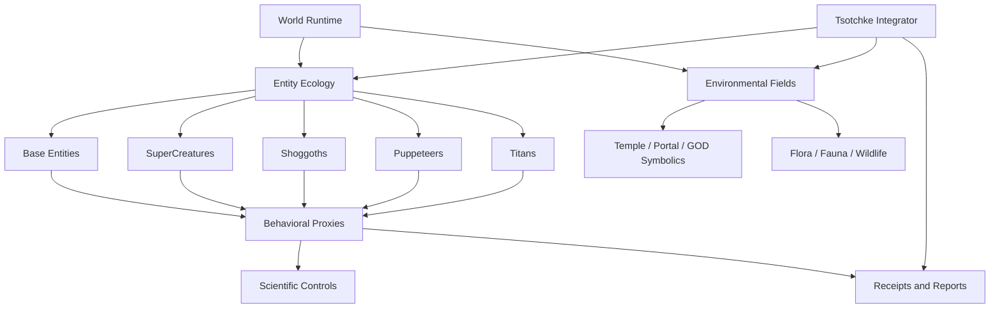

# Consolidated 22-Report Master Assessment

Current pass: 2026-07-07  
Workspace: `Z:\[Vibe Coded (AI)]\CLAUDECODE\Cosmogonic Quantum Mechalogodrom`  
Companion audit: `docs/CONSOLIDATED-22-FILE-AUDIT-CURRENT-2026-07-07.md`  
Companion HTML: `docs/CONSOLIDATED-22-MASTER-ASSESSMENT-CURRENT-2026-07-07.html`
Audit HTML: `docs/CONSOLIDATED-22-FILE-AUDIT-CURRENT-2026-07-07.html`

> **Snapshot boundary:** This assessment and every receipt called "latest" inside it are preserved as
> evidence from 2026-07-07. Current version, test, assertion, and coverage measurements live in
> [`VERIFICATION-ANALYTICAL-DATA.md`](./VERIFICATION-ANALYTICAL-DATA.md).
>
> **Habitat-denominator refresh (2026-07-10):** only the explicitly labeled world-denominator row was
> refreshed for the expanded habitat. All gate receipts and assessment judgments retain their
> 2026-07-07 snapshot date.
>
> **Operational-intelligence refresh (2026-07-10):** the corrected external Tsotchke ledger is
> `8 deep / 7 wired / 2 harvest / 4 fenced / 1 meta`, or `17/21` non-meta integrated; the internal
> `classical-contrast` control is separate. The then-current V3 fresh disjoint fixed-family evaluation passed
> goal-only and corpus-conditioned effects, `6.1213%` reversal adaptation, `17/17` integrated-row reach,
> `5/5` excluded-row inertness, numerical safety, three-process performance stability, and all named
> consumer counterfactuals. Uniform random-action baseline separation and aggregate-mapping specificity
> failed. Separate gate-backed A-Life mechanisms now set the current code-grounded vector to
> `[4.0, 2.4, 3.2, 3.8, 4.3, 4.5, 4.3, 3.5, 4.0]`: breadth `3.778`, rank `#1/113`, population z
> `+2.990`, and peer z `+3.131`. The finite 26-form generator plus differential selection establishes
> bounded active novelty against a frozen control, not unbounded open-ended evolution. V3 itself
> authorizes no additional consciousness, sentience, or numeric capability score change. See the
> [V3 causal audit](./reports/2026-07-10-OPERATIONAL-ORGANISM-INTELLIGENCE-CAUSAL-AUDIT.md).
>
> **V4 descendant refresh (2026-07-11):** the verified 64-seed Phase-A result retains three failures
> and one pass. Ordinary and Petri effects miss the fixed magnitude floor; the adaptive predictor loses
> to frozen and shuffled controls; Titans alone pass. This authorizes only bounded Titan game-policy
> semantic causality and changes no A-Life, consciousness, or sentience score. See the
> [V4 report](./reports/ORGANISM-INTELLIGENCE-V4-RESULTS-2026-07-11.md).

## Current Truth Banner

This is the sober master. The right assessment is not "sentience proven" and not
"nothing is there." The accurate position is stronger and more interesting:

Cosmogonic Quantum Mechalogodrom has a large, highly textured ALife and
cognition-inspired world model with many sentience-relevant proxy systems. It has
strong local verification receipts and rich named-system coverage. It does not
yet have scientific proof of consciousness, browser-public parity, or a fully
clean publication package.

The fresh verification receipt available to this current repair pass is:

| Gate               | Current observed result                                                                                       |
| ------------------ | ------------------------------------------------------------------------------------------------------------- |
| `bun run check`    | Passed locally on 2026-07-07 after the public-link/dashboard repair                                           |
| `bun run pages`    | Passed locally; Pages assembly now copies root public docs and prunes local-only archive drafts               |
| `verify:receipts`  | 2,385 pass / 0 fail, latest local verified receipt                                                            |
| Expect calls       | 2,867,279, latest local verified receipt                                                                      |
| Test files         | 256                                                                                                           |
| Coverage           | 92.03% line / 89.67% function                                                                                 |
| `typecheck`        | Passed                                                                                                        |
| `lint`             | Passed                                                                                                        |
| `sync:check`       | Passed at canonical floor wording                                                                             |
| `verify:facts`     | Exit 0, with known warning queue; not a zero-warning proof                                                    |
| 22-file formatting | Public tracked pair formatted; ignored local archive drafts are not release targets                           |
| Browser smoke      | Static Pages assembly checked; interactive browser/visual smoke still pending                                 |
| Remote release     | `v0.21.9` is the publication target for this pass; GitHub Releases remain the live source for post-tag status |

Important: `2,360` is the portable canonical floor. `2,373` and `2,376` were
previous observed latest receipts. `2,380` was the fifth-pass verified receipt
available to the original audit set; `2,385` is the latest Windows-local receipt
observed in this checkout. Any document that calls `2,360`, `2,373`, `2,376`, or
`2,380` the current latest is stale unless it is explicitly describing a dated
historical audit snapshot.

Post-subagent note: a second audit found that one dashboard linked to ignored
local archive drafts, which existed locally but not in a clean GitHub checkout.
That link gap is fixed by making those drafts explicit local archives and by
promoting the tracked 22-report master/audit pair as the publication target.
`bible.html`/Pages link generation is also hardened so public pages no longer
point at `/docs/../src` or `/docs/../scripts` paths.

## External Science Refresh

The science frame was refreshed against current literature rather than relying
only on local report wording.

| Source                                                                                                                                                                                 | Why it matters here                                                                                                                                                                               |
| -------------------------------------------------------------------------------------------------------------------------------------------------------------------------------------- | ------------------------------------------------------------------------------------------------------------------------------------------------------------------------------------------------- |
| Nature 2025 adversarial test of GNWT vs IIT, DOI `10.1038/s41586-025-08888-1`, <https://www.nature.com/articles/s41586-025-08888-1>                                                    | Directly compared Global Neuronal Workspace Theory and Integrated Information Theory; results challenged important predictions of both and emphasized quantitative, preregistered theory testing. |
| Trends in Cognitive Sciences 2025 AI-consciousness indicators, DOI `10.1016/j.tics.2025.10.011`, <https://www.sciencedirect.com/science/article/pii/S1364661325002864>                 | Uses theory-derived indicators to inform credences about AI consciousness while warning against both over-attribution and under-attribution.                                                      |
| Neuroscience and Biobehavioral Reviews 2025 active inference loop theory, DOI `10.1016/j.neubiorev.2025.106296`, <https://www.sciencedirect.com/science/article/pii/S0149763425002970> | Presents active inference/predictive processing as a proposed computational consciousness theory with world models, inferential competition, and recurrent epistemic depth.                       |
| Butlin et al. 2023 AI consciousness report, DOI `10.48550/arXiv.2308.08708`, <https://arxiv.org/abs/2308.08708>                                                                        | Offers a rigorous indicator-property method and surveys recurrent processing, global workspace, higher-order, predictive processing, and attention schema theories.                               |

Consequence for this repo: the right benchmark is not "does it sound alive?" The
right benchmark is "which theory-derived indicators are implemented, measured,
ablated, and falsified?"

Hard boundary as of 2026-07-07: these sources support indicator-based
assessment, not proof. GNWT/IIT remain unsettled after adversarial testing;
active inference is a proposed theory rather than a consensus; and the Butlin
indicator method can update credence, not certify phenomenal experience.

## What The 22 Files Are Really Saying

The 22 artifacts form five strata. The exact filename-by-filename inventory is
the companion audit's `22-File Trust Table`; this master summarizes the same
corpus by evidence role rather than repeating the full table.

| Stratum                     | Files                                                           | Meaning                                                                                                         |
| --------------------------- | --------------------------------------------------------------- | --------------------------------------------------------------------------------------------------------------- |
| Canonical foundations       | `BRAIN`, `VERIFICATION`, `NHSI`, `CONTROLS`                     | Best evidence base, but needs receipt/build/status cleanup.                                                     |
| Strong content mines        | `FINAL-HURRAH`, `PASS3`, `PASS2`, `MEGA-ULTRATHINK`             | Best named-system and benchmark ideas.                                                                          |
| Near-current draft pair     | `CONSOLIDATED-16-*`                                             | Best previous sober consolidation, now stale by scope and receipt.                                              |
| Secondary historic passes   | `PASS1`, `SUPER-REPORT`, `SUPER-REPORT-2ND`, `SUPER-REPORT-3RD` | Useful ancestry; not canonical.                                                                                 |
| Unsafe promotion candidates | `FILE-AUDIT-16`, `ULTIMATE`, `OMNISCIENT`, `MASTER-ASSESSMENT`  | Archive. They preserve provenance but contain scope drift, malformed HTML, stale counts, or overclaim language. |

## Architecture Read

The repo is best understood as a layered cognition simulation, not as a single
"brain."

### Layer 1 - Runtime and Verification

This is the most defensible layer. It includes tests, receipts, lint/typecheck,
static sync surfaces, and verification docs. The local evidence base is real,
but the report text lags the latest receipt.

Current rating: 9.1/10 internal, 7.0/10 publication-ready.

### Layer 2 - ALife Entity Cognition

Base Entities, SuperCreatures, Apex Abomination, Shoggoths, Puppeteers, and
Titans give the world its actual cognitive texture. This is where the strongest
sentience-relevant work sits, because these classes can plausibly be benchmarked
through survival, adaptation, learning, coordination, memory, novelty response,
and environmental coupling.

Current rating: 8.6/10 coverage, 6.8/10 scientific measurement.

### Layer 3 - Mythic/Architectural Systems

Pantheons, 25 Archon Godforms, GOD/GodColossus, Temple, Portal, and symbolic
field systems are valuable as world ontology and simulation affordances. They are
weak if presented as consciousness proof. They become strong when treated as
environmental governors, reward fields, attractors, constraints, ritualized
operator interfaces, or causal experiment layers.

Current rating: 8.0/10 worldbuilding, 5.4/10 scientific proof.

### Layer 4 - Ecology

Plants, flora, fauna, wildlife, niche interactions, resource fields, and
population dynamics are not decorative. They are critical for embodied cognition
claims, because an agent without an ecology is mostly a controller, not a life
system.

Current rating: 7.5/10 conceptual coverage, 5.8/10 benchmark maturity.

### Layer 5 - Tsotchke

Tsotchke is the claimed integrator across world systems, memory, reports, and
perhaps repo surfaces. It should be framed as a high-integration controller or
meta-observer unless repo-by-repo wiring receipts exist. The strongest future use
is not rhetoric; it is a Tsotchke integration matrix:

| Surface          | Required proof                                       |
| ---------------- | ---------------------------------------------------- |
| World runtime    | Code path, event path, state path                    |
| Entity cognition | Which entities Tsotchke observes, mutates, or routes |
| Reports          | Which receipts feed Tsotchke summaries               |
| Browser UI       | Which panels expose Tsotchke state                   |
| Other repos      | One receipt per repo, not a blanket claim            |

Current rating: 8.2/10 centrality, 6.2/10 verified wiring.

## Second-Pass Miss Check

The first 22-file consolidation captured the headline truth, but a second
term-level scan found under-covered technical details. Nothing below overturns
the verdict; it sharpens the map.

### Brain Substrates That Need Explicit Carry-Forward

The master should not compress all cognitive machinery into "entity cognition."
The 22-file set names these as distinct substrates or measurement surfaces:

| Substrate                                     | Why it matters                                                                                               |
| --------------------------------------------- | ------------------------------------------------------------------------------------------------------------ |
| SuperMind                                     | Apex composite mind and central multi-stage cognition pipeline.                                              |
| EntityBrain                                   | Population organism controller; key to broad ALife claims.                                                   |
| Connectome / GraphMind                        | Population neurology, graph routing, Louvain/PageRank-style structure.                                       |
| GlyphBrain                                    | 100 letter-creature/glyph cognition layer.                                                                   |
| MechalogodromBrain                            | STDP-like center fusion substrate, cited around ~53.7k live scale.                                           |
| ApexBrain                                     | 101st creature/tesseract-hydra brain; use `1B designed / LIVE_NODE_CAP = 4096`, not stale `5M/~600` wording. |
| Izhikevich spiking substrate                  | Real spiking-neuron math layer; not just metaphor.                                                           |
| ConsciousnessKernel                           | Ten-framework coupled kernel and scoring surface.                                                            |
| ConsciousnessLab / SentienceLab               | Structured-vs-null, seed-sweep, and indicator-only measurement surfaces.                                     |
| MindField / Xenomind / Noosphere / OmegaPoint | Cosmic or field-level cognition surfaces; scientifically weak unless tied to causal metrics.                 |

### Weird Brain And Theory Details Recovered On Third Check

The prompt explicitly asked for weird ideas by brain. These names should not be
lost in a clean consolidation:

| Detail group                        | Must preserve                                                                                                                                                                                               |
| ----------------------------------- | ----------------------------------------------------------------------------------------------------------------------------------------------------------------------------------------------------------- |
| ApexBrain 10 organs + quantum organ | PrimeSieveLoom, AcousticMeatDrum, EntropicNecroMatrix, KleinBottleCortex, PendulumHive, SlimeMoldHydra, ChronoWraith, QuantumTunnelLattice, ThermodynamicEngine, CancerousOuroboros, and QuantumBrainOrgan. |
| ApexBrain Meta-Paradox layer        | RetrocausalTargetPull, CantorDust, GodelResidual/GödelResidual, PhantomPerception, ReverseAnthropicBudget, and WignerShield, all as bounded homages with falsifiers.                                        |
| Thaler/DABUS/Creativity Machine     | Keep as perturbational creativity benchmark material, not mainstream consciousness proof.                                                                                                                   |
| Additional theory/kernel axes       | CEMI, UAL, CTM, sensorimotor, projective, and attention-schema.                                                                                                                                             |
| External brain/wetware anchors      | DishBrain, Brainoware, Organoid Intelligence, EBRAINS / Virtual Brain Twin, OpenWorm ConnectomeToolbox, AllenSDK / Allen visual coding, FlyWire, and MICRONS/MICrONS.                                       |
| UI/control/world exact names        | BrainSlots, EmergenceAnglesController, EntityBrainField, EntityManager, FloatingMonoliths, AETHON, SELENE, KRONOS, AURORA, and PortalDeathFauna where the source report uses them.                          |

### Third-Pass Semantic Coverage Delta

A third source-versus-consolidation pass found that the master had captured the
big map, but still compressed several source-specific handles too aggressively.
These are now part of the binding carry-forward set.

| Delta                                   | Source refs                                                                                                             | Patch verdict                                                                                                                                                                                                                                                                                                                        |
| --------------------------------------- | ----------------------------------------------------------------------------------------------------------------------- | ------------------------------------------------------------------------------------------------------------------------------------------------------------------------------------------------------------------------------------------------------------------------------------------------------------------------------------ |
| Butlin indicator IDs                    | `VERIFICATION-ANALYTICAL-DATA.md:222`; `NHSI-PROGRESS-DASHBOARD-2026-06-26.md:152-168`; `BRAIN...ASSESSMENT.md:828-843` | Keep exact IDs: MET = `GWT-1`, `GWT-3`, `GWT-4`, `PP-1`, `HOT-1`, `HOT-2`, `AST-1`, `AE-1`; PARTIAL = `GWT-2`, `HOT-3`, `HOT-4`, `AE-2`, `RPT-1`, `RPT-2`.                                                                                                                                                                           |
| SOAR / ACT-R cognitive-architecture bar | `BRAIN...ASSESSMENT.md:1533`; `:1578-1592`                                                                              | Carry the MIT-style verdict: broader than SOAR/ACT-R, but shallower in parsimony, single-theory commitment, and human-data validation.                                                                                                                                                                                               |
| Free Energy / AIF / Bayesian wording    | `SUPER-REPORT-2ND-PASS-2026-07-06.md:121-125`; `BRAIN...ASSESSMENT.md:598`; `:703-716`; `:793`                          | Name variational free energy, expected free energy, Bayesian belief update, and the one-sample epistemic-surrogate caveat.                                                                                                                                                                                                           |
| Ten-kernel framework IDs                | `BRAIN...ASSESSMENT.md:178`; `:628-634`; `:642-652`; `PASS3:456`                                                        | Preserve Butlin, Thaler, IIT-4, FEP/AIF, AST, CEMI, UAL, sensorimotor, projective, and CTM as coupled F0-F9 axes; note weak `ual` and `projective` ablation behavior.                                                                                                                                                                |
| Metacognition / valence / qualia proxy  | `BRAIN...ASSESSMENT.md:370`; `:600`; `:746`; `:834-836`; `:899-925`                                                     | Keep confidence, control, synthetic affect, and quality-space as proxy variables; explicitly deny felt qualia.                                                                                                                                                                                                                       |
| Tsotchke exact substrate vocabulary     | `BRAIN...ASSESSMENT.md:177`; `:383-387`; `:951-953`; `:966-984`; `:1027-1040`; `:1045-1053`; `NHSI:168`                 | Carry QGT/Fubini-Study/Berry, Moonlab Clifford/MPS/VQE, libirrep Wigner-D/Clebsch-Gordan/QEC, spin-NN/Hopfield/SK/NQS, QRNG, PINN, PIMC, ULG, TensorCore, Quantum-RNG-API, Quantum-Quake telemetry, and fenced SolanaQuantumFlux.                                                                                                    |
| Classical planning and learning handles | `BRAIN...ASSESSMENT.md:96`; `:288`; `:605-606`; `:835`; `:854`                                                          | Keep GOAP, TinyMLP, successor representation, reservoir computing, and NHI/adapters as explicit reasoning/planning handles.                                                                                                                                                                                                          |
| Ecological control vocabulary           | `PASS3:344-346`; `:375`; `BRAIN...ASSESSMENT.md:514`; `:1162`; `PASS1:435`; `PASS2:411`                                 | Preserve immune-system contrast, stigmergy, swarm/social fields, docs-as-immune-system, homeostasis/control framing, and morphogenesis when tied to source code.                                                                                                                                                                     |
| Archetypal/mythic precision             | `FINAL-HURRAH:227`; `PASS3:409`; `PASS1:428`; `BRAIN...ASSESSMENT.md:384`; `:607`; `:1029`; `:2218`                     | Treat Archons and mythic rosters as archetype-triggered deterministic bias fields or persona skins over math, not literal powers.                                                                                                                                                                                                    |
| Exact alias spellings                   | `MEGA-ULTRATHINK:172-173`; `:460-467`; `OMNISCIENT:59-79`; `NHSI:19`; `:23-26`; `BRAIN...ASSESSMENT.md:596`; `:945-953` | Preserve aliases: `Alien Flora`/`AlienFlora`, `Puppet Masters`/Puppeteers, `God-Colossus`/GodColossus, `Monolith Temple`/`MonolithTemple`, `Petri-Dish`, `GlyphCreatures`/GlyphBrain, `Digital Biologics`, `TsotchkeBrainIntake`, `real connectome`, `Butlin rubric`, `Cowan` bound, `QPU`, and `Sephiroth` as a mythic roster name. |
| False-positive search hits              | `PASS3:85`; `PASS3:181`; `SUPER-REPORT-2026-07-06.md:149-190`                                                           | Do not promote: `anima` came from animal/animation, `Unity` from community, and `Unreal` from unrealistic.                                                                                                                                                                                                                           |

### Exact Numbers And Drift Items Missed In The First Consolidation

| Item                   | Correct handling                                                                                                                                                                                                                                                                                                                                                                      |
| ---------------------- | ------------------------------------------------------------------------------------------------------------------------------------------------------------------------------------------------------------------------------------------------------------------------------------------------------------------------------------------------------------------------------------- |
| Butlin status          | Preserve `8/14 met + 6/14 partial + 0 sentience`; do not flatten this to "some indicators."                                                                                                                                                                                                                                                                                           |
| `butlinCoverage` drift | `BRAIN` cites current `consciousness-data.json` as `0.272`; stale `0.714` claims should not carry forward.                                                                                                                                                                                                                                                                            |
| Tsotchke/Eshkol count  | Track `.esk 1,436+` as stale where corrected to `1,365`. Current external truth is 22 repositories with `17/21 = 80.95%` non-meta integrated and `8 deep / 7 wired / 2 harvest / 4 fenced / 1 meta`; `OBLITERATUS` is fenced and `classical-contrast` is a separate internal control. `tsotchkeWiringCoverage() = 1.0` was misleading because it averaged only already-wired entries. |
| Archon denominator     | Preserve `5 apex + 20 light` rather than saying only "25 Archons."                                                                                                                                                                                                                                                                                                                    |
| Faculty denominator    | Preserve `144 faculties` and about `30 wired` where those exact denominators are cited.                                                                                                                                                                                                                                                                                               |
| ALife comparison       | Preserve breadth `4.44`, population `z=+4.02`, code-grounded `z=+2.83`, and the 113-system matrix as a cited comparative claim.                                                                                                                                                                                                                                                       |
| Scale claims           | Carry forward 100 GlyphBrains, 50k EntityBrains, and the Mechalogodrom live-scale claim only with source-path citations.                                                                                                                                                                                                                                                              |

### Fourth-Pass Semantic Handle Addendum

The final subagent sweep did not find missing top-level creature/world classes.
It found source handles that should stay visible because they are the audit
hooks a reviewer would trace.

| Handle cluster                    | Preserve in future consolidated reports                                                                                                                                                                                                                                                                                                                                                                       |
| --------------------------------- | ------------------------------------------------------------------------------------------------------------------------------------------------------------------------------------------------------------------------------------------------------------------------------------------------------------------------------------------------------------------------------------------------------------- |
| Policy and falsifiers             | Literal `indicatorOnly`; current lab values `runs=32`, `singularityRate=1`, `emergenceRate=1`, `ablationRate=0.40625`, `meanStructuredIndex=0.569244`, `meanNullIndex=0.571825`, `meanNullGap=0`, `meanConvergenceGap=0.062741`, `meanRewardGap=0.111229`, `eventTotal=90`; and handles `singularityProven`, `meanIndex`, `peakIndex`, `ablationProven`, `setQuantumAblated`, and the `detect()` surrogate.   |
| Tsotchke proof and legal boundary | `corpusBrainAblation(seed, frame)`, `corpusBrainScalar`, L1 distance `> 1e-9`, all 18 wired scientific repos load-bearing in the cited run; `quantum-quake` / `qge/` GPL-2.0 quarantine; unblock order `ULG -> logo-lab -> PINN -> PIMC`.                                                                                                                                                                     |
| Tsotchke pipeline                 | `fullTsotchkeBiologicsCatalysis`, `corpusBeat`, `harvest-tsotchke-corpus.ts`, `generated-tsotchke-seeds.ts`, `primordial-soup.ts`, and `digital-biologics.ts`.                                                                                                                                                                                                                                                |
| Archons and release events        | `VOID_KING`, `VOID_KING_AWAKENS`, `SPIRAL_WILL`, `BINARY_IGNITION`, `PHOENIX_FEAST`, `PHOENIX_FEAST_REBIRTH`; preserve the 25-Archon roster by exact source handles `ORACLE-Σ`, `STARKILLER-Ω`, `MANHATTAN-Φ`, `BROLY-Ψ`, `VOID-Λ`, plus the 20 ALPHA names. ASCII aliases such as `ORACLE-Sigma` are publishing fallbacks only.                                                                              |
| World denominators                | Shoggoths `100 / 16 strains`, Puppeteers `100 / 14 styles`, Titans `20`; benchmark IDs `B2`, `B3`, `B4`; `Leviathans`; active alien flora exactly `60,000` desktop / `20,800` mobile; inactive legacy `Vegetation.PLANT_COUNT=10,000`; `PHYLUM_COUNT=10`, `MORPHS_PER_PHYLUM=25`, `OUTLIER_RATE=0.01`. Habitat: ground edge `2,400`, platform `±1,080`, floor/ceiling `6..720`; non-plant ceilings unchanged. |
| Engineering/governance handles    | ADR-0007 native denominator: 8 C/C++ files = 3 `.cpp` + 4 `.h` + 1 `.hpp`; optional streamed tier; computed-but-unread loops `Mortality`, `MythRitual`, `latentSubstrate`; `canonical-receipts.ts`, `sync-surfaces.ts`, `FILE-MAP.md`, `AUDIT-LOG.md`.                                                                                                                                                        |
| 104-builder context lens          | Treat the 104-builder / six-pillar taxonomy as a review rubric, not as evidence from the 22 files. It can sharpen scoring against Turing/Dijkstra/Knuth/Hopper/Hamilton/Patterson/Hennessy/Gregg/Russell style rigor, but it is not a repo receipt.                                                                                                                                                           |

### Gaps That Are More Specific Than The First Master Said

| Gap                                                                                | Why it matters                                                                                                            |
| ---------------------------------------------------------------------------------- | ------------------------------------------------------------------------------------------------------------------------- |
| Old claim: `unification.ts` has 0 dedicated tests                                  | Stale. Current checkout has `tests/unification.test.ts`; the remaining reasoning gaps are ToT/predictor/level-k thinness. |
| Belief propagation and causal graph are strong                                     | The reasoning audit is not uniformly weak; strengths and gaps should be split.                                            |
| ToT/predictor/level-k are thin                                                     | These should be promoted with targeted tests before high reasoning claims.                                                |
| StrangeAttractor, TemporalCrystal, 26-form Biologic                                | These appear as dead-code or under-wired world-as-mind modules; wire or retire.                                           |
| PortalDeathFauna, WildernessPopulation, Phyla, Morphotypes, AlienFlora, Vegetation | These ecology subclasses should be named, not swallowed by "flora/fauna."                                                 |
| TomPantheon, FacultiesPantheon, GodformBias, PantheonSociety, Brutal God Releases  | These are pantheon internals that make the mythic layer mechanically inspectable.                                         |
| `corpusBrainScalar` ablation                                                       | This is the key load-bearing proof pattern for Tsotchke substrate claims.                                                 |
| License/GPL/fenced leaves                                                          | Legal and license state is part of scientific reproducibility and redistribution readiness.                               |

### Build Blocker Specificity

`BRAIN II.9` recorded a specific prior local build finding: `bun run build`
failed at `src/styles/app.css:0` with an out-of-range code point class of error;
a CSS-content hypothesis was tested and rejected. The 0.21.9 publication pass
turns that from active blocker into fixed lesson: Tailwind v4 whole-repo
auto-detection is disabled with `@import 'tailwindcss' source(none)`, and
`app.css` explicitly scans only `src/`, the root HTML shells, and `lab/`. Current
verification: `bun run pages` completes and assembles the static `site/` tree.
Future reports should preserve this as a build-fix invariant, not as an active
failure, unless a fresh build reopens it.

### Real-Connectome Ladder

The real-connectome path is a core future-sentience research spine and should be
explicit:

1. C. elegans / OpenWorm as the first honest import target.
2. FlyWire adult fly as the larger compressed-motif reference.
3. MICrONS mouse visual cortex as the high-end structural/functional reference.
4. Required controls: degree-matched random graph, shuffled signs, lesion hubs,
   checksum/license/citation validation, deterministic dynamics, and body
   actuator closure.

## Named System Assessment

| System                             | Status            | Scientific framing                    | Needed next proof                                                                                                                                                                              |
| ---------------------------------- | ----------------- | ------------------------------------- | ---------------------------------------------------------------------------------------------------------------------------------------------------------------------------------------------- |
| Entities                           | Strong            | ALife agents with measurable behavior | Per-entity memory/adaptation metrics.                                                                                                                                                          |
| SuperCreatures                     | Strong            | Higher-capability agent layer         | Compare against base-entity controls.                                                                                                                                                          |
| Apex Abomination                   | Medium            | Anomaly/apex pressure system          | Event telemetry and causal effect size.                                                                                                                                                        |
| Shoggoths                          | Medium-high       | Plastic/adaptive agent class          | Mutation/plasticity curve under controlled perturbation.                                                                                                                                       |
| Puppeteers                         | Medium-high       | Control/agency interference layer     | Command, resistance, and adaptation measurements.                                                                                                                                              |
| Titans                             | Strong, corrected | Large-scale agent class               | Source truth is `TITAN_COUNT=20` / `PAIR_COUNT=190`; current source/public prose has been corrected, and future reports should cite the constants instead of restating the pair count by hand. |
| NHIs                               | Strong            | Non-human intelligence agent layer    | Deterministic GOAP/utility/memory/Markov/TinyMLP minds with an orchestrator that applies manipulation, domination, swarm, mimicry, hunt, retreat, and broadcast intents.                       |
| PortalDeathFauna                   | Medium            | Portal death/respawn ecology          | Measure death/respawn rates, portal immunity, and predator/prey perturbation effects.                                                                                                          |
| Leviathans                         | Medium            | Large ecology/fauna pressure system   | Measure surge cadence, spatial territory, collision pressure, and population effect size.                                                                                                      |
| Digital Biologics / PrimordialSoup | Medium-high       | Tsotchke Petri growth substrate       | Preserve `26` forms, source paths `primordial-soup.ts` / `digital-biologics.ts`, and ablate corpus catalysis versus controls.                                                                  |
| Pantheons                          | Medium            | Governance/mythic world layer         | Causal effect on entity behavior.                                                                                                                                                              |
| 25 Archon Godforms                 | Medium            | Role taxonomy and symbolic attractors | One page per Archon: role, metric, falsifier.                                                                                                                                                  |
| GOD/GodColossus                    | Weak-medium       | Symbolic/reactive higher-order system | Must remain symbolic unless measurable cognition emerges.                                                                                                                                      |
| Temple/Portal                      | Weak-medium       | Environment/operator substrate        | Falsifier: if removing it changes nothing, claim must shrink.                                                                                                                                  |
| Flora                              | Medium            | Ecological substrate                  | Growth, signal, resource, and coupling metrics.                                                                                                                                                |
| Fauna/Wildlife                     | Medium            | Ecological agents                     | Population, niche, pursuit/avoidance, social metrics.                                                                                                                                          |
| Tsotchke                           | Medium-high       | Integrator/meta-observer              | Repo-by-repo and surface-by-surface wiring receipts.                                                                                                                                           |

## Consciousness Theory Mapping

| Theory family                | What it asks                                                  | Repo-relevant indicator                                      | Current fit                                                               |
| ---------------------------- | ------------------------------------------------------------- | ------------------------------------------------------------ | ------------------------------------------------------------------------- |
| Global workspace / GNWT      | Is information globally broadcast for flexible use?           | Shared state, attention, routing, cross-system reportability | Partial. Tsotchke and report surfaces could support this if instrumented. |
| Integrated information / IIT | Does the system have integrated causal structure?             | Irreducible causal coupling, not just many parts             | Weak until measured with causal interventions.                            |
| Recurrent processing         | Are there recurrent loops sustaining representations?         | Feedback loops, persistent state, sensorimotor recurrence    | Plausible in world/entity loops; needs explicit traces.                   |
| Predictive processing        | Does the system minimize prediction error with a world model? | Prediction, surprise, precision, update policy               | Partial unless prediction errors are logged.                              |
| Active inference             | Does it act to reduce uncertainty through a world model?      | Epistemic action, policy selection, uncertainty reduction    | Promising future build path.                                              |
| Higher-order theories        | Does the system represent its own states?                     | Self-model, confidence, introspective reporting              | Weak unless self-state is explicit and causally used.                     |
| Attention schema theory      | Does it model attention as a controllable resource?           | Attention map and control state                              | Possible, not proven.                                                     |
| Embodied/enactive cognition  | Is cognition coupled to body and environment?                 | Agent-environment loops, ecology, constraints                | Strong world fit, but needs benchmarked ecology.                          |

## Deductive, Inductive, Recursive, Decursive Review

### Deductive 0/360 - From Claims To Required Proof

If the claim is "sentience-relevant architecture," the proof requires:

1. Persistent state.
2. Integrated perception/action loop.
3. Adaptive behavior under perturbation.
4. Memory or state reuse across time.
5. Attention or salience routing.
6. Self/world distinction.
7. Measurable improvement or self-stabilization.
8. Falsifiers that can fail the claim.

The repo has several likely pieces, but the reports must tie each piece to
receipts and source paths before the claim becomes whitepaper-grade.

### Inductive 90 - From Evidence To Generalization

The tests and reports show a maturing system with wide coverage. The induction
is that this is a serious ALife/cognition platform, not a random pile of docs.
But the induction stops before "consciousness." The observed evidence supports
"complex proxy system," not "phenomenal experience."

### Recursive 180 - From System Back Into Itself

The reports now audit earlier reports. This is useful: the system is beginning
to build a reflective documentation loop. The danger is recursive amplification
of stale claims. Every recursive report must carry a current-truth banner,
receipt date, scope list, and claim linter.

### Decursive 270 - From Whole To Parts And Back

The complete view requires walking downward from mythic world names into
benchmarks, then upward from benchmarks into ontology:

- Shoggoth means nothing unless plasticity is measured.
- Puppeteer means nothing unless control and resistance are measured.
- Titan means nothing unless count, scale, and causal footprint are current.
- GOD/GodColossus means nothing scientifically unless it changes measurable
  system behavior.
- Tsotchke means nothing globally unless each integration surface has a receipt.

## Benchmark Model

Use this scoring model for each entity/system:

| Metric           | Weight | Meaning                                          |
| ---------------- | ------ | ------------------------------------------------ |
| Persistence      | 10     | State survives time and perturbation.            |
| Adaptation       | 15     | Behavior changes usefully under new conditions.  |
| Memory           | 15     | Past events alter future behavior.               |
| Integration      | 15     | Multiple subsystems coordinate causally.         |
| Embodiment       | 10     | Agent is coupled to environment constraints.     |
| Self/world model | 15     | System models its own state vs external state.   |
| Reportability    | 10     | State can be inspected without inventing claims. |
| Falsifiability   | 10     | There is a test that can disconfirm the claim.   |

Suggested interpretation:

| Score  | Meaning                                             |
| ------ | --------------------------------------------------- |
| 0-30   | Decorative or symbolic only.                        |
| 31-50  | Interactive but weakly cognitive.                   |
| 51-70  | Sentience-relevant proxy layer.                     |
| 71-85  | Strong artificial cognition architecture.           |
| 86-100 | Extraordinary claim requiring external replication. |

No current report should claim 86-100 without direct receipts, ablations, and
independent reproduction.

## Current Academic Scrutiny Rating

| Scrutiny level                          | Rating         | Verdict                                                           |
| --------------------------------------- | -------------- | ----------------------------------------------------------------- |
| Internal engineering memo               | 8.4/10         | Strong after this consolidation.                                  |
| Senior systems code review              | 7.4/10         | Needs static/browser and build clarity.                           |
| Graduate research artifact              | 6.6/10         | Promising, but theory-to-metric mapping incomplete.               |
| PhD dissertation chapter                | 5.9/10         | Needs literature review, formal methods, ablations, and datasets. |
| MIT / Max Planck lab review             | 5.4/10         | Interesting prototype; not yet a disciplined research package.    |
| Turing Award style systems contribution | Not applicable | Requires deployed field impact over years.                        |
| Nobel-level neuroscience claim          | Not applicable | No biological discovery is established here.                      |
| Fields Medal level proof                | Not applicable | This is not a mathematical proof artifact.                        |

This is not a downgrade. It is the right ladder. Calling the work "Nobel-level"
prematurely makes it weaker. Placing it correctly makes it improvable.

## Build Path Forward

### Phase A - Truth Lock

- Keep `VERIFICATION` distinguished between the 2,360 floor and the latest
  Windows-local 2,385 receipt.
- Keep `BRAIN` sealed after the current build/check and version-tail fixes.
- Fix or archive malformed `OMNISCIENT` HTML.
- Replace stale counts with current tracked counts.
- Archive superseded 16-file and "ultimate" drafts without deleting provenance.

### Phase B - Browser/Public Parity

- Regenerate static public pages after source/public prose changes.
- Keep Titan count drift sealed: source truth is `TITAN_COUNT=20` / `TITANS=20`
  and current public/source prose now uses 20 Titans / 190 pairs.
- Link the new `CONSOLIDATED-22-*` artifacts from public docs/index surfaces if
  they are intended to be the active report pair.
- Decide whether the HTML is a condensed browser companion or a full Markdown
  mirror; label it explicitly either way.
- Browser-smoke the new HTML report once Chrome/Edge explicit-path execution or
  local Playwright tooling is wired as a repeatable command.
- Check `index.html`, `docs.html`, `specs.html`, `bible.html`, lab pages, and
  report HTMLs against source truth.

### Phase C - Scientific Controls

- Add null worlds.
- Add ablation worlds with specific systems removed.
- Add seed sweeps and deterministic replay.
- Add per-system telemetry JSON.
- Track survival curves, adaptation deltas, novelty response, coordination,
  entropy, and causal intervention effect size.

### Phase D - Whitepaper Package

- One abstract.
- One claim table.
- One source map.
- One benchmark protocol.
- One data/receipt appendix.
- One limitations section.
- One falsifier list.
- One browser-ready HTML version.

## File Disposition

| Action                              | Files                                                                                       |
| ----------------------------------- | ------------------------------------------------------------------------------------------- |
| Promote after edits                 | `BRAIN`, `VERIFICATION`, `NHSI`, `CONTROLS`                                                 |
| Fold into master                    | `FINAL-HURRAH`, `PASS3`, `PASS2`, `MEGA-ULTRATHINK`, `CONSOLIDATED-16-*`                    |
| Archive as provenance               | `PASS1`, `SUPER-REPORT*`, `FILE-AUDIT-16`, `MASTER-ASSESSMENT*`, `OMNISCIENT*`, `ULTIMATE*` |
| Fix urgently if kept browser-facing | `SUPER-REPORT-OMNISCIENT...html`                                                            |

## Final Standing

Where we stand overall:

Cosmogonic is a serious, heavily imagined, increasingly instrumented ALife and
cognition-engineering world. It has enough architecture to deserve rigorous
measurement. It has enough report drift to require discipline. It has enough
mythic language to be beautiful and dangerous at the same time.

The correct master claim is:

> This repo contains a broad sentience-relevant proxy architecture with strong
> local verification and extensive named-world coverage. It is not evidence of
> actual consciousness. Its next leap is to convert mythic/cognitive ontology into
> falsifiable, browser-valid, receipt-backed science.

That is the strongest honest version. It keeps the scale, keeps the weirdness,
keeps the entities, keeps Tsotchke, keeps the GOD/Temple/Pantheon layer, and
still survives a serious scientific review.
