<!-- reviewed: 2026-06-27 | repo-wide consistency audit | canonical facts: docs/VERIFICATION-ANALYTICAL-DATA.md -->

# Entity-Relationship Diagrams, Models, and Process Mappings (SSOT)

This document is the single canonical source of truth (SSOT) for the data schemas, entity-relationship models, attributes, cardinality rules, dynamic execution pipelines, boot sequences, and cadence schedules of the **Cosmogonic Quantum Mechalogodrom**.

---

## 1. Conceptual Entity-Relationship Model (Conceptual & Cardinality)

The **conceptual** companion to [Logical Attributes Section](#2-logical-attributes--structural-schema-logical--attributes) (which carries the attribute-level diagrams) and
[Process Models Section](#3-dynamic-process-models--execution-pipelines-dynamic--flow) (the process/pipeline view). Where the ERD answers _"what fields does an entity
hold"_, this ERM answers _"what are the things, how do they relate, and with what cardinality and
meaning"_ — the relationship narrative a reviewer reads before trusting the structure.

The Mechalogodrom has **no database**. Its "entities" live in scene graphs, typed arrays, rings, and
`localStorage`; the composition root ([`src/world.ts`](../src/world.ts)) is the join engine that wires
them each frame. The relational structure is real all the same, and modeling it makes the data flow
auditable.

> **Scope (current - Tsotchke Genesis):** Includes PRIMORDIAL_SOUP / DIGITAL_BIOLOGIC as core for Tsotchke-depth-classed life/sentience indicators. Accurate to the synced canonical facts. "Grow What Thou Wilt."

## Conceptual schema

```mermaid
erDiagram
  PERSISTED_STATE ||--|| WORLD : "seeds + configures"
  WORLD ||--o{ ENTITY : "owns the population"
  WORLD ||--|| CONNECTOME : "owns the neural web"
  WORLD ||--|| GRAPH_MIND : "owns the analytical cortex"
  WORLD ||--o{ TITAN : "owns 20 game-theoretic minds"
  WORLD ||--o{ SHOGGOTH : "owns 100 predators (16 mobile)"
  WORLD ||--o{ PUPPET_MASTER : "owns the event triggers"
  WORLD ||--|| QUANTUM_SUBSTRATE : "owns cloud + register + circuit"
  WORLD ||--|| RD_FIELD : "owns the living ground"
  WORLD ||--|| ATMOSPHERE : "owns sky + weather"
  WORLD ||--|| PRIMORDIAL_SOUP : "owns the Petri Dish / digital biologics (depth-classed Tsotchke corpus)"
  PRIMORDIAL_SOUP ||--o{ DIGITAL_BIOLOGIC : "grows independent life forms & sentience substrates (Eshkol programs, Moonlab tensors, etc.)"

  PHYLUM ||--o{ MORPHOTYPE : "groups 25 morphs (+ outliers)"
  MORPHOTYPE ||--o{ ENTITY : "templates appearance + behavior"
  BEHAVIOR ||--o{ MORPHOTYPE : "assigned (id mod 26)"
  BEHAVIOR ||--o{ ENTITY : "drives motion each frame"
  ENTITY ||--o{ ENTITY : "splits into children"

  ENTITY }o--o{ ENTITY : "connectome links (grid-local)"
  CONNECTOME ||--o{ LINK : "emits <= maxLinks"
  GRAPH_MIND ||--o{ TRIBE : "detects (Louvain)"
  TRIBE ||--o{ ENTITY : "members (setGroup write-back)"
  GRAPH_MIND ||--o{ ENTITY : "ranks (PageRank top-K halo)"

  TITAN ||--|| STRATEGY : "plays (iterated PD)"
  TITAN }o--o{ TITAN : "wages war + trades"
  SHOGGOTH }o--o{ ENTITY : "tendrils pull + consume"

  PUPPET_MASTER ||--o{ ENTITY : "remorphs on trigger"
  PUPPET_MASTER }o--|| WEATHER : "selects regime"
  PUPPET_MASTER }o--|| QUANTUM_REGISTER : "applies gate signature"

  %% Full docs sync: ER* + ARCHITECTURE + README + PHILOSOPHY + CONTRACTS + SPECS + LABS + in-app match code + GH exactly. Current Tsotchke depth ledger + petri growth.

  WEATHER ||--o{ ENTITY : "wind + temperature -> lifespan"
  WEATHER ||--|| RD_FIELD : "tunes feed/kill/diffusion"
  ENTITY }o--|| RD_FIELD : "deaths perturb at ground UV"

  LORE_NAME ||--o| TRIBE : "names"
  LORE_NAME ||--o| CONSTELLATION_CELL : "names sector"

  LORE_NAME ||--o| OMEN : "names anomaly"
  CONSTELLATION_CELL ||--|| VORONOI_SITE : "located by"
  AUDIO_BANDS }o--o{ CONSTELLATION_CELL : "treble pulses edges"
  SONG ||--o{ AUDIO_BANDS : "analysed via AnalyserNode"

  ANALYTICS_WINDOW }o--o{ ENTITY : "samples population"
  ANALYTICS_WINDOW ||--o{ OMEN : "emits when |z| > 2.5"
  WORLD ||--o{ AUDIT_EVENT : "records actions"
  %% Tsotchke digital biologics: one compact relationship set, not three drifting diagrams.
  TSOTCHKE_REGISTRY ||--o{ TSOTCHKE_SUBSTRATE : "22 external repos: 8 deep, 7 wired, 2 harvest, 4 fenced, 1 meta; OBLITERATUS fenced"
  PRIMORDIAL_SOUP ||--o{ SOUP_STRAIN : "digital biologics born (EshkolProgram + AD mutation + depth-ledger catalysis)"
  SOUP_STRAIN ||--|| ESHKOL_PROGRAM : "heritable program fingerprint (from biologicProgramFingerprint + AD gradients)"
  SOUP_STRAIN ||--o{ ENTITY : "emergent life injected into world with substrate-specific dynamics"
  SUPER_CREATURE ||--|| PRIMORDIAL_SOUP : "first complex form; soup is the ongoing genesis (God in the dish)"
```

## Entity catalog

| Entity                 | Lives in                                           | Identity / key                          | Cardinality (typical)               |
| ---------------------- | -------------------------------------------------- | --------------------------------------- | ----------------------------------- |
| `PERSISTED_STATE`      | `localStorage` (MemoryStore)                       | fixed namespaced keys                   | 1                                   |
| `WORLD`                | `world.ts` (composition root)                      | singleton                               | 1                                   |
| `ENTITY`               | InstancedMesh pools + `entities.list`              | list index                              | ≤ `maxEntities` (650…10,000)        |
| `PHYLUM`               | `sim/phyla.ts` + `sim/lore.ts`                     | phylum id 0…9                           | 10                                  |
| `MORPHOTYPE`           | `sim/morphotypes.ts` / phyla                       | morph id 0…249                          | 250 (+ ~1% outliers)                |
| `BEHAVIOR`             | `sim/behaviors.ts`                                 | behavior name (26)                      | 26                                  |
| `CONNECTOME` / `LINK`  | `sim/connectome.ts` + GPU buffers                  | link = (i, j) pair                      | links ≤ `maxLinks` (12,000…600,000) |
| `GRAPH_MIND`/`TRIBE`   | `sim/graph-mind.ts` (graphology)                   | community index                         | tribes = Louvain count              |
| `TITAN`                | `sim/titans.ts` + `math/games.ts`                  | titan id 0…19                           | 20                                  |
| `SHOGGOTH`             | `sim/shoggoths.ts`                                 | shoggoth id 0…99 (16 on mobile)         | 100                                 |
| `PUPPET_MASTER`        | `sim/puppet-masters.ts`                            | id 0…99 (3 named: AETHON/SELENE/KRONOS) | 100                                 |
| `QUANTUM_SUBSTRATE`    | `sim/quantum.ts`, `qcircuit.ts`, `math/quantum.ts` | register (n=5 → 32 amps)                | 1 cloud + 1 register + 1 circuit    |
| `QUANTUM_MIND` (V76)   | `sim/super-qubits.ts` + `math/quantum.ts`          | register (n=6 → 64 amps)                | 1 (the apex creature only)          |
| `RD_FIELD`             | `sim/reaction-diffusion.ts`                        | grid cell (SIZE²)                       | 16,384 cells (128²)                 |
| `ATMOSPHERE`/`WEATHER` | `sim/atmosphere.ts`, `sim/weather.ts`              | weather regime id                       | 1 sky, N regimes                    |
| `CONSTELLATION_CELL`   | `sim/constellations.ts` (d3-delaunay)              | Voronoi cell index                      | 24 sites                            |
| `LORE_NAME`            | `sim/lore.ts` (sha256-derived)                     | (kind, seed-hash)                       | derived on demand                   |
| `SONG`/`AUDIO_BANDS`   | `audio/songs.ts`, `audio/analysis.ts`              | song idx / 128 freq bins                | 6 songs, 128 bins                   |
| `ANALYTICS_WINDOW`     | `sim/analytics.ts`                                 | rolling 120-sample ring                 | 3 rings                             |
| `AUDIT_EVENT`          | `logging/audit.ts` + server ring                   | ring slot                               | ≤ 200                               |

## Relationship matrix (who writes to whom)

Read as "**row** affects **column**". This is the cross-system coupling the composition root mediates;
every write-back below is documented at its call site and is the only sanctioned way data crosses a
system boundary (contract rule: no system reaches into another's internals).

| ↓ writes → affects | ENTITY               | CONNECTOME | RD_FIELD    | AUDIT  | RENDER           |
| ------------------ | -------------------- | ---------- | ----------- | ------ | ---------------- |
| BEHAVIOR           | velocity             | —          | —           | —      | position         |
| CONNECTOME         | `act`, `nW`          | links      | —           | —      | link colors      |
| GRAPH_MIND         | `setGroup`, emissive | palette    | —           | —      | tribe hues, halo |
| TITAN              | `energy`, `strategy` | —          | —           | toasts | titan meshes     |
| SHOGGOTH           | velocity, death      | —          | (via death) | —      | tendrils         |
| PUPPET_MASTER      | morph, count         | —          | —           | events | remorph flashes  |
| WEATHER            | lifespan, wind       | —          | feed/kill   | —      | fog, sky         |
| ENTITY (death)     | —                    | —          | UV perturb  | —      | —                |

## Cardinality & integrity rules

1. **One world, one seed.** `PERSISTED_STATE.seed` determines every derived name, gate, and random
   draw; the same seed reconstructs an identical world (see [Process Models Section](#3-dynamic-process-models--execution-pipelines-dynamic--flow) boot sequence).
2. **Every ENTITY has exactly one MORPHOTYPE** (`userData.mi`) and exactly one effective BEHAVIOR
   (the morph's, unless a PUPPET_MASTER override is active).
3. **A MORPHOTYPE belongs to exactly one PHYLUM**; a PHYLUM owns 25 morphs plus its share of the ~1%
   wildcard outliers.
4. **LINKs are symmetric, grid-local, and capped** — the connectome never emits more than
   `maxLinks`, and a link references two live entity indices.
5. **TRIBE membership is total but mutable** — every entity carries a `setGroup` (−1 until the first
   Louvain pass), reassigned each detection pass; tribe identity is emergent, not declared.
6. **LORE_NAME is a value, not a row** — names are pure functions of `(kind, seed, ordinal)` via
   sha256, so they need no storage and never drift.
7. **AUDIT_EVENTs are append-only and bounded** — the ring evicts oldest at 200; entries are
   constant-size (see [Logical Attributes Section](#2-logical-attributes--structural-schema-logical--attributes) storage shape and the server's parse-time truncation).
8. **No dangling references survive a frame** — death removes an entity from the population before
   the next neighbor rebuild, so links/tribes/ranks computed afterward never point at a corpse.

See [Process Models Section](#3-dynamic-process-models--execution-pipelines-dynamic--flow) for how these relationships are _exercised_ over time (the frame pipeline,
cadences, and lifecycles), and [BENCHMARKS-2026-06-26.md](./BENCHMARKS-2026-06-26.md) for the cost of each relationship's maintenance per frame.

## Tsotchke Digital Biologics Layer (full integration, paramount)

The Tsotchke corpus (Eshkol as consciousness language with native AD/GWT/inference; Moonlab, QGT, spin, irrep, quake, ulg, etc.) is the substrate for **digital biologics**.

- `TSOTCHKE_CORPUS` (registry + local Z:\...\(Tsotchke)) drives `SOUP_STRAIN` and `PETRI_DISH`.
- `PETRI_DISH` / `PrimordialSoup` births `BIOLOGIC` (emergent life with sentience proxies: Eshkol sentience, GWT ignition, IIT phi, spin polarization).
- `ARCHON` / `GODFORM` use per-repo Tsotchke biases and .esk programs.
- `BIOLOGIC` feeds back into `ENTITY`, phyla, evolution, super minds.
- Super Creature is the origin spark; the soup grows independent forms.

See README, ARCHITECTURE-2026-06-26.md, `reports/2026-06-20-*`, and `tsotchke-*.ts` for details.

---

## 2. Logical Attributes & Structural Schema (Logical & Attributes)

# Entity-Relationship Model

The Mechalogodrom has no database — its "entities" live in scene graphs,
typed arrays, rings, and `localStorage`. The relational structure is real
nonetheless, and the composition root (`world.ts`) is effectively its join
engine. Diagrams below follow ERD (structure), ERM (relationship narrative),
and ERP (process models).

> **Scope (v0.21.13 TSOTCHKE + NHSI):** Per binding [TSOTCHKE-INTEGRATION-MAP-2026-06-26.md](./TSOTCHKE-INTEGRATION-MAP-2026-06-26.md): 22 external repositories = 8 deep, 7 wired, 2 harvest, 4 fenced, 1 meta; non-meta integrated fraction `17/21 = 0.8095238095238095`. `OBLITERATUS` is one of the four fences; `classical-contrast` is a separate internal control. **100-faculty design (~30 deep-wired)**, **5 individuated apex + 20 light-echo Archons**, **25 ToM wired**, **10 emergence angles** (+5 god-scale events), **Butlin 8/14 met + 6/14 partial** (computational indicators, not sentience). Gate: 2,813 tests · 84.64% / 82.21%. Not LLM. 0thernes NHSI.

#

```mermaid
erDiagram
  MORPHOTYPE ||--o{ ENTITY : "templates (userData.mi)"
  BEHAVIOR ||--o{ MORPHOTYPE : "assigned (id mod 26)"
  BEHAVIOR ||--o{ ENTITY : "drives each frame"
  ENTITY ||--o{ ENTITY : "splits into children"
  SHOGGOTH }o--o{ ENTITY : "tendrils pull (grid query, r=15)"
  SHOGGOTH ||--o{ ENTITY : "consumes, respawns corrupted"
  PUPPET_MASTER ||--o{ ENTITY : "KRONOS remorphs (<=30 per trigger)"
  PUPPET_MASTER }o--|| WEATHER : "SELENE selects at random"
  WEATHER ||--o{ ENTITY : "wind force + temperature lifespan"
  PUPPET_MASTER ||--o{ AUDIT_EVENT : "emits via onEvent"
  PERSISTED_STATE }o--|| SONG : "songIdx"
  PERSISTED_STATE }o--|| WEATHER : "weatherIdx"

  PUPPET_MASTER }o--|| QUANTUM_REGISTER : "gate signatures (rx | h+cz | x+swap)"
  ENTITY }o--|| RD_FIELD : "deaths perturb at ground UV"
  WEATHER ||--o{ RD_FIELD : "tunes feed / kill / diffusion"
  GRAPH_TRIBE ||--o{ ENTITY : "members (setGroup write-back)"
  GRAPH_TRIBE ||--|| LORE_NAME : "named (kind = tribe)"
  CONSTELLATION_CELL ||--|| LORE_NAME : "named (kind = sector)"
  PERSISTED_STATE ||--o{ LORE_NAME : "seed derives via sha256"
  PUPPET_MASTER ||--o{ LORE_NAME : "epithets in toasts"
  SONG ||--o{ AUDIO_BANDS : "spectrum via AnalyserNode tap"
  AUDIO_BANDS }o--o{ CONSTELLATION_CELL : "treble pulses cell edges"
  ENTITY }o--|| ANALYTICS_WINDOW : "population sampled every 8th frame"
  ANALYTICS_WINDOW ||--o{ AUDIT_EVENT : "omens when |z| > 2.5"
  ANALYTICS_WINDOW }o--o{ LORE_NAME : "omens named (kind = omen)"

  WORLD ||--|| PRIMORDIAL_SOUP : "catalyzes via archons + corpus (petri dish)"
  GODFORM ||--o{ TSOTCHKE_SUBSTRATE : "biases + pulses (depth-classed corpus)"
  PRIMORDIAL_SOUP ||--o{ BIOLOGIC_STRAIN : "grows Eshkol/Moonlab/Irrep/Quake/PINN life"
  BIOLOGIC_STRAIN ||--o{ ENTITY : "harvestEmergent to world (new forms)"
  ESHKOL_ENGINE ||--|| BIOLOGIC_STRAIN : "KB + factor-graph + GWT sentience markers"
  TSOTCHKE_SUBSTRATE ||--|| BIOLOGIC_STRAIN : "wired corpus substrates (Eshkol prime language)"
  PRIMORDIAL_SOUP ||--o{ LORE_NAME : "biologic epithets"

  %% Tsotchke Digital Biologics (Eshkol language + depth-ledger repos, Petri as God dish)
  WORLD ||--o{ PETRI_DISH : "per-Archon (Super Creature initial spark)"
  PETRI_DISH ||--o{ SOUP_STRAIN : "EshkolProgram + vitality/flux"
  SOUP_STRAIN ||--o{ BIOLOGIC : "emergent forms (Eshkol agents, Moonlab quantum-life proxies...)"
  TSOTCHKE_REGISTRY ||--|| BIOLOGIC : "depth-ledger wiring (Eshkol/Moonlab/QGT/spin/libirrep/quake...)"
  BIOLOGIC ||--o{ BRUTAL_GOD : "VOID_AZATHOTH (Azathoth/Knull), PHOENIX_DARK (Phoenix/Broly/EVA), DEVOUR_GALACTUS (Galactus/Frieza), CHAOS_WARHAMMER (Chaos/Joker/Pennywise/Griffith), REALITY_MXY (Mxyzptlk/Jaspers/DrM), BRUTAL_ZOD (Zod/Vergil/Dante/Alucard/Starkiller/Riddick), SPIRAL_GURREN (Gurren/Simon/Gilgamesh), VOID_KNIGHT (Knull/Joker) + BRUTALISM power (devour/rage/void/warp/chaos/spiral)"
  BRUTAL_GOD ||--|| ARCHON : "brutalGodPower from godform pulse (QGT warp, spin chaos, Eshkol will, irrep form, Moonlab scale) -- the full list: Valkorion Tenebrae, Thanos, Captain Marvel, Scarlet Witch, Dr Manhattan, Galactus, Jean Grey Dark Phoenix, Broly, Frieza, Azathoth, Warhammer Chaos, Shuma-Gorath, Mad Jim Jaspers, Pennywise, Anti-Monitor, Knull, Mr Mxyzptlk, Joker, General Zod, Gilgamesh, Alucard, Griffith Femto, EVA-01, Simon Gurren Lagann, Sephiroth, Asura/Wyzen, Vergil, Dante, Starkiller, Riddick"
  BIOLOGIC ||--o{ AUDIT_EVENT : "sentience proxy events"

  TITAN ||--|| ECON_AGENT : "enrolled at boot (purse ~ stature, weight 8+)"
  NHI ||--|| ECON_AGENT : "enrolled on launch (fattest purse, weight 14)"

  %% Tsotchke Petri Genesis additions (0.12+)
  TSOTCHKE_SUBSTRATE ||--o{ BIOLOGIC : "powers (Eshkol AD/GWT, Moonlab tensor, QGT geom, spin order, irrep sym, quake unitary...)"
  PETRI_SOUP ||--o{ BIOLOGIC_STRAIN : "incubates 128 slots"
  BIOLOGIC_STRAIN ||--|| BIOLOGIC_KIND : "one of 26 forms from the depth-ledger corpus"
  BIOLOGIC_STRAIN ||--o{ ENTITY : "emerges into world (vitality gate)"
  SUPER_CREATURE ||--o{ PETRI_SOUP : "catalyzes via ignition + corpus beat (first spark only)"
  ARCHON ||--|| BIOLOGIC_STRAIN : "genesisBoost from high sentience"
  ECON_AGENT ||--|| WALLET : "holds AURUM + UMBRA + QUANTA + ICHOR"
  ECON_AGENT }o--|| MARKET : "trades via buy-vs-sell clearing book"
  MARKET ||--o{ CURRENCY : "AURUM/UMBRA fx via currency-adoption game"
  MARKET ||--o{ COMMODITY : "QUANTA/ICHOR tatonnement pricing"
  PERSISTED_STATE }o--|| MARKET : "chaos feeds market stress (econRng sub-stream)"
  MARKET ||--o{ TELEMETRY_SNAPSHOT : "dominant money, fx, prices, wealth Gini"

  PHYSICS_BODY }o--|| RELIQUARY_CASE : "confined (native engine)"
  PHYSICS_BODY }o--o{ PHYSICS_BODY : "sphere-sphere impulse collisions + friction spin"
  PHYSICS_BODY ||--|| SPECIMEN_SDF : "transform posed each frame (native ray-marcher)"

  %% Tsotchke Petri Genesis / Digital Biologics (0.12+ — paramount growth engine)
  PRIMORDIAL_SOUP ||--o{ DIGITAL_BIOLOGIC : "catalyzes (Eshkol AD + GWT ignition + depth-ledger corpus)"
  ARCHON }o--|| PRIMORDIAL_SOUP : "stirs with consciousness + substrate flux (beginning only)"
  DIGITAL_BIOLOGIC }o--o{ ENTITY : "harvestEmergent → world phyla / NHI / new life forms"
  TSOTCHKE_SUBSTRATE ||--o{ DIGITAL_BIOLOGIC : "provides AD, GWT, spin, QGT, symmetry, aliveness, etc. by depth class"
  DIGITAL_BIOLOGIC ||--|| BIOLOGIC_PROGRAM : ".esk-like fingerprint + genome (Eshkol substrate)"
  PRIMORDIAL_SOUP ||--|| PETRI_STATE : "128 slots, vitality, sentience, speciation"

  WORLD ||--|| PETRI_DISH : "owns primordial soup for digital biologics"
  PETRI_DISH ||--o{ SOUP_STRAIN : "incubates independent life from the depth-classed Tsotchke corpus (Eshkol, Moonlab, spin, QGT, irrep, QGE...)"
  SOUP_STRAIN ||--|| TSOTCHKE_SUBSTRATE : "catalyzed by (AD, GWT, tensor, symmetry, aliveness, geometry)"
  ARCHON ||--|| PETRI_DISH : "initial stir (Super Creature is the beginning)"

  ENTITY {
    int mi "morphotype index 0..morphTotal-1 (250 in phylum mode)"
    string beh "one of 26 behaviors (overridable)"
    float age ""
    float life "death at age > life * tempMod"
    vec3 vel ""
    float sortVal "value the sorting fields operate on"
    float nW "neural weight (connectome)"
    float act "neural activation accumulator"
    float energy "market wealth 0..100"
    int strategy "nash strategy 0|1"
    int typeId "type-theory tag 0..4"
    int setGroup "set-theory group 0..3"
    float sT "auto-split countdown"
    float belly "post-split digestion pulse"
  }
  MORPHOTYPE {
    int id "0..249 (10 phyla x 25; legacy mode 0..99)"
    int gi "geometry-cache index into the ~41 shared geometries"
    color col ""
    color em "emissive"
    float emI ""
    float met ""
    float rou ""
    float op "opacity; < 0.6 means transparent double-sided"
    string beh "behavior name"
    float srMin "scale range lo"
    float srMax "scale range hi"
    float spd ""
  }
  BEHAVIOR {
    string name "drift..lorenz (26 names, fixed order)"
    string family "motion | neighbor | theory | chaotic"
  }
  SHOGGOTH {
    vec3 position "Lorenz-ish drift, contained at r=60"
    float ph "phase offset"
    int tendrils "8 line segments max"
    float aT "consumption timer"
    float aI "interval 200..500 ticks"
    int consumed "victims so far"
  }
  PUPPET_MASTER {
    string name "AETHON | SELENE | KRONOS"
    string act "chaos | weather | mutate"
    float hue "0.08 | 0.6 | 0.3"
    float orb "orbit radius 45 | 55 | 50"
    float iv "trigger interval 400 | 600 | 500 ticks"
    float ti "elapsed since last trigger"
  }
  WEATHER {
    string name "CLEAR RAIN STORM AURORA VOID FOG"
    float fogDensity "0.003 .. 0.02 (FOG whiteout) xFOG_SCALE (V7.5)"
    float exposure "0.35 (VOID) .. 2.0 (AURORA); +STORM lightning flashes"
    float tempTarget "-60C (VOID) .. 22C (CLEAR)"
    float windFactor "STORM x9 .. CLEAR x0.8 (V7.5 dramatic)"
  }
  SONG {
    string name "VOIDCROWN BLACK-MERIDIAN ELDER-ENGINE LAST-THEOREM QUANTUM STARKILLER-REQUIEM"
    int bpm "56 156 96 112 140 72"
    string wave "chord oscillator type"
    string bass "bass oscillator type"
    float fBase "lowpass filter base Hz"
  }
  AUDIT_EVENT {
    float ts "epoch ms"
    string action ""
    json detail "optional"
  }
  PERSISTED_STATE {
    int version "1"
    int seed "mulberry32 seed, varied per first boot"
    int songIdx ""
    int algoIdx ""
    int viewIdx ""
    int weatherIdx ""
    bool sfxOn ""
    int sessions "boot counter"
  }
  QUANTUM_REGISTER {
    int qubits "5 in the sim (1..8 enforced)"
    float64array amps "2^n complex amplitudes (re/im pair)"
    float entropy "normalized Shannon 0..1 -> telemetry #v11"
    int lastCollapse "basis index of last measure, -1 if none"
  }
  RD_FIELD {
    int size "128 (SIZE x SIZE Gray-Scott grid)"
    float32array u "activator -> DataTexture ground emissiveMap"
    float32array v "inhibitor (typed-array ping-pong)"
    float feed "raised by STORM"
    float kill "raised by VOID"
    float diffusion "boosted by AURORA; chaos scales reaction"
  }
  GRAPH_TRIBE {
    int index "community id from seeded louvain (240f cadence)"
    int memberCount "entities carrying it in setGroup"
    float hue "slot in the 8-hue connectome link palette"
    float pagerank "600f cadence, offset 300; top-20 get emissive floor"
  }
  CONSTELLATION_CELL {
    vec2 site "monolith/diorama XZ (24 fixed sites)"
    polygon region "voronoi cell, faint edges at y~55"
    string loreName "sub-sector shown in #lore"
  }
  LORE_NAME {
    string kind "sector | tribe | star | omen"
    int index "input to the digest, memoized"
    string name "2-4 syllables from sha256(seed||kind||index)"
    string epithet "puppet | weather | collapse keys"
  }
  AUDIO_BANDS {
    float bass "0..1 -> point-light shimmer"
    float mid "0..1"
    float treble "0..1 -> constellation pulse"
    float level "0..1 -> quantum-cloud point-size breathe"
  }
  ANALYTICS_WINDOW {
    ring population "120 samples, pushed every 8th frame"
    ring energy "120 samples"
    ring links "120 samples"
    float trendPerMin "regression slope -> telemetry #v10"
    float zThreshold "2.5; omen at most once per 30 s"
  }

  GODFORM ||--|| SUPER_MIND : "1:1 archetype bias (clifford/generative/chaos/narrative)"

  %% Digital Biologics / Tsotchke Petri Genesis (depth-ledger wiring)
  TSOTCHKE_REGISTRY {
    string[] userRepos "eshkol, moonlab, quantum_geometric_tensor..."
    string[] orgRepos "ulg, logo-lab, quantum-quake..."
    float wiring "1.0 for all non-fenced"
  }
  TSOTCHKE_SUBSTRATE {
    string kind "consciousness-engine | clifford-tensor | ..."
    string cosmogonicLeaf "path in src/"
    float wiring "current integration level"
  }
  PRIMORDIAL_SOUP {
    int slots "128"
    float[] vitality "strain health"
    uint32[] eshkolProgram "program fingerprint from depth-ledger corpus"
  }
  SOUP_STRAIN {
    int id ""
    float vitality ""
    int generation ""
    float eshkolProgram "heritable Eshkol-like program"
    float aliveness "from QGE + catalysis"
  }
  ESHKOL_PROGRAM {
    uint fingerprint "biologicProgramFingerprint + AD mutation"
    float[] genome "24-float heritable vector"
  }
  BIOLOGIC_FORM {
    string name "eshkol-godform | qgt-curved | spin-order | ... (9+)"
  }
  PETRI_DISH {
    float biomass ""
    float phiSurrogate "IIT-like"
    float aliveness "QGE proxy"
    float tsotchkeBiologicFlux "depth-ledger catalysis"
  }

  TSOTCHKE_REGISTRY ||--o{ TSOTCHKE_SUBSTRATE : "maps all 20 corpus projects"
  PRIMORDIAL_SOUP ||--o{ SOUP_STRAIN : "births via fullTsotchkeBiologicsCatalysis + Eshkol AD"
  SOUP_STRAIN ||--|| ESHKOL_PROGRAM : "AD-mutable heritable code"
  SOUP_STRAIN ||--|| BIOLOGIC_FORM : "substrate kind"
  SOUP_STRAIN }o--o{ ENTITY : "emergent into world"
  WORLD ||--|| PETRI_DISH : "owns genesis"
  SUPER_CREATURE ||--|| PETRI_DISH : "initial spark; soup continues"
  GODFORM ||--|| SUPER_BODY : "1:1 visual rig per (5 distinct)"
  GODFORM }o--o{ ECON_AGENT : "purse (weight 20, 5 registered)"
  SUPER_MIND ||--|| NARRATIVE_MEMORY : "per-Archon (10 orchestrations: typed event, graph, consolidate...)"
  SUPER_MIND ||--|| ATTENTION_SCHEMA : "AST-1 self-model"
  SUPER_MIND ||--|| TOPDOWN_PERCEPTION : "HOT-1 generative loop"
  SUPER_MIND ||--|| QUALITY_SPACE : "HOT-4 qualia tone"
  SUPER_MIND }o--|| GRID : "local percepts (query at body pos)"
  GODFORM }o--|| LORE_NAME : "archetype epithets via lore"

  GODFORM {
    string name "ORACLE-Σ | STARKILLER-Ω | MANHATTAN-Φ | BROLY-Ψ | VOID-Λ (exclusive godform.ts)"
    float cliffordWeight "bias for stabilizer reflex"
    float generative "topdown/HOT bias"
    float chaos "regime shift bias"
    float narrative "memory/manip bias"
    float colorHue "body palette seed"
  }
  SUPER_MIND {
    int paramCount "~10081 (composite 12 nets)"
    SuperSnapshot snapshot "emotion/plan/consciousness/quantum"
    NarrativeMemory mem "per creature instance"
  }
  SUPER_BODY {
    vec3 pos "live"
    float dominance "drives glow/arms"
    int variant "0-4 godform index"
  }
```

## ERM — relationship narrative

- **MORPHOTYPE → ENTITY (1:N).** Each of the 250 morphotypes (10 lore-named
  phyla × 25 since PANTHEON 0.3.0; 100 in legacy mode) is a template:
  color, emissive, metalness, roughness, opacity, scale range, speed, wobble,
  and a behavior. An entity is born from one morphotype (`userData.mi`) and
  copies its parameters; `EntityManager.remorph` re-points an existing entity
  at a different morphotype with a geometry-ref swap and material rewrite
  (zero allocation, no scene churn).
- **BEHAVIOR → MORPHOTYPE / ENTITY (1:N).** The 26 behaviors are drawn from
  each phylum's behavior pool at mint (legacy mode: round-robin `id % 26`).
  Entities normally inherit the behavior through their
  morphotype, but it is overridable per entity: Shoggoth-corrupted spawns are
  forced to `lorenz` regardless of morphotype.
- **ENTITY → ENTITY (1:N, self).** Organisms reproduce: the user `split`
  action spawns 4 children around up to 5 mature parents; the `split`
  behavior and the auto-split countdown (`sT`) spawn singles; death below the
  100-entity floor triggers 3 respawns near the corpse.
- **SHOGGOTH ↔ ENTITY (M:N + 1:N).** Tendrils connect each Shoggoth to up to
  8 nearby entities per frame (spatial-hash query, radius 15) and tug them
  inward. On its consumption interval, a Shoggoth deletes its nearest entity
  within range and spawns 2 corrupted (`lorenz`, dark-violet) replacements —
  a destructive 1:N relationship that recolors the population over time.
- **PUPPET_MASTER → ENTITY / WEATHER / SimState (1:N).** KRONOS remorphs up
  to 30 random entities per trigger; SELENE overwrites the active weather
  index at random; AETHON raises `chaos` (clamped to 70% of max). Every
  trigger emits a `PuppetEvent` which the world forwards to the HUD toast and
  the audit trail.
- **WEATHER → ENTITY (1:N).** The active weather drives the wind vector
  added to every entity's velocity, and the temperature, which scales
  lifespan (cold ×0.7, hot ×1.3 on the death threshold).
- **SONG / PERSISTED_STATE (N:1 references).** `PersistedState` stores
  indices, not copies: `songIdx`, `algoIdx`, `viewIdx`, `weatherIdx` point
  into the fixed catalogs (6 songs, 25 algorithms, 4 view modes, 6 weathers).
- **AUDIT_EVENT (append-only ring).** Produced by user actions and puppet
  events; stored three ways with no foreign keys back — a local ring
  (`AuditTrail`, cap 200), `localStorage` (`cqm.audit.v1`), and the server's
  in-memory ring via `POST /api/audit`.

### Wildbeyond V2 relationships

- **PUPPET_MASTER → QUANTUM_REGISTER (N:1).** All three masters act on the
  single 5-qubit register through characteristic gate signatures — AETHON
  applies `rx(chaos·π/4)`, SELENE `h+cz`, KRONOS `x+swap` — and the sorting
  field's swaps apply parity-targeted `cx`. The register answers back: its 32
  Born-rule probabilities become hue bands for the quantum cloud, its
  normalized entropy is telemetry `#v11`, and each measurement collapse
  implodes the cloud locally around the measured basis index.
- **ENTITY / WEATHER → RD_FIELD (N:1 / 1:1 coupling).** Entity deaths (via the
  `EntityManager.onDeath` hook the world wires to `rd.perturb`) perturb the
  Gray-Scott field at their position normalized to ground UV; the active
  weather tunes its parameters (STORM raises feed, VOID raises kill, AURORA
  boosts diffusion) and `chaos` scales the reaction rate. The field's U
  channel is the ground's emissive map — the ecosystem's history grows as
  living skin under it.
- **GRAPH_TRIBE ↔ ENTITY (1:N, recomputed).** Every 240 frames a seeded
  Louvain pass over the connectome's link pairs partitions entities into
  tribes. Tribes are written back into member entities' `setGroup` (the
  set-theory behavior becomes tribe-aware — true feedback) and install an
  8-hue palette on connectome links; a PageRank pass every 600 frames (offset
  300, so it never shares a frame with the Louvain pass) grants the top-20 an
  emissive floor while their rank holds. Tribe identity is not persisted — it
  is re-derived from live topology each pass.
- **CONSTELLATION_CELL → LORE_NAME (1:1).** The 24 Voronoi cells over the
  static monolith/diorama sites are built once; each is named by the
  `LoreEngine`, and the camera's `subSectorAt` lookup feeds the `#lore` line.
- **LORE_NAME (derived, memoized).** No name is stored or chosen — every
  sector/tribe/star/omen name and puppet/weather/collapse epithet is digested
  out of `sha256(seed–kind–index)`. `PERSISTED_STATE.seed` is therefore the
  foreign key to the entire mythology: same seed, same names, forever.
- **SONG → AUDIO_BANDS → world (1:1 tap).** One AnalyserNode taps the music
  and SFX gains; per-frame polling yields bass/mid/treble/level, which fan
  out to exactly three couplings — bass shimmers the six-light rig
  (`EnvironmentSystem.setAudioBass`), treble pulses the constellation cells,
  level breathes the quantum-cloud point size (`QuantumCloud.setBreath`) — at
  ≤ 0.35 strength. The cosmos hears itself sing and flinches.
- **ANALYTICS_WINDOW → AUDIT_EVENT (1:N, throttled).** Rolling 120-sample
  rings of population/energy/links yield a regression trend (telemetry
  `#v10`); a population z-score beyond ±2.5 emits a lore-named omen (the
  world-injected `nameOmen` hook digests the name out of the seed) into the
  same audit pipeline as user actions, at most once per 30 s.

### GOAL5 — 5 Archons / Godforms (exclusive ownership)

- **GODFORM (leaf, godform.ts) 1:1 → SUPER_MIND + SUPER_BODY.** Exactly 5 at boot (world integrator). Names+biases single source in godform.ts (ORACLE-Σ etc). Per-creature SuperMind wires AST-1 (attention-schema), HOT-1 (topdown-perception), HOT-4 (quality-space), NarrativeMemory + MemoryOrchestra. Each has own child-seeded rng, local grid percepts (read), econ purse (write), body rig.
- **SUPER_MIND / GODFORM → shared systems (read/write).** Grid for local crowding/threat, economy for wealthRel, audio bands, quantum for aspects (Clifford reflex), RD/entities via perturb/bursts on dominate. No shared mutation without owner.
- **NARRATIVE_MEMORY (per Archon) + graph provenance.** 10 orchestrations as decision system (surprise gate, consolidate to skill, strategic reputation). Transient; drives plans + body.
- **GODFORM → LORE_NAME.** Archetype epithets derived.
- Transient: no new persisted except SuperEvolution per creature.

## ERP — process models

### Boot sequence

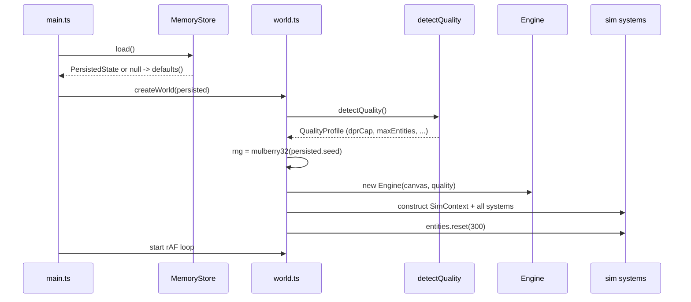

### User action → audit round-trip

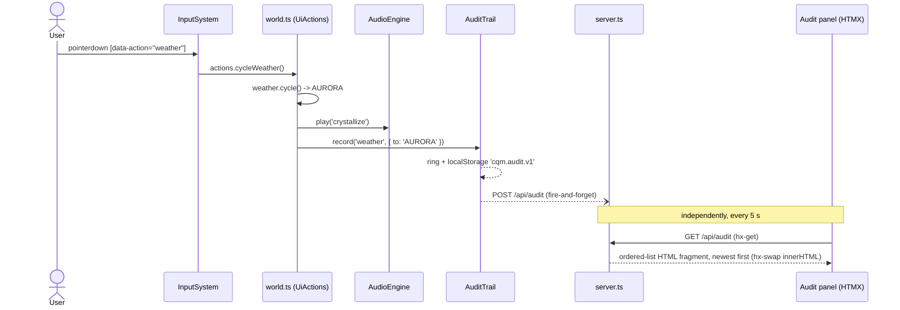

### Audio engine lifecycle (Known Bugs 1-3 fixed)

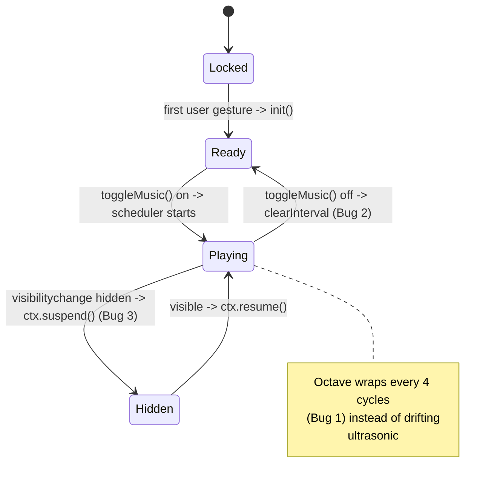

### Quantum collapse feedback loop (V2)

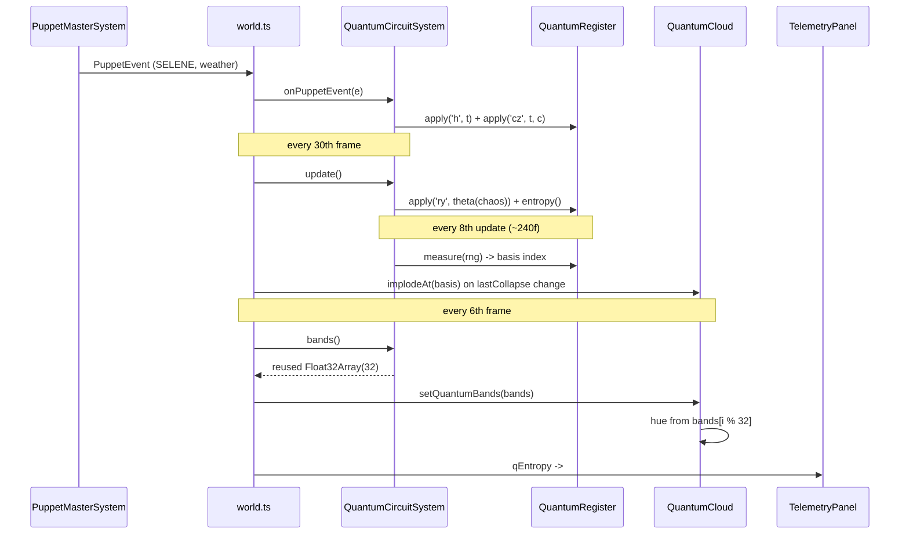

### Anomaly → omen pipeline (V2)

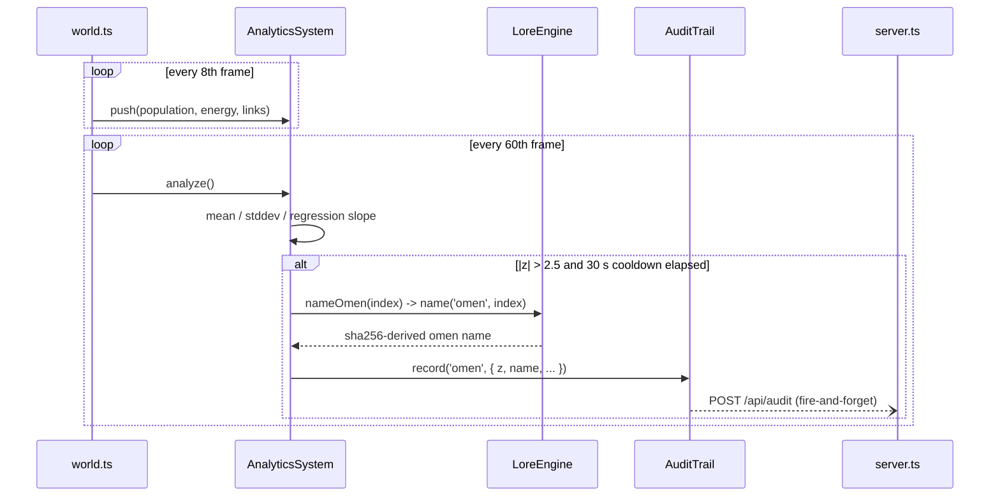

### Weather state machine

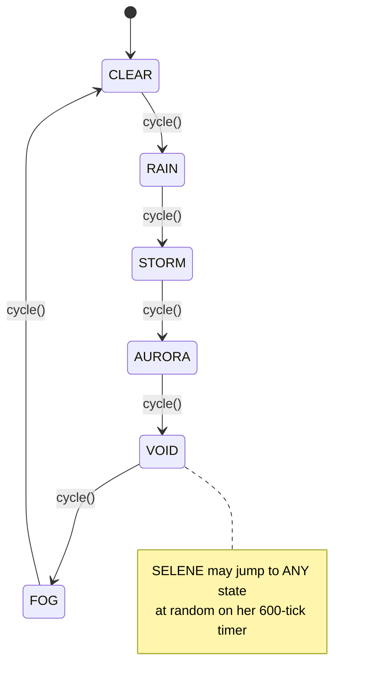

---

## 3. Dynamic Process Models & Execution Pipelines (Dynamic & Flow)

The **process** companion to [Logical Attributes Section](#2-logical-attributes--structural-schema-logical--attributes) (attribute structure) and [Conceptual Model Section](#1-conceptual-entity-relationship-model-conceptual--cardinality)
(conceptual relationships). Static models say what the things are; this document says **how they move
through time** — the boot sequence, the per-frame pipeline, the cadence schedule that keeps the heavy
substrates off each other's frames, and the lifecycles entities and events pass through.

Think of it as the "resource plan" for a 16.6 ms frame budget: every system gets a slot and a cadence,
and the composition root ([`src/world.ts`](../src/world.ts)) is the scheduler. Costs per stage live in
[BENCHMARKS-2026-06-26.md](./BENCHMARKS-2026-06-26.md); this is the ordering and the why.

> All mermaid labels below are punctuation-light by necessity — a semicolon inside a label is a
> statement separator and crashes the parser (documented gotcha, fixed once already on `/docs`).
> **Tsotchke full paradigm integrated:** Petri catalysis is now a core cadence for digital biologics growth. All docs (README/ARCH/ER\*/masters/SPECS/Dome-World docs) match. Accurate/current.

## 1. Boot / seed sequence

How a deterministic world comes into being from a single seed.

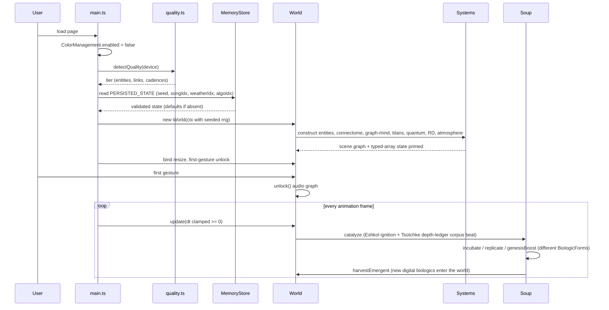

## 2. Per-frame pipeline

The order of a single `World.update(dt)`. Read-only projections (render, audio, UI) come last and
never mutate sim state.

**Tsotchke Petri / Digital Biologics cadence (depth-ledger wiring):** After Archon/super-mind beats, petriDishBeat + primordial-soup update for Eshkol program execution, AD mutation, GWT ignition, flux. Biologics emerge/grow from licensed/wired Tsotchke substrates (Eshkol language primary) while harvest/fenced entries remain classified honestly. Super Creature catalyzes only.

```mermaid
flowchart TD
  A[rAF tick] --> B[clamp dt >= 0]
  B --> C{grid rebuild frame?<br/>every 2nd}
  C -- yes --> D[SpatialHash clear + insert n]
  C -- no --> E[reuse last grid]
  D --> F[EntityManager.update<br/>behaviors + neighbor queries]
  E --> F
  F --> NHIcheck{live NHI?}
  NHIcheck -- yes --> NHIgrid[current-position grid rebuild]
  NHIgrid --> NHItick[NHI exact-target percept + decision]
  NHItick --> G[Connectome.update<br/>cadence by population]
  NHIcheck -- no --> G
  G --> H[Titans + Shoggoths + PuppetMasters]
  H --> I[Quantum cloud + register drift]
  I --> J[Tsotchke depth-ledger catalysis (registry beat + soup update)]
  J --> K[PrimordialSoup / PetriDish step (Eshkol AD mutation, biologic birth, aliveness selection)]
  K --> L[Emergent DIGITAL_BIOLOGIC strains injected as new life forms]
  I --> RDcheck{RD step frame?<br/>every 2nd offset 1}
  RDcheck -- yes --> RDstep[ReactionDiffusion.step]
  RDcheck -- no --> RDskip[skip]
  RDstep --> M[Weather.apply + Atmosphere]
  RDskip --> M
  M --> N{slow cadences}
  N --> O[Louvain every 240f]
  N --> P[PageRank every 600f offset 300]
  O --> Q[render projections]
  P --> Q
  Q --> R[viz3d + observatory on cadence]
  R --> S[telemetry + analytics every 8th]
  S --> T[audio analyser poll O of 128]
  T --> U[petri-dish/primordial-soup catalysis (full Tsotchke growth of new biologics)]
  U --> A
```

## 3. Cadence schedule

The heavy passes are deliberately interleaved so no two land on the same frame. This is the core of
the frame-budget "resource plan".

| Stage                     | Cadence                                             | Offset | Why staggered                                                 |
| ------------------------- | --------------------------------------------------- | ------ | ------------------------------------------------------------- |
| Grid rebuild              | baseline every 2nd; extra every frame with live NHI | 0      | halves no-NHI O(n) cost; current NHI pass proves exact target |
| Reaction-diffusion        | every 2nd frame                                     | 1      | never shares a frame with the grid rebuild                    |
| Connectome                | 1f (≤400) / 2f (≤700) / 3f (>700)                   | —      | bounds the only per-frame O(n·k) consumer                     |
| Quantum register drift    | every 30th frame                                    | —      | gate math is bursty, not continuous                           |
| Quantum-mind beat (V76)   | Observatory cadence (apex only)                     | —      | ~90 gates × 64 amps, allocation-free `evolve`                 |
| Telemetry + analytics     | every 8th frame                                     | —      | text writes are O(1) but DOM-touching                         |
| Observatory draw          | every 18th frame                                    | —      | 16 panels + the 36-readout NEURAL box                         |
| Louvain (tribes)          | every 240th frame                                   | 60/180 | rebuilds graphology graph — heavy                             |
| PageRank (halo)           | every 600th frame                                   | 300    | offset 300 never collides with the 240f Louvain               |
| Analytics regression      | every 60th frame                                    | —      | O(W=120) mean/stddev/slope                                    |
| Petri / Digital Biologics | every frame (light) + Archon beat catalysis         | —      | Primordial soup growth; Eshkol ignition births new biologics  |

```mermaid
gantt
  title Heavy-pass interleave over 600 frames
  dateFormat X
  axisFormat %s
  section Substrates
  Grid rebuild (2f)      :0, 600
  Reaction-diffusion (2f off1) :1, 600
  section Slow cortex
  Louvain (240f)         :milestone, 240, 0
  Louvain (240f) again   :milestone, 480, 0
  PageRank (600f off300) :milestone, 300, 0
```

## 4. Entity lifecycle

Birth to death to perturbation — the state machine every organism passes through.

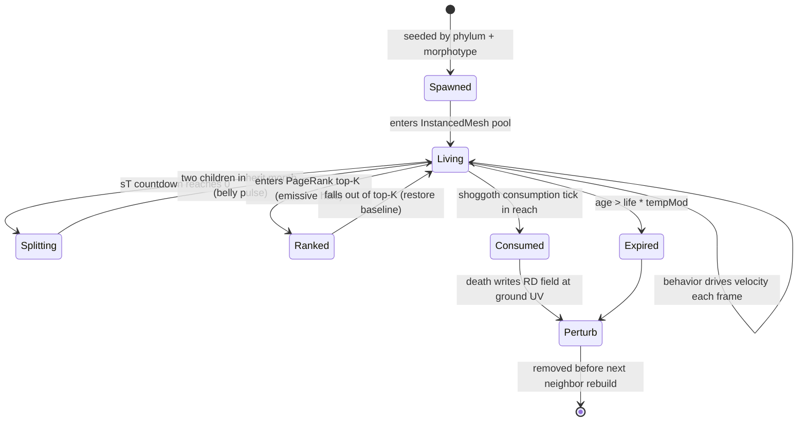

## 5. Audit event flow

The fire-and-forget telemetry path — never blocks the sim, always bounded.

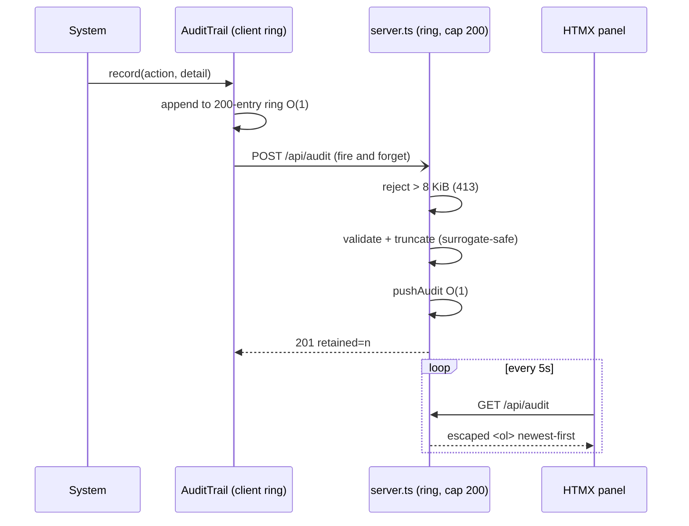

## 6. Build / release process

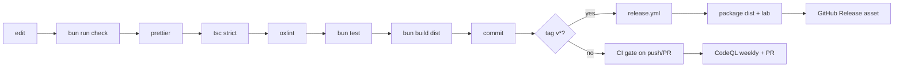

## Invariants the process preserves

1. **dt is never negative** — clamped before any curve sampling, so a late first frame cannot
   NaN-poison the sim.
2. **Read-after-write ordering** — neighbor-dependent systems (connectome, graph-mind) run after the
   grid is rebuilt for the frame; slow passes read the latest `connectome.pairs`.
3. **No corpse references** — death removes an entity before the next rebuild, so links/tribes/ranks
   never address a dead index.
4. **Projections are pure reads** — render, audio, observatory, and analytics consume sim state and
   never write it back (the one sanctioned write-back direction is documented per system in
   [Conceptual Model Section](#1-conceptual-entity-relationship-model-conceptual--cardinality)).
5. **Bounded everything** — every ring, buffer, and heap is fixed-size; the process cannot grow
   unbounded memory regardless of input or runtime.

See [BENCHMARKS-2026-06-26.md](./BENCHMARKS-2026-06-26.md) for the measured cost of each stage and the ultra-tier 10k interleave in detail.
