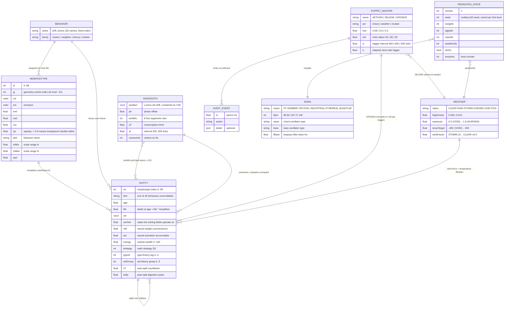
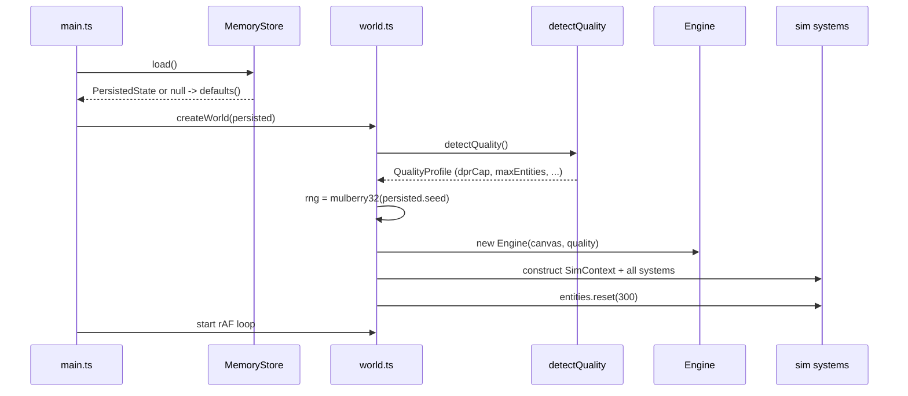
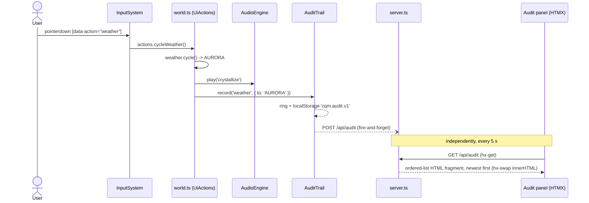
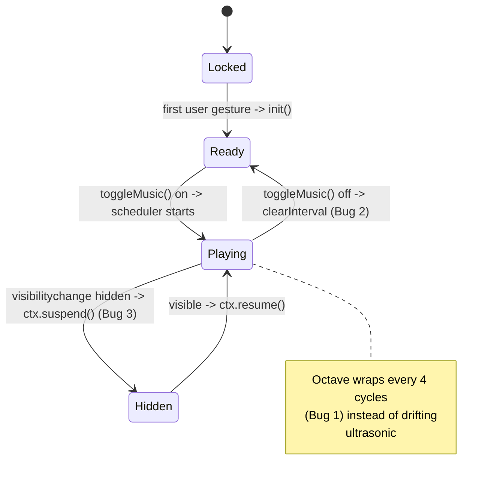
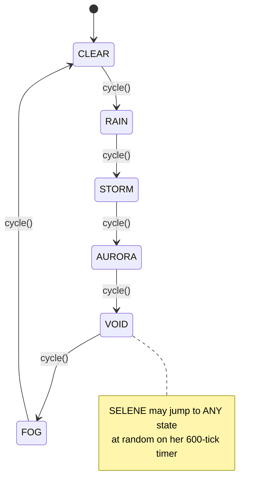

# Entity-Relationship Model

The Mechalogodrom has no database — its "entities" live in scene graphs,
typed arrays, rings, and `localStorage`. The relational structure is real
nonetheless, and the composition root (`world.ts`) is effectively its join
engine. Diagrams below follow ERD (structure), ERM (relationship narrative),
and ERP (process models).

## ERD

## ERM — relationship narrative

- **MORPHOTYPE → ENTITY (1:N).** Each of the 100 morphotypes is a template:
  color, emissive, metalness, roughness, opacity, scale range, speed, wobble,
  and a behavior. An entity is born from one morphotype (`userData.mi`) and
  copies its parameters; `EntityManager.remorph` re-points an existing entity
  at a different morphotype with a geometry-ref swap and material rewrite
  (zero allocation, no scene churn).
- **BEHAVIOR → MORPHOTYPE / ENTITY (1:N).** The 26 behaviors are assigned to
  morphotypes round-robin (`id % 26`), so each behavior owns roughly 4
  morphotypes. Entities normally inherit the behavior through their
  morphotype, but it is overridable per entity: Shoggoth-corrupted spawns are
  forced to `lorenz` regardless of morphotype.
- **ENTITY → ENTITY (1:N, self).** Organisms reproduce: the user `split`
  action spawns 4 children around up to 5 mature parents; the `split`
  behavior and the auto-split countdown (`sT`) spawn singles; death below the
  100-entity floor triggers 3 respawns near the corpse.
- **SHOGGOTH ↔ ENTITY (M:N + 1:N).** Tendrils connect each Shoggoth to up to
  8 nearby entities per frame (spatial-hash query, radius 15) and tug them
  inward. On its consumption interval, a Shoggoth deletes its nearest entity
  within range and spawns 2 corrupted (`lorenz`, dark-violet) replacements —
  a destructive 1:N relationship that recolors the population over time.
- **PUPPET_MASTER → ENTITY / WEATHER / SimState (1:N).** KRONOS remorphs up
  to 30 random entities per trigger; SELENE overwrites the active weather
  index at random; AETHON raises `chaos` (clamped to 70% of max). Every
  trigger emits a `PuppetEvent` which the world forwards to the HUD toast and
  the audit trail.
- **WEATHER → ENTITY (1:N).** The active weather drives the wind vector
  added to every entity's velocity, and the temperature, which scales
  lifespan (cold ×0.7, hot ×1.3 on the death threshold).
- **SONG / PERSISTED_STATE (N:1 references).** `PersistedState` stores
  indices, not copies: `songIdx`, `algoIdx`, `viewIdx`, `weatherIdx` point
  into the fixed catalogs (5 songs, 20 algorithms, 4 view modes, 6 weathers).
- **AUDIT_EVENT (append-only ring).** Produced by user actions and puppet
  events; stored three ways with no foreign keys back — a local ring
  (`AuditTrail`, cap 200), `localStorage` (`cqm.audit.v1`), and the server's
  in-memory ring via `POST /api/audit`.

## ERP — process models

### Boot sequence

### User action → audit round-trip

### Audio engine lifecycle (Known Bugs 1-3 fixed)

### Weather state machine

