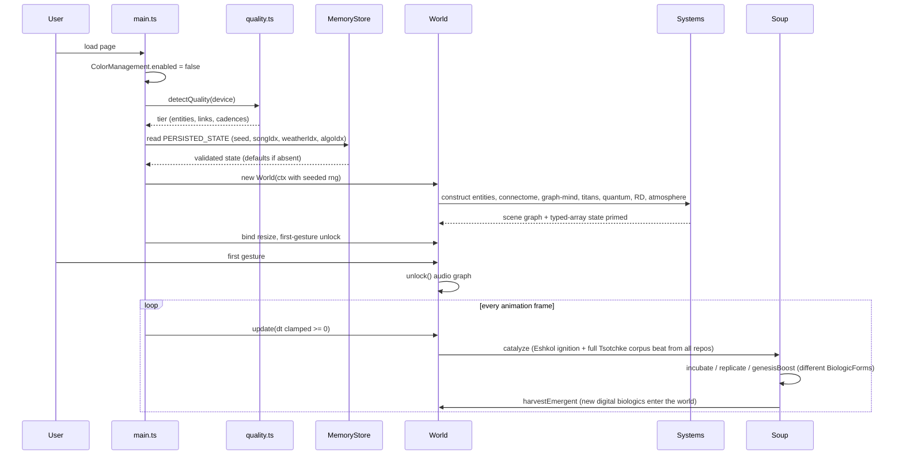
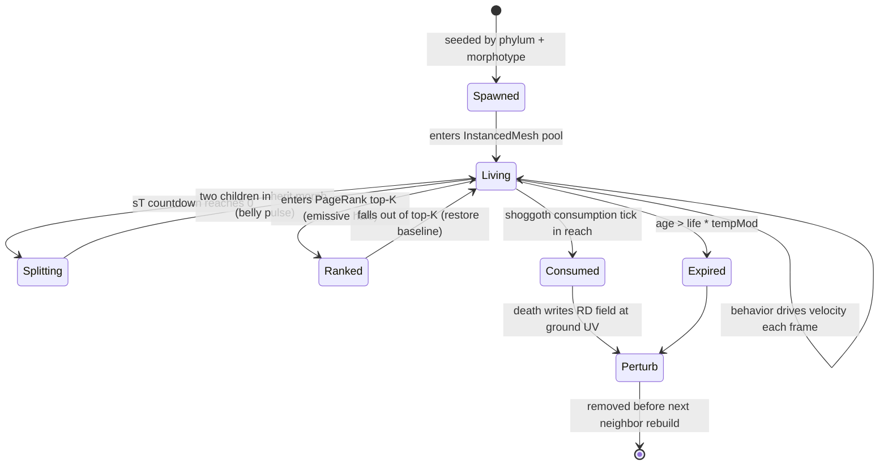
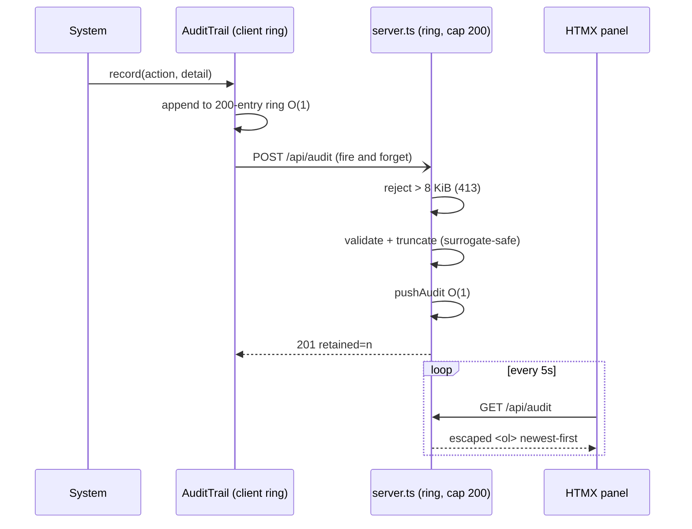
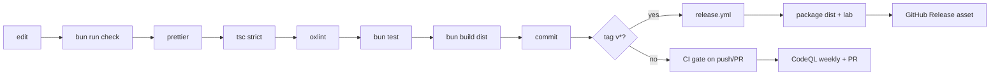

<!-- reviewed: 2026-06-27 | repo-wide consistency audit | canonical facts: docs/VERIFICATION-ANALYTICAL-DATA.md -->

# ERP — Entity Relationships in Process (the dynamic view)

The **process** companion to [ERD-2026-06-26.md](./ERD-2026-06-26.md) (attribute structure) and [ERM-2026-06-26.md](./ERM-2026-06-26.md)
(conceptual relationships). Static models say what the things are; this document says **how they move
through time** — the boot sequence, the per-frame pipeline, the cadence schedule that keeps the heavy
substrates off each other's frames, and the lifecycles entities and events pass through.

Think of it as the "resource plan" for a 16.6 ms frame budget: every system gets a slot and a cadence,
and the composition root ([`src/world.ts`](../src/world.ts)) is the scheduler. Costs per stage live in
[COMPLEXITY-2026-06-26.md](./COMPLEXITY-2026-06-26.md); this is the ordering and the why.

> All mermaid labels below are punctuation-light by necessity — a semicolon inside a label is a
> statement separator and crashes the parser (documented gotcha, fixed once already on `/docs`).
> **Tsotchke full paradigm integrated:** Petri catalysis is now a core cadence for digital biologics growth. All docs (README/ARCH/ER\*/masters/SPECS/Dome-World docs) match. Accurate/current.

## 1. Boot / seed sequence

How a deterministic world comes into being from a single seed.



## 2. Per-frame pipeline

The order of a single `World.update(dt)`. Read-only projections (render, audio, UI) come last and
never mutate sim state.

**Tsotchke Petri / Digital Biologics cadence (full wiring):** After Archon/super-mind beats, petriDishBeat + primordial-soup update for Eshkol program execution, AD mutation, GWT ignition, flux. Biologics emerge/grow from all Tsotchke substrates (Eshkol language primary). Super Creature catalyzes only.

```mermaid
flowchart TD
  A[rAF tick] --> B[clamp dt >= 0]
  B --> C{grid rebuild frame?<br/>every 2nd}
  C -- yes --> D[SpatialHash clear + insert n]
  C -- no --> E[reuse last grid]
  D --> F[EntityManager.update<br/>behaviors + neighbor queries]
  E --> F
  F --> G[Connectome.update<br/>cadence by population]
  G --> H[Titans + Shoggoths + PuppetMasters]
  H --> I[Quantum cloud + register drift]
  I --> J[Tsotchke full corpus catalysis (registry beat + soup update)]
  J --> K[PrimordialSoup / PetriDish step (Eshkol AD mutation, biologic birth, aliveness selection)]
  K --> L[Emergent DIGITAL_BIOLOGIC strains injected as new life forms]
  I --> J{RD step frame?<br/>every 2nd offset 1}
  J -- yes --> K[ReactionDiffusion.step]
  J -- no --> L[skip]
  K --> M[Weather.apply + Atmosphere]
  L --> M
  M --> N{slow cadences}
  N --> O[Louvain every 240f]
  N --> P[PageRank every 600f offset 300]
  O --> Q[render projections]
  P --> Q
  Q --> R[viz3d + observatory on cadence]
  R --> S[telemetry + analytics every 8th]
  S --> T[audio analyser poll O of 128]
  T --> U[petri-dish/primordial-soup catalysis (full Tsotchke growth of new biologics)]
  U --> A
```

## 3. Cadence schedule

The heavy passes are deliberately interleaved so no two land on the same frame. This is the core of
the frame-budget "resource plan".

| Stage                     | Cadence                                     | Offset | Why staggered                                                |
| ------------------------- | ------------------------------------------- | ------ | ------------------------------------------------------------ |
| Grid rebuild              | every 2nd frame                             | 0      | halves O(n) rebuild cost                                     |
| Reaction-diffusion        | every 2nd frame                             | 1      | never shares a frame with the grid rebuild                   |
| Connectome                | 1f (≤400) / 2f (≤700) / 3f (>700)           | —      | bounds the only per-frame O(n·k) consumer                    |
| Quantum register drift    | every 30th frame                            | —      | gate math is bursty, not continuous                          |
| Quantum-mind beat (V76)   | Observatory cadence (apex only)             | —      | ~90 gates × 64 amps, allocation-free `evolve`                |
| Telemetry + analytics     | every 8th frame                             | —      | text writes are O(1) but DOM-touching                        |
| Observatory draw          | every 18th frame                            | —      | 16 panels + the 36-readout NEURAL box                        |
| Louvain (tribes)          | every 240th frame                           | 60/180 | rebuilds graphology graph — heavy                            |
| PageRank (halo)           | every 600th frame                           | 300    | offset 300 never collides with the 240f Louvain              |
| Analytics regression      | every 60th frame                            | —      | O(W=120) mean/stddev/slope                                   |
| Petri / Digital Biologics | every frame (light) + Archon beat catalysis | —      | Primordial soup growth; Eshkol ignition births new biologics |

```mermaid
gantt
  title Heavy-pass interleave over 600 frames
  dateFormat X
  axisFormat %s
  section Substrates
  Grid rebuild (2f)      :0, 600
  Reaction-diffusion (2f off1) :1, 600
  section Slow cortex
  Louvain (240f)         :milestone, 240, 0
  Louvain (240f) again   :milestone, 480, 0
  PageRank (600f off300) :milestone, 300, 0
```



## 4. Entity lifecycle

Birth to death to perturbation — the state machine every organism passes through.



## 5. Audit event flow

The fire-and-forget telemetry path — never blocks the sim, always bounded.



## 6. Build / release process



## Invariants the process preserves

1. **dt is never negative** — clamped before any curve sampling, so a late first frame cannot
   NaN-poison the sim.
2. **Read-after-write ordering** — neighbor-dependent systems (connectome, graph-mind) run after the
   grid is rebuilt for the frame; slow passes read the latest `connectome.pairs`.
3. **No corpse references** — death removes an entity before the next rebuild, so links/tribes/ranks
   never address a dead index.
4. **Projections are pure reads** — render, audio, observatory, and analytics consume sim state and
   never write it back (the one sanctioned write-back direction is documented per system in
   [ERM-2026-06-26.md](./ERM-2026-06-26.md)).
5. **Bounded everything** — every ring, buffer, and heap is fixed-size; the process cannot grow
   unbounded memory regardless of input or runtime.

See [COMPLEXITY-2026-06-26.md](./COMPLEXITY-2026-06-26.md) for the measured cost of each stage and
[BENCHMARKS-2026-06-26.md](./BENCHMARKS-2026-06-26.md) for the ultra-tier 10k interleave in detail.
