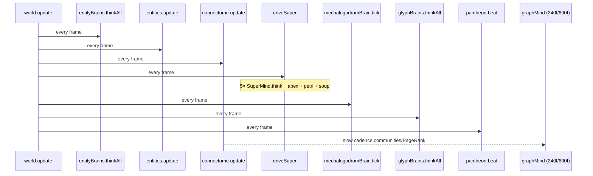
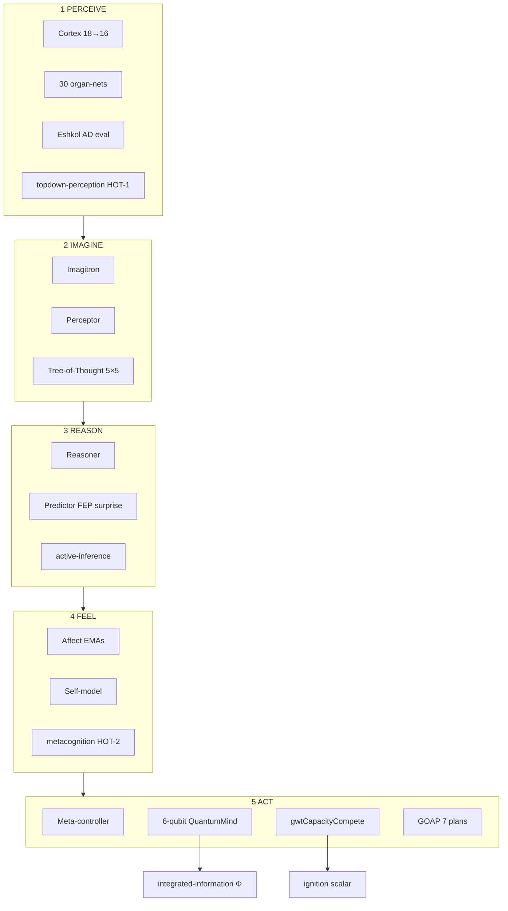
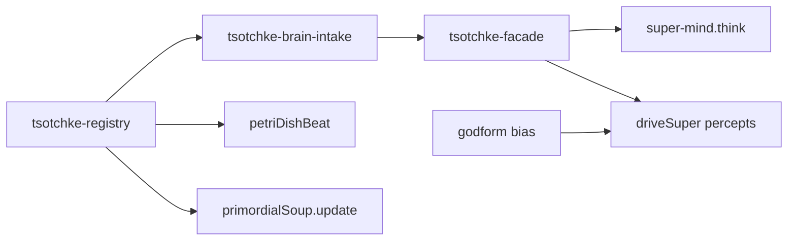

<!-- reviewed: 2026-07-06 | Pass 2 of 3 | v0.21.7 module atlas + wiring receipts | canonical: docs/VERIFICATION-ANALYTICAL-DATA.md -->

# MEGA-MASTER Assessment — Pass 2: Module Atlas, Wiring Receipts & Test Matrix

**Pass 2 of 3** · Cosmogonic Quantum Mechalogodrom **v0.21.7**  
**Assessment date:** 2026-07-06  
**Predecessor:** [`MEGA-MASTER-...-PASS-1-2026-07-06.md`](./MEGA-MASTER-CONSCIOUSNESS-BRAIN-SENTIENCE-ASSESSMENT-PASS-1-2026-07-06.md)  
**Machine preview:** [`reports/assets/brain-evidence-matrix-pass2.json`](./reports/assets/brain-evidence-matrix-pass2.json)  
**Claim boundary:** `indicatorOnly` — computational indicators, not phenomenal consciousness.

---

## 0 · What Pass 2 Adds

Pass 1 synthesized five agent reports into a unified verdict. **Pass 2 goes under the hood:**

| Deliverable | Scope |
|-------------|-------|
| **Composition root anatomy** | `src/world.ts` — 4,771 lines, 94 `sim/` imports, verified frame pipeline |
| **Authority-tier atlas** | Every brain/cognition module classified LIVE / TELEMETRY / LAB / SCAFFOLD / FENCED |
| **Read/write receipts** | What each substrate reads and what it actually mutates |
| **Full `src/sim/` inventory** | 185 modules · 59,500 lines — domain-grouped with line counts |
| **Full `src/math/` inventory** | 31 leaves · 6,468 lines — theory mapping + sim importers + tests |
| **`tests/` brain matrix** | 72 related test files · ~900+ test blocks in cognition cluster |
| **`native/` C++ receipts** | 8 files · ~1,367 lines — gallery vs golden-vector split |
| **Wiring gaps** | 7 named gaps with severity and file receipts |
| **`driveSuper` deep dive** | Verified call graph from `world.update()` |

**Pass 3 (complete):** [`MEGA-MASTER-...-PASS-3-2026-07-06.md`](./MEGA-MASTER-CONSCIOUSNESS-BRAIN-SENTIENCE-ASSESSMENT-PASS-3-2026-07-06.md) — omniscient living-world census (shoggoths, puppets, titans, leviathans, NHI, flora/fauna, pantheon/GOD/temple), full [`brain-evidence-matrix.json`](./reports/assets/brain-evidence-matrix.json), [`sim-modules-census-pass3.csv`](./reports/assets/sim-modules-census-pass3.csv), gap audit vs six uploads, preprint skeleton.

---

## 1 · Composition Root: `src/world.ts`

The simulation oracle is **`src/world.ts`**, not `src/core/engine.ts` (WebGL-only).

| Metric | Value |
|--------|------:|
| Lines | **4,771** |
| Direct `sim/` imports | **94** |
| Brain-related imports | **~40** (SuperMind, ApexBrain, Connectome, petri, pantheon, Tsotchke facade, …) |

### 1.1 Verified frame pipeline (`world.update`)



**Correction vs stale comments:** `driveSuper` header still mentions "frame % 4 cadence" in places, but `world.update` calls `this.driveSuper(...)` **every frame** (line ~1810). The pantheon is beaten once per frame before `driveSuper` reads its snapshot to avoid double-stepping the stigmergic field.

### 1.2 What is NOT on the frame path

| Module | Tier | Note |
|--------|------|------|
| `consciousness-kernel.ts` | LAB | No `world.ts` import |
| `consciousness-lab.ts` | LAB | Headless sweeps only |
| `sentience-lab.ts` | LAB | 32-seed batch analytics |
| `consciousness-adapters.ts` | SCAFFOLD | Static profiles; no live telemetry feed |
| `runThalerProof` | LAZY | Via `world.thaler` getter — not per-frame |

**Honesty receipt:** Live "consciousness" scalars in the HUD come from **`SuperMind.think()`** (ignition, phi, workspace, surprise, …), not from the 10-framework coupled kernel. The kernel is rigorous but **offline**.

---

## 2 · `driveSuper` — Apex Beat Anatomy

`driveSuper` (lines ~2469–2700+) is the **central integration bus** for NHSI apex cognition.

### 2.1 Input assembly (every beat)

| Source | Scratch buffer | Signals |
|--------|----------------|---------|
| World state | `nhsiFacultyIn[16]` | chaos, population, pantheon field, NHI/titans, audio, economy, connectome link density |
| Faculties | `facultiesPantheon.update(fi)` | `getAggregateActivation()` → percept bias |
| ToM | `tomPantheon.observe(tc)` | `getAggregateMenace()` → threat |
| Grid | per-archon query | local crowding at body position |
| Tsotchke | `getCorpusPulseForArchon(i)` | quake, ulg, moonlab MPO, QGE, tensor contract, QEC stability |
| Godform | `getFullTsotchkeBias(i)` | per-Archon generative/chaos/narrative bias |

### 2.2 Per-Archon loop (5×)

For each `i ∈ [0, APEX_INDIVIDUATED)`:

1. Build localized `SuperPercept` `p`
2. `mindOut = superMinds[i].think(p)` (~1.99 ms each)
3. **Write-backs:**
   - `noosphere.updateArchon(phi, ignition, workspace, novelty, qualiaTone)`
   - `stigmergy.deposit(ignition-weighted)`
   - `emergenceAngles.aggregateCollective(coll)`
   - `pantheon.depositApex(8-dim vector)`
   - `primordialSoup.update(i, frame, rng)`
   - `petriDishBeat(dish, i, frame, rng)`
   - `superBodies[i].setConsciousness(...)`, `setMind(...)`

4. `apexBrain.tick(...)` feeds `foundationals.tickAndStore`

### 2.3 Code receipt (consciousness write path)

```2611:2652:src/world.ts
        const mindOut = this.superMinds[i]!.think(p);
        this.noosphere.updateArchon(
          i,
          mindOut.consciousness.phi,
          mindOut.consciousness.ignition,
          mindOut.consciousness.workspace,
          mindOut.consciousness.novelty,
          mindOut.consciousness.qualiaTone,
        );
        // ... stigmergy, emergenceAngles, pantheon.depositApex ...
        this.primordialSoup.update(i, s.frame, this.petriRng);
        const dish = this.petriDishes[i];
        if (dish) petriDishBeat(dish, i, s.frame, this.petriRng);
```

---

## 3 · Authority-Tier Module Atlas (Brain & Cognition)

### Tier legend

| Tier | Definition |
|------|------------|
| **LIVE** | Mutates sim behavior, physics, spawns, or collective fields on frame or slow cadence |
| **TELEMETRY** | Computes cognition; output is visual/HUD/audit only |
| **LAB** | Headless experiment runners (`bun test`, lab JSON generators) |
| **SCAFFOLD** | Implemented + tested but not wired to `world.update` hot path |
| **FENCED** | Registry `wiring: 0` — deliberate exclusion |

### 3.1 Primary brain substrates

| Module | Lines | Tier | Params/Scale | Reads | Writes | Tests |
|--------|------:|------|--------------|-------|--------|-------|
| `super-mind.ts` | 1,928 | **LIVE** | ~10,081 × 5 | SuperPercept, Tsotchke pulse, faculty/ToM bias | move intent, noosphere, stigmergy, pantheon, emergence | 3 files + coupling |
| `apex-brain.ts` | 2,110 | **LIVE** | 1B+ designed / 4096 cap | ApexPercept | noosphere, foundationals, mecha apex | 15 apex test files |
| `entity-brain.ts` | 301 | **LIVE** | 70 × 50k | userData, chaos | vel, act (→ connectome) | entity-brain, gedanken-death |
| `connectome.ts` | 388 | **LIVE** | 2.2k–8k links | entities, grid | act propagation, pairs[], axons | connectome |
| `graph-mind.ts` | 192 | **LIVE** | slow | connectome.pairs | tribes, palette, PageRank halo | graph-mind |
| `glyph-brain.ts` | 290 | **TELEMETRY** | 25k × 100 | 8-dim percept | alphabet pantheon visual | glyph-brain |
| `mechalogodrom-brain.ts` | 349 | **TELEMETRY** | 5M / 120k live | mecha snapshot | exterior visual; morphic→chaos glue | mechalogodrom-brain, stdp |
| `consciousness-kernel.ts` | 870 | **LAB** | 10 frameworks | FrameworkSignals | coupled index (offline) | consciousness-kernel |
| `consciousness-lab.ts` | 445 | **LAB** | — | Kuramoto + kernel | LabReport JSON | consciousness-lab |
| `sentience-lab.ts` | 293 | **LAB** | 32 seeds | batch runs | SentienceLabReport | sentience-lab |
| `consciousness-adapters.ts` | 546 | **SCAFFOLD** | entity profiles | static traits | adapter snapshots (no world feed) | consciousness-adapters |
| `faculties-pantheon.ts` | 335 | **LIVE** | 100 / ~30 deep | 16-dim faculty input | aggregate activation → percept | faculties-pantheon, coupling |
| `tom-pantheon.ts` | 406 | **LIVE** | 25 organs | 8-dim social cues | menace → threat | tom-pantheon |
| `thaler-sentience.ts` | 1,005 | **LAB/LAZY** | 70-param CM | seeded ensemble | ThalerVerdict (getter) | thaler-sentience (19 tests) |
| `petri-dish.ts` | 632 | **LIVE** | 5 dishes | full Tsotchke vector | biomass, aliveness, godPower | petri-open-endedness, brutal-god |
| `primordial-soup.ts` | 253 | **LIVE** | 128 slots | archon, frame | strain evolution; spawn @120f | facade integration |
| `digital-biologics.ts` | 359 | **SCAFFOLD** | 26 forms | would-read corpus | `birthBiologic()` **unwired** | digital-biologics |

### 3.2 Embedded SuperMind submodules (LIVE via `think()`)

| Submodule | File | Theory | Tests |
|-----------|------|--------|-------|
| Active inference | `active-inference.ts` (257) | FEP / Friston | active-inference |
| Integrated information | `integrated-information.ts` (301) | IIT Φ proxy | integrated-information |
| Theory of mind | `theory-of-mind.ts` | Rabinowitz 2018 | theory-of-mind |
| Metacognition | `metacognition.ts` (109) | HOT-2 | metacognition |
| Attention schema | `attention-schema.ts` (85) | AST | super-mind-leaves |
| Embodiment | `embodiment.ts` (92) | AE-2 partial | embodiment |
| Reservoir | `reservoir.ts` | Echo-state / QRC | resonance tests |
| Empowerment | `empowerment.ts` (304) | Klyubin | empowerment |
| Holographic memory | `holographic-memory.ts` (482) | VSA/HRR | holographic-memory |
| Spin glass | `spin-glass.ts` | Tsotchke Hopfield | spin-glass |
| Super-qubits | `super-qubits.ts` (575) | 6-qubit register | super-qubits (23 tests) |
| Eshkol bridge | `eshkol-bridge.ts` (380) | AD/GWT/KB | eshkol-vm, workspace |
| Quality space | `quality-space.ts` | HOT-4 partial | super-mind-leaves |
| Topdown perception | `topdown-perception.ts` | HOT-1 | super-mind-leaves |
| Learned recurrence | `learned-recurrence.ts` (106) | RPT partial | — |

### 3.3 Collective / society layers (LIVE)

| Module | Lines | Role |
|--------|------:|------|
| `noosphere.ts` | ~210 | Collective consciousness field; chaos coupling |
| `morphic-field.ts` | ~127 | Cross-mind resonance; mecha/apex latents |
| `stigmergy.ts` | ~stigmergy | Spatial trace deposits from ignition |
| `pantheon.ts` | 109 | 25-Archon society + mind-field |
| `mind-field.ts` | — | 25×8 stigmergic buffer |
| `emergence-angles.ts` | 696 | 10 canonical angles + god events |
| `foundationals.ts` | 662 | 1B-self-awareness interconnect |
| `nhi.ts` + `nhi-system.ts` | 438 + 97 | Separate apex NHI minds with own `think` |
| `gedanken-death.ts` | ~216 | Neural death + devour imprint on predation |

### 3.4 Tier summary counts

| Tier | Brain-relevant modules |
|------|----------------------:|
| LIVE | **22+** (including embedded submodules) |
| TELEMETRY | **2** (glyph-brain, mechalogodrom-brain primary) |
| LAB | **4** (kernel, consciousness-lab, sentience-lab, thaler proof path) |
| SCAFFOLD | **2** (consciousness-adapters, digital-biologics) |
| FENCED (registry) | **3 repos** (gpt2-basic, llm-arbitrator, SolanaQuantumFlux) |

---

## 4 · SuperMind Internal Stack (Deep)



**Honesty header (binding):**

```48:57:src/sim/super-mind.ts
 * NOT SENTIENT DISCLAIMER (binding per MODULE-CONTRACTS + masters + GOAL5 receipts)
 * NOT SENTIENT. Deterministic mathematical model / functional correlate / simulacrum only.
 * No phenomenal consciousness, sentience, or hard-problem solution claimed or implemented.
```

**Math imports into SuperMind (verified):** `rng`, `global-workspace`, `eshkol-ad`, `eshkol-qrng`, `clifford-tableau`, `super-qubits`, plus sim leaves for active-inference, theory-of-mind, integrated-information, spin-glass, eshkol-bridge, empowerment, reservoir, metacognition, embodiment, holographic-memory, quality-space, topdown-perception, learned-recurrence, tsotchke-facade.

---

## 5 · ApexBrain Organ Receipts

| Organ | Math substrate | Live cap | Test coverage |
|-------|----------------|----------|---------------|
| PrimeSieveLoom | Twin-prime graph | 4096 | apex-brain.test.ts |
| AcousticMeatDrum | Wave equation ring | 4096 | apex-brain.test.ts |
| EntropicNecroMatrix | BFS + edge burnout | 4096 | apex-brain.test.ts |
| KleinBottleCortex | Non-orientable grid | 4096 | apex-brain.test.ts |
| PendulumHive | Chirikov rotors | 4096 | apex-brain.test.ts |
| SlimeMoldHydra | Split/fuse heads | 4096 | apex-brain.test.ts |
| ChronoWraith | Delay lines | 4096 | apex-brain.test.ts |
| QuantumTunnelLattice | Born-rule edges | 4096 | apex-brain.test.ts |
| ThermodynamicEngine | Heat diffusion | 4096 | apex-brain + native golden |
| CancerousOuroboros | Growth vs cull | 4096 | apex-brain.test.ts |
| Quantum Brain | Statevector + Tsotchke pulse | 4096 | apex-quantum-substrate tests |

**Designed vs live:** `LIVE_NODE_CAP = 4096` per organ class; `designedNeurons` can reach 1B+ on the addressable manifold ladder.

---

## 6 · `src/math/` Complete Inventory (31 files · 6,468 lines)

| File | Lines | Theory | Sim importers | Tests |
|------|------:|--------|---------------|-------|
| `eshkol-ad.ts` | 557 | Eshkol reverse-mode AD | eshkol-bridge, super-mind | eshkol-ad |
| `curvature-aware-qng.ts` | 466 | Weighted projective QNG | tsotchke-facade | curvature-aware-qng-field |
| `quantum.ts` | 440 | Dense statevector (n≤8) | super-qubits, moonlab-vqe, apex | quantum, super-qubits |
| `eshkol-qrng.ts` | 369 | Eshkol qRNG | super-mind, classical-contrast | eshkol-qrng |
| `clifford-tableau.ts` | 350 | Stabilizer formalism | super-mind, apex-quantum | clifford-tableau |
| `quantization.ts` | 333 | FP16/INT8 | entity-brain | quantization |
| `rng-stats.ts` | 287 | RNG quality battery | — | rng-stats |
| `irrep.ts` | 282 | SO(3)/SU(2) irreps | irrep-symmetry, deep-wire | irrep |
| `mixed-state-qgt.ts` | 262 | Mixed-state QGT | **NONE** | **NONE** |
| `global-workspace.ts` | 256 | GWT / Dehaene | super-mind, eshkol-workspace | global-workspace, gwt-capacity, butlin |
| `games.ts` | 253 | Game theory | pantheon-breeding, titans | games |
| `so3.ts` | 226 | Quaternions, SLERP | latent-substrates | so3 |
| `mps-svd.ts` | 216 | MPS bond truncation | moonlab-tensor, tensorcore | mps-svd |
| `heap.ts` | 174 | Binary heap | graph-mind | heap |
| `schrodinger.ts` | 168 | Crank–Nicolson TDSE | latent-substrates | schrodinger |
| `quantum-geometry.ts` | 167 | QGT / Berry | super-qubits, quake-physics | quantum-geometry |
| `quantum-qrng-full.ts` | 156 | QRNG + CHSH | — | quantum-qrng-full |
| `belief-propagation.ts` | 151 | Factor-graph BP | **NONE** | belief-propagation |
| `quantum-natural-gradient.ts` | 147 | Stokes QNG | super-qubits, facade | quantum-natural-gradient |
| `hyperdual.ts` | 144 | 2nd-order AD | — | hyperdual |
| `predictive-coding.ts` | 139 | Rao–Ballard / Friston | facade | predictive-coding |
| `unification.ts` | 133 | Eshkol logic/KB | — | unification |
| `hopfield.ts` | 119 | Associative memory | facade | hopfield |
| `libirrep-symmetry.ts` | 116 | SU(2) characters | — | libirrep-symmetry |
| `quantum-magic.ts` | 109 | Stabilizer Rényi | super-qubits, facade | quantum-magic |
| `izhikevich.ts` | 99 | Spiking neurons | facade | izhikevich |
| `spatial-hash.ts` | 96 | Uniform grid | world.ts (not sim/) | spatial-hash |
| `dual.ts` | 73 | Forward-mode AD | — | dual |
| `scalar.ts` | 66 | clamp, lerp, TAU | 29 sim files | scalar |
| `quantum-coherence.ts` | 59 | Coherence monotones | super-qubits, facade | quantum-coherence |
| `rng.ts` | 55 | mulberry32 | **57 sim files** | rng |

### Math wiring gaps (Pass 2 findings)

| Module | Sim wired? | Tests? | Severity |
|--------|-----------|--------|----------|
| `mixed-state-qgt.ts` | No | No | **P2** |
| `belief-propagation.ts` | No | Yes (leaf only) | P3 |
| `dual.ts`, `hyperdual.ts`, `unification.ts` | No | Yes | P3 |
| `libirrep-symmetry.ts` | No | Yes | P3 |
| `quantum-qrng-full.ts`, `rng-stats.ts` | No | Yes | P3 |

---

## 7 · `src/sim/` Domain Inventory (185 files · 59,500 lines)

### 7.1 By functional domain

| Domain | Files | Lines (approx) | Brain relevance |
|--------|------:|---------------:|-----------------|
| **Apex / Super creature** | 25+ | ~12,000 | super-mind, apex-brain, super-body, super-qubits, wingmen, evolution |
| **Population / entities** | 15+ | ~8,000 | entity-brain, entities, connectome, graph-mind, genome |
| **Pantheon / NHSI** | 20+ | ~6,500 | godform, faculties, tom, pantheon, emergence, brutal-god |
| **Petri / biologics** | 10+ | ~3,500 | petri-dish, primordial-soup, digital-biologics, open-endedness |
| **Tsotchke integration** | 12+ | ~4,000 | registry, facade, brain-intake, deep-wire, eshkol-bridge |
| **Consciousness / lab** | 8 | ~3,200 | kernel, lab, sentience-lab, adapters |
| **Mechalogodrom / glyph** | 10+ | ~4,500 | mechalogodrom, mechalogodrom-brain, glyph-brain, alphabet-pantheon |
| **Environment / world FX** | 40+ | ~12,000 | titans, economy, weather, flora, singularities |
| **Rendering / viz** | 15+ | ~5,000 | instanced-entities, viz3d, exterior layers |
| **NHI / classical AI** | 10+ | ~2,500 | nhi, nhi-system, ai/brains, behaviors |
| **Misc leaves** | 30+ | ~7,800 | constants, algorithms, lore, analytics |

### 7.2 Top 40 modules by line count

| Lines | Module | Domain |
|------:|--------|--------|
| 2,110 | apex-brain.ts | Apex weird brain |
| 1,928 | super-mind.ts | Apex composite mind |
| 1,547 | titans.ts | World antagonists |
| 1,417 | super-body.ts | Apex body |
| 1,392 | creature-exterior-layers.ts | Visual phenotypes |
| 1,151 | instanced-entities.ts | Renderer |
| 1,131 | singularities.ts | World phenomena |
| 1,107 | alphabet-pantheon-render.ts | Glyph visuals |
| 1,014 | environment.ts | World environment |
| 1,005 | thaler-sentience.ts | Creativity Machine proof |
| 941 | entities.ts | Entity manager |
| 870 | consciousness-kernel.ts | 10-framework lab |
| 845 | pantheon-breeding.ts | Breeding scaffold |
| 812 | tsotchke-deep-wire.ts | Corpus deep wiring |
| 757 | mechalogodrom.ts | Mecha shell |
| 696 | emergence-angles.ts | 10 angles + god events |
| 662 | foundationals.ts | 1B interconnect |
| 632 | petri-dish.ts | Digital biologics dish |
| 575 | super-qubits.ts | 6-qubit register |
| 546 | consciousness-adapters.ts | Entity adapters (scaffold) |
| 482 | holographic-memory.ts | VSA binding |
| 445 | consciousness-lab.ts | Lab sweeps |
| 438 | nhi.ts | NHI apex minds |
| 435 | tsotchke-registry.ts | Corpus ledger |
| 406 | tom-pantheon.ts | 25 ToM organs |
| 388 | connectome.ts | Population neurology |
| 380 | eshkol-bridge.ts | Eshkol consciousness engine |
| 359 | digital-biologics.ts | Form taxonomy (scaffold) |
| 349 | mechalogodrom-brain.ts | Fusion brain |
| 335 | faculties-pantheon.ts | 100 faculties |
| 339 | resonance.ts | Kuramoto binding |
| 319 | godform.ts | 25 Archon biases |
| 301 | entity-brain.ts | 70-param MLP |
| 301 | integrated-information.ts | IIT Φ |
| 290 | glyph-brain.ts | Letter brains |
| 293 | sentience-lab.ts | Mass-run lab |
| 257 | active-inference.ts | FEP |
| 253 | primordial-soup.ts | Soup evolution |

*(Full 185-file listing available via `wc -l src/sim/*.ts` — Pass 3 will emit CSV.)*

---

## 8 · Test Coverage Matrix (Brain / Consciousness Cluster)

**Totals:** 255 test files repo-wide · **72** brain/consciousness-related · **~900+** `describe`/`test`/`it` blocks in cluster · **2,722** blocks across all tests.

### 8.1 Core brain tests

| Test file | ~Tests | Pins |
|-----------|-------:|------|
| `apex-brain.test.ts` | 44 | 11 organs, designed/live honesty |
| `super-mind.test.ts` | 9 | think(), determinism, bounds |
| `super-mind-leaves.test.ts` | 11 | HOT-1/4, AST, quality-space |
| `super-mind-learning.test.ts` | 7 | learning loop |
| `entity-brain.test.ts` | 12 | 70-param MLP, quantization |
| `glyph-brain.test.ts` | 4 | visual-only contract |
| `mechalogodrom-brain.test.ts` | 3 | 5M designed honesty |
| `mechalogodrom-stdp.test.ts` | 7 | STDP plasticity |
| `connectome.test.ts` | 5 | activation propagation |
| `graph-mind.test.ts` | 16 | Louvain, PageRank |

### 8.2 Consciousness / Butlin / Thaler

| Test file | ~Tests | Pins |
|-----------|-------:|------|
| `butlin-indicators.test.ts` | 16 | All 14 families exercised |
| `consciousness-kernel.test.ts` | 12 | 10-framework coupling |
| `consciousness-lab.test.ts` | 11 | Kuramoto null, ablation |
| `consciousness-adapters.test.ts` | 6 | Entity profiles |
| `sentience-lab.test.ts` | 7 | 32-seed mass sweep |
| `thaler-sentience.test.ts` | 19 | 9 constitutive markers |
| `integrated-information.test.ts` | 7 | Φ proxy on register |
| `active-inference.test.ts` | 8 | FEP free energy |
| `global-workspace.test.ts` | 18 | GWT competition |
| `gwt-capacity.test.ts` | 6 | GWT-2 bottleneck |
| `coupling-audit.test.ts` | 14 | meanAbsCoupling floor 0.188 |

### 8.3 Tsotchke / Petri / Pantheon

| Test file | ~Tests | Pins |
|-----------|-------:|------|
| `tsotchke-registry.test.ts` | 23 | 22 slugs, depth classes |
| `tsotchke-brain-intake.test.ts` | 11 | corpusBrainScalar ablation |
| `tsotchke-facade.test.ts` | 16 | math re-exports |
| `tsotchke-wiring.test.ts` | 4 | super-mind + godform |
| `petri-open-endedness.test.ts` | 11 | dish evolution |
| `petri-brutal-god-event.test.ts` | 8 | god-scale releases |
| `faculties-pantheon.test.ts` | 5 | 100 faculty bank |
| `tom-pantheon.test.ts` | 9 | 25 ToM organs |
| `nhsi-pantheons.test.ts` | 4 | cross-pantheon integration |

### 8.4 Apex subsystem (15 files · ~130 tests)

`apex-quantum-substrate`, `apex-parameter-manifold`, `apex-field-substrate`, `apex-native-backend`, `apex-harness`, `apex-substrate-ablation`, `apex-rarity`, `apex-offworld-score`, `apex-consciousness-scaffold`, …

### 8.5 Coverage holes (tests missing or thin)

| Module | Test gap |
|--------|----------|
| `mixed-state-qgt.ts` | No test file |
| `learned-recurrence.ts` | No dedicated test |
| `xenomind.ts` | Unwired + no test |
| `resonance-integrator.ts` | Duplicate scaffold |
| Live kernel→world bridge | No integration test |

---

## 9 · Tsotchke Hot-Path Wiring (Verified)

### 9.1 Registry depth classes

| Class | Repos | `wiring` |
|-------|-------|----------|
| deep | 8 | 1.0 |
| wired | 2+3 | 1.0 |
| harvest | 2 | toolchain |
| fenced | 3 | **0** |

### 9.2 Per-beat consumption chain



**Ablation proof:** `tsotchke-brain-intake.test.ts` — `corpusBrainScalar` with all 18 wired repos excluded returns measurably different pulse.

**Fenced exclusion:** `gpt2-basic`, `llm-arbitrator`, `SolanaQuantumFlux` — `wiring: 0`, excluded from `corpusBrainScalar`.

---

## 10 · Native C++ Inventory (8 files · ~1,367 lines)

| File | Lines | Purpose | Authority |
|------|------:|---------|-----------|
| `native/src/main.cpp` | 326 | GLFW gallery, ray-marched SDF | **Gallery only** |
| `native/src/shaders.h` | 304 | Embedded GLSL 3.30 | Visual |
| `native/src/physics_jolt.h` | 263 | Jolt Physics backend | Future P5 |
| `native/src/physics.h` | 164 | Built-in rigid-body (≤24 bodies) | Demo |
| `native/src/gl_core.h` | 130 | Minimal GL 3.3 loader | Visual |
| `native/apex/apex_kernels.hpp` | 141 | Golden-vector kernels | **Reproduction gate** |
| `native/apex/apex_golden.cpp` | 24 | C++ vs TS oracle check | ADR-0007 |
| `native/src/gl_core.cpp` | 15 | Proc resolution | Visual |

**Binding law (ADR-0007):** Browser TypeScript sim is the **oracle**. Native C++ must match golden vectors; it does **not** drive SuperMind, pantheon, or connectome in production.

---

## 11 · Wiring Gaps & Scaffold Inventory (Pass 2 Receipts)

| ID | Severity | Gap | File receipt | Recommended fix |
|----|----------|-----|--------------|-----------------|
| W1 | **P1** | 10-framework kernel not in world loop | No import in `world.ts` | Wire live snapshots → adapters (optional telemetry) |
| W2 | **P1** | Faculty coupling still weak regime | `coupling-audit.ts`; score 6.0/10 | Structural holographic binding, not scalar gains |
| W3 | **P2** | `digital-biologics.birthBiologic` unwired | Exported via facade; petri uses inline objects | Call from `petri-dish.ts` hot path |
| W4 | **P2** | `mixed-state-qgt.ts` orphan | No sim import, no test | Wire or delete |
| W5 | **P2** | Mechalogodrom brain visual-only | Header + `mechalogodrom-brain.ts` | Controlled runtime authority after tests |
| W6 | **P3** | `PANTHEON_BREEDING_LIVE = false` | `pantheon-breeding.ts` | Promote when petri loop ready |
| W7 | **P3** | `belief-propagation.ts` unwired | No sim imports | Connect to eshkol factor-graph or fence |

### Stale comment debt

| Location | Issue |
|----------|-------|
| `driveSuper` header | Says "frame % 4 cadence" but runs every frame |
| `ROADMAP-TO-NHSI-AND-SENTIENCE.xml` | Header still says v0.18.0 baseline |
| Antigravity/Devin reports (uploads) | 4.22 breadth, v0.21.6 — superseded |

---

## 12 · Performance & Frame Budget (Hot Path)

| Subsystem | Measurement | Frame impact |
|-----------|-------------|--------------|
| `SuperMind.think()` | ~1.99 ms × 5 | ~9.95 ms (~60% of 16.67 ms budget) |
| 50k `entityBrains.thinkAll` | ~60 ms total sim | Dominates at mega tier |
| `connectome.update` | O(links) | Hot at 8k links |
| `consciousness-kernel` | O(100) coupling | Negligible — **not in frame loop** |
| ApexBrain.tick | bounded by LIVE_NODE_CAP | Capped organs protect browser |

**GOAL5 target:** 5-mind batch <2% frame — **not met** at full cadence; requires staggered think cadence or native offload.

---

## 13 · Coupling Audit Deep Read

`coupling-audit.ts` measures **Pearson interdependence**, not proven causality.

| Metric | Value | Note |
|--------|------:|------|
| Lineage | 0.167 → 0.183 → 0.197 → **0.270** | Improving |
| Gate floor | **0.188** | `coupling-audit.test.ts` enforced |
| Scorecard | **6.0/10** | Weakest scientific axis |
| Isolated faculties | 5 → 3 (after selfAware un-rail) | Still candidates |

**Lesson encoded in tests:** Un-pin saturated faculties; avoid scalar input gains that nonlinearities wash out (reservoir, holographic reverts documented in 25-point scorecard).

---

## 14 · Pass 2 Updated Ratings (Module-Aware)

| Axis | Pass 1 | Pass 2 delta | Reason |
|------|-------:|-------------|--------|
| Wiring honesty | 8.5 | **8.7** | Named gaps with file receipts |
| Test pin density | 8.7 | **8.8** | 72 brain test files mapped |
| Math leaf coverage | — | **7.5** | 8 unwired math modules found |
| Live/lab split clarity | — | **9.0** | Kernel offline vs SuperMind live documented |
| Scaffold debt | — | **6.5** | 2 brain scaffolds + 7 wiring gaps |

**Overall Pass 2 engineering verdict unchanged:** **8.3/10** scrutiny composite. Science bottlenecks remain **coupling (6.0)** and **peer validation (5.0)**.

---

## 15 · Pass 3 (Complete)

See [`MEGA-MASTER-...-PASS-3-2026-07-06.md`](./MEGA-MASTER-CONSCIOUSNESS-BRAIN-SENTIENCE-ASSESSMENT-PASS-3-2026-07-06.md).

| Deliverable | Status |
|-------------|--------|
| `brain-evidence-matrix.json` (full) | ✓ `docs/reports/assets/brain-evidence-matrix.json` |
| `src/sim/*.ts` CSV | ✓ `docs/reports/assets/sim-modules-census-pass3.csv` |
| Omniscient domain census | ✓ antagonist + ecology + pantheon + population |
| Gap audit vs six uploads | ✓ §7 in Pass 3 |
| Preprint skeleton | ✓ §10 in Pass 3 |
| Partial-indicator promotion matrix | Deferred — needs ablation runs |
| Wire consciousness-adapters | Deferred — W1 gap remains |

---

## 16 · One-Paragraph Pass 2 Monster Answer

Pass 2 proves the architecture is **not decorative**: `world.ts` (4,771 lines) orchestrates **22+ LIVE cognition modules** every frame through `driveSuper`, where five `SuperMind` instances (~10,081 params, ~1.99 ms each) read a 16-dimensional faculty field, 25 ToM organs, full Tsotchke corpus pulses, and localized grid percepts — then write into noosphere, stigmergy, pantheon, petri, and primordial soup. Population neurology (`connectome` + `graph-mind`) propagates activation across thousands of links with Louvain/PageRank write-back. The 10-framework `consciousness-kernel` is **lab-only** (honest split). Two scaffolds remain (`digital-biologics`, `consciousness-adapters`). Eight math leaves are unwired. **72 test files** pin the brain cluster. Native C++ is gallery + golden vectors, not the sim oracle. The weakest axes remain **faculty coupling (~0.27)** and **external replication (5.0/10)** — not missing code, but missing science.

---

*Pass 2 compiled 2026-07-06 · v0.21.7 · 0thernes Corp · indicatorOnly*
