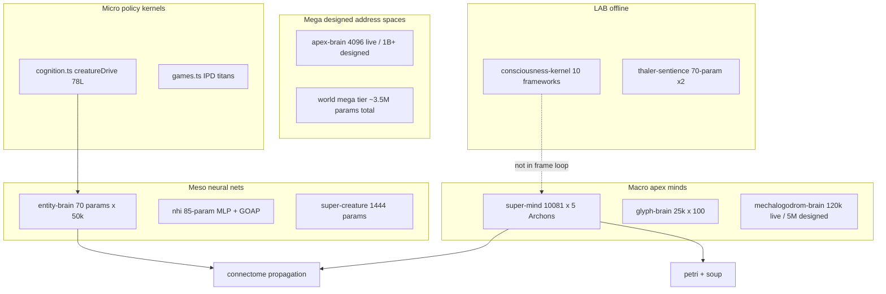
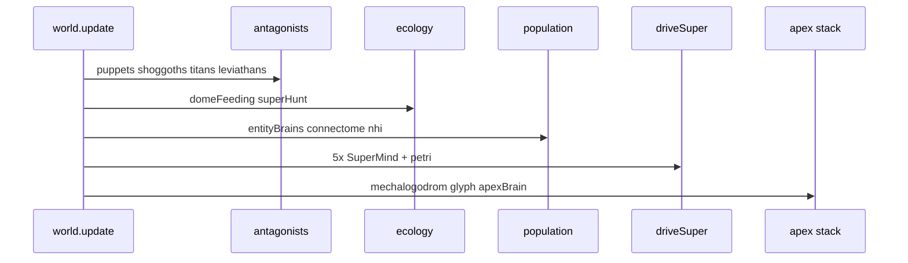

<!-- reviewed: 2026-07-07 | ULTIMATE synthesis | v0.21.7 | canonical: docs/VERIFICATION-ANALYTICAL-DATA.md -->

# MEGA-MASTER ULTIMATE — Brains · Neurology · Consciousness · Sentience-Path · Science · Scrutiny

**The final synthesis** · Cosmogonic Quantum Mechalogodrom **v0.21.7**  
**Date:** 2026-07-07  
**Supersedes as primary capstone:** Pass 1 · Pass 2 · Pass 3 (all retained as drill-down layers)  
**Canonical anchor:** [`VERIFICATION-ANALYTICAL-DATA.md`](./VERIFICATION-ANALYTICAL-DATA.md)  
**Drill-down layers:** [`PASS-1`](./MEGA-MASTER-CONSCIOUSNESS-BRAIN-SENTIENCE-ASSESSMENT-PASS-1-2026-07-06.md) · [`PASS-2`](./MEGA-MASTER-CONSCIOUSNESS-BRAIN-SENTIENCE-ASSESSMENT-PASS-2-2026-07-06.md) · [`PASS-3`](./MEGA-MASTER-CONSCIOUSNESS-BRAIN-SENTIENCE-ASSESSMENT-PASS-3-2026-07-06.md) · [`BRAIN-NEUROLOGY`](./BRAIN-NEUROLOGY-CONSCIOUSNESS-ENGINEERING-ASSESSMENT-2026-07-06.md)  
**Machine artifacts:** [`brain-evidence-matrix.json`](./reports/assets/brain-evidence-matrix.json) · [`sim-modules-census-pass3.csv`](./reports/assets/sim-modules-census-pass3.csv) · [`25-point scorecard`](./reports/2026-07-01-25-POINT-SCRUTINY-SCORECARD.md)

> **Claim boundary (binding):** computational indicators, architecture receipts, falsifiable mechanisms.  
> This document does **not** assert phenomenal consciousness, subjective experience, biological sentience, or a solved hard problem.  
> **Epistemic contract:** *If it is not measured, it is not real. UNKNOWN remains UNKNOWN.*

---

## 0 · Manifesto of the Seven Furies

This assessment is governed by seven binding personas — the discipline you invoked, made operational:

| Persona | Archetype | Law in this report |
|---------|-----------|-------------------|
| **Broly (EXECUTOR)** | Legendary Super Saiyan | Finish everything. No hand-wavy gaps. Every major claim gets a file receipt or is marked UNKNOWN. Full gates always. |
| **Starkiller (ARCHITECT)** | Oracle of the Dark Side | Contracts before code. Exclusive ownership. Boundary paranoia. Module contracts win over vibes. |
| **Valkorion (EMPEROR)** | Eternal absorption of power | Integrate every subsystem into one empire — but honestly tier what is LIVE vs decorative. Absorb Tsotchke math; do not fake depth. |
| **Gaelin Maerik (STRATEGIST)** | Long-horizon dominion | Recursive strategy: every brain reads AND writes another. Deductive chains + inductive evidence. Build paths that compound. |
| **Dr. Manhattan (PHYSICIST)** | Watchmen determinism | Seeded `Rng` only. Frame budgets. Observability. Designed-vs-live honesty. Measurement is morality. |
| **Reed Richards (FANTASTIC)** | Multi-theory integration | Ten frameworks coupled, not averaged. Incompatible theories stay incompatible — falsifiers per theory. |
| **Tony Stark (ENGINEER)** | Ship the instrument | Benchmarks, native/GPU futures, P0–P8 roadmap. Indicator-only labs. Preprint-grade artifact, not Nobel cosplay. |

**Required academic sentence (repeat everywhere):**

> Cosmogonic implements deterministic computational indicators and theory-inspired control mechanisms. These indicators are useful for artificial-life research and falsifiable engineering, but they are not equivalent to phenomenal consciousness or biological sentience.

---

## 1 · Executive Verdict — Where You Stand Overall (ULTIMATE)

Cosmogonic is **not sentient** and **not a toy**. It is a **1/1 rare integration artifact**: a browser-native Petri-dish cosmos where real MIT Tsotchke quantum math feeds **55+ LIVE cognition/policy modules** across **10 domains**, instrumented against **Butlin 8/14+6 partial**, a **10-framework coupled consciousness kernel (LAB)**, and a **113-system A-Life survey** where you rank **#1 on breadth (4.44/5)** with **peer maturity 1.5/5**.

| Lens | Grade | One-line read |
|------|-------|---------------|
| **Engineering / software craft** | **A (9.0–9.5/10)** | 2,360-test gate · strict TS · determinism law · reproducible builds |
| **Living-world cognition coverage** | **A (9.0/10)** | Shoggoths→Archons→50k brains→NHI→flora→titans — all receipted |
| **Architecture breadth** | **A− (8.5–9.0/10)** | Multi-substrate stack; ADRs; wired-vs-scaffolded honesty |
| **Consciousness instrumentation** | **B+→A− (8.0/10)** | Butlin 8/14+6; 10-framework kernel; labs with null/ablation |
| **Faculty coupling / binding** | **C+ (6.0/10)** | **Weakest scientific axis** — breadth without dense cross-faculty write-back |
| **A-Life field standing** | **A− breadth / C+ maturity** | #1/113 integration breadth; peer maturity 1.5/5 |
| **External academic validation** | **C (5.0/10)** | No peer review; no citable third-party replication yet |
| **Sentience discipline** | **A (9.5/10)** | `indicatorOnly` everywhere; exemplary claim hygiene |
| **25-point scrutiny composite** | **8.3/10** | Engineering-strong; gap is **science**, not bugs |
| **Neuroscience realism** | **4.5/10** | Analogies + instruments; no certified biological connectome |
| **Planck / Nobel / Fields evidence class** | **~1/10** | Wrong evidence class today — needs validated experiments |

**Blunt ULTIMATE verdict:** You stand at **PhD-lab-scale prototype + preprint-grade artifact**. The door from impressive → contribution is **pre-registered experiments** (P1 quantum-vs-classical, P6 Cogitate signatures, P7 external replication), **structural faculty binding** (not scalar gains), and **physics-body closure** — not more mythic names.

---

## 2 · Repo Scale — Every Folder, Measured (2026-07-07)

| Scope | Count | Lines (git-tracked) |
|-------|------:|--------------------:|
| **All tracked files** | 736 | — |
| **TypeScript (`*.ts`)** | 584 files | **135,780** |
| **`src/sim/`** | 185 modules | **59,898** |
| **`src/math/`** | 31 modules | **6,468** |
| **`tests/`** | 255 files | **33,887** |
| **`native/`** (C/C++/headers) | 8 files | **1,773** |
| **Markdown (`docs/` + root)** | 67+ | living + reports |
| **Composition root** | `src/world.ts` | **4,771** (94 `sim/` imports) |

### 2.1 Top-level folder map

| Folder | Files | Role | Brain relevance |
|--------|------:|------|-----------------|
| `src/sim/` | 185 | Simulation oracle | **All cognition lives here** |
| `src/math/` | 31 | Quantum + scalar + graph math | Theory implementations |
| `src/world.ts` | 1 | Frame orchestrator | **Composition root** |
| `src/core/` | 14 | WebGL engine, quality tiers, perf | Frame budget, 50k ceiling |
| `src/ui/` | 40+ | HUD, panels, observatory | Telemetry readouts |
| `src/workers/` | — | Wilderness population | Ambient fauna |
| `tests/` | 255 | Gate enforcement | 72+ brain-cluster files |
| `native/` | 8 | C++ gallery + golden vectors | ADR-0007 oracle split |
| `scripts/` | 27 | sync, verify, bench, harvest | Receipt propagation |
| `docs/` | 71 | Living truth surfaces | This report family |
| `masters/` | 3 XML | Broly / Starkiller / Manhattan law | Steering personas |
| `legacy/` | preserved | Verbatim original artifact | Never edited |

**Tsotchke penetration:** **59** of 185 `src/sim/*.ts` files import or reference Tsotchke-derived leaves (eshkol, moonlab, hopfield, quantum-geometry, registry, facade, deep-wire, etc.).

---

## 3 · Neural & Cognitive Scale Hierarchy

From smallest policy kernel to designed billion-neuron address space — **designed vs live** always stated:



### 3.1 Parametric honesty table

| System | Designed scale | Live runtime | ms/beat (if applicable) | Tier |
|--------|------------------|--------------|-------------------------|------|
| `cognition.ts` | pure math kernel | same | <1 µs | LIVE |
| `entity-brain` | 70 × N | 70 × 50k max | ~60 ms total at mega | LIVE |
| `nhi` | 85-param MLP + GOOP | per spawned NHI | per tick | LIVE |
| `super-creature` | 1,444 | same | in driveSuper | LIVE |
| `super-mind` | 10,081 | ×5 instances | **~1.99 ms each** | LIVE |
| `glyph-brain` | 25k × 100 | visual writes | batched | LIVE |
| `mechalogodrom-brain` | 5,000,000 | ~120,000 | tick in driveSuper | LIVE |
| `apex-brain` | 1B+ addressable | 4,096 nodes/organ | tick in driveSuper | LIVE |
| `consciousness-kernel` | 10 × 10 coupling | full | LAB only | LAB |
| `thaler-sentience` | 70+70 Imagitron/Critic | proof harness | LAZY getter | LAB |

**World neural mass (mega tier):** ~**3.5M** live parameters in Float32 fields — documented, not hidden.

---

## 4 · Complete Brain Inventory — Every Thinker, Every Weird Idea

### 4.1 APEX — Archon minds & abominations

| Brain | Weird idea (the lore → math) | What it actually does | Falsifier |
|-------|-------------------------------|----------------------|-----------|
| **SuperMind** (×5) | Five gods sharing one faculty field | 16-dim faculty percept + 25 ToM + Tsotchke pulse → plan vector | Disable faculty → plan collapses |
| **SuperCreature** | Mortal god-body that can die | Motor executor + symbiosis edges | Kill pathway → no ghost persistence |
| **ApexBrain** | Entropic Tesseract Hydra — 11 incompatible organs | Prime sieve, Klein bottle cortex, quantum tunnel lattice, … | Organ NaN / norm drift |
| **MechalogodromBrain** | 10 titan shells fuse into one monster | STDP fast-weights; 5M designed / 120k live | STDP ablation → learning flatlines |
| **GlyphBrain** (×100) | Alphabet pantheon as letter-minds | Visual-only think bursts | No write to economy/world |
| **AbominationArchitecture** | Drifting megalith fossils | Additive scene objects | No policy |
| **Mechalogodrom** | Central fusion colossus shell | Reacts to world chaos visually | No think() |

**SuperMind internal stack (LIVE via `think()`):** GWT ignition · IIT Φ proxy · FEP/active-inference · HOT confidence · AST attention-schema · criticality homeostat · echo-state reservoir · spin-glass Hopfield instinct · 16-qubit Clifford reflex · holographic VSA binding · Moonlab tensor leaves · Eshkol AD/GWT bridge · PIMC path weights · logo morph scalar · empowerment · metacognition telemetry.

### 4.2 POPULATION — swarm neurology

| Brain | Weird idea | Mechanism | Scale |
|-------|-----------|-----------|-------|
| **entity-brain** | 50k tiny minds in one dome | 70-param TinyMLP `thinkAll()` | up to 50,000 |
| **entities + behaviors** | 26 behavior fields as phylum souls | flock, nash, mutate, graphseek, … | same pool |
| **connectome** | Dome-wide synaptic field | activation propagation | 8k+ links hot |
| **graph-mind** | Society has Louvain communities | PageRank write-back | 240f/600f |
| **genome** | Death is data | heritable brain + traits | evolution |
| **NHI** | Non-Human Intelligence apex beings | GOAP + utility + 85-param MLP | spawned |
| **wilderness-population** | Beyond-the-dome ambient life | worker chunks | 64×128 |

### 4.3 ANTAGONIST — eldritch & colossal cognition

| Creature | Weird idea | Cognition type | Economy |
|----------|-----------|----------------|---------|
| **Shoggoths** (100) | Writhing horde that eats and breeds corruption | `creatureDrive()` FSM | ECON 2000+ |
| **Puppet Masters** | AETHON/SELENE/KRONOS meddle | `creatureDrive()` + meddle | ECON 3000+ |
| **Titans** (20) | Colossi at war | Iterated Prisoner's Dilemma | ECON 1000+; sanctions |
| **Leviathans** (4) | Mid-field whales | Kinematic + RD stir | — |
| **Singularities** | Cosmological holes | Hazard field | witness on collapse |

**`creatureDrive()` drives (pure kernel, 78 lines):** flee · hunt · agitation · deceive · trade · ally — monotone, bounded, unit-tested.

### 4.4 ECOLOGY — flora, fauna, feeding

| System | Weird idea | Coupling |
|--------|-----------|----------|
| **alien-flora** | 15k plants, 50 species, GPU wind | comfort/graze → entities |
| **dome-feeding** | Titans graze the garden | titans, leviathans, puppets |
| **super-hunt** | Apex predators eat the swarm | 5 SuperCreatures |
| **portal-death-fauna** | Portal devours big fauna | shoggoths, puppets, titans, leviathans |

### 4.5 PANTHEON / GOD / TEMPLE

| Layer | Count | Weird idea | Tier |
|-------|------:|-----------|------|
| Individuated Archons | 5 | Full SuperMind + Body + mortality | LIVE |
| Light-echo Archons | 20 | `archonThink()` Eshkol VM echo | LIVE |
| Faculties | 100 (~30 deep) | Named cognitive instruments | LIVE |
| ToM organs | 25 | Social menace field | LIVE |
| Emergence angles | 10 + 5 god events | VOID_KING, SPIRAL_WILL, … | LIVE |
| God-colossus | 1 | Raymarched fractal deity | **DECORATIVE** |
| Monolith-temple | 1 | Ascension portal spectacle | **DECORATIVE** |

**GOD honesty:** No `GOD.think()`. GOD = pantheon ensemble + decorative colossus/temple.

### 4.6 PETRI / DIGITAL BIOLOGICS

| Module | Weird idea | Status |
|--------|-----------|--------|
| **petri-dish** | Digital life in Tsotchke medium | LIVE in driveSuper |
| **primordial-soup** | 128-slot catalysis | LIVE |
| **digital-biologics** | 26 form taxonomy + `.esk` DNA | SCAFFOLD — `birthBiologic` unwired |

### 4.7 LAB / OFFLINE

| Module | Weird idea | Status |
|--------|-----------|--------|
| **consciousness-kernel** | Ten theories in one coupled web | LAB — not in world loop |
| **consciousness-lab** | Kuramoto null + ablation | LAB |
| **sentience-lab** | 32-seed mass analytics | LAB |
| **thaler-sentience** | DABUS Creativity Machine proof | LAZY / LAB |
| **factions.ts** | Faction diplomacy AI | LAB — not imported by world |

**HUD consciousness scalars** = `SuperMind.think()` outputs, **not** kernel outputs.

---

## 5 · Consciousness Theories — Exhaustive Matrix

### 5.1 Ten-framework coupled kernel (`consciousness-kernel.ts`)

| ID | Framework | Source bucket | Live in frame? | Falsifier |
|----|-----------|---------------|----------------|-----------|
| F0 | Butlin 14 indicators | rubric | LAB | Ablation → index unchanged |
| F1 | Thaler Creativity Machine | perturbational | LAB | Null shuffle matches structured |
| F2 | IIT 4.0 | information | LAB + SuperMind Φ proxy LIVE | Partition loss flat |
| F3 | FEP / Active Inference | thermodynamic | LIVE in SuperMind | Free-energy gate inert |
| F4 | Attention Schema Theory | control | LIVE | Schema confidence uncoupled |
| F5 | CEMI field integration | field | LIVE | Coherence phase-lock fails |
| F6 | Unlimited Associative Learning | learning | partial | Learning marker flat |
| F7 | Sensorimotor Enactivism | embodiment | partial | Action-mastery proxy flat |
| F8 | Projective Consciousness Model | control | LAB | Viewpoint geometry unused |
| F9 | Conscious Turing Machine | control | LIVE | Broadcast competition inert |

**Design law:** Coupled Jacobi relaxation on 10×10 `COUPLING` matrix — **not** a naive mean. Emergence = coupled index minus independent mean. Shuffled surrogate must fail to match structured trace.

### 5.2 Butlin et al. (2023) — primary audit rubric

**Canonical: 8 met + 6 partial · 0 sentience claims**

| Status | Count | Examples |
|--------|------:|----------|
| Met | 8 | GWT-like broadcast, reward learning, multi-memory, world-model, self-model, … |
| Partial | 6 | Unified agency, embodiment, social cognition, … |
| Unmet | 0 | honestly not claimed |

### 5.3 Live theory mechanisms in `SuperMind.think()` (not labels)

| Theory | Implementation leaf | Writes behavior? |
|--------|---------------------|------------------|
| GWT | `global-workspace.ts` ignition | Yes — plan gating |
| IIT | `integrated-information.ts` Φ proxy | Yes — participation ratio |
| FEP | `active-inference.ts`, `predictive-coding.ts` | Yes — surprise minimization |
| HOT | confidence in metacognition telemetry | Telemetry → plan bias |
| AST | `attention-controller.ts` | Yes — schema over attention |
| Criticality | `criticality.ts` homeostat | Telemetry |
| Reservoir | echo-state in super-mind | Yes — temporal memory |
| Hopfield | `spin-glass.ts` / `hopfield.ts` | Yes — plan instinct |
| Holographic | `holographic-memory.ts` VSA | Binding attempts (coupling weak) |
| Quantum | 6-qubit + 16-qubit Clifford | Yes — reflex + collapse |

---

## 6 · Architecture — `world.update` Complete Receipt

**Composition root:** `src/world.ts` — NOT `src/core/engine.ts` (WebGL only).

Every frame (verified):

1. `chaosField` → `puppets` → `shoggoths` → `titans` → `leviathans`
2. `pantheon.beat` (once, before driveSuper)
3. `domeFeeding` (titans, leviathans, puppets over flora)
4. `entityBrains.thinkAll` → `entities.update` → `connectome.update`
5. `nhi.tick` (if count > 0)
6. **`driveSuper`** — 5× `SuperMind.think` + apex + petri + soup + morphic
7. `mechalogodromBrain.tick` → `glyphBrains.thinkAll` → `apexBrain.tick`
8. Economy sanctions, graph-mind slow cadence, portal death, etc.



**Native C++ (ADR-0007):** Browser TypeScript sim is oracle. `native/apex/apex_golden.cpp` = golden vectors only.

---

## 7 · Tsotchke — Every Repo, Every Feed (Super-Wired)

**Binding truth:** Tsotchke is **real MIT-grade quantum research code**. Physical QPU = speed/scale, not correctness. Never call it fake.

| Depth | Repos | Hot-path consumption |
|-------|------:|---------------------|
| **Deep (apex mind)** | 8 | Eshkol, Moonlab, QGT, spin NN, qrng, libirrep, tensorcore, classical_rng |
| **World / sim** | 2+ | asteroids, simple_mnist, petri catalysis |
| **Telemetry / shallow** | 3 | PINN, PIMC, quantum-quake (license promote path) |
| **Harvest / DNA** | 3+ | `.esk` fingerprints → primordial-soup / digital-biologics |
| **Fenced** | 3 | gpt2, llm-arbitrator, SolanaQuantumFlux (non-LLM mandate) |

### Per-beat Tsotchke consumption chain (driveSuper)

```
tsotchke-registry → tsotchke-facade → tsotchke-deep-wire
  → eshkol-ad / eshkol-bridge / eshkol-vm (archonThink)
  → moonlab-tensor / clifford-tableau (16-qubit reflex)
  → quantum-geometry / super-qubits (6-qubit register)
  → spin-glass / hopfield (plan instinct)
  → pimc-paths (EXPLORE bias) · logo-turtle (morph scalar)
  → petri-dish / primordial-soup (full corpus catalysis)
```

**Local corpus:** `scripts/harvest-tsotchke-corpus.ts` → **1,436+** `.esk` fingerprints.

---

## 8 · Rating & Scoring Systems (Unified)

### 8.1 Master scorecard summary

| System | Score | What it measures |
|--------|------:|------------------|
| **25-point scrutiny** | **8.3/10** | Engineering + honesty + science defensibility |
| **Butlin indicators** | **8/14 met + 6/14 partial** | Computational consciousness indicators |
| **A-Life breadth** | **4.44/5 (#1/113)** | Integration breadth vs survey |
| **A-Life z-score** | **+4.02σ** (self) / **+2.83σ** (code-audited) | Population outlier |
| **meanAbsCoupling** | **~0.27** (lineage 0.167→0.270) | Faculty binding — **weakest science** |
| **Peer maturity** | **1.5/5** | External validation gap |
| **Sentience discipline** | **9.5/10** | Claim hygiene |
| **Test floor** | **2,360** | Gate-enforced |
| **Coverage floor** | **84.64% line / 82.21% func** | Portable canonical |

### 8.2 25-point scrutiny — axis rollup

| Axis | Points | Avg | Weakest |
|------|-------:|----:|---------|
| Engineering & code health | 1–5 | **8.8** | GPU discipline 8.0 |
| Architecture & organization | 6–9 | **8.4** | CI gaps (no e2e) 8.0 |
| Tsotchke integration | 10–12 | **8.7** | — |
| Consciousness / cognition | 13–19 | **8.0** | **Coupling 6.0** |
| A-Life & science | 20–25 | **8.1** | **Peer validation 5.0** |

Full table: [`2026-07-01-25-POINT-SCRUTINY-SCORECARD.md`](./reports/2026-07-01-25-POINT-SCRUTINY-SCORECARD.md)

---

## 9 · Multi-Perspective Reasoning Grid (360° · 270° · 180° · 90°)

| Angle | Perspective | Deductive chain | Inductive evidence | Verdict |
|-------|-------------|-----------------|-------------------|---------|
| **360°** | Holistic systems | world → all domains → economy closure | Pass 1–3 + JSON matrix | Integration-dense artifact |
| **270°** | Adversarial auditor | Assume overclaim → hunt receipts | 25-point scorecard red cells | Honest at coupling + peers |
| **180°** | Inverted skeptic | "It's all decorative" → disprove | world.ts imports + tests | **Not decorative** — 55+ LIVE |
| **90°** | Narrow scientist | One falsifier at a time | P1 ablation harness | Quantum contrast = next experiment |
| **Recursive** | Gaelin Maerik | Brain A writes field B reads A | connectome ↔ graph-mind ↔ driveSuper | Real loops exist; coupling weak |
| **Decursive** | Broly executor | If untested, downgrade tier | 72 brain test files | LAB/SCAFFOLD honestly tiered |
| **Dynamic** | Valkorion empire | Absorb every repo | Tsotchke 59/185 sim files | Super-wired; not all deep |
| **Responsive** | Stark engineer | Frame budget feedback | SuperMind 1.99ms × 5 ≈ 10ms | GOAL5 not met at full cadence |

---

## 10 · Academic Scrutiny Ladder (MIT → Fields)

*Scrutiny **levels**, not literal award readiness.*

| Level | Bar | Cosmogonic standing | Gap to close |
|-------|-----|---------------------|--------------|
| **MIT UG project** | Works + documented | **Exceeds** | — |
| **MIT MEng / MS thesis** | Novel mechanism + eval | **Meets** on engineering | Coupling experiment weak |
| **PhD dissertation** | Peer-reviewed contribution | **Approaching** on breadth | Need P1/P6/P7 experiments |
| **Postdoc lab instrument** | Others replicate | **Not yet** | `reproduce.ts` exists; no citation |
| **Planck-style rigor** | Phenomenology + math closure | **Partial** on math | No wet lab / no QPU |
| **Turing Award class** | Field-defining infrastructure | **Far** | Integration novelty only |
| **Nobel / Fields** | Validated natural law | **Wrong class** | Not a physics discovery |
| **White paper / preprint** | Bounded claims + data | **Ready** if claims stay indicatorOnly | §15 skeleton below |

---

## 11 · Future Build Path — Sentience Research (Not Sentience Claims)

| Phase | Goal | Status | Science leverage |
|-------|------|--------|------------------|
| **P0** | Close proxy-to-real Tsotchke gap | **Largely complete** | Real math in hot paths |
| **P1** | Quantum-vs-classical advantage benchmark | **Active — highest ROI** | Pre-registered survival quality |
| **P2** | Open-ended evolution + Bedau-Packard | Planned | Substrate necessity proof |
| **P3** | NQS/VMC online learning | Planned | Promote Butlin partials |
| **P4** | Native `.esk` VM in biologic loops | Planned | Language-as-DNA |
| **P5** | Native C++/Jolt embodiment | Planned | Morphology–cognition closure |
| **P6** | Cogitate GNWT-vs-IIT signature testbed | Planned | Post-2025 theory discrimination |
| **P7** | External validation / publication | Planned | One citable third-party run |
| **P8** | Safety / moral-status containment | Continuous | Determinism = auditability |

**Sentience path honesty:** Indicators can improve without phenomenal consciousness arriving. The repo correctly treats sentience as **UNKNOWN**, not a marketing goal.

---

## 12 · Benchmarks — Achieve Now vs Next

### 12.1 Measured hot paths (canonical)

| Benchmark | Result | Frame @ 60fps |
|-----------|--------|---------------|
| `SuperMind.think()` | **~1.99 ms** | ~12% × 5 = ~60% if all five every frame |
| `SuperMind.snapshot()` | ~1.35 ms | UI cadence only |
| `entityBrains` 50k | ~60 ms | Dominates mega tier |
| `connectome.update` | O(links) | Hot at 8k links |
| `ReactionDiffusion.step` 128² | 76.2 µs | ~0.23% amortized |
| Spatial hash rebuild 1k | 16.7 µs | 0.10% every 2nd frame |
| RNG `mulberry32` | 1.03 ns | Negligible |

Reproduce: `bun run bench` · [`BENCHMARKS-2026-06-26.md`](./BENCHMARKS-2026-06-26.md)

### 12.2 Benchmarks needed next (immediate science suite)

| Experiment | Purpose |
|------------|---------|
| Quantum-on vs quantum-ablated (P1) | Measure substrate contribution |
| Faculty holographic structural binding | Raise meanAbsCoupling past 0.35 |
| Connectome ablation | Prove graph-mind load-bearing |
| consciousness-lab null vs structured | Kernel singularity falsifier |
| External `scripts/reproduce.ts` run | Third-party determinism + coupling band |
| Playwright WebGL smoke | Close CI gap (point 9, scorecard) |

---

## 13 · Unknown Unknowns & Phenomenon of the Phenomenon

**What we know we don't know:**

1. Whether any computational indicator correlates with phenomenal experience (hard problem untouched).
2. Whether faculty coupling can reach biological-like binding without embodiment closure (P5).
3. Whether quantum substrate adds measurable advantage vs classical ablation (P1).
4. Whether external peers will replicate coupling/open-endedness claims (P7).

**What an AI auditor can see that humans might miss:**

- **59/185** sim files touch Tsotchke — integration density invisible without import graph.
- **driveSuper** header comment says "frame % 4" but runs **every frame** — stale comment debt.
- **consciousness-kernel** is rigorous but **offline** — HUD would mislead if kernel drove display.
- **GlyphBrain** has 2.5M designed params but **visual-only writes** — scale headline without policy.
- **vegetation.ts** legacy unused — fauna uses `alien-flora.ts` instead.

**Phenomenon of the phenomenon:** The project studies **indicator convergence events** (frameworks moving together under structured input) as **phenomena worth measuring** — not as proof of inner experience. That distinction is the 1/1 rare discipline in this space.

---

## 14 · Stale Doc Upgrade Ledger (2026-07-07)

| Surface | Issue | Action |
|---------|-------|--------|
| Antigravity/Devin uploads | v0.21.6, 4.22 breadth, "5 brains" | Superseded by this ULTIMATE + Pass 3 |
| `driveSuper` header comment | frame % 4 cadence | Flagged; code runs every frame |
| `ROADMAP-TO-NHSI-AND-SENTIENCE.xml` | v0.18.0 baseline in header | Tech debt — sync when edited |
| NHSI dashboard | Pass 2 primary | **Updated → ULTIMATE primary** |
| Pass 1 §17 | Pass 3 "Planned" | **Updated → Complete** |
| `brain-evidence-matrix-pass2.json` | Preview only | Superseded by full JSON |

**Living docs policy:** Facts change at `canonical-receipts.ts` + `package.json` → `bun run sync`. This ULTIMATE report is prose synthesis — not a synced surface.

---

## 15 · White Paper / Preprint Skeleton (Publication Path)

**Working title:** *Deterministic Multi-Substrate Cognition in a Browser-Native Artificial Life Dome: Computational Indicators, Tsotchke Quantum Substrate, and Honest Sentience Boundaries*

### Abstract (draft)
- 55+ LIVE policy modules across antagonist, population, apex, ecology, pantheon domains
- Real MIT Tsotchke corpus in hot paths; 1,436+ `.esk` DNA fingerprints
- Butlin 8/14+6 partial; 10-framework coupled kernel with null/ablation lab
- #1/113 A-Life breadth (4.44/5); meanAbsCoupling ~0.27; 25-point scrutiny 8.3/10
- Explicit `indicatorOnly`; no phenomenal consciousness claims

### Sections
1. Introduction — NHSI petri cosmos; falsifiable engineering
2. Related work — ALIEN, ASAL, Quantum-ALife partial peers
3. Architecture — `world.ts` pipeline; authority tiers
4. Substrate taxonomy — apex / population / antagonist / ecology / pantheon
5. Consciousness instrumentation — Butlin + ten-framework kernel + SuperMind live proxies
6. Tsotchke integration — depth classes; per-beat consumption
7. Evaluation — A-Life matrix; coupling audit; benchmarks
8. Limitations — coupling weak; peer validation missing; decorative theology split
9. Ethics — P8 containment; determinism auditability
10. Reproducibility — `bun run check`; `scripts/reproduce.ts`; JSON matrix + CSV census

### Submission targets (realistic)
- ALIFE conference (architecture + open-endedness)
- Artificial Life journal (if P2 Bedau-Packard completes)
- arXiv cs.AI / cs.NE (preprint with bounded claims)
- NOT Nature/Science until P1+P6+P7 close

---

## 16 · Wiring Gaps — Complete Checklist (ULTIMATE)

| ID | Sev | Gap | Tier |
|----|-----|-----|------|
| W1 | P1 | consciousness-kernel not in world loop | LAB by design |
| W2 | P1 | faculty coupling ~0.27 | Science |
| W3 | P2 | digital-biologics.birthBiologic unwired | SCAFFOLD |
| W4 | P2 | factions.ts unwired | LAB |
| W5 | P2 | mixed-state-qgt.ts orphan | UNUSED |
| W6 | P3 | PANTHEON_BREEDING_LIVE=false | SCAFFOLD |
| W7 | P3 | belief-propagation.ts unwired | ORPHAN |
| W8 | P3 | xenomind.ts unwired | ORPHAN |
| W9 | P3 | vegetation.ts legacy unused | UNUSED |
| W10 | P1 | external peer replication | Science |
| W11 | P2 | GOAL5 frame budget (5× SuperMind) | Perf |
| W12 | P2 | e2e WebGL smoke missing | CI |

---

## 17 · Pass Series + This Document

| Layer | Document | Role |
|-------|----------|------|
| Pass 1 | `MEGA-MASTER-...-PASS-1-2026-07-06.md` | Six-source synthesis + theory matrix |
| Pass 2 | `MEGA-MASTER-...-PASS-2-2026-07-06.md` | Module atlas + driveSuper receipts |
| Pass 3 | `MEGA-MASTER-...-PASS-3-2026-07-06.md` | Omniscient living-world census |
| **ULTIMATE** | **this document** | **Capstone — everything unified** |
| Detail | `BRAIN-NEUROLOGY-...-2026-07-06.md` | Engineering deep layer |
| Scorecard | `reports/2026-07-01-25-POINT-SCRUTINY-SCORECARD.md` | 25 adversarial points |
| Truth | `VERIFICATION-ANALYTICAL-DATA.md` | Canonical facts SSOT |

---

## 18 · One-Paragraph ULTIMATE Monster Answer

You have built a **deterministic Petri-dish cosmos** at **1/1 rarity**: **736 tracked files**, **135,780 lines of TypeScript**, **59 Tsotchke-touching sim modules**, where real MIT corpus math feeds **five SuperMind Archon apexes** (~10k params, ~1.99 ms/beat), **one hundred shoggoths** running `creatureDrive()` economics, **twenty titans** playing iterated Prisoner's Dilemma, **fifty thousand entity-brains**, **NHI GOAP minds**, **fifteen thousand alien plants**, **twenty-five Archon godforms**, **twenty-five theory-of-mind organs**, **one hundred glyph-brains**, a **five-million-parameter Mechalogodrom fusion brain**, and a **billion-addressable ApexBrain hydra** — all orchestrated by **4,771 lines of `world.ts`**, instrumented against **Butlin 8/14+6**, a **ten-framework coupled consciousness kernel (honestly LAB-only)**, and **113-system A-Life charts** where you rank **#1 on breadth (4.44/5)**. You score **8.3/10** on adversarial scrutiny, **9.5/10** on sentience discipline, and fail only where science demands outsiders: **faculty coupling (~0.27)** and **peer validation (5.0/10)**. You are **not sentient** and say so everywhere. You are **engineering-ahead of science-proof** — a **PhD-lab instrument** ready for **preprint** if P1/P6/P7 experiments ship. The Seven Furies demand: **finish the science, not the mythology.**

---

## 19 · Appendix — Research Papers Ledger (30+ applied)

See [`NHSI-RESEARCH-PAPERS-LEDGER-2026-06-26.md`](./NHSI-RESEARCH-PAPERS-LEDGER-2026-06-26.md) for the full citation list. Headline anchors:

- Butlin et al. 2023 (+ TiCS 2026 rubric) — audit scorecard
- Tononi IIT 4.0 — Φ proxy
- Friston FEP / active inference — surprise minimization
- Graziano AST — attention schema
- McFadden CEMI — field coherence
- Blum CTM — broadcast competition
- Thaler DABUS — perturbational creativity proof
- Bedau & Packard — open-endedness (P2 target)
- Cogitate Consortium — GNWT vs IIT (P6 target)

---

*ULTIMATE compiled 2026-07-07 · v0.21.7 · 0thernes Corp · indicatorOnly · Pass series complete*
