# Architecture Assessment — Cosmogonic Quantum Mechalogodrom

**Audit date:** 2026-06-13 · **Version:** 0.9.0 · **Scope:** whole-repo layering, module
dependency graph, the PHILOSOPHY "reads-AND-writes" coupling law, module ownership/boundary
discipline, god-module risk, and ADR coverage versus the shipped code.

> Grounding: this assessment is read against the two binding maps —
> [`docs/MODULE-CONTRACTS.md`](../MODULE-CONTRACTS.md) (V1 + V2 + 0.2.1 amendments + V3 Pantheon)
> and [`docs/ARCHITECTURE.md`](../ARCHITECTURE.md) — and the three MASTER FILES they descend from
> (THE EXECUTOR, THE ARCHITECT, THE PHYSICIST). Where the contract and the code disagree, the
> contract wins and the divergence is logged as a finding. Citations are `file:line` against the
> 0.9.0 tree.

---

## 1. Layered architecture overview

The runtime module graph is **acyclic by design** and stratified into seven tiers. The single law
that holds it together: dependencies point **down and inward** — leaves never reach up, presentation
never reaches sideways into simulation except through the composition root.

| #   | Layer                       | Directory / files                                    | DOM?        | Role                                                                                                                                                                                                                      | Representative units                                                                            |
| --- | --------------------------- | ---------------------------------------------------- | ----------- | ------------------------------------------------------------------------------------------------------------------------------------------------------------------------------------------------------------------------- | ----------------------------------------------------------------------------------------------- |
| 0   | **Math determinism leaves** | `src/math/*`                                         | No          | Pure, allocation-free primitives; the only legal randomness (`Rng`) lives here. No runtime import of `types.ts`.                                                                                                          | `rng.ts`, `scalar.ts`, `spatial-hash.ts`, `quantum.ts` (statevector), `games.ts`, `heap.ts`     |
| 1   | **Data leaves**             | `sim/constants.ts`, `audio/songs.ts`                 | No          | Frozen facts (arena geometry, weather table, song data). Owned by no behavioral module.                                                                                                                                   | `WEATHERS`, `MONOLITH_CONFIG`, `SONGS`                                                          |
| 2   | **Simulation systems**      | `src/sim/*`                                          | No          | The cosmos: entities, macro-agents, environment, mind/quantum/analytics, render-bridge. Each reads and writes another sim system.                                                                                         | `EntityManager`, `TitanSystem`, `EnvironmentSystem`, `QuantumCloud`, `GraphMind`, `Viz3DSystem` |
| 3   | **Engine / world spine**    | `core/engine.ts`, `core/quality.ts`, `world.ts`      | core only   | `Engine` owns renderer/scene/camera; `quality.ts` resolves the tier ladder; `world.ts` is the **composition root** — builds the `SimContext`, instantiates every system, implements `UiActions`, runs the frame pipeline. | `Engine`, `World`, `detectQuality`                                                              |
| 4   | **Audio**                   | `src/audio/*`                                        | engine only | Web-Audio synthesis + spectral analysis; `analysis.ts` taps the gain busses and fans 4 bands back into the sim.                                                                                                           | `AudioEngine`, `AudioAnalysis`, `SONGS`                                                         |
| 5   | **UI / presentation**       | `src/ui/*`                                           | Yes         | HUD, panels, input, observatory. Read-only consumers of telemetry; the one tier exempt (de facto) from the write half of the philosophy law.                                                                              | `Hud`, `TelemetryPanel`, `InputSystem`, `Observatory`                                           |
| 6   | **Persistence + I/O edge**  | `logging/*`, `memory/*`, `server.ts`, `src/server/*` | mixed       | Audit ring, log ring, persisted state, and the Bun fullstack server + copilot/sandbox. The only network and filesystem boundary.                                                                                          | `AuditTrail`, `MemoryStore`, `server.ts`, `copilot.ts`, `ai-sandbox.ts`                         |

**Enforced invariants (from `docs/ARCHITECTURE.md` §Design rules):**

1. **Acyclic runtime graph.** `src/types.ts` is a type-only hub; `verbatimModuleSyntax` erases its
   edges at emit, so it is correctly omitted from the dependency graph.
2. **Leaves are DOM-free.** `math/*`, `logging/logger.ts`, `sim/constants.ts`, `audio/songs.ts` run
   under `bun test` with no browser. Browser globals are confined to tiers 3–6.
3. **Composition root owns wiring.** Only `world.ts` constructs the `SimContext` and fans systems
   together; systems talk to each other through `SimContext` (shared `SimState`, `SpatialHash`,
   `Rng`) and explicit constructor references — never by reaching into a sibling's module scope.
4. **Determinism.** One `mulberry32` stream seeded from `PersistedState.seed`; `Math.random` and
   `Date.now` are banned in sim logic.

**Overall posture:** the layering is clean and genuinely enforced, not aspirational. The dependency
direction is respected everywhere; the weak spots are not cycles but (a) a handful of orphaned
subsystems that violate the _reads-AND-writes_ law, (b) two oversized "god" modules, and (c) several
contract-vs-code drifts. These are detailed in §3 and §5–§7.

---

## 2. Module dependency / layering diagram

Built from `DEP_DATA` (the per-unit `imports`/`exports`/`reads`/`writes`) and cross-checked against
the `world.ts` wiring in `docs/ARCHITECTURE.md`. Solid arrows are **construction/import** edges
(static dependency); dotted arrows are **runtime feedback** couplings (the philosophy web — A reads
or writes B's live state at runtime without a hard import).

```mermaid
graph TD
  classDef leaf fill:#06283d,stroke:#0ef,color:#bde6ff;
  classDef sim fill:#0a1a2f,stroke:#3a7,color:#cfe;
  classDef spine fill:#1a1030,stroke:#a7f,color:#e7d9ff;
  classDef ui fill:#2a1020,stroke:#f7a,color:#ffd9e7;
  classDef io fill:#241a06,stroke:#fa0,color:#ffe9bd;

  subgraph L0["L0 · math leaves (pure, DOM-free)"]
    rng["rng.ts<br/>mulberry32 · Rng"]:::leaf
    scalar["scalar.ts"]:::leaf
    shash["spatial-hash.ts"]:::leaf
    qreg["quantum.ts<br/>QuantumRegister"]:::leaf
    games["games.ts<br/>PD · replicator"]:::leaf
    heap["heap.ts"]:::leaf
  end

  subgraph L1["L1 · data leaves"]
    constants["sim/constants.ts"]:::leaf
    songs["audio/songs.ts"]:::leaf
  end

  subgraph L2["L2 · simulation systems"]
    entities["entities.ts<br/>EntityManager"]:::sim
    behaviors["behaviors.ts"]:::sim
    instanced["instanced-entities.ts"]:::sim
    morph["morphotypes.ts / phyla.ts"]:::sim
    shog["shoggoths.ts"]:::sim
    puppets["puppet-masters.ts"]:::sim
    titans["titans.ts<br/>TitanSystem"]:::sim
    leviathans["leviathans.ts"]:::sim
    factions["factions.ts + ai/brains.ts<br/>(orphaned)"]:::sim
    env["environment.ts<br/>EnvironmentSystem"]:::sim
    atmos["atmosphere.ts"]:::sim
    weather["weather.ts"]:::sim
    singular["singularities.ts"]:::sim
    rd["reaction-diffusion.ts"]:::sim
    quantum["quantum.ts<br/>QuantumCloud"]:::sim
    qcirc["qcircuit.ts"]:::sim
    connectome["connectome.ts"]:::sim
    graphmind["graph-mind.ts"]:::sim
    analytics["analytics.ts"]:::sim
    constell["constellations.ts"]:::sim
    lore["lore.ts"]:::sim
    artifacts["artifacts.ts"]:::sim
    viz3d["viz3d.ts<br/>Viz3DSystem"]:::sim
    genome["genome.ts / lineage.ts<br/>(orphaned)"]:::sim
  end

  subgraph L3["L3 · engine + world spine"]
    quality["core/quality.ts"]:::spine
    engine["core/engine.ts<br/>Engine"]:::spine
    world["world.ts<br/>composition root"]:::spine
    main["main.ts<br/>(entrypoint)"]:::spine
  end

  subgraph L4["L4 · audio"]
    aengine["audio/engine.ts<br/>AudioEngine"]:::sim
    analysis["audio/analysis.ts<br/>AudioAnalysis"]:::sim
  end

  subgraph L5["L5 · UI / presentation"]
    input["ui/input.ts"]:::ui
    hud["ui/hud.ts"]:::ui
    panels["ui/panels.ts"]:::ui
    graphs["ui/graphs.ts"]:::ui
    observ["ui/observatory.ts<br/>Observatory"]:::ui
    copilot["ui/copilot.ts"]:::ui
  end

  subgraph L6["L6 · persistence + I/O edge"]
    logger["logging/logger.ts"]:::io
    audit["logging/audit.ts"]:::io
    store["memory/store.ts"]:::io
    server["server.ts (Bun.serve)"]:::io
    srvcopilot["server/copilot.ts"]:::io
    sandbox["server/ai-sandbox.ts"]:::io
  end

  %% --- static import edges (down/inward) ---
  main --> world
  world --> engine & quality & store & audit
  world --> entities & titans & env & quantum & qcirc & connectome & graphmind & analytics & constell & viz3d & instanced & atmos & singular & rd & shog & puppets & weather
  world --> aengine & analysis & input & hud & panels & observ

  entities --> behaviors
  behaviors --> scalar & constants
  morph --> constants
  morph --> phylaNote["phyla"]:::sim
  titans --> games
  titans --> scalar & rng
  titans --> brainsNote["ai/brains"]:::sim
  env --> constants & scalar & rng
  weather --> engine
  singular --> entities
  qcirc --> qreg
  graphmind --> connectome & entities
  connectome --> qreg
  constell --> lore
  analysis --> aengine
  aengine --> songs
  panels --> graphs
  viz3d --> scalar & constants
  observ --> analytics
  server --> srvcopilot & sandbox & logger
  srvcopilot --> sandbox

  %% --- runtime feedback couplings (philosophy web) ---
  entities -. "onDeath(x,z) → perturb" .-> rd
  titans -. "waste scars → perturb · entropy relief ←" .-> rd
  titans -. "conscription remorph · entropy feed" .-> entities
  qcirc -. "bands()→setQuantumBands · collapse→implodeAt" .-> quantum
  puppets -. "PuppetEvent → gate seq" .-> qcirc
  graphmind -. "setCommunityOf · setGroup" .-> connectome
  rd -. "DataTexture → emissiveMap" .-> env
  analysis -. "bass → setAudioBass" .-> env
  analysis -. "treble → cell pulse" .-> constell
  analysis -. "level → setBreath" .-> quantum
  analytics -. "record('omen') |z|>2.5" .-> audit
  viz3d -. "reads ledger/warMatrix/phylumCounts" .-> titans
  atmos -. "reads bass + qEntropy" .-> analysis
  instanced -. "sync(list) last in frame" .-> entities
  audit -. "POST /api/audit" .-> server
```

**Reading the graph:**

- Every **solid** edge points down a layer or inward to a leaf — the acyclic invariant holds.
- The **dotted** web is where the PHILOSOPHY _reads-AND-writes_ law lives. It is dense and real:
  the RD field is the central hub (deaths scar it, titans feed it, it lights the ground), and audio
  bands fan out to exactly three couplings (env / constellations / quantum), matching the 0.2.1
  contract.
- Two nodes are drawn but **dangle with no live edge in or out**: `factions.ts + ai/brains.ts`
  and `genome.ts / lineage.ts`. They are built and tested but unwired (§3, §5).

---

## 3. Reads ↔ Writes system-coupling matrix (PHILOSOPHY law validation)

PHILOSOPHY rule 4: _every system READS from at least one other system AND WRITES to at least one
other system._ The matrix below distills each unit's `reads`/`writes` from `DEP_DATA`. **Verdict
column** flags any unit that is read-only, write-only, or fully isolated.

| Unit                                                                                  | Reads (live, from)                                                                      | Writes (live, to)                                                                                                                          | Verdict                                                |
| ------------------------------------------------------------------------------------- | --------------------------------------------------------------------------------------- | ------------------------------------------------------------------------------------------------------------------------------------------ | ------------------------------------------------------ |
| **core-spine / `world.ts`**                                                           | Input, AudioAnalysis, every sim system, `Engine.camera`                                 | `SimState`, camera, EntityManager, RD, Atmosphere, Audio, qcircuit, singularities, titans, MemoryStore, AuditTrail, HUD/panels/observatory | ✅ R+W (it is the hub)                                 |
| **`EntityManager` (entities)**                                                        | grid, `SimState`, morphs                                                                | scene meshes, `onDeath`→RD perturb, telemetry counts                                                                                       | ✅ R+W                                                 |
| **macro-agents (`titans`/`puppets`/`shoggoths`)**                                     | entities, grid, `SimState`, singularities, RD energy, audio, quantum collapse, lore     | entities (dispose/spawn/remorph), `SimState`, RD perturb, audit, HUD toasts, telemetry, sfx                                                | ✅ R+W                                                 |
| **environment-cosmology (`environment`/`atmosphere`/`weather`/`singularities`/`rd`)** | `SimState` (chaos/weather/wind/temp/frame), QuantumCloud entropy, audio bands, entities | `Engine` exposure/fog, `SimState`, entity velocity/material, RD U/V fields, ground emissiveMap                                             | ✅ R+W                                                 |
| **`QuantumCloud` (quantum)**                                                          | qcircuit bands, audio level (setBreath), `SimState`                                     | particle colors/size, collapse/respawn, implodeAt                                                                                          | ✅ R+W                                                 |
| **`QuantumCircuitSystem` (qcircuit)**                                                 | PuppetEvents, sort swaps, `SimState.chaos`                                              | entropy/collapse scalar, `bands()`→QuantumCloud                                                                                            | ✅ R+W                                                 |
| **`Connectome`**                                                                      | entity ids/positions                                                                    | link geometry; receives `setCommunityOf` from GraphMind                                                                                    | ✅ R+W                                                 |
| **`GraphMind`**                                                                       | `connectome.pairs`, entities                                                            | `connectome.setCommunityOf`, entity `setGroup`                                                                                             | ✅ R+W                                                 |
| **`AnalyticsSystem`**                                                                 | telemetry rings (pop/energy/links)                                                      | `audit.record('omen', …)`, `trendPerMin`                                                                                                   | ✅ R+W                                                 |
| **`Viz3DSystem` (render-bridge)**                                                     | phylumCounts, titan ledger + warMatrix, `quality.maxEntities`                           | THREE.Scene render graph (own meshes/network)                                                                                              | ✅ R+W (writes the scene, not a sim system — see note) |
| **Audio (`AudioEngine`/`AudioAnalysis`)**                                             | `SimState.songIdx`, gain busses                                                         | `SimState.songIdx`, audio output, `AudioBands` consumed by env/constellations/quantum                                                      | ✅ R+W                                                 |
| **`LoreEngine`**                                                                      | seed (pure leaf)                                                                        | names consumed by constellations/titans/analytics omens                                                                                    | ✅ effectively R+W via consumers                       |
| **`ArtifactField` (artifacts)**                                                       | —                                                                                       | placed relics; `influenceAt` is **dead** (no consumer)                                                                                     | ⚠️ **WRITE-ONLY** — fails the law                      |
| **`Observatory` (ui-observatory)**                                                    | telemetry snapshot, CSS theme tokens                                                    | own canvas pixels only — **no sim write-back**                                                                                             | ⚠️ **READ-ONLY** — HUD exemption (undeclared)          |
| **`Hud` / `TelemetryPanel` / `graphs` (ui-shell)**                                    | telemetry snapshot                                                                      | DOM only                                                                                                                                   | ⚠️ **READ-ONLY** — HUD exemption (undeclared)          |
| **`factions.ts` + `ai/brains.ts`**                                                    | nothing live                                                                            | nothing live                                                                                                                               | ❌ **ISOLATED** — orphaned, fails the law              |
| **`genome.ts` / `lineage.ts`**                                                        | nothing live                                                                            | nothing live                                                                                                                               | ❌ **ISOLATED** — orphaned, V9 unwired                 |
| **markup (`index.html`/`app.css`)**                                                   | none                                                                                    | none directly (UI writers mutate it)                                                                                                       | n/a — presentation shell                               |

### Flagged systems — failures and exemptions

- **❌ `factions.ts` + `ai/brains.ts` (isolated).** Implemented and unit-tested but never wired into
  the running world (`decideFaction` at `src/sim/factions.ts:217`; the intended wiring at
  `src/world.ts:269-320` does not call it). This is the trophy-shelf orphan the manifesto explicitly
  forbids. Determinism is unaffected (nothing draws from the seeded stream), but the documented
  faction→steering feedback loop into the organisms does not exist. **`AI-SUBSYSTEM.md` describes it
  in the present tense and overstates completion.** Inside `brains.ts`, `softmaxPick` (`:44`),
  `goapPlan` (`:192`), and `MemoryRing` (`:267`) have no production consumer.
- **❌ `genome.ts` / `lineage.ts` (isolated).** Whole V9 genetics subsystem built and tested but
  wired into nothing (intended site `src/world.ts:250-268`); offspring inherit nothing. **HIGH** —
  either wire per V9 or record the deferral in the contract/ROADMAP.
- **⚠️ `ArtifactField` (write-only).** Places relics but `influenceAt` (`src/sim/artifacts.ts:162`)
  is dead — nothing reads the influence it computes, so the system writes the world but never reads
  it back. Wire `influenceAt` into a consumer or document it as a visual-only exception.
- **⚠️ Observatory / HUD / panels (read-only).** These are pure presentation. A read-only HUD is a
  _reasonable_ exemption, but the rule as written in PHILOSOPHY.md is **universal**, so the exemption
  is currently **implicit and undeclared** (`src/ui/observatory.ts:690-783`). The Observatory even
  computes derived signals (Shannon H, war intensity, flux) it could surface back to the world.
  **Recommendation:** carve the read-only UI tier (observatory, hud, panels, graphs) out of the
  bidirectional rule explicitly in MODULE-CONTRACTS.md / PHILOSOPHY.md, OR feed one derived signal
  back to close the loop.

> **Net:** the philosophy web is genuinely implemented across the _sim_ tier — the dotted graph in §2
> is not decoration. The law is violated in exactly four places: two orphans (must wire or
> formally defer), one write-only relic field, and the UI tier (needs an explicit carve-out).

---

## 4. `src/` scaffolding / hierarchy tree

```mermaid
graph TD
  src["src/"]
  src --> coreD["core/"]
  src --> mathD["math/"]
  src --> simD["sim/"]
  src --> simAI["sim/ai/"]
  src --> audioD["audio/"]
  src --> uiD["ui/"]
  src --> logD["logging/"]
  src --> memD["memory/"]
  src --> srvD["server/"]
  src --> roots["world.ts · main.ts · types.ts · docs-page.ts"]

  coreD --> coreF["engine.ts · quality.ts"]
  mathD --> mathF["rng.ts · scalar.ts · spatial-hash.ts<br/>quantum.ts · games.ts · heap.ts"]

  simD --> simCore["constants.ts · geometry-cache.ts<br/>morphotypes.ts · phyla.ts · algorithms.ts<br/>behaviors.ts · entities.ts · instanced-entities.ts"]
  simD --> simAgents["shoggoths.ts · puppet-masters.ts<br/>titans.ts · leviathans.ts · factions.ts"]
  simD --> simEnv["environment.ts · atmosphere.ts · weather.ts<br/>singularities.ts · reaction-diffusion.ts"]
  simD --> simMind["quantum.ts · qcircuit.ts · connectome.ts<br/>graph-mind.ts · analytics.ts · constellations.ts<br/>lore.ts · artifacts.ts · viz3d.ts"]
  simD --> simGen["genome.ts · lineage.ts  ⟂ orphaned"]
  simAI --> simAIF["brains.ts  ⟂ orphaned"]

  audioD --> audioF["engine.ts · songs.ts · analysis.ts"]
  uiD --> uiF["input.ts · hud.ts · panels.ts<br/>graphs.ts · observatory.ts · copilot.ts"]
  logD --> logF["logger.ts · audit.ts"]
  memD --> memF["store.ts"]
  srvD --> srvF["copilot.ts · ai-sandbox.ts"]
```

`src/` holds **55 TypeScript modules** across 9 directories. The grouping is functionally coherent —
`sim/` is the heaviest at ~30 modules and would benefit from the conceptual sub-grouping shown above
(core / agents / environment / mind), though no physical sub-foldering is required by the contract.
The two `⟂ orphaned` clusters (`genome`/`lineage`, `ai/brains`) are the only structural dead weight.

---

## 5. Module-ownership & boundary findings

The ARCHITECT mandates **exclusive file ownership** and **boundary paranoia** — a writer codes
against the contract sight-unseen, so any drift between the contract signature and the shipped
signature is a latent integration failure.

| #   | Finding                                                                                                                              | File:line                                     | Severity | Discipline breached                                            |
| --- | ------------------------------------------------------------------------------------------------------------------------------------ | --------------------------------------------- | -------- | -------------------------------------------------------------- |
| O1  | `EntityManager.list` is a public **mutable** `Entity[]`, not a `readonly`/`ReadonlyArray` view                                       | `src/sim/entities.ts:82`                      | medium   | exclusive ownership / encapsulation                            |
| O2  | `EntityManager.onDeath` ships as `((x,z)=>void)\|null` but the 0.2.1 contract declares `((e:Entity)=>void)\|null`                    | `src/sim/entities.ts:97`                      | medium   | contract-wins (sight-unseen integration)                       |
| O3  | `simple-statistics` imported by **two** modules, breaking the "single owned facade" invariant of ADR 0005                            | `src/ui/observatory.ts:55` (+ `analytics.ts`) | medium   | one-owner-per-dependency facade                                |
| O4  | `POINT_LIGHT_GAIN` / `LEGACY_LIGHT_GAIN` owned by the heavy `environment.ts` and imported as runtime values by 3 sibling sim modules | `src/sim/environment.ts:50`                   | low      | shared facts belong in the leaf, owned by no behavioral module |
| O5  | `environment.ts` contract block is stale — omits `setAudioBass` and `attachGroundEmissiveMap` it now owns                            | `src/sim/environment.ts:438-440, 681-699`     | low      | contract enumerates the binding surface                        |
| O6  | `snapshot()` calls `hud.setLore()` as a UI side effect inside a pure-ish refill accessor, >1×/frame                                  | `src/world.ts:870`                            | low      | data-vs-presentation boundary                                  |
| O7  | `setAlgo` contract drift (`swapped:boolean` vs `swaps:number`); `setLore` missing from the hud contract                              | `src/ui/hud.ts`                               | info     | contract-wins                                                  |
| O8  | `PANEL_Y=220` hardcodes clearance over a "~90u titan roam ceiling" it neither imports nor can see change                             | `src/sim/viz3d.ts:43-47`                      | info     | cross-module magic-number coupling                             |

**Key boundary observations:**

- **O1 (entities.list).** The raw backing array is the canonical read path for ~30 reader sites. The
  population-array invariant (index order is meaningful to the sorting field — see the doc comment at
  `entities.ts:81`) is enforceable only by convention; one in-place sort from any reader would desync
  rendering, the grid, and death accounting with no compile-time guard. Fix: expose
  `get list(): readonly Entity[]` backing a private array — current readers only index/iterate, so
  it is source-compatible.
- **O2 + O3 are the canonical "contract drift" failures.** A writer implementing `onDeath` against
  the doc would write an `(e: Entity)` handler that fails to compile against the shipped manager —
  exactly the sight-unseen breakage the discipline exists to prevent. **The fix is in the doc, not
  the code** (the `(x,z)` signature is the better design — it hands the still-valid corpse position
  without exposing the about-to-be-disposed entity; the doc comment at `entities.ts:90-97` already
  describes this behavior). Reconcile the 0.2.1 contract clause and ADR 0005's facade clause to
  reality.
- **O3 specifically erodes the ADR-0005 facade promise.** `docs/ARCHITECTURE.md:198-201` states each
  new dep stays behind one owned facade; `simple-statistics` now has two consumers (analytics for
  regression/z-score, observatory for window stddev). Either amend ADR 0005 + ARCHITECTURE.md to
  demote it from "isolated facade" to "shared leaf-style utility," or re-route observatory's stddev
  through an exported analytics helper. The lightweight, honest fix is the doc amendment — the key is
  that the _stated invariant stops contradicting the code_.

---

## 6. God-module risk — `world.ts` and `observatory.ts`

The contract asks specifically about `world.ts` and `observatory.ts`. Both are large; the risk
profile differs sharply.

| Module                  | LOC       | Role                                                                                                   | Coupling                      | Risk                                    |
| ----------------------- | --------- | ------------------------------------------------------------------------------------------------------ | ----------------------------- | --------------------------------------- |
| `src/ui/observatory.ts` | **2,234** | 4-page / 16-canvas data-viz HUD; ~20 distinct draw routines                                            | fan-IN (reads telemetry only) | **moderate — internal duplication**     |
| `src/world.ts`          | **1,465** | composition root: builds SimContext, wires every system, runs the frame pipeline, implements UiActions | fan-OUT (touches everything)  | **structurally expected; watch growth** |

For comparison, the other heavyweight sim modules: `titans.ts` 815, `environment.ts` 714,
`entities.ts` 514.

### `observatory.ts` (2,234 LOC) — the real god-module

This is the single largest file in `src/`, and its size is **not** justified by coupling (it is a
pure read-only consumer). The bulk is **repeated drawing logic**:

- **Duplicated normalization/downsampling loops** across ~5 draw bodies (`src/ui/observatory.ts:
1027-1083, 1106-1147, 1314-1379, 1469-1502, 1960-2002`). The index/clamp/x-mapping is correct (and
  covered by the `strideFor` property test) but copy-pasted, so any change to the downsampling
  convention must be applied in ~15 places. **Fix:** extract a private `strokeSeries(ring, n, stride,
mapY)` polyline helper — `envLine`/`fluxArea` already hint at this factoring; broaden it.
- **Duplicated palette state:** `warColors` and `warStackColors` are identical literals
  (`:663, :668`). Collapse to one field unless they are intended to diverge (add a comment if so).

**Risk:** maintainability, not correctness. A 2.2 k-line file with 15 copies of the same loop is a
change-amplifier. **Recommendation:** treat the polyline-helper extraction as the highest-value
refactor in the UI tier; it would likely shed several hundred lines.

### `world.ts` (1,465 LOC) — large but legitimately the hub

`world.ts` is _supposed_ to be the largest behavioral file: by design rule 3 it is the only place
the SimContext is built and the ~30 systems are fanned together, plus it implements `UiActions` and
the whole frame pipeline. Its size is a **direct function of system count**, not a smell. The code is
described in the findings as "very clean."

**Watch items rather than failures:**

- **O6 (the `setLore` side effect at `:870`)** is the one boundary smell: `snapshot()` reads as a
  pure refill accessor but mutates the HUD, and is called >1×/frame. Move `this.hud.setLore(sn.lore)`
  into the telemetry-cadence block of `step()` (where `panel.update` already runs) so `snapshot()`
  stays pure and freely callable.
- **Growth risk:** every new system adds construction + wiring + a pipeline line here. At ~1.5 k LOC
  with V3/V4 still landing, consider extracting cohesive wiring bundles (e.g. an `audioCoupling(ctx)`
  / `feedbackWeb(ctx)` helper) so the root reads as a manifest of subsystems rather than a wall of
  glue. **Not urgent at 0.9.0** — flag for the 1.0 cut.

> **Verdict:** the _named_ god-module risk lands on **`observatory.ts`** (duplication-driven bloat,
> moderate, mechanical to fix), not `world.ts` (expected hub size, clean, one minor boundary smell).

---

## 7. ADR coverage vs reality

Five ADRs exist: `0001-bun-runtime`, `0002-threejs-rendering`, `0003-htmx-tailwind-ui`,
`0004-deterministic-rng`, `0005-math-stack-selection`.

| ADR                       | Decision                                                                                                                                              | Reality at 0.9.0                                                          | Coverage                                       |
| ------------------------- | ----------------------------------------------------------------------------------------------------------------------------------------------------- | ------------------------------------------------------------------------- | ---------------------------------------------- |
| 0001 Bun runtime          | Bun fullstack server, `bun run check` gate                                                                                                            | `server.ts` is `Bun.serve`; gate enforced                                 | ✅ matches                                     |
| 0002 three.js rendering   | three.js renderer/scene/camera in `Engine`                                                                                                            | `core/engine.ts`; instancing added in V3 (`instanced-entities.ts`)        | ✅ matches (instancing is a natural extension) |
| 0003 HTMX + Tailwind UI   | HTMX audit polling, Tailwind glass shell                                                                                                              | `index.html` `hx-get="/api/audit"`, `app.css` `@theme`                    | ✅ matches                                     |
| 0004 Deterministic RNG    | one seeded `mulberry32` stream, no `Math.random` in sim                                                                                               | `math/rng.ts`; banned-`Math.random` enforced                              | ✅ matches                                     |
| 0005 Math-stack selection | each dep behind **one owned facade**; pure-TS quantum; CPU Gray-Scott; graphology; d3-delaunay; @noble/hashes; simple-statistics; native AnalyserNode | facades mostly hold — **except `simple-statistics` has 2 consumers (O3)** | ⚠️ **violated in one spot**                    |

### Findings

1. **ADR 0005's central invariant ("isolate every dependency behind an owned facade", Master File II
   law 4) is contradicted by the code** in exactly one place: `simple-statistics` is imported by both
   `analytics.ts` and `observatory.ts:55`. The "single escape route" discipline silently degrades —
   the next dep added "behind a facade" now has a precedent for leaking, and the ADR can no longer be
   trusted as _the_ dependency contract. **Amend ADR 0005** to record `simple-statistics` as a
   deliberately shared math utility (two consumers), demoting it from facade to shared leaf-style
   utility — or re-route the observatory's stddev through an analytics helper.

2. **ADR 0005 honestly self-documents its epistemic status** — its deep-research adversarial-
   verification stage "was killed by a session capacity limit, so its claims are recorded as
   plausible-but-unverified leads, not facts," and it commits to re-amend if the leads are later
   contradicted (Master File III: insufficient measurements = UNKNOWN, not false). This is exemplary
   ADR hygiene and should be preserved.

3. **Coverage gap — no ADR for the orphaned subsystems.** The V9 genetics (`genome`/`lineage`) and
   the faction/brains AI layer are built, tested, and unwired (§3, §5). There is **no ADR or contract
   note recording the deferral**, so they read as bugs rather than intentional staging. **Recommend a
   short ADR (or a MODULE-CONTRACTS deferral note + ROADMAP entry)** declaring "genome/lineage/
   factions are staged-but-unwired pending V9 integration" so the orphans are _intentional_ and the
   `AI-SUBSYSTEM.md` present-tense overstatement is corrected.

4. **Coverage gap — server/copilot/sandbox security posture is undocumented as an ADR.** The
   `ai-sandbox.ts` module is contractually "write-NOTHING to the filesystem," yet the findings
   document three reachable write/exec escapes (`find -delete`, `bun run check/bench`, grep
   option-injection) plus an unbounded-stdout DoS (`src/server/ai-sandbox.ts:277-295`). The
   sandbox's threat model deserves its own ADR given it executes repo commands and reaches external
   LLM providers. (Detailed in the Security assessment; noted here as an ADR-coverage gap.)

> **ADR verdict:** 4 of 5 ADRs match reality cleanly. ADR 0005 is violated in one concrete spot
> (O3) and should be amended; two coverage gaps (orphan deferral, sandbox threat model) want new
> records so the codebase's intentional state is legible.

---

## 8. Summary scorecard & priorities

**Per-unit quality (from `UNIT_SCORES`, 0–5):**

| Unit             |  Score  |     | Unit                   | Score |
| ---------------- | :-----: | --- | ---------------------- | :---: |
| math-determinism |   4.7   |     | render-bridge          |  4.3  |
| ui-shell         |   4.5   |     | ui-observatory         |  4.3  |
| core-spine       |   4.3   |     | markup-styles          |  4.3  |
| audio engine     |   4.3   |     | entities-genetics      |  4.0  |
| macro-agents     |   4.0   |     | environment-cosmology  |  4.0  |
| **server-io**    | **3.5** |     | mind-quantum-analytics | (n/a) |

The architecture is **strong** — clean layering, an acyclic graph that is actually enforced, and a
genuinely-implemented feedback web. `server-io` is the weakest tier (3.5), dragged down by the
sandbox write/exec escapes and the unbounded-stdout path.

**Prioritized architecture actions:**

1. **HIGH** — Wire or formally defer the orphans: `genome`/`lineage` (V9) and `factions`/`brains`.
   Correct `AI-SUBSYSTEM.md` to PENDING. _(§3, §5, §7.3)_
2. **MEDIUM** — Reconcile contract-vs-code drift: `onDeath` signature (O2), `entities.list`
   read-only view (O1), `simple-statistics` facade (O3, amend ADR 0005). _(§5, §7.1)_
3. **MEDIUM** — Refactor `observatory.ts`: extract the shared polyline helper to kill the 15-site
   loop duplication; collapse `warColors`/`warStackColors`. _(§6)_
4. **LOW** — Move `POINT_LIGHT_GAIN` to `sim/constants.ts` (O4); refresh the `environment.ts`
   contract block (O5); move `setLore` out of `snapshot()` (O6); carve out the read-only UI tier in
   PHILOSOPHY.md / wire `ArtifactField.influenceAt` (§3). _(§3, §5)_

---

_Prepared for the Cosmogonic Quantum Mechalogodrom audit, 2026-06-13 (v0.9.0). All citations are
`file:line` against the audited tree. Where a finding pits the contract against the code, the
remediation follows the binding rule: the contract wins, and the doc is corrected to match the
better-designed code where the code is right._
