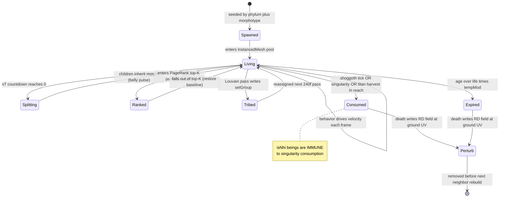
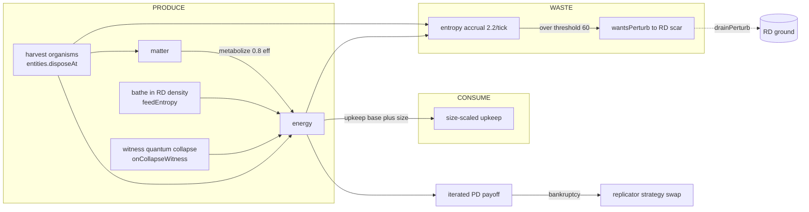
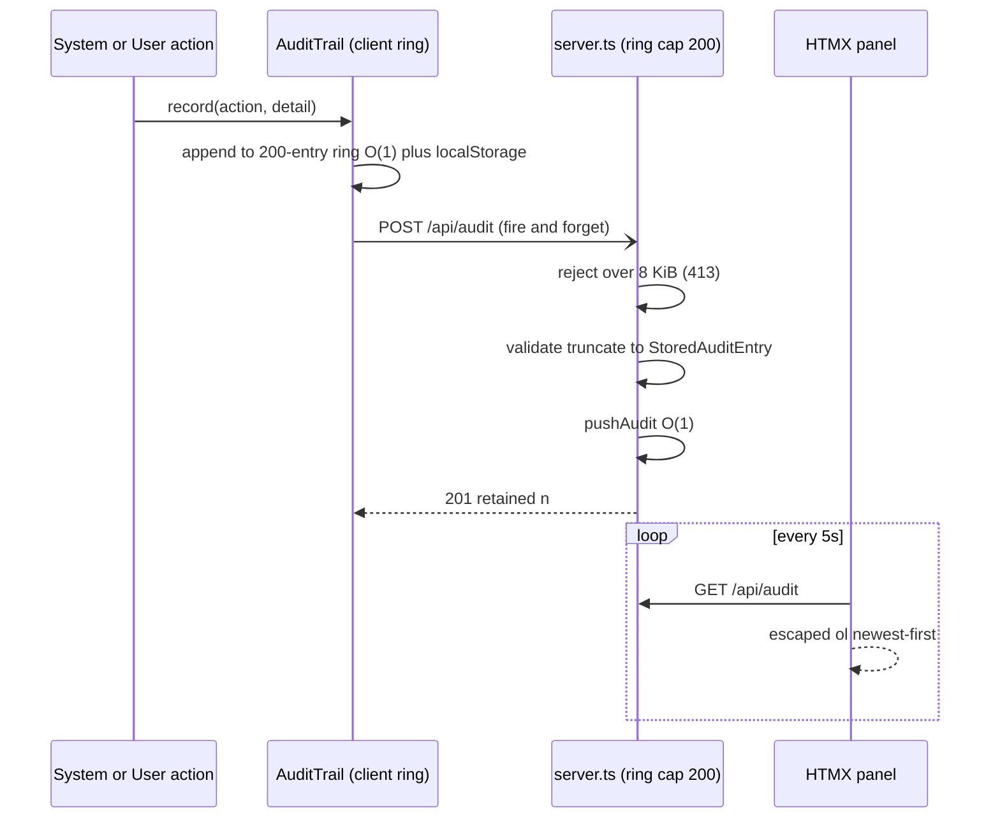

# Domain Model — ERD + ERM + ERP

> **Audit deliverable** · Cosmogonic Quantum Mechalogodrom · v0.9.0 · 2026‑06‑13
>
> **This file SUPERSEDES** [`docs/ERD.md`](../ERD.md), [`docs/ERM.md`](../ERM.md), and
> [`docs/ERP.md`](../ERP.md). Those three remain valuable prose, but several of their claims have
> drifted from the code since they were last revised; every drift found during this audit is called
> out inline in a **⚠ DRIFT** callout and consolidated in [§4 Drift register](#4-drift-register).

---

## 0. Reading guide

The Mechalogodrom has **no database**. Its "entities" live in THREE.js scene graphs, typed arrays,
fixed-capacity rings, and `localStorage`. The relational structure is real all the same, and the
composition root — [`src/world.ts`](../../src/world.ts) — is its join engine: it constructs every
system once, owns the one mutable `SimState`, and drives the per‑frame pipeline that lets one system
read (and exactly one sanctioned write-back to) another.

Three lenses, one model:

| Section                                                 | Lens          | Answers                                                                                |
| ------------------------------------------------------- | ------------- | -------------------------------------------------------------------------------------- |
| [§1 ERD](#1-erd--entity-relationship-diagram)           | **Structure** | What entities exist, what fields they hold, how they relate and with what cardinality. |
| [§2 ERM](#2-erm--entity-relationship-matrix--narrative) | **Coupling**  | Who produces/consumes whom, which module owns each entity, the write-back matrix.      |
| [§3 ERP](#3-erp--entity-resource--process)              | **Time**      | Per-entity lifecycle, the resource/economy flows, the tick/process pipeline.           |

All citations are `file:line` against the v0.9.0 tree.

---

## 1. ERD — Entity-Relationship Diagram

A single `erDiagram` covering the domain entities. To keep GitHub's Mermaid parser happy, relationship
labels are punctuation-light (a `;` inside a label is a statement separator and crashes the renderer —
a gotcha already documented in the legacy ERP). Field rows are limited to the load-bearing attributes;
exhaustive field lists live in [§2's entity catalog](#21-entity-catalog).

```mermaid
erDiagram
  WORLD ||--|| SIM_STATE : "owns the single mutable state"
  WORLD ||--|| SIM_CONTEXT : "builds the dependency bag"
  PERSISTED_STATE ||--|| WORLD : "seeds and configures"
  PERSISTED_STATE ||--|| RNG : "seed drives mulberry32"
  RNG ||--o{ SIM_CONTEXT : "single deterministic stream"

  WORLD ||--o{ ENTITY : "owns the population"
  WORLD ||--o{ TITAN : "owns 10 game-theoretic minds"
  WORLD ||--o{ SHOGGOTH : "owns 3 predators"
  WORLD ||--o{ PUPPET_MASTER : "owns 3 event triggers"
  WORLD ||--o{ LEVIATHAN : "owns 4 abyssal serpents"
  WORLD ||--|| CONNECTOME : "owns the neural web"
  WORLD ||--|| GRAPH_MIND : "owns the analytical cortex"
  WORLD ||--|| QUANTUM_CLOUD : "owns the amplitude cloud"
  WORLD ||--|| QUANTUM_CIRCUIT : "owns the register wrapper"
  WORLD ||--|| RD_FIELD : "owns the living ground"
  WORLD ||--|| ENVIRONMENT : "owns monoliths and dioramas"
  WORLD ||--|| WEATHER : "owns the regime machine"
  WORLD ||--|| ATMOSPHERE : "owns sky and haze"
  WORLD ||--o| SINGULARITY : "owns 0 or 1 active hole"
  WORLD ||--o{ AUDIT_ENTRY : "records actions"

  PHYLUM ||--o{ MORPHOTYPE : "groups 25 morphs"
  MORPHOTYPE ||--o{ ENTITY : "templates appearance and behavior"
  BEHAVIOR ||--o{ MORPHOTYPE : "assigned at mint"
  BEHAVIOR ||--o{ ENTITY : "drives velocity each frame"
  ENTITY ||--o{ ENTITY : "splits into children"

  ENTITY }o--o{ ENTITY : "connectome links grid-local"
  CONNECTOME ||--o{ ENTITY : "writes act and nW"
  GRAPH_MIND ||--o{ TRIBE : "detects via Louvain"
  TRIBE ||--o{ ENTITY : "members via setGroup write-back"
  GRAPH_MIND ||--o{ ENTITY : "ranks top-K halo via PageRank"

  TITAN ||--|| STRATEGY : "plays iterated PD"
  TITAN }o--o{ TITAN : "wages war and trades via PairHistory"
  TITAN }o--|| RD_FIELD : "waste scars perturb"
  TITAN ||--|| TITAN_LEDGER : "publishes economy row"

  SHOGGOTH }o--o{ ENTITY : "tendrils pull and consume"
  PUPPET_MASTER ||--o{ ENTITY : "remorphs on trigger"
  PUPPET_MASTER }o--|| WEATHER : "SELENE selects regime"
  PUPPET_MASTER }o--|| QUANTUM_REGISTER : "applies gate signature"
  PUPPET_MASTER ||--o{ AUDIT_ENTRY : "emits PuppetEvent"
  SINGULARITY }o--o{ ENTITY : "force field and consumption"

  WEATHER ||--o{ ENTITY : "wind plus temperature to lifespan"
  WEATHER ||--|| RD_FIELD : "tunes feed kill diffusion"
  ENTITY }o--|| RD_FIELD : "death perturbs at ground UV"

  CONSTELLATION_CELL ||--|| LORE_NAME : "named sector"
  TRIBE ||--o| LORE_NAME : "named tribe"
  OMEN ||--|| LORE_NAME : "named anomaly"
  LORE_NAME }o--|| PERSISTED_STATE : "digested from seed"

  SONG ||--o{ AUDIO_BANDS : "spectrum via AnalyserNode tap"
  AUDIO_BANDS }o--o{ CONSTELLATION_CELL : "treble pulses cell edges"
  ANALYTICS_WINDOW }o--o{ ENTITY : "samples population every 8th frame"
  ANALYTICS_WINDOW ||--o{ OMEN : "emits when z over 2.5"

  ENTITY {
    int mi "morphotype index 0..morphTotal-1"
    Behavior beh "1 of 26 (override-able)"
    float age "death at age over life times tempMod"
    float life "base lifespan"
    Vector3 vel "velocity"
    float sortVal "sorting-field operand"
    float nW "connectome neural weight"
    float act "neural activation accumulator"
    float energy "market wealth 0..100"
    int strategy "nash 0 or 1"
    int typeId "type-theory tag 0..4"
    int setGroup "set-theory group, Louvain-rewritten"
    int phylum "0..9 or -1 legacy"
    Behavior beh2 "OUTLIER second behavior or null"
    bool isNhi "user-launched immortal being (optional)"
  }
  MORPHOTYPE {
    int id "0..249 phylum mode or 0..99 legacy"
    int gi "geometry-cache index"
    Color col "albedo"
    Color em "emissive"
    float op "opacity under 0.6 means transparent"
    Behavior beh "behavior name"
    float spd "base speed"
  }
  TITAN {
    string name "lore-named"
    string epithet "lore epithet"
    int mi "champion morph base"
    float energy "PRODUCE harvest collapse RD"
    float matter "harvested entity mass"
    float entropy "WASTE accrual to scars"
    int strategy "index into 5 STRATEGIES"
    int warCount "rivals currently at war"
    float homeX "territory anchor X"
    float homeZ "territory anchor Z"
  }
  SHOGGOTH {
    Vector3 vel "Lorenz-ish drift"
    float ph "phase offset"
    float feedTimer "consumption countdown"
    float feedInterval "200..500 ticks"
    int consumed "victims so far"
  }
  PUPPET_MASTER {
    string name "AETHON SELENE KRONOS"
    string act "chaos weather mutate"
    float hue "orb tint"
    float spd "orbit speed"
    float ti "elapsed since last trigger"
  }
  LEVIATHAN {
    Vector3 vel "sinusoidal sail"
    float ph "golden-angle phase"
    float hue "tint"
  }
  WEATHER {
    int weatherIdx "0..5 CLEAR RAIN STORM AURORA VOID FOG"
    float temperature "tempTarget per regime"
    Vector2 wind "x and z force"
    float fogDensity "FogExp2 density"
    float exposure "toneMappingExposure"
  }
  QUANTUM_REGISTER {
    int qubits "5 in the sim, 1..8 enforced"
    Float64Array re "real amplitudes 2^n"
    Float64Array im "imag amplitudes 2^n"
    Float64Array probs "Born-rule shared buffer"
    int lastCollapse "measured basis index or -1"
  }
  RD_FIELD {
    int size "128 Gray-Scott grid SIZE squared"
    Float32Array u "activator to ground emissiveMap"
    Float32Array v "inhibitor ping-pong"
    float feed "raised by STORM"
    float kill "raised by VOID"
  }
  TRIBE {
    int index "Louvain community id"
    int memberCount "entities carrying it"
    float pagerank "top-20 get emissive floor"
  }
  CONSTELLATION_CELL {
    int site "1 of 24 monolith/diorama sites"
    string loreName "sub-sector shown in #lore"
  }
  LORE_NAME {
    string kind "sector tribe star omen"
    int index "digest input, memoized"
    string name "sha256 seed kind index"
  }
  AUDIO_BANDS {
    float bass "0..1 to light shimmer"
    float mid "0..1"
    float treble "0..1 to constellation pulse"
    float level "0..1 to cloud breathe"
  }
  PERSISTED_STATE {
    int version "1"
    int seed "mulberry32 seed"
    int songIdx "into 6 songs"
    int weatherIdx "into 6 regimes"
    int algoIdx "into sorting fields"
    bool sfxOn "sfx toggle"
    int sessions "boot counter"
    int sim "1 GENESIS or 2 BREAK FREE"
  }
  AUDIT_ENTRY {
    float ts "epoch ms"
    string action "verb"
    json detail "optional"
  }
```

> **⚠ DRIFT (vs `docs/ERD.md`).** The legacy ERD lists `QUANTUM_REGISTER.entropy` and `lastCollapse`
> as register fields. In code those are **derived/owned by the wrapper** `QuantumCircuitSystem`, not
> by `QuantumRegister` itself — entropy is computed from `probs`, and `lastCollapse` lives on the
> circuit (`src/sim/qcircuit.ts:56`, default `new QuantumRegister(5)`). The register exposes only
> `re/im/probs/qubits` (`src/math/quantum.ts`).

> **⚠ DRIFT (vs all three docs).** None of the legacy diagrams include **`LEVIATHAN`** (4 serpents,
> `src/sim/leviathans.ts:21`), **`SINGULARITY`** (0‑or‑1 active hole, 5 kinds,
> `src/sim/singularities.ts:38`), or the **`isNhi`** launched-being relationship
> (`src/types.ts:100`). All three shipped after the docs were last revised and are first-class domain
> entities owned by `world.ts`.

---

## 2. ERM — Entity-Relationship Matrix & narrative

### 2.1 Entity catalog

Every domain entity, its owning module, its identity key, and typical cardinality. Owning module = the
**single system that constructs and mutates it** (ARCHITECT rule: no system reaches into another's
internals; the only cross-boundary path is the write-back in [§2.3](#23-write-back-matrix-row-writes--column)).

| Entity                                     | Owning module (file)                               | Identity / key                 | Cardinality                      | Produced by                           | Consumed by                                                        |
| ------------------------------------------ | -------------------------------------------------- | ------------------------------ | -------------------------------- | ------------------------------------- | ------------------------------------------------------------------ |
| `World`                                    | `src/world.ts`                                     | singleton                      | 1                                | `main.ts (new World)`                 | `main.ts` frame loop (`world.step`)                                |
| `SimState`                                 | `src/world.ts` (decl `src/types.ts:127`)           | the one mutable struct         | 1                                | World ctor from persisted             | every system via `ctx.state`                                       |
| `SimContext`                               | `src/world.ts` (decl `src/types.ts:186`)           | dependency bag                 | 1                                | World ctor                            | all `src/sim/*` systems                                            |
| `PersistedState`                           | `src/memory/store.ts`                              | namespaced `localStorage` keys | 1                                | `MemoryStore.load/defaults`           | `main.ts`, World ctor                                              |
| `Rng`                                      | `src/math/rng.ts`                                  | `mulberry32(seed)`             | 1 (+1 audio fork)                | World ctor                            | `ctx.rng` → every sim system                                       |
| `EntityData` / `Entity`                    | `src/sim/entities.ts` (decl `src/types.ts:51`)     | `entities.list` index          | ≤ `maxEntities` (650…10 000)     | `EntityManager.spawn`                 | World, behaviors, connectome, instanced renderer                   |
| `MorphType`                                | `src/sim/morphotypes.ts` (decl `src/types.ts:108`) | morph id 0…249                 | 250 (100 legacy)                 | morphotype mint at boot               | every entity (`userData.mi`)                                       |
| `Phylum`                                   | `src/sim/phyla.ts` / `lore.ts`                     | phylum id 0…9                  | 10                               | static phylum data                    | morphotype mint, telemetry                                         |
| `Behavior`                                 | `src/sim/behaviors.ts`                             | behavior name (26)             | 26                               | static behavior pool                  | morphotypes, entities                                              |
| `TitanSystem` / `Titan`                    | `src/sim/titans.ts`                                | titan id 0…9                   | **10**                           | `buildTitan` (boot, seeded)           | World `update`, telemetry, viz3d, observatory                      |
| `PairHistory`                              | `src/math/games.ts`                                | one per unordered titan pair   | **45** = C(10,2)                 | `createHistory`                       | `titans.ts` diplomacy / `relationOf`                               |
| `ShoggothSystem` / `Shoggoth`              | `src/sim/shoggoths.ts`                             | shoggoth id 0…2                | **3**                            | `spawnShoggoth` (boot, seeded)        | World `update`, telemetry                                          |
| `PuppetMasterSystem` / `Puppet`            | `src/sim/puppet-masters.ts`                        | named (AETHON/SELENE/KRONOS)   | **3**                            | PuppetMasterSystem ctor               | World `update`, HUD toast, telemetry                               |
| `LeviathanSystem` / `Leviathan`            | `src/sim/leviathans.ts`                            | index 0…3                      | **4**                            | LeviathanSystem ctor (no rng)         | World `update`, telemetry                                          |
| `Connectome`                               | `src/sim/connectome.ts`                            | link = (i,j) pair              | links ≤ `maxLinks` (2 200…6 000) | World ctor                            | World `update`, GraphMind                                          |
| `GraphMind` / `Tribe`                      | `src/sim/graph-mind.ts`                            | community index                | tribes = Louvain count           | World ctor                            | World cadence (240f/600f), entities (`setGroup`)                   |
| `QuantumCloud`                             | `src/sim/quantum.ts`                               | amplitude point cloud          | 1                                | World ctor                            | World `update`, audio breathe                                      |
| `QuantumCircuitSystem` / `QuantumRegister` | `src/sim/qcircuit.ts`, `src/math/quantum.ts`       | register n=5 → 32 amps         | 1 + 1                            | World ctor (`new QuantumRegister(5)`) | World cadence (30f/6f), telemetry `#v11`                           |
| `ReactionDiffusionSystem` (RD_FIELD)       | `src/sim/reaction-diffusion.ts`                    | grid cell (SIZE²)              | 16 384 cells (128²)              | World ctor (line 286)                 | World step (line 496), titans, environment ground                  |
| `EnvironmentSystem`                        | `src/sim/environment.ts`                           | monolith/diorama rigs          | 1                                | World ctor (line 265)                 | World `update`, constellations                                     |
| `WeatherSystem`                            | `src/sim/weather.ts`                               | weather regime id 0…5          | 1 sky / 6 regimes                | World ctor (line 277)                 | World `update` (line 441), `cycle`                                 |
| `AtmosphereSystem`                         | `src/sim/atmosphere.ts`                            | sky dome + haze                | 1                                | World ctor (line 311)                 | World `update` (line 508), `setNightmare`                          |
| `SingularitySystem` / `Singularity`        | `src/sim/singularities.ts`                         | active kind or null            | **0 or 1** (5 kinds)             | World ctor (line 315)                 | World `update` (line 460), shoggoths/titans/leviathans `bodyForce` |
| `ConstellationSystem` / cell               | `src/sim/constellations.ts`                        | Voronoi cell index             | 24 sites                         | World ctor                            | World `update` (line 505), `#lore`                                 |
| `LoreEngine` / `LoreName`                  | `src/sim/lore.ts`                                  | (kind, seed-hash)              | derived on demand                | World ctor                            | titans, constellations, omens, HUD                                 |
| `AnalyticsSystem` / window                 | `src/sim/analytics.ts`                             | rolling 120-sample ring        | 3 rings                          | World ctor                            | World cadence (8f/60f), audit (omens)                              |
| `AudioEngine` / `Song` / `SfxSpec`         | `src/audio/engine.ts`, `songs.ts`                  | song idx / 100 sfx             | 6 songs / 100 sfx                | World ctor (forked rng)               | World action handlers, AudioAnalysis                               |
| `AudioAnalysis` / `AudioBands`             | `src/audio/analysis.ts`                            | 1 reused bands object          | 1                                | World ctor                            | environment, constellations, quantum                               |
| `AuditTrail` / `AuditEntry`                | `src/logging/audit.ts` (decl `src/types.ts:220`)   | ring slot                      | ≤ 200                            | `ctx.audit`                           | UI audit panel, `POST /api/audit`                                  |
| `Viz3DSystem`                              | `src/sim/viz3d.ts`                                 | towers + obelisks              | 10 + 10                          | World ctor (line 312)                 | World step (line 511)                                              |
| `Observatory`                              | `src/ui/observatory.ts`                            | 8 SeriesRings / 16 canvases    | 1                                | World ctor                            | World step (push+draw on cadence)                                  |

> **⚠ DRIFT (vs `docs/ERM.md` entity catalog).** The legacy ERM catalog states `PUPPET_MASTER`
> cardinality as "fixed small set" and omits the exact count — it is **exactly 3** (AETHON, SELENE,
> KRONOS). It also predates `LEVIATHAN`, `SINGULARITY`, and the `Viz3DSystem`/`Observatory` UI
> entities, none of which appear in its table.

### 2.2 Relationship narrative (produces / consumes / lifecycle)

- **`MorphType → Entity` (1:N).** Each of the 250 morphotypes (10 lore-named phyla × 25 since the
  PANTHEON release; 100 in legacy mode) is a template — colour, emissive, metalness, roughness,
  opacity, scale range, speed, wobble, and a behavior. An entity is born from one morphotype
  (`userData.mi`, `src/types.ts:53`) and copies its parameters; `EntityManager.remorph` re-points an
  existing entity at a different morphotype with a geometry-ref swap and material rewrite (zero
  allocation, no scene churn).
- **`Behavior → MorphType / Entity` (1:N).** The 26 behaviors are drawn from each phylum's pool at
  mint. Entities inherit the behavior through their morphotype but it is **overridable per entity**:
  Shoggoth-corrupted spawns are forced to `lorenz`, and OUTLIER morphs carry a `beh2` second behavior
  blended with `beh` (`src/types.ts:93`).
- **`Entity → Entity` (1:N, self).** Reproduction: the user `split` action spawns 4 children around up
  to 5 mature parents; the `split` behavior and the auto-split countdown `sT` spawn singles; death
  below a population floor triggers sparse respawns near the corpse.
- **`Titan → PairHistory ↔ Titan` (N:M).** The 10 titans form **45** unordered pairs, each with one
  `PairHistory` (bit-ring move memory, `src/math/games.ts`). Diplomacy is an iterated prisoner's
  dilemma STAGGERED so at most one pair plays per frame — full 45-pair coverage every 600-frame cycle,
  no frame spike (`src/sim/titans.ts:73-75`). Recent-window defection counts derive each pair's
  relation (TRUCE / ALLIANCE / WAR, `src/sim/titans.ts:120`); WAR fires territory strikes.
- **`Shoggoth ↔ Entity` (M:N + 1:N).** Tendrils connect each Shoggoth to nearby entities per frame
  (spatial-hash query) and tug them inward. On its consumption interval (200…500 ticks) a Shoggoth
  deletes its nearest entity within range and spawns **2 corrupted (`lorenz`, dark-violet)**
  replacements — a destructive relationship that recolours the population over time.
- **`PuppetMaster → Entity / Weather / SimState` (1:N).** KRONOS remorphs random entities per trigger;
  SELENE overwrites the active weather index at random; AETHON raises `chaos`. Every trigger emits a
  `PuppetEvent` (`src/types.ts:215`) which the world forwards to the HUD toast **and** the audit trail,
  and (V2) applies a characteristic quantum gate signature.
- **`Weather → Entity` (1:N) and `Weather → RD_FIELD` (1:1).** The active regime drives the wind
  vector added to every entity's velocity and the temperature that scales lifespan (cold ×0.7, hot
  ×1.3 on the death threshold); it also tunes the Gray-Scott field (STORM raises feed, VOID raises
  kill, AURORA boosts diffusion).
- **`Entity (death) → RD_FIELD` (N:1 coupling).** Entity deaths — via the `EntityManager.onDeath` hook
  the world wires to `rd.perturb` — perturb the field at the corpse's position normalized to ground UV.
  The field's U channel **is** the ground's emissiveMap: the ecosystem's history grows as living skin.
- **`GraphMind → Tribe ↔ Entity` (1:N, recomputed).** Every 240 frames a seeded Louvain pass
  partitions entities into tribes, written back into member `setGroup` (the set-theory behavior becomes
  tribe-aware — true feedback). A PageRank pass every 600 frames (offset 300) grants the top-20 an
  emissive floor. Tribe identity is **not persisted** — re-derived from live topology each pass.
- **`Singularity → Entity` (0/1 : N).** When a hole is summoned (one of 5 kinds —
  `entropy/blackhole/whitehole/greyhole/strangestar`, `src/sim/singularities.ts:38-43`), its force
  field mutates entity velocities **before** integration, and `disposeAt` consumption fires the same
  `onDeath → rd.perturb` path. NHI beings (`isNhi`) are immune to consumption.
- **`Song → AudioBands → world` (1:1 tap).** One AnalyserNode taps music+SFX gain; per-frame polling
  yields bass/mid/treble/level, fanning out to exactly three couplings at ≤ 0.35 strength — bass
  shimmers the light rig (`environment.setAudioBass`, `world.ts:438`), treble pulses constellation
  cells, level breathes the quantum cloud (`quantum.setBreath`, `world.ts:439`).
- **`AnalyticsWindow → Omen → AuditEntry` (1:N, throttled).** Rolling 120-sample rings yield a
  regression trend (telemetry `#v10`); a population z-score beyond ±2.5 emits a lore-named omen into
  the audit pipeline, at most once per 30 s.
- **`LoreName` (derived, memoized).** No name is stored or chosen — every sector/tribe/star/omen name
  and puppet/weather/collapse epithet is digested from `sha256(seed‖kind‖index)`. `PersistedState.seed`
  is therefore the **foreign key to the entire mythology**: same seed, same names, forever.

### 2.3 Write-back matrix (row writes → column)

Read as "**row** affects **column**". This is the cross-system coupling `world.ts` mediates; every
write-back is documented at its call site and is the only sanctioned way data crosses a boundary.

| ↓ writes → affects | ENTITY                    | CONNECTOME | RD_FIELD            | QUANTUM                  | AUDIT           | RENDER             |
| ------------------ | ------------------------- | ---------- | ------------------- | ------------------------ | --------------- | ------------------ |
| BEHAVIOR           | velocity                  | —          | —                   | —                        | —               | position           |
| CONNECTOME         | `act`, `nW`               | links      | —                   | —                        | —               | link colours       |
| GRAPH_MIND         | `setGroup`, emissive      | palette    | —                   | —                        | —               | tribe hues, halo   |
| TITAN              | `energy`, death (harvest) | —          | waste scars         | (witness reads collapse) | toasts          | titan meshes       |
| SHOGGOTH           | velocity, death           | —          | (via death)         | —                        | —               | tendrils           |
| PUPPET_MASTER      | morph, count, `chaos`     | —          | —                   | gate signature           | events          | remorph flashes    |
| SINGULARITY        | velocity, death           | —          | (via death)         | —                        | (summon logged) | hole rig           |
| WEATHER            | lifespan, wind            | —          | feed/kill/diffusion | —                        | —               | fog, sky, exposure |
| ENTITY (death)     | —                         | —          | UV perturb          | —                        | —               | —                  |
| ANALYTICS          | —                         | —          | —                   | —                        | omens           | —                  |

> **⚠ DRIFT (vs `docs/ERM.md` matrix).** The legacy 5-column matrix has no `TITAN→RD_FIELD` row, no
> `SINGULARITY` row, and no `PUPPET_MASTER→QUANTUM` cell. All three are live couplings in v0.9.0:
> titan waste scars route through `wantsPerturb`/`drainPerturb` (`world.ts:497`), the singularity force
> field and `disposeAt` mutate entities and RD (`world.ts:460`), and puppet events apply gate
> signatures (`world.ts` `onPuppetEvent` → `qc.apply`).

---

## 3. ERP — Entity Resource & Process

### 3.1 Per-entity lifecycle (spawn → update → death)

The state machine every organism passes through. Death routes to a perturbation **before** the next
neighbor rebuild, so links/tribes/ranks computed afterward never address a corpse.

### 3.2 Resource & economy flows

Three economies run concurrently. None has a database; all are typed-array ledgers refilled per tick.

**Titan economy** (`src/sim/titans.ts`) — the most elaborate, a closed PRODUCE → CONSUME → WASTE loop
per titan, internally cadenced so titan `i` ticks at `frame % 90 === i * 9` (`titans.ts:70-72`):

The diplomacy payoff couples to the **actual energy ledger** (zero-line at the matrix mean), and
bankruptcy mutates the titan's strategy via replicator dynamics over the 5-strategy population
(`titans.ts:104-107`).

**Entity energy / population economy** — every organism carries `energy` 0…100 (`src/types.ts:80`,
market-behavior wealth). Population is a self-balancing flow: auto-split (`sT`) and sparse-respawn add
organisms up to `targetEntities`; shoggoth/titan/singularity consumption and lifespan expiry remove
them. Since 0.5.0 `targetEntities === maxEntities` on every tier (`src/types.ts:32-41`), so an idle
world fills its ceiling, carried by per-frame neighbor-query throttles.

**Quantum "entropy" flow** — the 5-qubit register's normalized Shannon entropy (`#v11`) feeds the
atmosphere aurora and is a component of the biome `sentience` index (`src/types.ts:300-306`).

### 3.3 Tick / process pipeline

The authoritative ordering of a single `World.step(dt)`, transcribed from `src/world.ts:434-548`. This
is the **corrected** pipeline — see the drift note below.

```mermaid
flowchart TD
  A[rAF tick clamp dt] --> B[audioAnalysis.update bands]
  B --> C[environment.setAudioBass and quantum.setBreath]
  C --> D[weather.apply]
  D --> E[puppets.update]
  E --> F{frame mod 2 equals 0}
  F -- yes --> G[grid clear and insert n]
  F -- no --> H[reuse last grid]
  G --> I[shoggoths.update]
  H --> I
  I --> J[titans.update roam plus cadenced econ]
  J --> K[leviathans.update pure trig]
  K --> L[singularities.update force field]
  L --> M[sortStep sorting fields]
  M --> N[entities.update behaviors integrate]
  N --> O{connectome cadence 1/2/3/4/6 by n}
  O --> P[qc.update every 30f and bands every 6f]
  P --> Q[quantum.update]
  Q --> R{frame mod 2 equals 1}
  R -- yes --> S[rd.step]
  R -- no --> T[skip RD]
  S --> U[titans.drainPerturb waste scar]
  T --> U
  U --> V{graph passes}
  V --> W[Louvain 240f gmScale]
  V --> X[PageRank 600f offset 300]
  W --> Y[constellations.update]
  X --> Y
  Y --> Z[atmosphere.update]
  Z --> AA[viz3d.update and environment.update and artifacts.update]
  AA --> AB{frame mod 60 equals 30}
  AB -- yes --> AC[sampleRdEnergy and titans.feedEntropy]
  AB --> AD{frame mod 8 equals 0}
  AC --> AD
  AD -- yes --> AE[analytics.push and panel.update and updateAlgoPicker]
  AE --> AF{frame mod 60 equals 0 analyze}
  AF --> AG{observatory cadence 18f or 36f}
  AG --> AH[instanced.sync pool mirror LAST]
  AH --> A
```

> **⚠ DRIFT (vs `docs/ERP.md` §2 per-frame pipeline).** The legacy ERP flowchart places
> `connectome.update` **before** `titans/shoggoths/puppets` and shows RD stepping right after the
> quantum block. The real order (`world.ts:441-548`) is: **weather → puppets → grid rebuild →
> shoggoths → titans → leviathans → singularities → sortStep → entities.update → connectome →
> quantum → RD step → drainPerturb → graph passes → projections**. The connectome runs _after_
> `entities.update`, not before the actors; `drainPerturb` runs immediately after `rd.step`; and the
> pool-mirror `instanced.sync` is strictly last. The cadence _values_ in the legacy doc remain
> correct.

> **⚠ DRIFT (vs `docs/ERP.md` §1 boot sequence).** The legacy boot diagram shows
> `entities.reset(300)` with a hardcoded 300. The code calls `entities.reset(this.bootPopulation())`
> (`world.ts:268` and on reset `world.ts:1034`) — boot population is **computed**, not a literal 300.

#### Cadence schedule (verified against `world.ts`)

| Stage                         | Cadence                                               | Offset | Source line        |
| ----------------------------- | ----------------------------------------------------- | ------ | ------------------ |
| Grid rebuild                  | every 2nd frame                                       | 0      | `world.ts:444`     |
| Reaction-diffusion            | every 2nd frame                                       | 1      | `world.ts:496`     |
| Connectome                    | 1/2/3/4/6 by population (≤400/≤700/≤2000/≤5000/>5000) | —      | `world.ts:481-482` |
| Quantum register update       | every 30th frame                                      | —      | `world.ts:485`     |
| Quantum bands refresh         | every 6th frame                                       | —      | `world.ts:492`     |
| RD energy sample → titan feed | every 60th frame                                      | 30     | `world.ts:515`     |
| Telemetry + analytics push    | every 8th frame                                       | —      | `world.ts:523`     |
| Analytics regression          | every 60th frame                                      | 0      | `world.ts:528`     |
| Observatory draw              | 18f (36f phone)                                       | —      | `world.ts:532-533` |
| Louvain (tribes)              | every 240th frame ×`gmScale`                          | —      | `world.ts:501`     |
| PageRank (halo)               | every 600th frame ×`gmScale`                          | 300    | `world.ts:503`     |

`gmScale` doubles the graph periods above 2 500 entities (`world.ts:500`) — a 10k-node Louvain at the
base cadence would spike the budget.

### 3.4 Audit event flow

The fire-and-forget telemetry path — never blocks the sim, always bounded (ring cap 200).

> **Note — wire vs stored shape.** `AuditEntry` (`src/types.ts:220`: `ts/action/detail?`) is the
> client/wire format; the server re-narrows it to `StoredAuditEntry` (`server.ts`:
> `ts/action/detailJson?`) where `detail` is serialized to a JSON string. The legacy ERM/ERP treat
> them as one shape; they are structural twins with a serialization boundary between them.

---

## 4. Drift register

Consolidated list of every place the code (v0.9.0) diverges from the three legacy docs. This file is
the corrected source of record.

| #   | Legacy doc             | Claim                                                                 | Reality                                                                                    | Evidence                                         |
| --- | ---------------------- | --------------------------------------------------------------------- | ------------------------------------------------------------------------------------------ | ------------------------------------------------ |
| 1   | ERD                    | `QUANTUM_REGISTER` owns `entropy` and `lastCollapse`                  | Owned/derived by the **wrapper** `QuantumCircuitSystem`; register has `re/im/probs/qubits` | `src/sim/qcircuit.ts:56`; `src/math/quantum.ts`  |
| 2   | ERD/ERM/ERP            | No `LEVIATHAN` entity                                                 | 4 serpents owned by `world.ts`                                                             | `src/sim/leviathans.ts:21,52`                    |
| 3   | ERD/ERM/ERP            | No `SINGULARITY` entity                                               | 0-or-1 active hole, 5 kinds                                                                | `src/sim/singularities.ts:38-43`; `world.ts:460` |
| 4   | ERD/ERM/ERP            | No `isNhi` launched-being relationship                                | Immortal user being, immune to consumption                                                 | `src/types.ts:100`                               |
| 5   | ERM                    | `PUPPET_MASTER` cardinality "fixed small set"                         | Exactly **3** (AETHON/SELENE/KRONOS)                                                       | `src/sim/puppet-masters.ts`                      |
| 6   | ERM                    | Write-back matrix omits `TITAN→RD`, `SINGULARITY→*`, `PUPPET→QUANTUM` | All three are live couplings                                                               | `world.ts:460,497`; `onPuppetEvent`              |
| 7   | ERP §2                 | Connectome runs before the actor systems; RD right after quantum      | Connectome runs **after** `entities.update`; RD then `drainPerturb` then graph passes      | `world.ts:441-548`                               |
| 8   | ERP §1                 | `entities.reset(300)` hardcoded                                       | `entities.reset(this.bootPopulation())` — computed                                         | `world.ts:268,1034`                              |
| 9   | ERD `mi` field comment | "morphotype index 0..99"                                              | 0..`morphTotal-1` (250 in phylum mode)                                                     | `src/types.ts:52` vs `:288`                      |

### Not drift — confirmed accurate

- **`factions.ts` is intentionally NOT wired into `world.ts`.** `decideFaction`, `FACTIONS`,
  `DEVOURER_NET`, `ORACLE_CHAIN` and the 8 archetypes are consumed **only by
  `tests/factions.test.ts`** — verified by a repo-wide grep finding zero `factions`/`FACTIONS`/`brains`
  references in `world.ts`. This is a known finding in the audit backlog, not a doc drift; the legacy
  ERM correctly never wires it.
- **Cadence values** in the legacy ERP (`§3 Cadence schedule`) match the code exactly; only the
  _ordering_ in the §2 flowchart drifted.
- **The seed-as-mythology-foreign-key** narrative (ERM integrity rule 6) holds: lore names remain pure
  functions of `(kind, seed, ordinal)` via sha256.
