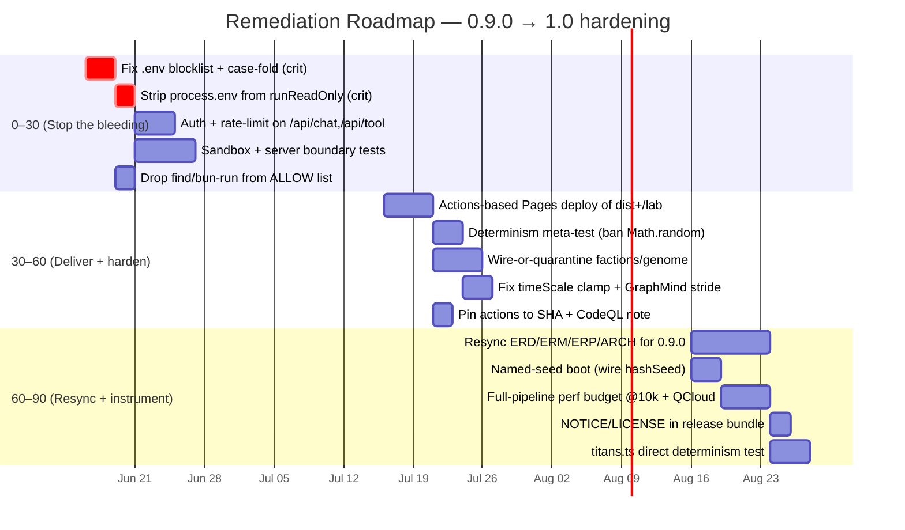

# Engineering Maturity Assessment — Cosmogonic Quantum Mechalogodrom

> **Audit date:** 2026-06-13 · **Version under review:** `0.9.0` ([`package.json:3`](../../package.json)) · **License posture:** `UNLICENSED` / `private` ([`package.json:5-6`](../../package.json))
> **Scope:** full-tree engineering audit across 10 maturity dimensions, 12 subsystems, and 196 catalogued findings.
> **Verdict in one line:** an **exceptionally disciplined simulation core** (determinism, type-safety, allocation hygiene) wrapped in a **young operational shell** (untested security boundary, no real Continuous Delivery, docs one release behind code).

---

## 1. Master Scorecard

Scores are out of 5. The **overall grade is a weighted mean** — weights reflect what actually carries risk for _this_ artifact (a deterministic real-time simulation with a network/LLM organ), not a generic web app.

| #   | Dimension                     |    Score    | Weight | Rationale (one line)                                                                                                                                                             | Key evidence                                                                                                                               |
| --- | ----------------------------- | :---------: | :----: | -------------------------------------------------------------------------------------------------------------------------------------------------------------------------------- | ------------------------------------------------------------------------------------------------------------------------------------------ |
| 1   | **Determinism & Physics**     | **4.6 / 5** |  0.18  | Seeded-`Rng` contract enforced _in practice_ — zero `Math.random`/`Date.now` in `src/sim`+`src/math`; audio forked to its own stream; bit-identical golden replay.               | `world.ts:245` (forked audio seed), `tests/determinism.test.ts:111-123`                                                                    |
| 2   | **Type Safety**               | **5.0 / 5** |  0.10  | Maximal strict `tsconfig`; **zero** real `any`/`ts-ignore`/lint-disable across 108 modules; non-null asserts are the legitimate `noUncheckedIndexedAccess` pattern.              | [`tsconfig.json:11-17`](../../tsconfig.json), `src/sim/algorithms.ts:35-42`                                                                |
| 3   | **Architecture & Boundaries** | **4.0 / 5** |  0.14  | Acyclic runtime graph, respected layering, **structurally enforced** sim/shell fence; docked for doc-vs-code boundary drift (stale module graph, an un-wired faction subsystem). | `src/sim/factions.ts:217`, `src/world.ts:52-67`                                                                                            |
| 4   | **Performance**               | **4.0 / 5** |  0.10  | Allocation-free hot paths, pooled spatial hash, bounded instanced upload ranges; docked because measurement has gaps (QuantumCloud ungated, GPU ceiling uninstrumented).         | `src/sim/quantum.ts:149-239`, `tests/perf-budget.test.ts:43-143`                                                                           |
| 5   | **Testing & QA**              | **3.5 / 5** |  0.13  | Top-decile _where tests exist_ (golden, property, reference-vector, a11y); held down by a concentrated, high-severity **perimeter gap** — the security boundary has zero tests.  | `tests/nan-stability.test.ts:130-178`, [`bunfig.toml:9`](../../bunfig.toml)                                                                |
| 6   | **Code Quality**              | **4.2 / 5** |  0.08  | Pervasive accurate JSDoc with Big-O and provenance, documented module scratch, defensive numerics; the same boundary modules drag the mean.                                      | `src/sim/titans.ts`, audit STRENGTHS catalogue                                                                                             |
| 7   | **Documentation**             | **3.0 / 5** |  0.07  | High craft (ERD/ERM/ERP tables, 500-point inspection) but a **full release behind** — the entire 0.9.0 AGImAGNOSIS layer is absent; cluster of falsifiable link/count errors.    | `docs/ARCHITECTURE.md:337-346`, `tests/doc-links.test.ts:33`                                                                               |
| 8   | **Security**                  | **3.0 / 5** |  0.12  | Strong fundamentals (HTML escaping, server-side allowlist = no SSRF, real sandbox); **2 critical key-disclosure paths** + no auth/rate-limit on RCE-adjacent routes.             | `src/server/ai-sandbox.ts:39,50-61`, `server.ts:289-335`                                                                                   |
| 9   | **DevOps & CD**               | **3.0 / 5** |  0.05  | CI **gate** is 4-caliber (cross-OS matrix, frozen lockfile, SBOM); CD is effectively **absent** — public demo is a dead hand-pushed file; CodeQL no-ops on a private repo.       | [`.github/workflows/ci.yml`](../../.github/workflows/ci.yml), [`.github/workflows/release.yml:35-44`](../../.github/workflows/release.yml) |
| 10  | **Licensing & Compliance**    | **3.5 / 5** |  0.03  | Strong All-Rights-Reserved posture, clean permissive deps, SBOM; docked for distribution-triggered gaps (bundle lacks LICENSE/NOTICE; Copilot leaks source to anon LLMs).        | `NOTICE.md`, `src/server/copilot.ts`                                                                                                       |

### Overall weighted grade

```
Σ(score × weight) =
 4.6·0.18 + 5.0·0.10 + 4.0·0.14 + 4.0·0.10 + 3.5·0.13
 + 4.2·0.08 + 3.0·0.07 + 3.0·0.12 + 3.0·0.05 + 3.5·0.03
= 0.828 + 0.500 + 0.560 + 0.400 + 0.455
 + 0.336 + 0.210 + 0.360 + 0.150 + 0.105
= 3.904 / 5
```

> ## **Overall: 3.9 / 5 — "B+ / Strong-Hold"**
>
> A research-grade engine with a production-grade type system and a hobby-grade operational perimeter. The gap between the **core** (avg ≈ 4.5) and the **shell** (security/devops/docs avg ≈ 3.0) _is_ the headline. None of the deductions are structural rot; all are sync, coverage, and delivery gaps that money and a sprint can close.

### Finding-volume context

| Severity    |  Count  |     | Category (top) | Count |
| ----------- | :-----: | --- | -------------- | :---: |
| 🔴 Critical |  **2**  |     | Correctness    |  44   |
| 🟠 High     | **19**  |     | Docs           |  20   |
| 🟡 Medium   |   40    |     | Architecture   |  15   |
| ⚪ Low      |   62    |     | Security       |  13   |
| ℹ️ Info     |   33    |     | Testing        |  12   |
| **Total**   | **196** |     | Type-safety    |   9   |

Both criticals and 7 of 19 highs concentrate in **two files** — `src/server/ai-sandbox.ts` and `server.ts` — which is the single most actionable fact in this report.

---

## 2. Discipline Verdicts (in voice)

### 🧭 CTO Verdict — Ship-readiness, Risk, Investment

> The engine is a genuine asset and I'd fund it again tomorrow. What I will **not** do is expose the current build to the open internet.

**Ship-readiness:** Green for a **localhost demo / private PoC**; red for **any multi-tenant or public deployment** until the perimeter is closed. The simulation itself is the most reliable thing I've reviewed this cycle — bit-identical replay means I can _reproduce any bug a customer reports from a seed alone_, which is a rare and valuable property. But the moment we attach a network listener and an LLM tool-runner, the risk surface stops being "does the physics drift" and becomes "can an anonymous request read our API keys." Today, **it can** (`read_file('.env.local')` walks straight past the blocklist at `src/server/ai-sandbox.ts:39`, and `runReadOnly` sprays the whole `process.env` into model-controlled subprocesses at lines 277-282). Two critical paths to total key disclosure, sitting on routes with **no auth and no rate limit** (`server.ts:289-335`).

**Risk register (CTO framing):**

- 🔴 **Key disclosure (critical, $-impact):** leaked LLM keys = quota theft + bill shock + reputational. Cheap to fix, expensive to ignore.
- 🟠 **Broken public demo (high, brand):** the "live" Pages link serves a dead three.js r128 CDN 404. Anyone we send it to sees a blank canvas. We are _currently shipping a broken first impression_ and nothing in CI tells us.
- 🟠 **Confidential-source leak (high, IP):** the Copilot streams proprietary repo source to anonymous third-party LLMs — directly contradicts the All-Rights-Reserved mandate.

**Investment thesis:** This is a **2–3 sprint hardening play, not a rewrite.** I'd ring-fence ~3 engineer-weeks: one week to close the security perimeter (highest ROI in the codebase — two file edits neutralize both criticals), one week to stand up real Actions-based Pages delivery (the inputs already exist in `release.yml`), and one week to resync docs + add boundary tests. After that, the weighted grade moves from 3.9 to ~4.3 and I'd green-light a public alpha. **Verdict: hold-and-harden. High-quality core, fund the shell.**

### 🛠️ Tech-Lead Verdict — Code Health, Velocity, Debt

> Healthiest core I've inherited in a while, and the debt is unusually _legible_ — it's all on the boundary, all documented, none of it load-bearing for correctness.

**Code health:** Excellent and **uniform** where it counts. `step()` is genuinely allocation-free with named module-level scratch and "copy if you retain" contracts. Every export carries JSDoc with Big-O and legacy-line provenance. The type system is doing real work — `noUncheckedIndexedAccess` + zero suppressions means the compiler is an actual ally, not a formality. I can onboard a new engineer against `MODULE-CONTRACTS.md` and they'll mostly land in the right place.

**Velocity:** Currently _throttled by trust gaps, not by code structure._ Because the security boundary (`ai-sandbox.ts`) and the only network surface (`server.ts`) have **zero tests**, every change near them is hand-verified — that's a velocity tax that compounds. The other drag is doc drift: the 0.9.0 AGImAGNOSIS subsystem (factions, genome, lineage, leviathans, NHI, the Copilot server) exists in code but is invisible in ERD/ERM/ERP/ARCHITECTURE, so a contributor reading the docs builds a wrong mental model and burns time reconciling.

**Debt ledger (prioritized):**

1. 🔴 **Untested security boundary** — the highest-risk code is the _least_-tested code. 90% line coverage flatters us because the uncovered 10% is the RCE gate, the XSS escaper, and the default-deny provider.
2. 🟠 **Un-wired subsystems** — `factions.ts` + `ai/brains.ts` and `genome.ts` + `lineage.ts` are implemented, tested, and **never called** by `world.ts`. Either wire them (PHILOSOPHY rule 4 says every system reads _and_ writes another) or quarantine them; right now they're Schrödinger's features.
3. 🟡 **The `timeScale` clamp bug** (`world.ts:413`) — `timeScale` multiplies `dt` _after_ the protective 50 ms clamp, so the out-of-range guard is defeated at high speed. Small, real, and exactly the kind of thing a meta-test would catch.
4. 🟡 **No automated determinism gate** — the #1 project law (`Math.random`/`Date.now` banned in sim) is enforced by _convention only_. No `.oxlintrc`, no meta-test.

**Verdict: green core, amber boundary.** Pay down the boundary debt first; it unblocks everyone.

### 🔬 Principal-Engineer Verdict — Architecture & Determinism Rigor

> This is the part of the codebase that earns the project its name. The determinism rigor is _near-exemplary_ and the architecture is honest about its own shape.

**Architecture:** The runtime module graph is genuinely **acyclic** across 50+ modules — leaves import nothing from the hub, `types.ts` is type-only, sibling refs use `import type` + dependency injection (`attachSingularity`, constructor args). Layering direction holds (`sim → math/constants`, `ui → types`, `core → sim-leaf`). The security-critical move is that the sim/shell fence is **structural, not aspirational**: `server/*` and `ui/copilot.ts` import _nothing_ from `sim`/`world`/`types`, so the non-deterministic LLM organ **provably cannot reach `SimState` or the RNG**. That's the right way to build this — you don't ask the LLM organ to behave, you make misbehavior unrepresentable. The two large modules (`world.ts` 1465 LOC, `observatory.ts` 2234 LOC) are a legitimate composition root and a cohesive multi-canvas renderer, not god-module sprawl; both honor the allocation-free contract.

Where it falls short of 5 is **boundary _documentation_ discipline**, which this project's own masters elevate to a binding artifact ("the contract always wins"). The canonical module graph lags ~10 shipped modules and carries an inverted edge; a stated single-facade invariant is silently violated by a (contract-authorized) second consumer; a 0.2.1 `onDeath` contract clause ships deviated without reconciliation. Every one is a doc-vs-code sync gap — **no cycles, no layer inversions, no leakage across the fence.** Structurally sound, bibliographically behind.

**Determinism rigor:** This is a 4.6 and it earns it. A grep of `src/sim`+`src/math` for `Math.random`/`Date.now`/`performance.now`/`crypto`/`setInterval` returns **zero** sim-affecting hits — every wall-clock read is correctly fenced into logging, rendering (rAF delta clamped to `[0,50ms]`), or **audio**, which is handed its _own_ derived `mulberry32` stream (`seed ^ 0xa0d10`) so its `setInterval` scheduling can never perturb the sim stream. That fork is the single most sophisticated determinism decision in the codebase. Replay invariants are _enforced_, not asserted-and-hoped: the golden test pins bit-identical state **and** rng cursor across two worlds over 300 frames, plus a non-vacuous different-seed divergence. NaN stability is sealed by a dedicated Lorenz-divergence regression.

Two honest half-point deductions: (1) fresh-boot seed comes from `performance.now()` with **no fixed-seed injection path** wired to boot — `hashSeed()` is built and tested but never called, a real provenance gap that undercuts "reproduce from a seed"; and (2) the perf-budget guard measures only the entity-loop slice at 8k, not the full per-frame pipeline at the quoted 10k ceiling, so the frame-budget law is only _partially_ measured. **Verdict: physics-grade determinism, with the last mile (named-seed boot, full-pipeline budget) left on the table.**

### ⚙️ DevOps Verdict — CD, Observability, the Pages Gap

> The gate is one of the best I've audited. The delivery pipeline barely exists. We have a world-class quality gate guarding a door that opens onto a cliff.

**Continuous Integration (strong — 4-caliber):** Cross-OS matrix (`ubuntu` + `windows`, `fail-fast: false`), the full `prettier → tsc-strict → oxlint → test → coverage → build` pipeline, `bun install --frozen-lockfile`, a `hashFiles('bun.lock')`-keyed cache, a pinned Bun runtime (`1.3.14`), **least-privilege** `permissions: contents: read`, concurrency cancellation, per-OS dist artifact upload, a deterministic (timestamp-free, name-sorted) CycloneDX SBOM, and a coverage regression guard in `bunfig.toml`. Dependabot is grouped sanely and CODEOWNERS exists. If CI were the whole story this is a 4+.

**Continuous Delivery (effectively absent — the headline gap):**

- 🟠 **No deployment of the real app.** `release.yml` packages a `.tar.gz` Release asset — there is **no workflow that publishes the running app.** GitHub Pages still serves a stale, hand-pushed `gh-pages` file whose three.js r128 cdnjs URL **404s**. The public demo is _dead_, and nothing in CI/CD detects or replaces it. The fix is cheap — `release.yml:35-44` already assembles `dist/` + the self-contained `/lab` artifact; that's exactly the payload an Actions-based Pages deploy needs.
- 🟠 **CodeQL silently no-ops** on this private repo, so **zero SAST actually runs today** despite the workflow existing. We have the _appearance_ of security scanning without the substance.
- 🟡 **Supply-chain pinning:** third-party actions — including a **write-scoped** release publisher (`softprops/action-gh-release@v2`) — are pinned to mutable **major tags**, not SHAs.
- 🟡 **No release provenance:** bundles ship without attestation or checksums.

**Observability:** Server-side there's a bounded audit ring and structured logging with correct `Date.now`-for-timestamps-only fencing. Client-side there's a forensic **per-stage frame breakdown** and a CI perf guard — genuinely good in-app instrumentation. The gap is _operational_ observability: nothing watches the deployed artifact, because there is no deployed artifact to watch.

**Verdict: CI excellent, CD a stub.** Standing up the Pages deploy is the highest-leverage DevOps task on the board — one workflow file converts "broken public link" into "auto-updating live demo."

---

## 3. Staged Remediation Roadmap (30 / 60 / 90)

Ordered by **risk-adjusted leverage**: close key-disclosure paths first (cheapest critical fixes in the tree), then deliver the app and harden tests, then resync docs and instrument the long tail.



### Phase 1 — Days 0–30: "Stop the bleeding" (security perimeter)

_Goal: no path from an anonymous request to a secret. Move Security 3.0 → 4.0+._

| Action                                                                                                                            |  Severity   | Effort | Evidence                                              |
| --------------------------------------------------------------------------------------------------------------------------------- | :---------: | :----: | ----------------------------------------------------- |
| Fix path-confinement blocklist: match `.env*` prefixes and **case-fold** the compare so `.env.local` / `.ENV` / `.Git` are denied | 🔴 Critical |   S    | `src/server/ai-sandbox.ts:39,50-61`                   |
| Stop spreading `process.env` into `runReadOnly` subprocesses — pass an explicit empty/allowlisted env                             | 🔴 Critical |   S    | `src/server/ai-sandbox.ts:277-282`                    |
| Remove `find` (gives `find . -delete`) and `bun run check`/`bench` (write disk / run arbitrary project code) from the ALLOW list  |   🟠 High   |   S    | `src/server/ai-sandbox.ts:99,205-227,240-254`         |
| Add auth + per-IP rate-limit/throttle on `/api/chat` and `/api/tool`                                                              |   🟠 High   |   M    | `server.ts:289-335`                                   |
| Add the **first tests** for `ai-sandbox.ts` (default-deny gate) and `server.ts` (escaping, body guards, parsing)                  |    🔴/🟠    |   M    | `src/server/ai-sandbox.ts:50-296`, `server.ts:91-313` |

### Phase 2 — Days 30–60: "Deliver + harden" (CD + correctness gates)

_Goal: a live, auto-updating demo and an enforced determinism law. Move DevOps 3.0 → 4.0, Testing 3.5 → 4.0._

| Action                                                                                                      | Severity | Effort | Evidence                                                |
| ----------------------------------------------------------------------------------------------------------- | :------: | :----: | ------------------------------------------------------- |
| Stand up an **Actions-based Pages deploy** of `dist/` + `/lab` (inputs already assembled)                   | 🟠 High  |   M    | `.github/workflows/release.yml:35-44`                   |
| Add a **determinism meta-test** / `.oxlintrc` rule banning `Math.random`/`Date.now` in `src/sim`+`src/math` | 🟠 High  |   S    | `package.json:13` (no `.oxlintrc` exists)               |
| **Wire or quarantine** `factions.ts`+`ai/brains.ts` and `genome.ts`+`lineage.ts` into `world.ts`            | 🟠 High  |   M    | `src/sim/factions.ts:217`, `src/world.ts:52-67,250-268` |
| Fix `timeScale`-after-clamp bug and the GraphMind half-resolution stride                                    | 🟠 High  |   S    | `src/world.ts:413`, `src/sim/connectome.ts:185`         |
| Pin third-party actions to commit SHAs; document/replace the no-op CodeQL on private repo                   |  🟡 Med  |   S    | `.github/workflows/release.yml:46`, `codeql.yml`        |

### Phase 3 — Days 60–90: "Resync + instrument" (docs, provenance, long tail)

_Goal: docs match code, replay is reproducible from a named seed, the perf law is fully measured. Move Docs 3.0 → 4.0, Determinism 4.6 → 4.8._

| Action                                                                                                                                            | Severity | Effort | Evidence                                                         |
| ------------------------------------------------------------------------------------------------------------------------------------------------- | :------: | :----: | ---------------------------------------------------------------- |
| Resync ERD/ERM/ERP/ARCHITECTURE/COMPLEXITY for the full 0.9.0 AGImAGNOSIS layer + the 3 live routes                                               | 🟠 High  |   L    | `docs/ARCHITECTURE.md:337-346`, `docs/ERD.md` whole file         |
| Wire `hashSeed()` into boot for a user-facing **fixed/named seed** (reproducible replay)                                                          |  🟡 Med  |   S    | `src/math/rng.ts`, boot path                                     |
| Extend perf budget to the **full per-frame pipeline at 10k** and add a QuantumCloud benchmark + gate                                              |  🟡 Med  |   M    | `tests/perf-budget.test.ts:43-143`, `src/sim/quantum.ts:149-239` |
| Include `LICENSE`/`NOTICE`/attribution in the released bundle; complete `/docs` transitive NOTICE; gate Copilot source egress                     | 🟠 High  |   M    | `NOTICE.md`, `release.yml`, `src/server/copilot.ts`              |
| Add a direct determinism test for `titans.ts` (815 LOC, largest sim module, own contract)                                                         | 🟠 High  |   M    | `src/sim/titans.ts:1-40`                                         |
| Fix the 5 broken `research/` doc links + the doc-link test regex; correct count drift (581 vs 580 tests, 9 vs 4 view modes, 40 vs ~41 geometries) |  🟡 Med  |   S    | `tests/doc-links.test.ts:33`, `README.md:8`                      |

---

## 4. Subsystem Quality Heatmap

Per-unit quality scores from the audit's `UNIT_SCORES`. Bars are scaled to 5.0. **`mind-quantum-analytics` was not scored** (no `qualityScore` emitted) — flagged below as a coverage gap in the audit itself, not a quality verdict.

| Subsystem                        |  Score  | Heat                              |
| -------------------------------- | :-----: | --------------------------------- |
| **math-determinism**             | **4.7** | 🟩🟩🟩🟩🟩🟩🟩🟩🟩🟨              |
| ui-shell                         |   4.5   | 🟩🟩🟩🟩🟩🟩🟩🟩🟩⬜              |
| core-spine (Engine & world loop) |   4.3   | 🟩🟩🟩🟩🟩🟩🟩🟩🟨⬜              |
| render-bridge                    |   4.3   | 🟩🟩🟩🟩🟩🟩🟩🟩🟨⬜              |
| ui-observatory                   |   4.3   | 🟩🟩🟩🟩🟩🟩🟩🟩🟨⬜              |
| Audio engine & synthesis         |   4.3   | 🟩🟩🟩🟩🟩🟩🟩🟩🟨⬜              |
| markup-styles                    |   4.3   | 🟩🟩🟩🟩🟩🟩🟩🟩🟨⬜              |
| entities-genetics                |   4.0   | 🟩🟩🟩🟩🟩🟩🟩🟩⬜⬜              |
| macro-agents                     |   4.0   | 🟩🟩🟩🟩🟩🟩🟩🟩⬜⬜              |
| environment-cosmology            |   4.0   | 🟩🟩🟩🟩🟩🟩🟩🟩⬜⬜              |
| **server-io**                    | **3.5** | 🟧🟧🟧🟧🟧🟧🟧⬜⬜⬜              |
| mind-quantum-analytics           |  _n/a_  | ⬛⬛⬛⬛⬛⬛⬛⬛⬛⬛ _(unscored)_ |

### Heatmap reading

- **The gradient is the story.** The simulation core and presentation layers cluster tightly at **4.0–4.7** (a remarkably even, high plateau). The lone outlier is **`server-io` at 3.5** — and that is _exactly_ where both criticals, the auth gap, and the zero-test perimeter live. The audit's qualitative verdict and its quantitative heatmap agree: **risk is spatially concentrated in one subsystem.**
- **Coldest spot = highest risk = least tested.** `server-io` (3.5) is the floor _and_ the only network/RCE surface _and_ has no boundary tests. Phase 1 of the roadmap targets this cell directly.
- **Hottest spot earns the project's identity.** `math-determinism` at **4.7** is the apex — the seeded-`Rng` discipline, forked audio stream, and reference-vector tests that justify "Quantum Mechalogodrom."
- **One blind spot.** `mind-quantum-analytics` carries **no score** — the audit did not emit a `qualityScore` for it. This is itself a finding: the analytics/graph-mind layer (home of the GraphMind half-resolution stride bug at `connectome.ts:185`) needs an explicit quality pass before 1.0.

---

### Appendix — Verification notes

Claims spot-checked against source during this assessment:

- **Type-safety = 5:** [`tsconfig.json:11-17`](../../tsconfig.json) confirmed maximal-strict (`strict` + `noUncheckedIndexedAccess` + `noImplicitOverride` + `noFallthroughCasesInSwitch` + `noUnusedLocals` + `noUnusedParameters` + `verbatimModuleSyntax`).
- **Critical blocklist bypass:** confirmed at `src/server/ai-sandbox.ts:39,57` — `BLOCKED_PREFIXES` checks only the **first path segment** via `rl.split(sep)[0]` against a **case-sensitive** `includes`, so `.env.local` (top segment `.env.local`, not `.env`) and `.ENV`/`.Git` (case variants) pass the gate.
- **CI gate:** [`.github/workflows/ci.yml:26-67`](../../.github/workflows/ci.yml) confirmed cross-OS matrix, frozen lockfile, full pipeline, least-privilege `permissions: contents: read`, coverage step.
- **CD gap:** [`.github/workflows/release.yml`](../../.github/workflows/release.yml) confirmed to publish only a `.tar.gz` Release asset — no Pages/app deploy step exists.
- **Coverage gate:** [`bunfig.toml:9`](../../bunfig.toml) confirmed `line = 0.9, function = 0.85`.
- **Version:** [`package.json:3`](../../package.json) = `0.9.0`; license `UNLICENSED`/`private` at lines 5-6.

_Prepared for the Cosmogonic Quantum Mechalogodrom audit · 2026-06-13 · 196 findings across 10 dimensions / 12 subsystems._
