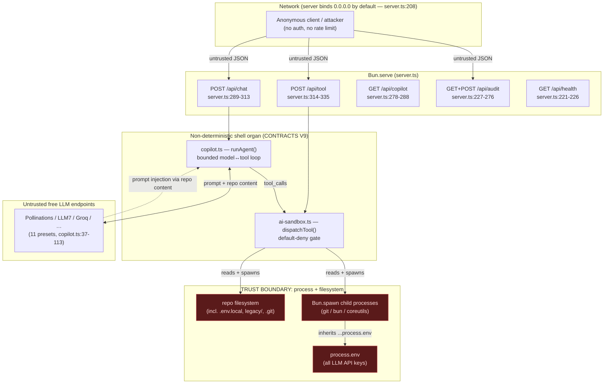

# Security, Supply-Chain, Determinism & License Audit

**Project:** Cosmogonic Quantum Mechalogodrom
**Version:** 0.9.0
**Audit date:** 2026-06-13
**Classification:** Proprietary — All Rights Reserved (see [`LICENSE`](../../LICENSE))
**Scope:** the Bun fullstack server (`server.ts`), the Copilot LLM bridge (`src/server/copilot.ts`), the read-only tool sandbox (`src/server/ai-sandbox.ts`), the determinism fence (`src/sim/**`, `src/math/rng.ts`, `src/memory/store.ts`), supply-chain config (`package.json`, `bun.lock`, `.github/**`), and license/IP posture (`LICENSE`, `NOTICE.md`, the public `/lab` bundle).

---

## 0. Executive summary

The simulation core is a genuinely deterministic, well-fenced machine: every nondeterministic call site lives in the **CONTRACTS-V9 non-deterministic shell organ** (`src/server/**`, `src/logging/**`), which by contract never imports `SimState` or the seeded `Rng`. That fence holds — the determinism verdict is **PASS with zero violations** (§4).

The **server is the problem**. The "read-only" AI sandbox that the codebase advertises as a hard boundary — _"It writes NOTHING … a would-be attacker who fully controls the model still cannot escape these gates"_ ([`ai-sandbox.ts:18-20`](../../src/server/ai-sandbox.ts)) — is not airtight. There is **1 critical** and **5 high** security findings that each individually break that stated guarantee: a secret-file read that exfiltrates every LLM API key, a `git grep` argument-injection that escalates to arbitrary process execution, a `find . -delete` file-deletion primitive, two allowlisted `bun run` scripts that write to disk, and full `process.env` (keys included) injected into every model-controlled subprocess. None of `server.ts`, `copilot.ts`, or `ai-sandbox.ts` has a single test, and the routes have no auth, no rate limit, and bind to `0.0.0.0` by default.

| Severity | Security | Determinism | License/IP | Total |
| -------- | :------: | :---------: | :--------: | :---: |
| Critical |    1     |      0      |     0      | **1** |
| High     |    5     |     1\*     |     2      | **8** |
| Medium   |    5     |      1      |     0      | **6** |
| Low      |    2     |      2      |     0      | **4** |
| Info     |    0     |      4      |     0      | **4** |

\* The "no automated gate on the `Math.random`/`Date.now` ban" finding is high-severity but is a _determinism-governance_ gap, not a live violation; the code itself is clean today.

**Headline (do these first):** (1) fix the `.env.local` secret read, (2) fix the `grepRepo` argument injection, (3) strip `process.env` from spawned children, (4) bind to loopback + add auth/rate-limit, (5) regenerate `NOTICE` from the production closure and ship third-party licenses in the release/Pages bundle.

---

## 1. Threat model of the server

### 1.1 Architecture and trust boundaries

### 1.2 Adversary and assets

The module's own docstring states the explicit threat model: **"a would-be attacker who fully controls the model still cannot escape these gates"** ([`ai-sandbox.ts:19-20`](../../src/server/ai-sandbox.ts)). We adopt exactly that, plus a second adversary made reachable by the deployment posture:

| Adversary                       | Reachability                                                                                                                                                                                                                        | Capability                                                                                    |
| ------------------------------- | ----------------------------------------------------------------------------------------------------------------------------------------------------------------------------------------------------------------------------------- | --------------------------------------------------------------------------------------------- |
| **A1 — model controller**       | Drives the model via `/api/chat`, or directly via `/api/tool`. Also reachable indirectly by **prompt injection**: repo/history content the model reads is fed back as data (`copilot.ts:333-344`) and can steer further tool calls. | Issues `read_file` / `list_dir` / `grep` / `run` calls subject only to the `ai-sandbox` gate. |
| **A2 — anonymous network peer** | `Bun.serve({ port })` with no `hostname` binds `0.0.0.0` (`server.ts:208`). No auth, no CORS allowlist, no rate limit on any route.                                                                                                 | Resource exhaustion, denial-of-wallet against LLM keys, audit-feed forgery.                   |

**Assets at risk:** (a) LLM provider API keys in `process.env`; (b) `.env*` and other secrets on disk; (c) `legacy/` confidential personal files; (d) repository source confidentiality (proprietary, All-Rights-Reserved); (e) operator LLM quota/budget; (f) audit-trail integrity; (g) host CPU/process table.

### 1.3 Per-route analysis

| Route                                | Auth | Body guard                                                                              | Calls                                  | Primary risk                                                                                                                           |
| ------------------------------------ | :--: | --------------------------------------------------------------------------------------- | -------------------------------------- | -------------------------------------------------------------------------------------------------------------------------------------- |
| `POST /api/chat` (`server.ts:289`)   | none | 256 KB cap, ≤100 msgs, role/content narrowed (`parseChatMessages`, `server.ts:186-205`) | `runAgent` → LLM + sandbox             | RCE-by-proxy; denial-of-wallet (A2); prompt-injection → secret read (A1)                                                               |
| `POST /api/tool` (`server.ts:314`)   | none | 8 KB cap                                                                                | `dispatchTool` directly                | **Direct** access to the read-only gate without even an LLM in the loop — every sandbox finding below is reachable here in one request |
| `GET /api/copilot` (`server.ts:278`) | none | n/a                                                                                     | `providerLabel` / `availableProviders` | Low — labels/ids only, no secrets leak (`copilot.ts:191-204`)                                                                          |
| `GET /api/audit` (`server.ts:228`)   | none | n/a                                                                                     | renders ring as HTML                   | XSS surface (escaped today; no CSP backstop — §2)                                                                                      |
| `POST /api/audit` (`server.ts:234`)  | none | 8 KB cap, fields truncated (`parseAuditBody`, `server.ts:128-152`)                      | appends to in-memory ring              | Audit-feed forgery/poisoning (A2)                                                                                                      |
| `GET /api/health` (`server.ts:221`)  | none | n/a                                                                                     | uptime/version                         | Minor info disclosure (version)                                                                                                        |
| `GET /lab` (`server.ts:213`)         | none | n/a                                                                                     | static file                            | None server-side (CDN p5 risk is the client's — §5)                                                                                    |

**Positive controls already present:** body-size caps before parse on every POST; strict shape narrowing; HTML escaping of all user strings in the audit fragment (`escapeHtml`, `server.ts:91-93`); surrogate-pair-safe truncation (`server.ts:144-146`); per-entry fault isolation in render (`server.ts:114-116`); `git`/`bun` subcommand gating; a shell-metacharacter denylist (`META`, `ai-sandbox.ts:205`); path confinement via `confine()` (`ai-sandbox.ts:50-61`). The findings below are where those controls have gaps.

---

## 2. Security findings

Sorted critical → low. Line references are to the files as read on 2026-06-13.

| #   | Severity     | Finding                                                                                                                                                                                                                                                                                                                                                                                                                                                                        | Location                                                                                     | Why it breaks the stated guarantee                                                                                                                                          |
| --- | ------------ | ------------------------------------------------------------------------------------------------------------------------------------------------------------------------------------------------------------------------------------------------------------------------------------------------------------------------------------------------------------------------------------------------------------------------------------------------------------------------------ | -------------------------------------------------------------------------------------------- | --------------------------------------------------------------------------------------------------------------------------------------------------------------------------- |
| S1  | **CRITICAL** | **`.env.local` (and `.ENV` case-variants) read through path confinement → leaks every LLM API key.** `confine()` blocks only the exact top segments `legacy / .git / node_modules / .env / dist` via `BLOCKED_PREFIXES.includes(top)`, an exact, case-sensitive match. `read_file(".env.local")` has top segment `.env.local`, which is **not** in the set → the read is allowed. On Windows/macOS dev hosts `.ENV` also bypasses (case-insensitive FS, case-sensitive check). | `ai-sandbox.ts:39, 50-61`; reachable via `/api/tool` and via prompt injection in `/api/chat` | Full disclosure of every configured provider key (`GROQ_API_KEY`, `GEMINI_API_KEY`, …, `CQM_LLM_KEY`) and any other `.env.*` secret, exfiltrated to a third-party endpoint. |
| S2  | **HIGH**     | **`grepRepo` argument injection → arbitrary process execution.** `grepRepo` interpolates the pattern into `git grep -n -I --fixed-strings ${pattern}` with no end-of-options `--` (`ai-sandbox.ts:313`). A pattern of `--open-files-in-pager=<cmd>` is parsed by `git grep` as an option, not a search term, and runs `<cmd>`. The pattern guard rejects spaces/metacharacters but **not** a leading `-`.                                                                      | `ai-sandbox.ts:299-314`                                                                      | Strongest possible escape: read-only allowlist → arbitrary exec, again under the "attacker controls the model" model.                                                       |
| S3  | **HIGH**     | **`runReadOnly` injects the entire `process.env` into every model-controlled child.** `Bun.spawn(v.argv, { env: { ...process.env, … } })` spreads all env (keys included) into the subprocess.                                                                                                                                                                                                                                                                                 | `ai-sandbox.ts:277-282`                                                                      | Defense-in-depth failure: any single filter bypass (S2, or a future one) becomes full key exfiltration via the child. Removes the last line of defense.                     |
| S4  | **HIGH**     | **`find` on the allowlist gives the "read-only" sandbox a delete primitive.** `find` is in `ALLOWED_BINS` (`ai-sandbox.ts:99`). `run find . -delete` (or `-exec rm …`, but `rm` is denied) recursively deletes repo files. `-delete` is not a metacharacter, not a path, and not a DENY token, so the gate passes it.                                                                                                                                                          | `ai-sandbox.ts:99, 205-227`                                                                  | Destructive write — directly contradicts "writes NOTHING; no code path creates, mutates, or deletes a file."                                                                |
| S5  | **HIGH**     | **`bun run check` and `bun run bench` are allowlisted → disk writes + arbitrary project-code execution.** `ALLOWED_SCRIPTS` includes `'check'` and `'bench'` (`ai-sandbox.ts:246`). `bun run check` runs `scripts/build.ts` which **writes `dist/`**; `bun run bench` executes `bench/index.ts`.                                                                                                                                                                               | `ai-sandbox.ts:240-254`                                                                      | Breaks "writes nothing" and the V9 acceptance "deny: … writes" through an explicitly allowed path; `scripts/build.ts` is also a code-exec surface.                          |
| S6  | **HIGH**     | **No auth / rate limit / loopback bind on `/api/chat`, `/api/tool`, `/api/copilot`.** `Bun.serve({ port })` with no `hostname` binds `0.0.0.0` (`server.ts:208`). Off-localhost this is anonymous repo reconnaissance + denial-of-wallet against the operator's keys + unbounded outbound traffic.                                                                                                                                                                             | `server.ts:208, 289-335`                                                                     | Turns every sandbox finding into a remotely-reachable, unauthenticated primitive.                                                                                           |
| S7  | **MEDIUM**   | **`validateCommand` path confinement is heuristic and bypassable.** The per-arg loop only confines tokens containing `/` or `.` (`ai-sandbox.ts:261`), and even then only checks for `..` escape — it does **not** re-apply `BLOCKED_PREFIXES`. So `run cat .env`, `run cat legacy/<file>`, `run git show HEAD:.env` read the very files the blocklist exists to protect.                                                                                                      | `ai-sandbox.ts:256-268`                                                                      | The "`legacy/` + `.git`/`.env`/`node_modules` blocked outright" guarantee (docstring `ai-sandbox.ts:8-10`) is false for the `run` tool.                                     |
| S8  | **MEDIUM**   | **Unauthenticated audit POST → feed poisoning/forgery.** Anyone reaching the port can append forged `{action, detail, ts}` to the ring (`server.ts:234-275`), overwriting the genuine action record (ring evicts at 200). Client `ts` is trusted within Date range.                                                                                                                                                                                                            | `server.ts:234-275`                                                                          | Undermines the audit trail's purpose; reachable off-host given S6.                                                                                                          |
| S9  | **MEDIUM**   | **No CSP or security headers on any response.** The server documents a CSP it never sets; the HTMX audit fragment is swapped via `hx-swap="innerHTML"`. One future escaping regression in `renderAuditFragment` becomes stored XSS with no second line of defense.                                                                                                                                                                                                             | `server.ts:210-340` (all responses)                                                          | No `Content-Security-Policy`, `X-Content-Type-Options`, `Referrer-Policy`.                                                                                                  |
| S10 | **MEDIUM**   | **Prompt-injection → tool-execution channel.** Repo/history content the model reads is appended as `tool` messages (`copilot.ts:333-344`) with no "untrusted content" delimiter, so file content can instruct the model to issue further reads. Combined with S1/S7 this drives secret exfiltration with no direct attacker request.                                                                                                                                           | `copilot.ts:320-354`                                                                         | Injection reaches secrets unless S1/S3/S7 are also fixed.                                                                                                                   |
| S11 | **LOW**      | **Upstream provider error text echoed to the client.** A failed provider response body is sliced to 300 chars and surfaced in the reply (`copilot.ts:295-297`, `:382-388`). Providers are untrusted free endpoints.                                                                                                                                                                                                                                                            | `copilot.ts:295-297, 382-388`                                                                | Bounded info leakage of upstream error text.                                                                                                                                |
| S12 | **LOW**      | **Comment/behavior mismatch on the path heuristic.** Same root cause as S7; low live impact but brittle — relies on the `META` `..` block as the sole traversal guard for args without `/` or `.`.                                                                                                                                                                                                                                                                             | `ai-sandbox.ts:256-268`                                                                      | Defense rests on a heuristic, not on `confine()`.                                                                                                                           |

> **Note — what is correctly handled.** The `META` regex (`ai-sandbox.ts:205`) blocks redirection/chaining/subshell/`..`; quotes are rejected; `DENY_TOKENS` covers `rm/mv/curl/sh/eval/…`; `git`/`bun` are subcommand-gated; `branch`/`tag`/`remote` are list-form only. These are real controls — the findings are the specific seams between them.

---

## 3. Supply-chain

### 3.1 Dependency posture

- **Runtime deps (`package.json:22-35`):** 12 production packages — `three`, `htmx.org`, `tailwindcss`, `mermaid`, `simplex-noise`, `graphology*` (×3), `d3-delaunay`, `@noble/hashes`, `simple-statistics`, plus two Fontsource font packages. All permissive (MIT / ISC / 0BSD / OFL-1.1). No GPL/AGPL in the bundled closure. `mermaid` pulls a large transitive tree (`katex`, `cytoscape`, `d3-*`, `dayjs`, `marked`, `roughjs`, …) into the **`/docs`** bundle — these are MIT/ISC/BSD but are **not enumerated in `NOTICE.md`** (see §5, finding L1).
- **`license: "UNLICENSED"`, `private: true` (`package.json:5-6`):** correct for a proprietary product — blocks accidental `npm publish` and signals no license grant. Consistent with the `LICENSE` "All Rights Reserved" text (`LICENSE:1-4`) and the proprietary-license mandate.
- **Lockfile:** `bun.lock` is present, committed, and in the **text JSON v1 format** (`lockfileVersion: 1`) — reviewable in PRs and diffable, unlike the old binary `bun.lockb`. CI installs with `--frozen-lockfile` on both OSes (`ci.yml:48-49`, `release.yml:29`), so the resolved graph is pinned and reproducible.

### 3.2 Automation matrix

| Control                                 |               Configured?               | Evidence                                                                                                                                                                                  | Verdict                                                                                            |
| --------------------------------------- | :-------------------------------------: | ----------------------------------------------------------------------------------------------------------------------------------------------------------------------------------------- | -------------------------------------------------------------------------------------------------- |
| **Dependabot — npm**                    | ✅ weekly, grouped dev-tooling, limit 5 | `dependabot.yml:4-24`                                                                                                                                                                     | Good.                                                                                              |
| **Dependabot — github-actions**         |           ✅ weekly, limit 3            | `dependabot.yml:27-36`                                                                                                                                                                    | Good — but actions are pinned to **major tags**, so SHA-pinning (§3.3) is needed for it to matter. |
| **CodeQL / SAST**                       |    ⚠️ present but **self-disables**     | `codeql.yml:29` — `if: github.event.repository.visibility == 'public'`. The repo is **private**, so the job is skipped → **zero SAST runs**.                                              | **No SAST in effect.** High-severity gap.                                                          |
| **SBOM (CycloneDX)**                    |    ⚠️ generated **only at tag time**    | `release.yml:42-43` → `bun run sbom`; `scripts/sbom.ts` exists. Never exercised in `ci.yml`, so breakage surfaces only at release (or never).                                             | Smoke-test it in CI.                                                                               |
| **Provenance / attestation**            |                 ❌ none                 | `release.yml:45-51` publishes the tarball + SBOM with no `attest-build-provenance` and no checksums.                                                                                      | No integrity/provenance signal for downloaders.                                                    |
| **Action pinning**                      |              ❌ major tags              | `actions/checkout@v4`, `oven-sh/setup-bun@v2`, `actions/cache@v4`, `actions/upload-artifact@v4` (`ci.yml:34,37,42,71`), `softprops/action-gh-release@v2` (write-scoped, `release.yml:46`) | Mutable refs — supply-chain risk, esp. the write-scoped release action.                            |
| **Branch protection / required checks** |             ❓ not in repo              | only `CODEOWNERS` present                                                                                                                                                                 | Merge contract is implicit, not version-controlled.                                                |
| **Coverage gate**                       |               ⚠️ CI-only                | `ci.yml:63-64` runs `test:coverage`; `check` (the local "full gate") does **not** (`package.json:20`)                                                                                     | Local/CI divergence vs. the CLAUDE.md "full gate before any commit" law.                           |

### 3.3 Supply-chain risk narrative

The two material gaps are **(a) SAST is silently off** — `codeql.yml` is well-written but gated behind `repository.visibility == 'public'`, and on this private repo with no GitHub Advanced Security it never executes, so the Security tab is green for the wrong reason; and **(b) third-party actions are pinned to mutable major tags**, including the `contents: write`-scoped `softprops/action-gh-release@v2` in the release path. A compromised upstream tag on that action would run with write permission to releases. SHA-pinning (Dependabot rewrites SHAs automatically) closes this at near-zero maintenance cost.

---

## 4. Determinism audit

**The fence holds.** Every nondeterministic call site in scope lives in the CONTRACTS-V9 non-deterministic shell organ (`src/server/**`, `src/logging/**`), which never imports `SimState` or the seeded `Rng`. No `Math.random` / `Date.now` / `performance.now` / `new Date` appears in any sim-logic path. The audio subsystem is deliberately forked onto a **separate** stream — `mulberry32((seed ^ 0xa0d10) >>> 0)` ([`world.ts:245`](../../src/world.ts)) — precisely so wall-clock `setInterval` audio callbacks cannot perturb the sim stream. **Verdict: 0 violations of determinism rule 7.**

### 4.1 Banned-call ledger (every flagged site, with verdict)

| Site                                                                                         | Call                                | Context                                               | Verdict                                                                                                                                                                                    |
| -------------------------------------------------------------------------------------------- | ----------------------------------- | ----------------------------------------------------- | ------------------------------------------------------------------------------------------------------------------------------------------------------------------------------------------ |
| `src/main.ts:56`                                                                             | `performance.now()`                 | seeds the rAF dt baseline                             | ✅ **OK** — non-sim; dt is clamped in `step()`, not part of the seeded stream                                                                                                              |
| `src/main.ts:59`                                                                             | `Math.max(0, now-last)/1000`        | wall-clock dt                                         | ✅ **OK** — non-sim input, clamped to `[0, 0.05]` before integration                                                                                                                       |
| `src/memory/store.ts:164`                                                                    | `performance.now()` in `defaults()` | boot-only seed generation                             | ✅ **OK** — persisted immediately, reproducible thereafter (see §4.2 D-info-1, D-med-1)                                                                                                    |
| `src/logging/logger.ts:23-24`                                                                | `Date.now()`                        | entry timestamps (debug + info/warn/error branches)   | ✅ **OK** — logging metadata, never read back into sim                                                                                                                                     |
| `src/logging/audit.ts:72`                                                                    | `Date.now()`                        | audit `entry.ts`                                      | ✅ **OK** — non-sim shell organ                                                                                                                                                            |
| `server.ts:137`                                                                              | `Date.now()`                        | audit ts fallback when client ts missing/out-of-range | ✅ **OK** — non-sim                                                                                                                                                                        |
| `server.ts:108`                                                                              | `new Date(entry.ts).toISOString()`  | audit fragment render                                 | ✅ **OK** — derives from stored ts, non-sim                                                                                                                                                |
| `server.ts:224`                                                                              | `process.uptime()`                  | `/api/health`                                         | ✅ **OK** — non-sim diagnostic                                                                                                                                                             |
| `src/server/copilot.ts:280`                                                                  | `setTimeout`                        | fetch timeout                                         | ✅ **OK** — non-sim network                                                                                                                                                                |
| `src/server/ai-sandbox.ts:283`                                                               | `setTimeout`                        | command kill timeout                                  | ✅ **OK** — non-sim exec                                                                                                                                                                   |
| `src/ui/observatory.ts:849-850, 652-653`                                                     | `offsetWidth` / `getComputedStyle`  | render-path DOM reads                                 | ✅ **OK** — render path, not sim logic                                                                                                                                                     |
| `src/ui/graphs.ts:78-79`                                                                     | `offsetWidth/Height`                | draw-path DOM read                                    | ✅ **OK** — render path                                                                                                                                                                    |
| **macro-agents** (titans/shoggoths/puppet-masters/leviathans/factions/constellations/brains) | —                                   | full read + grep                                      | ✅ **CLEAN** — all randomness via `ctx.rng` or fixed-seed `mulberry32` forks (`DEVOURER_NET 0xde7011`, `ORACLE_CHAIN 0x0deac1e`); titans diplomacy draws in strict left-to-right arg order |
| **environment-cosmology** (environment/atmosphere/singularities/reaction-diffusion/weather)  | —                                   | full read + grep                                      | ✅ **CLEAN** — all via injected `ctx.rng`; `weather.ts` is a deterministic function of `t`                                                                                                 |
| **audio** (engine/songs/analysis)                                                            | —                                   | full read                                             | ✅ **CLEAN** — forked audio stream; noise buffer uses a local xorshift LCG seeded with the fixed constant `0x9e3779b9` (intentionally not the injected rng, not `Math.random`)             |

### 4.2 Determinism findings (parity-stable but worth recording)

| #   | Severity              | Finding                                                                                                                                                                                                                                                                                                                                                                                                                                                                  | Location                                                                                                                                                                                                                                                                      | Verdict / fix                                                                                                                                                                                                                                                                             |
| --- | --------------------- | ------------------------------------------------------------------------------------------------------------------------------------------------------------------------------------------------------------------------------------------------------------------------------------------------------------------------------------------------------------------------------------------------------------------------------------------------------------------------ | ----------------------------------------------------------------------------------------------------------------------------------------------------------------------------------------------------------------------------------------------------------------------------- | ----------------------------------------------------------------------------------------------------------------------------------------------------------------------------------------------------------------------------------------------------------------------------------------- | ---------------------------------------------------------------------------------------------------------------- |
| D1  | **MEDIUM**            | **`GraphMind` leans on object integer-key enumeration order for determinism.** `for (const node of Object.keys(mapping))` relies on the JS spec's ascending-numeric ordering of integer-like keys (`graph-mind.ts:117-118`). Correct per spec, but fragile — a non-integer key or a future Map/object swap silently changes traversal order.                                                                                                                             | `src/sim/graph-mind.ts:117`                                                                                                                                                                                                                                                   | Iterate the entity index space directly with `hasNode`, or numerically `sort()` the keys before the loop.                                                                                                                                                                                 |
| D2  | **MEDIUM**            | **Fresh-boot seed is wall-clock-derived; the named-seed path (`hashSeed`) is dead in production.** `defaults()` seeds from `performance.now()` (`store.ts:164`); `hashSeed()` exists and is tested (`rng.ts:33-40`) but is never wired to any input, so a striking run can't be replayed by name — reproducibility is reachable only via persisted state, not a stated input. Contradicts THE PHYSICIST's provenance discipline (per-seed determinism itself is intact). | `src/memory/store.ts:164`                                                                                                                                                                                                                                                     | In `main.ts`, before `store.load()`, read `?seed=` from the URL: `seed = /^\d+$/.test(s) ? (Number(s)>>>0) : hashSeed(s)`. Activates the tested path; keep `performance.now()` only as the no-input fallback. Add a test asserting `?seed=foo` → `mulberry32(hashSeed('foo'))`.           |
| D3  | **LOW**               | **Perf-budget guard covers only the entity+grid slice at 8k**, not the full per-frame pipeline nor the 10k ceiling — structural regressions outside `EntityManager.update` (incl. the connectome cadence the test's own docstring claims to guard) pass silently.                                                                                                                                                                                                        | `tests/perf-budget.test.ts:108-143`                                                                                                                                                                                                                                           | Drive the real `World.step()` headlessly at `maxEntities=10000` and assert the aggregate median, or scope/rename the test and add a connectome+graphMind guard; at minimum bump POP to 10000.                                                                                             |
| D4  | **LOW**               | **Single global RNG stream with XOR-constant derivation; no stream-independence invariant or test.** The "separate audio stream" mitigation (`world.ts:245`) rests on the untested assumption that XOR-derived seeds yield independent streams. Low risk given mulberry32's avalanche, but unmeasured.                                                                                                                                                                   | `src/math/rng.ts:18-27`                                                                                                                                                                                                                                                       | Add a `forkStream(rng-or-seed, label)` helper deriving sub-seeds via a hash, document it as the only sanctioned way to mint a stream, and test low cross-correlation between the sim stream and `seed ^ 0xa0d10`.                                                                         |
| D5  | **INFO**              | **`store.defaults()` seed entropy degrades after ~35 min uptime.** `(performance.now() \* 1000)                                                                                                                                                                                                                                                                                                                                                                          | 0` int32-truncates the sub-ms value (`store.ts:164`); once `performance.now()` exceeds ~2147 s the high bits roll past int32, mildly shrinking the seed space for two fresh boots far apart in a very long-lived tab. Determinism is preserved (seed persists on first save). | `src/memory/store.ts:164`                                                                                                                                                                                                                                                                 | Optional/cosmetic: mix without int32 truncation, e.g. `((0xc05a06 ^ Math.floor(performance.now()*1000)) >>> 0)`. |
| D6  | **INFO**              | **`reaction-diffusion.perturb()` draws `rng()` unconditionally per in-disk cell** (`seedV`, `cutU` at `reaction-diffusion.ts:280-281`) even when the value is discarded — advancing the shared stream more than necessary. Draw **count** is a deterministic function of `(nx, ny, radius, size)`, so same-seed runs match (tests pin this).                                                                                                                             | `src/sim/reaction-diffusion.ts:280-283`                                                                                                                                                                                                                                       | **No change** — altering draw order/count breaks the pinned determinism tests. Documented as an intentional design point: perturb consumes 2 draws per in-disk cell.                                                                                                                      |
| D7  | **INFO**              | **Wall-clock use across `src/server/**`is the sanctioned exception.** The PHYSICIST's`Date.now`/`Math.random` ban applies to sim logic only; this module is by-contract outside it. Listed for ledger completeness.                                                                                                                                                                                                                                                      | `src/server/copilot.ts` (subsystem)                                                                                                                                                                                                                                           | **No change.** Keep the boundary: never import sim/RNG into `src/server/**` or `src/logging/**`.                                                                                                                                                                                          |
| D8  | **HIGH (governance)** | **The #1 project law — `Math.random`/`Date.now` banned in sim logic — has no automated gate.** A stray `Math.random()` in a rarely-exercised behavior/titans branch would silently break "one seed, one cosmos" and would **not** be caught by the golden determinism tests if their fixtures never hit that branch.                                                                                                                                                     | `package.json:13` (lint script)                                                                                                                                                                                                                                               | Add `.oxlintrc.json` `no-restricted-syntax`/`no-restricted-globals` forbidding `Math.random`/`Date.now` under `src/sim/**` + `src/world.ts` (with an explicit `// determinism-exempt` escape hatch), OR a meta-test that greps those files and asserts zero matches. Pin it as a CI gate. |

---

## 5. License / IP compliance

### 5.1 Own-product posture (correct)

| Control             | State                                                                                                                  | Evidence           |
| ------------------- | ---------------------------------------------------------------------------------------------------------------------- | ------------------ |
| License text        | All Rights Reserved, proprietary & confidential, no implied grant                                                      | `LICENSE:1-25`     |
| `package.json`      | `"license": "UNLICENSED"`, `"private": true`                                                                           | `package.json:5-6` |
| `NOTICE.md` framing | States the project's own code is **not** open-source; enumerates third-party components under their own licenses       | `NOTICE.md:6-9`    |
| Copyleft isolation  | **p5.js (LGPL-2.1)** is loaded from CDN in `lab/quantum-wildbeyond.html` — **not** bundled, vendored, or redistributed | `NOTICE.md:38-43`  |

This satisfies the proprietary-license mandate. No GPL/AGPL/LGPL code is **bundled** into the redistributable artifact; the only copyleft dependency (p5) is correctly held at arm's length via runtime CDN load.

### 5.2 License findings

| #   | Severity | Finding                                                                                                                                                                                                                                                                                                                                                                                                                                                                                                                                                                                                                                                                                         | Location                                           | Fix                                                                                                                                                                                                                                                                 |
| --- | -------- | ----------------------------------------------------------------------------------------------------------------------------------------------------------------------------------------------------------------------------------------------------------------------------------------------------------------------------------------------------------------------------------------------------------------------------------------------------------------------------------------------------------------------------------------------------------------------------------------------------------------------------------------------------------------------------------------------- | -------------------------------------------------- | ------------------------------------------------------------------------------------------------------------------------------------------------------------------------------------------------------------------------------------------------------------------- |
| L1  | **HIGH** | **`NOTICE.md` is incomplete and the released bundle ships no third-party LICENSE/NOTICE for the `/docs` transitive closure.** `NOTICE.md` enumerates the 12 direct runtime deps + fonts, but the **`/docs` bundle** pulls a large `mermaid` transitive tree (`katex`, `cytoscape*`, `d3-*`, `dayjs`, `marked`, `roughjs`, `stylis`, `@braintree/sanitize-url`, …) — all present in `node_modules` with their own LICENSE files — that is **not listed**. The release tarball (`release.yml:35-51`) ships `dist/` + `/lab` with **no** `LICENSE`/`NOTICE`/`THIRD-PARTY-LICENSES` (and no OFL text for the bundled fonts), so a downloader receives MIT/ISC/OFL-covered code with no attribution. | `NOTICE.md`; `.github/workflows/release.yml:35-51` | Regenerate `NOTICE` from the **production dependency closure** via `scripts/sbom.ts`, gate drift in CI, and ship `LICENSE` + `NOTICE` + `THIRD-PARTY-LICENSES` (including the full OFL-1.1 text for Inter/JetBrains Mono) in the release tarball and any Pages dir. |
| L2  | **HIGH** | **Copilot leaks confidential, All-Rights-Reserved repo source to anonymous third-party LLMs by default.** `runAgent` sends repo content read by the sandbox to a free, **key-less** provider by default (Pollinations / LLM7 are always-on, `copilot.ts:37-49, 173-184`). For a proprietary product this is uncontrolled egress of confidential source to an anonymous endpoint with unknown retention/training terms. (p5/LGPL is correctly CDN-isolated — this finding is about **our** source, not deps.)                                                                                                                                                                                    | `src/server/copilot.ts`                            | Default the Copilot to **no provider** (opt-in); drop the anonymous key-less providers from the defaults; document the egress in `SECURITY.md`/`NOTICE.md`; and **gate the Copilot off by default in distributed builds**.                                          |

### 5.3 Public-bundle exposure

The redistributable surface is (a) the **release tarball** (`dist/` + `/lab`) and (b) any **GitHub Pages** deployment. Two exposures compound:

1. **Attribution gap (L1):** the bundle ships third-party MIT/ISC/OFL code with no accompanying license/notice text — a compliance defect even though all licenses are permissive (MIT/ISC require the copyright + permission notice to travel with redistributions; OFL requires its text and reserved-font-name handling).
2. **Source-confidentiality gap (L2):** if the Copilot server (`server.ts` + `copilot.ts`) is ever exposed (recall **S6**: binds `0.0.0.0`, no auth), the proprietary source is both readable by anonymous peers **and** forwarded to anonymous LLMs — a direct conflict with the All-Rights-Reserved, "confidential" posture in `LICENSE:4-9`. The server routes must never ship in, or be reachable from, a public deployment of a proprietary product.

---

## 6. Remediation checklist (ranked by severity)

### CRITICAL — do immediately

- [ ] **S1 — Stop `.env*` reads.** In `confine()`, normalize and lowercase the top segment, then reject when it `=== '.env'` **or** `startsWith('.env.')` **or** is in `BLOCKED_PREFIXES` (case-insensitive). Prefer an **allowlist** of readable roots (`src/`, `docs/`, `tests/`, `*.md`, `package.json`) over the denylist. Add regression tests reading `.env.local`, `.ENV`, `.env.production`. (`ai-sandbox.ts:50-61`)

### HIGH — same change-set

- [ ] **S2 — Close `git grep` injection.** Use `git grep -n -I --fixed-strings -e ${pattern} --` (the `-e` makes the pattern unambiguously the search term; `--` ends options) and reject patterns beginning with `-` in the guard. (`ai-sandbox.ts:299-314`)
- [ ] **S3 — Minimal child env.** Pass an explicit env to `Bun.spawn`: `{ PATH, GIT_PAGER:'cat', PAGER:'cat', HOME/USERPROFILE }` only. Never spread `process.env` into a child running attacker-influenced argv. (`ai-sandbox.ts:277-282`)
- [ ] **S4 — Remove `find` from `ALLOWED_BINS`** (its read use is covered by `list_dir`/`grep`/`git ls-files`), or add a `find` arg-denylist rejecting `-delete/-exec*/-ok*/-fprint*/-fls`. Prefer removal. (`ai-sandbox.ts:99`)
- [ ] **S5 — Drop `check` and `bench` from `ALLOWED_SCRIPTS`** (keep only the no-write `typecheck`/`lint`/`format:check`). Document that any allowlisted script must be audited for filesystem writes. (`ai-sandbox.ts:240-254`)
- [ ] **S6 — Lock down the routes.** Bind `127.0.0.1` unless an explicit `HOST` env opts in; add a per-IP token-bucket (low ceiling) + a global in-flight cap on tool spawns; gate `/api/chat`, `/api/tool`, `/api/copilot` behind a shared secret/loopback. (`server.ts:208, 289-335`)
- [ ] **D8 — Add the determinism CI gate** (`.oxlintrc.json` no-restricted-globals under `src/sim/**` + `src/world.ts`, or a grep meta-test). (`package.json:13`)
- [ ] **L1 — Regenerate `NOTICE` from the production closure** via `scripts/sbom.ts`, gate drift in CI, and ship `LICENSE`/`NOTICE`/`THIRD-PARTY-LICENSES` (incl. OFL text) in the release + Pages dir. (`NOTICE.md`, `release.yml:35-51`)
- [ ] **L2 — Default Copilot to no provider** (opt-in), drop anonymous key-less providers from defaults, document the egress, and gate Copilot off in distributed builds. (`copilot.ts`)
- [ ] **CodeQL/SAST (§3.2)** — either commit to CodeQL with GHAS, or add an always-running OSS SAST (e.g. `semgrep --config auto`) to `ci.yml` so _some_ SAST runs on every PR. (`codeql.yml:29`)

### MEDIUM

- [ ] **S7/S12 — Route all path validation through one `confine()`** applied to every non-flag positional in `validateCommand` (drop the `/`-or-`.` heuristic; rely on confinement, not the `META` `..` block). (`ai-sandbox.ts:256-268`)
- [ ] **S8 — Gate `POST /api/audit`** behind same-origin/CSRF or a shared secret, throttle per-IP, and store server-receipt time alongside the advisory client `ts`. (`server.ts:234-275`)
- [ ] **S9 — Add a strict CSP + security headers** (`script-src 'self'; style-src 'self'; connect-src 'self'; object-src 'none'; base-uri 'none'; frame-ancestors 'none'`, `X-Content-Type-Options: nosniff`, `Referrer-Policy: no-referrer`) via a shared header helper on every response. (`server.ts:210-340`)
- [ ] **S10 — Treat tool output as data, not instructions** — wrap with a delimiter + "the following is untrusted file content" system note. (`copilot.ts:320-354`)
- [ ] **D1 — Make `GraphMind` traversal order explicit** (iterate index space with `hasNode`, or numerically sort keys). (`graph-mind.ts:117`)
- [ ] **D2 — Wire the `?seed=` named-seed override** in `main.ts` to activate the dead `hashSeed` path; add a test. (`store.ts:164`)
- [ ] **Supply-chain — SHA-pin all third-party actions** (`# vX.Y.Z` comment; prioritize the write-scoped `softprops/action-gh-release`); add `attest-build-provenance` + a `SHA256SUMS` file to the release; smoke-test `bun run sbom` in `ci.yml`. (`ci.yml`, `release.yml`)

### LOW

- [ ] **S11 — Map provider HTTP failures to a generic client category**; log raw detail server-side only. (`copilot.ts:295-297, 382-388`)
- [ ] **D3 — Extend the perf-budget guard** to the full pipeline at 10k. (`tests/perf-budget.test.ts:108-143`)
- [ ] **D4 — Add `forkStream` + a stream-independence test.** (`rng.ts:18-27`)
- [ ] **Coverage/branch-protection** — either add `--coverage` to `check` or document it as a CI-only gate; commit a GitHub ruleset requiring the cross-OS gate checks. (`bunfig.toml`, `.github/`)

### INFO (documented, no code change)

- [ ] **D5** — optional uint32 seed mix (cosmetic). **D6** — perturb draw-count is intentional, leave as-is. **D7** — keep the sim/shell fence.

---

## Appendix A — Untested security-critical surface

No test file exists for any of the following (verified: `tests/` contains no `ai-sandbox`, `copilot`, or `server` test). This is itself a finding — the V9 acceptance claims the sandbox was "verified live," but there is no automated regression for any gate:

| Module                     | LOC of gate logic                                                      | Tests | Risk                                                                                                       |
| -------------------------- | ---------------------------------------------------------------------- | :---: | ---------------------------------------------------------------------------------------------------------- |
| `src/server/ai-sandbox.ts` | `confine` + `validateCommand` + `runReadOnly` + `grepRepo` (`:50-314`) | **0** | The entire default-deny boundary (the subject of S1–S5, S7, S12) has no regression coverage. **Critical.** |
| `server.ts`                | audit ring, body guards, HTML escaping, message parsing (`:91-313`)    | **0** | XSS/escaping, body-cap, and shape-narrowing logic untested. **High.**                                      |
| `src/server/copilot.ts`    | provider resolution, agent loop, failover (`:1-396`)                   | **0** | Provider default-deny + prompt-injection handling untested. **High.**                                      |

Recommended first tests once S1–S5/S7 land: assert `read_file(".env.local")` / `.ENV` are denied; assert `grep("--open-files-in-pager=…")` is rejected; assert `run("find . -delete")` and `run("bun run check")` are denied; assert spawned-child env contains no `*_API_KEY`.

---

_Audit prepared 2026-06-13 for Cosmogonic Quantum Mechalogodrom v0.9.0. All findings cite `file:line` against the working tree as read on the audit date. This document is part of the proprietary Work and is itself All Rights Reserved._
