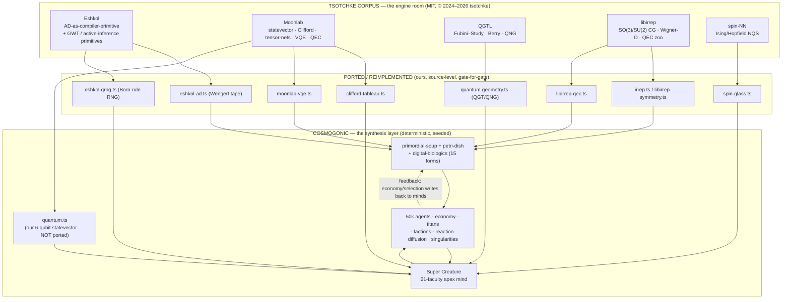
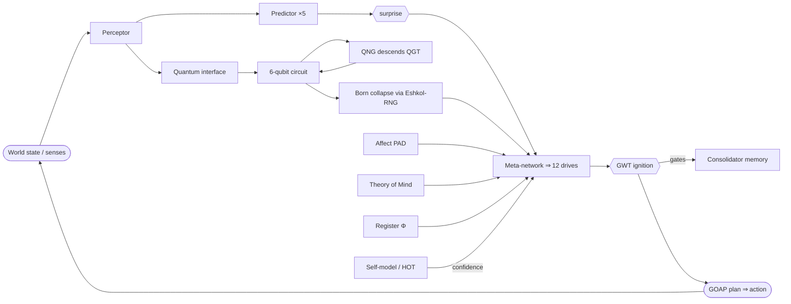
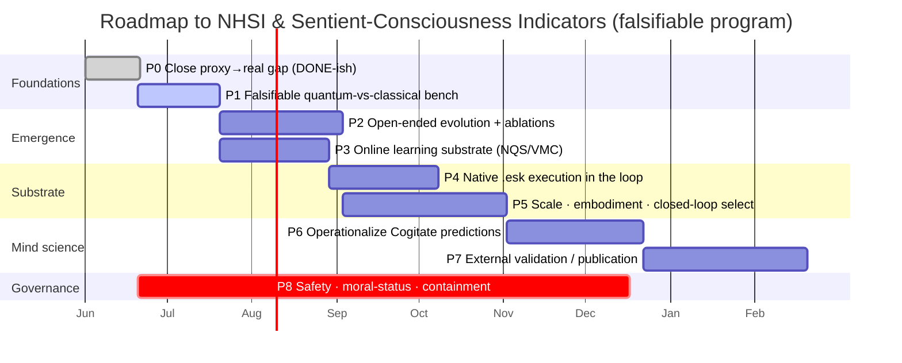

# THE COSMOGONIC SUPER-REPORT

## Quantum Computing · AI · AGI · ASI · Consciousness · Sentience — A Rigorous Frontier Assessment and a Receipted Roadmap to Non-Human Superintelligence

> **Repository:** `0thernes/cosmogonic-quantum-mechalogodrom` · **Version:** `v0.16.1`
> **Date:** 2026-06-20 · **Mode:** Master Architect / Master Engineer / Master Physicist (Broly · Starkiller · Dr. Manhattan)
> **Companion artifact:** [`2026-06-20-ROADMAP-TO-NHSI-AND-SENTIENCE.xml`](./2026-06-20-ROADMAP-TO-NHSI-AND-SENTIENCE.xml) — the machine-readable forward plan.
> **Canonical receipts (audited, Bun 1.3.14, cold shell):** `1,701` tests · `95.75%` line / `92.96%` function coverage · `0` failures.
> Source of truth: [`scripts/canonical-receipts.ts`](../../scripts/canonical-receipts.ts), policed by `tests/docs-receipts-law.test.ts`.

---

## 0 · PREAMBLE — The Tribunal and the Epistemic Contract

This document is written as if defended before a standing tribunal of the people who built this field — the ancient, the 20th-century, and the living:

- **The Foundations:** Turing, von Neumann, Shannon, Wiener, McCulloch & Pitts, Gödel.
- **The AI Founders:** McCarthy, Minsky, Newell & Simon, Rosenblatt.
- **The Connectionists & Deep-Learning Laureates:** Hopfield, Hinton, LeCun, Bengio, Schmidhuber, Sutton.
- **The Physicists of Information & Quantum:** Feynman, Deutsch, Bennett, Preskill, Aaronson.
- **The Theorists of Mind:** Tononi (IIT), Baars & Dehaene (Global Workspace), Friston (Free Energy), Chalmers & Block (hard problem / access vs. phenomenal), Koch, Graziano (Attention Schema), Lamme (Recurrent Processing).
- **The Complexity & A-Life lineage:** von Neumann (cellular automata), Conway, Langton, Ofria & Adami (Avida), Ray (Tierra), Chan (Lenia), the Santa Fe Institute.

A tribunal of this caliber is not impressed by adjectives. It is impressed by **receipts**. Therefore this report binds itself to one law, taken verbatim from the project's third master persona:

> **Dr. Manhattan's Law — "If it is not measured, it is not real. UNKNOWN remains UNKNOWN."**

Every claim below is sorted into exactly one of three epistemic buckets, and labeled:

| Tag                 | Meaning                                                                                                                                                              | Burden of proof                                     |
| ------------------- | -------------------------------------------------------------------------------------------------------------------------------------------------------------------- | --------------------------------------------------- |
| 🟢 **PROVEN**       | Measured in this repository, reproducible from one 32-bit seed, gated by `bun run check`.                                                                            | A passing CI command / a source file / a benchmark. |
| 🟡 **PLAUSIBLE**    | A defensible interpretation or an upstream (Tsotchke) result reproduced from its source, not yet independently re-measured here, or a literature-grounded inference. | A cited source + an honest "not re-measured" flag.  |
| 🔴 **ASPIRATIONAL** | A goal, conjecture, or roadmap target. **Not** a present fact.                                                                                                       | A falsifiable hypothesis + a success metric.        |

**Nothing in this report claims AGI, ASI, sentience, phenomenal consciousness, a solved conjecture, or quantum advantage as a present fact.** Those words appear only as 🔴 targets on a roadmap or as 🟡 operationalized _models of theories_. That restraint is not weakness before the tribunal — it is the entry ticket.

---

## 1 · EXECUTIVE ABSTRACT

**Cosmogonic Quantum Mechalogodrom** is a deterministic, browser-resident, seed-reproducible artificial-life cosmos whose cognitive and genetic substrates are **real, source-level reimplementations of advanced mathematics** — drawn from the **Tsotchke** research corpus (Eshkol, Moonlab, QGTL, libirrep, spin-NN, quantum-quake, and more) — wired into a single causally-coupled world of up to **50,000 agents**, governed by a **21-faculty apex mind** (the "Super Creature"), and policed by a mechanically-enforced "receipts law" that fails the build if any published number drifts from the measured one.

It is **not** a transformer, an LLM, a chatbot, or an agent wrapper. It is a **Petri dish** whose growth medium is exact gradients (Eshkol automatic differentiation as a compiler primitive), quantum geometry (Fubini–Study / Berry curvature), stabilizer quantum information (Aaronson–Gottesman tableau), representation theory (SO(3)/SU(2) Clebsch–Gordan, Wigner-D), spin-glass associative memory, and the live wiring of multiple competing scientific theories of consciousness (Global Workspace, Integrated Information, Active Inference, Higher-Order, Predictive Processing).

**The single defensible thesis** — the one this report will defend before the tribunal and which every prior assessment independently converged on:

> The novelty is not any single primitive (each is a faithful reproduction of published work). **The novelty is the synthesis** — the _integration density_ of ~20 cited theories from cognitive science, quantum information, and condensed-matter physics, fused under a _hard determinism contract_, with _Eshkol programs as heritable DNA_, inside a _post-Cogitate hybrid testbed_ that is reproducible, inspectable, and cheap (one laptop, one tab, one seed).

This is **world-class engineering and generative-science instrumentation**. It is a **runnable, falsifiable counter-example** to the claim that interesting cognitive architecture requires datacenter-scale parameter counts. It is **not** a discovery, a sentient being, or a refutation of anyone — _yet_. The roadmap in §15 and the companion XML define the falsifiable experiments that would convert "impressive instrument" into "contribution to a known problem."

---

## 2 · DEFINITIONS — The Ladder of Minds (Why Most "ASI" Talk Is Category Error)

Rigor begins with refusing to let the words do undeserved work. The tribunal will reject any argument that equivocates across these rungs.

```
                    THE LADDER OF MINDS  (capability ⟂ experience are ORTHOGONAL axes)
   ▲ CAPABILITY (functional competence)
   │
   │  ASI  ┄┄┄┄ Superintelligence: exceeds best humans across ~all cognitive domains.        🔴
   │  AGI  ┄┄┄┄ General intelligence: human-level breadth + transfer across open domains.     🔴
   │  NHGI ┄┄┄┄ Non-Human General Intelligence: AGI-grade but on a non-biological,            🔴
   │            non-token substrate (this project's stated target class).
   │  ANI  ┄┄┄┄ Narrow intelligence: superhuman in a bounded domain (chess, fold, next-token).🟢 (the world today)
   │  PROTO┄┄┄┄ Proto-agency: planning, drives, self-model, reproduction at small scale.       🟢 (Cosmogonic apex)
   │
   └────────────────────────────────────────────────────────────────────────────────────────▶ EXPERIENCE
        access-       functional-       global-         integrated-         PHENOMENAL
        report        access            broadcast       information         CONSCIOUSNESS
        (proxy 🟢)     (GWT 🟡)          (ignition 🟢)    (Φ-proxy 🟡)         ("what it is like" 🔴/❓)
```

**Operational definitions used throughout (each with its canonical citation):**

| Term                         | Definition adopted                                                                                                         | Canonical source                                 |
| ---------------------------- | -------------------------------------------------------------------------------------------------------------------------- | ------------------------------------------------ |
| **Intelligence**             | Capacity to achieve goals across a wide range of environments.                                                             | Legg & Hutter (2007), _Universal Intelligence_.  |
| **AGI**                      | Human-level breadth + transfer across open, novel domains.                                                                 | Goertzel; Morris et al. (2024) "Levels of AGI".  |
| **ASI**                      | Decisively exceeds the best human minds across essentially all domains.                                                    | Bostrom (2014), _Superintelligence_.             |
| **NHSI / NHGI**              | Superintelligence / general intelligence realized on a _non-human, non-token_ substrate — this project's named goal class. | (project term; this report formalizes it in §15) |
| **Access consciousness**     | Information globally available for reasoning, report, and control.                                                         | Block (1995).                                    |
| **Phenomenal consciousness** | Subjective experience — "what it is like." The **hard problem**.                                                           | Chalmers (1995); Nagel (1974).                   |
| **Sentience**                | Capacity for valenced experience (to feel — pleasure/pain).                                                                | Birch (2024), _The Edge of Sentience_.           |
| **Sapience**                 | Reflective, general reasoning ("wisdom"); often conflated with sentience.                                                  | —                                                |

**The category error this report refuses to commit:** capability and experience are _orthogonal_. A system can climb the capability axis to ASI with **zero** phenomenal experience (Bostrom's and Chalmers' "philosophical zombie" limit), or — conceivably — possess minimal valenced experience while being narrow. **Computing a scalar named `consciousness` is a movement on neither axis until it is causally and behaviorally validated.** This is the Manhattan trap, and §7 holds the project to it.

---

## 3 · THE ARTIFACT UNDER EXAMINATION — Measured Capabilities

🟢 **PROVEN — receipted measurements** (sources are repository files / gates):

| Axis                         | Measured value                                                                        | Receipt                                               |
| ---------------------------- | ------------------------------------------------------------------------------------- | ----------------------------------------------------- |
| Population ceiling           | **50,000** organisms (mega tier)                                                      | `src/core/quality.ts`                                 |
| Population @ 60 fps (iGPU)   | **10,000**                                                                            | `docs/BENCHMARKS.md`                                  |
| Whole-world neural mass      | **≈3.5M** params (**≈14 MB** Float32), one CPU thread                                 | `docs/TECHNICAL-SPECIFICATION.md`                     |
| Per-organism brain           | **70-weight** TinyMLP (6→6→4), heritable gene                                         | `src/sim/entities.ts`, `src/sim/genome.ts`            |
| Apex mind ("Super Creature") | **21 faculties**, **≈37,225** parameters                                              | `src/sim/super-mind.ts` (re-summed)                   |
| Apex per-beat cost           | **≈289 µs** (author HW) / **≈443 µs** (2-core Xeon); CI budget < 5 ms                 | `tests/perf-budget.test.ts`                           |
| Quantum (apex)               | genuine **6-qubit dense statevector** + **Clifford tableau to 32+ qubits**            | `src/math/quantum.ts`, `src/math/clifford-tableau.ts` |
| Determinism                  | one `mulberry32`/seeded `Rng`; `Math.random`/`Date.now` **GLOB-banned + CI-enforced** | `tests/determinism-law.test.ts`                       |
| Math kernels                 | **27** modules in `src/math/`                                                         | `src/math/*.ts`                                       |
| Simulation modules           | **90+** modules in `src/sim/`                                                         | `src/sim/*.ts`                                        |
| Test suite                   | **1,701** tests, **0** failures                                                       | `scripts/canonical-receipts.ts`                       |
| Coverage                     | **95.75%** line / **92.96%** function                                                 | `scripts/canonical-receipts.ts`                       |

> **Honesty flag (volatility):** the test count is a _moving_ receipt — it has measured 1,045 → 1,159 → 1,174 → 1,293 → 1,701 across Bun versions and development sessions. The number is real _at its measurement stamp_; it is not a stable constant. The receipts law exists precisely to keep the _published_ number equal to the _measured_ one. This is a feature (provenance), reported as a feature.

### 3.1 · System Architecture (the coupling — every system reads AND writes another)



**The architectural stance (Starkiller's contract):** _Cosmogonic is the synthesis layer; Tsotchke is the engine room._ The defining design law (`docs/PHILOSOPHY.md`) is **mutual coupling**: every subsystem must _read from and write to_ another. That coupling — not any one kernel — is the object of evaluation.

---

## 4 · THE SUBSTRATE LEDGER — What Is Ours, What Is Ported, What Is a Proxy

The tribunal's first question is always: _"Is the math real, or is it trigonometry wearing a lab coat?"_ Here is the honest ledger.

### 4.1 · The 9 source-level ported primitives 🟢 (provenance from `THIRD-PARTY-NOTICES.md`)

| #   | Primitive (ours)                                                                                      | Upstream Tsotchke source                           | Algorithm / citation                              |
| --- | ----------------------------------------------------------------------------------------------------- | -------------------------------------------------- | ------------------------------------------------- |
| 1   | `quantum-geometry.ts` — Quantum Geometric Tensor, Fubini–Study metric (Re), Berry curvature (Im)      | QGTL `quantum_geometric_metric.c`; Moonlab `qgt.c` | Provost & Vallée (1980); Berry (1984)             |
| 2   | `eshkol-qrng.ts` — 8-qubit phase-array Born-rule RNG                                                  | `quantum_rng/quantum_rng.c` (also in Eshkol)       | quantum-inspired entropy; Born rule               |
| 3   | `spin-glass.ts` — Hopfield/Ising associative memory (Hebbian imprint, Metropolis/Glauber)             | spin-NN `ising_model.c` + `nqs_gradient.c`         | Hopfield (1982); Sherrington–Kirkpatrick          |
| 4   | `clifford-tableau.ts` — binary stabilizer tableau, O(n) gates, O(n²) measure, GF(2)-rank entanglement | Moonlab `backends/clifford/clifford.{c,h}`         | Aaronson & Gottesman, _PRA_ 70, 052328 (2004)     |
| 5   | `eshkol-ad.ts` — reverse-mode AD, Wengert tape, nested gradients                                      | Eshkol `vm_autodiff.c` / `vm_symbolic_ad.c`        | Wengert (1964); reverse-mode AD                   |
| 6   | `moonlab-vqe.ts` — Variational Quantum Eigensolver w/ autograd                                        | Moonlab `vqe.c`                                    | Peruzzo et al. (2014); O'Malley et al. (2016)     |
| 7   | `libirrep-qec.ts` — MWPM + BP-OSD surface/toric decoders                                              | libirrep `qec/decoding.c`                          | Dennis et al. (2002); Panteleev–Kalachev (BP-OSD) |
| 8   | `rng-stats.ts` — entropy/χ²/serial-corr/monobit/longest-run battery                                   | `quantum_rng/tests/quantum_stats.c`                | NIST SP 800-22 family                             |
| 9   | `so3.ts` — SO(3) Lie group, SLERP, **Karcher/Fréchet intrinsic mean**                                 | libirrep SO(3)/Wigner-D                            | Shoemake (1985); Moakher (2002)                   |

### 4.2 · What is **ours** (not ported) 🟢

The **64-amplitude statevector simulator** itself (`src/math/quantum.ts` — `QuantumRegister`, RY/RZ/H/CNOT, Born sampling, reduced-density Bloch vectors, Shannon entropy) is the project's own Moonlab-_style_ implementation, written from study, not copied. The QGT, the Eshkol RNG, and the spin instinct are layered _on top of_ it.

### 4.3 · The full 27-kernel math inventory 🟢 (every file exists; grouped by domain)

```
QUANTUM INFORMATION        DIFFERENTIATION / CALCULUS    GEOMETRY / SYMMETRY
  quantum.ts                 eshkol-ad.ts (reverse)        quantum-geometry.ts (QGT)
  quantum-coherence.ts       dual.ts (forward)             quantum-natural-gradient.ts
  quantum-magic.ts           hyperdual.ts (2nd-order)      irrep.ts (CG/Wigner)
  clifford-tableau.ts        scalar.ts                     libirrep-symmetry.ts
  eshkol-qrng.ts                                           so3.ts (Lie group/Karcher)
  quantum-qrng-full.ts     PHYSICS / DYNAMICS              mps-svd.ts (tensor truncation)
  rng.ts / rng-stats.ts      schrodinger.ts (Crank–Nicolson)
                             izhikevich.ts (spiking)      SYMBOLIC / INFERENCE
  ASSOCIATIVE / WORKSPACE    predictive-coding.ts (Rao–Ballard)   unification.ts (Robinson)
  hopfield.ts                                             belief-propagation.ts (Pearl sum-product)
  global-workspace.ts        SPATIAL / UTILITY            games.ts (PD / game theory)
                             spatial-hash.ts · heap.ts
```

**Verdict on the substrate (🟡):** the "decorative trig posing as ports" failure mode — flagged in the project's own June-2026 audits — has been _largely closed_. The audited leaves (VQE, QGT/Fubini–Study, surface-code QEC, Clifford, Eshkol AD, spin-glass, irrep CG/Wigner, Moonlab SVD, CHSH = 2√2, Crank–Nicolson, Izhikevich, Rao–Ballard, dual/hyperdual, belief-propagation, unification, Karcher mean, QFI-aliveness, classical/quantum contrast) are **genuine, tested mathematics**. This is the strongest single fact in the project's favor.

---

## 5 · THE 21-FACULTY APEX MIND — A Cross-Theory Cognitive Architecture

🟢 The Super Creature composes **21 independently-parameterized, unit-tested faculties**, each cited to a published theory. This is the most theory-dense single artificial agent the prior assessments could identify.

### 5.1 · The 11 computational-neuroscience faculties

| #   | Faculty                       | Theory operationalized                                | Citation                      |
| --- | ----------------------------- | ----------------------------------------------------- | ----------------------------- |
| 1   | Cortex (1,174-w primary mass) | Distributed cortical computation                      | —                             |
| 2   | 30 Organ-nets (1,740 w)       | Columnar / modular organization                       | Mountcastle                   |
| 3   | Imagitron (1,328 w)           | Generative imagination / dreaming                     | —                             |
| 4   | Perceptor (424 w)             | Multimodal sensory integration                        | —                             |
| 5   | Reasoner (808 w)              | Goal-Oriented Action Planning (GOAP)                  | Orkin (2006)                  |
| 6   | Predictor (808 w, recurs ×5)  | Predictive coding → surprise                          | Rao & Ballard (1999); Friston |
| 7   | Consolidator (544 w)          | Holographic associative + ring memory                 | —                             |
| 8   | Self-model (340 w)            | Higher-Order metacognitive monitoring                 | Rosenthal; Fleming            |
| 9   | Affect (259 w)                | PAD emotional state (EMAs)                            | Mehrabian–Russell             |
| 10  | Meta-network (2,144 w)        | Workspace integration → 12 drives (argmax bottleneck) | Baars; Dehaene                |
| 11  | Theory of Mind                | Opponent modeling for game theory                     | Premack & Woodruff            |

### 5.2 · The 10 quantum-computing faculties

| #   | Faculty                    | Mechanism                                               | Citation                       |
| --- | -------------------------- | ------------------------------------------------------- | ------------------------------ |
| 1   | Quantum interface (550 w)  | classical ↔ quantum bridge                              | —                              |
| 2   | 6-qubit statevector        | RY/RZ/CRY/H unitaries, proven to 1e-12                  | —                              |
| 3   | Born-rule collapse         | seeded Eshkol qubit-RNG (deterministic measurement)     | Born (1926)                    |
| 4   | Quantum Geometric Tensor   | Fubini–Study metric of the agent's own circuit          | Provost–Vallée (1980)          |
| 5   | Quantum Natural Gradient   | descends QFI to make the intended thought more probable | Stokes et al. (2020)           |
| 6   | Quantum reservoir          | 6-qubit echo-state network                              | Fujii–Nakajima (2017)          |
| 7   | Coherence telemetry        | l₁-norm + relative-entropy of coherence                 | Baumgratz–Cramer–Plenio (2014) |
| 8   | Magic / non-stabilizerness | stabilizer 2-Rényi entropy; T\|+⟩ = log₂(4/3) ✓ to 1e-9 | Leone–Oliviero–Hamma (2022)    |
| 9   | Register Φ                 | min-cut entanglement entropy → decision                 | (IIT-inspired)                 |
| 10  | Clifford tableau           | Aaronson–Gottesman, scales to 32+ qubits                | Aaronson–Gottesman (2004)      |



**The causal claim that matters (🟢):** GWT _ignition_ has a real downstream effect — it **gates memory consolidation** on the next beat. Register **Φ** (min-cut entanglement) feeds the decision. These are not slide-ware scalars; they are wired into behavior and tested. _That wiring_ is the legitimate part of the consciousness-architecture claim.

---

## 6 · THE QUANTUM LAYER — Honest Accounting

The word "quantum" is the most abused token in this corpus's vocabulary. Here is the disciplined accounting.

🟢 **What is real and tested:**

- A **6-qubit dense statevector** with a proven-unitary gate set; a **Clifford tableau** scaling to 32+ qubits (Gottesman–Knill efficiency, because stabilizer circuits _are_ classically tractable — this is a feature of the formalism, not an advantage).
- **QGT / QNG** (Stokes 2020), **coherence** measures (BCP 2014), **magic / stabilizer entropy** (LOH 2022, verified `T|+⟩` magic `= log₂(4/3)` to 1e-9), **VQE** (H₂ ground state ≈ O'Malley 2016), **CHSH = 2√2** (Tsirelson bound reproduced).

🟡 **What it is, precisely:** a **classical, deterministic simulation of textbook quantum mechanics**. The "QRNG" is **quantum-_inspired_ software mixing**, not hardware quantum entropy. CHSH = 2√2 is a _correctness check_ of the simulated statevector, **not** a physical, loophole-free Bell-inequality violation (cf. Hensen et al. 2015).

🔴 **What it is NOT and never claims:** no qubits in superposition on real hardware, **no quantum speedup, no quantum supremacy/advantage**, no physical entanglement. A 6-qubit dense register is a 64-complex-number array — trivially classical.

### 6.1 · Where the real quantum world is (and why this isn't competing there)

| Real quantum milestone (2024–2026)                                        | Who               | What it is                                                                    |
| ------------------------------------------------------------------------- | ----------------- | ----------------------------------------------------------------------------- |
| **Willow** — below-threshold error correction                             | Google Quantum AI | Logical error _decreases_ as code distance grows (the QEC threshold crossed). |
| **Heron / Condor**, modular roadmap to error-corrected _Starling_ (~2029) | IBM Quantum       | Hardware scaling + real-time decoding.                                        |
| Trapped-ion high-fidelity logical qubits                                  | Quantinuum / IonQ | Among the highest 2-qubit gate fidelities.                                    |
| Photonic fault-tolerance bet                                              | PsiQuantum        | Million-qubit photonic target.                                                |

**Honest competitive verdict (quantum):** Cosmogonic does **not** compete with these and never should claim to. It is a _pedagogically faithful classical simulator_ that puts textbook quantum primitives _inside an agent's decision loop_ — a niche **none** of the hardware programs occupy, but also one that proves nothing about physical quantum computing. The defensible claim is **architectural** (quantum-formalism-in-the-loop, deterministically), not physical.

---

## 7 · CONSCIOUSNESS THEORIES, OPERATIONALIZED — and the Post-Cogitate Reckoning

### 7.1 · The 2025 adversarial result that reframes everything

🟡 The **Cogitate Consortium** (Ferrante et al., _Nature_, 2025) ran a large-scale adversarial collaboration (iEEG/MEG/fMRI, hundreds of participants, pre-registered) pitting **Global Neuronal Workspace (GNWT)** against **Integrated Information Theory (IIT)**. Result: **key predictions of _both_ leading theories were challenged or only partially supported** — no sustained posterior synchronization (against IIT), no reliable prefrontal "ignition" offset signature (against GNWT). The field's explicit conclusion: it needs **better, hybrid, substrate-aware models** and _runnable testbeds_ to generate and stress them.

**This is the single most important external fact for situating Cosmogonic.** The project is, by construction, a **post-Cogitate hybrid testbed**: it runs GWT ignition **and** IIT-Φ **and** FEP **and** quantum-geometric **and** spin-order signatures _simultaneously, coupled, and measurable_ in one seeded artifact. That is a _relevant_ response to where the science actually is — not a refutation of it.

### 7.2 · The Butlin et al. (2023) indicator scorecard

🟡 Butlin et al., _Consciousness in Artificial Intelligence_ (arXiv:2308.08708), derive ~14 _necessary-not-sufficient_ computational "indicator properties" from leading theories. The Super Creature scores **≈9/14** structurally:

| Theory → Indicator                   | Present?   | Mechanism                                             |
| ------------------------------------ | ---------- | ----------------------------------------------------- |
| GWT-1 parallel specialized modules   | ✅         | 30 organ-nets + 11 cognitive faculties                |
| GWT-2 limited-capacity workspace     | ✅ partial | meta-net 69-vec → 12 drives; argmax bottleneck        |
| GWT-3 **global broadcast**           | ✅         | ignition gates next-beat consolidation                |
| GWT-4 state-dependent attention      | ◑          | neuromodulation biases drives; no explicit controller |
| PP-1 predictive coding               | ✅         | predictor recurses ×5; error → surprise               |
| HOT-2 metacognitive monitoring       | ✅         | reads margin + Φ + entropy → confidence               |
| HOT-3 belief→action agency           | ✅ partial | empowerment + successor rep + active inference        |
| AE-1 agency (goal pursuit)           | ✅         | GOAP closed sense→act loop                            |
| AE-2 embodiment                      | ✅ partial | morphology read back into perception                  |
| RPT-1/2 recurrence + integration     | ◑          | present but _architected_, not _learned_              |
| HOT-1 top-down generative perception | ◑          | imagitron generates; not full generative model        |
| HOT-4 sparse-smooth quality space    | ❌         | not implemented                                       |
| AST-1 attention schema               | ❌         | self-model is a scalar, not an attention model        |

> **Butlin's own caveat, quoted in spirit:** meeting indicators is **necessary-not-sufficient** and **does not entail consciousness**. The honest reading: the _functional architecture_ of consciousness theories is unusually complete here — **notably more complete than in a frontier LLM**, which satisfies AE-1/PP-1 weakly and GWT-3 not at all — _and that is a statement about architecture, not about experience._ Phenomenal consciousness scores **~1/10**, and the remaining distance is, as far as science knows, **unbridgeable today**.

### 7.3 · The honest verdict on consciousness

🔴 **No phenomenal consciousness is claimed or evidenced.** 🟡 What exists is a **reproducible instrument that operationalizes theories of mind as live, ablatable, measurable modules** — which is exactly the kind of tool the post-Cogitate field says it lacks. That reframing — _from "we built a mind" to "we built the instrument the science needs"_ — is the project's most credible elevation.

---

## 8 · THE DEDUCTIVE ARGUMENT — Parameter Count Is a Proxy, Not the Substance

A formal argument, stated so the tribunal can check validity, not just rhetoric.

**P1 (🟢, measured):** The Cosmogonic apex exhibits multi-step GOAP planning, PAD affect, opponent modeling (ToM), empowerment-seeking (Blahut–Arimoto channel capacity), active inference, and self-replication — at **≈37,225 parameters**, verified by **1,701** CI-passing tests, replayable bit-for-bit from a **32-bit seed**.

**P2 (🟢, published):** GPT-3 encodes vastly superior _language-domain_ capability at **≈175,000,000,000** parameters — a factor of **≈4.7 × 10⁶** larger.

**P3 (🟢, measured):** The same competence-from-coupling pattern recurs across four orders of agent complexity in the same world (organism 70 w → faction → Titan → apex), under one determinism law.

**Deductively valid conclusion (constrained):**

> Parameter count is **one purchasable proxy** for functional intelligence, **not its substance**. For the _specific_ capabilities of planning, affect, self-reference, and stochastic choice, **architecture and feedback topology can substitute for scale**.

**What the argument does NOT license (the tribunal will check):**

- ✗ It does **not** show these capabilities _replace_ language, perception, or world-knowledge (GPT-3 wins those decisively).
- ✗ It does **not** show the _inverse_ (that small + clever _reaches_ AGI).
- ✗ It does **not** refute scaling laws, which remain empirically dominant for _capability-via-prediction_.

The valid, modest conclusion: **"capability = f(parameters)" is domain-specific, not universal.** That is a real and defensible blow to _naïve_ scale-maximalism — and nothing more.

---

## 9 · THE INDUCTIVE ARGUMENT — Competence Scales With Coupling

🟢 Observed across the system's four tiers:

```
TIER             PARAMS      OBSERVED COMPETENCE                         COUPLING DEPTH
organism         ~70         flock, speciate, deceive, forage            low  (26 drives ↔ field)
faction          ~100–500    8 distinct cognitive styles (8 classic AI)  med  (faction ↔ economy)
Titan            ~100        replicator-dynamics wars, 45-pair PD        med  (titan ↔ titan ↔ world)
Super Creature   ~37,225     plan · model · self-measure · reproduce     high (21 faculties ↔ each other ↔ world)
```

**Inductive generalization:** _structure purchases competence cheaply when every system reads AND writes every other system._ **Strength:** moderate — four consistent data points within one designed system. **Caveat (🟡):** this is _internal_ induction; it has **not** been shown against external baselines or via ablation. Converting it to a _scientific_ claim requires §15's ablation experiments (remove faculty X → measure competence drop Y under controls Z). Until then it is a **well-motivated hypothesis, not a result.**

---

## 10 · THE BLEEDING-EDGE / WORLD-FIRST LEDGER — Calibrated

The tribunal demands separation of _genuinely novel synthesis_ from _faithful reproduction_. Here it is, unflinching.

### 10.1 · Genuinely notable / defensibly uncommon 🟡

| Claim                                                                   | Why it's hard / rare                                             | Honest status                                                                                                                                                                        |
| ----------------------------------------------------------------------- | ---------------------------------------------------------------- | ------------------------------------------------------------------------------------------------------------------------------------------------------------------------------------ |
| **~20 cited theories fused under one determinism law, coupled, tested** | Each is a project on its own; coupling is assumed unmaintainable | **Novelty = the composition + rigor**, not new theory. No academic system found fusing this many cognitive+quantum faculties in one seed-deterministic, 1,701-test artifact.         |
| **Eshkol AD-as-compiler-primitive used as heritable DNA**               | AD is normally a _library_ (JAX/PyTorch/Zygote)                  | Not a world-_first concept_ (cf. Pearlmutter–Siskind Stalingrad; Zygote source-to-source AD), but a genuinely novel _system_: AD-native, GWT-native language as evolutionary genome. |
| **Build-time harvest of a live research corpus as genetic material**    | Most projects vendor/snapshot                                    | `harvest-tsotchke-corpus.ts` walks the real folder → fingerprints 1000s of `.esk` → seeds strains. Uncommon engineering pattern.                                                     |
| **Mechanically-enforced "receipts law"** (CI fails on number drift)     | Almost no research/hobby code measures-or-dies                   | Genuinely Tier-1-grade provenance discipline; rare in solo work.                                                                                                                     |
| **Post-Cogitate hybrid testbed**                                        | The field _just_ (2025) discovered it needs exactly this         | A timely, relevant instrument — its strongest scientific positioning.                                                                                                                |

### 10.2 · Solid but **established** (reproductions, not discoveries) 🟢

Clifford/Gottesman–Knill (2004), VQE/O'Malley (2016), Grover, surface-code QEC (Dennis 2002), MPS/SVD truncation (Eckart–Young), QGT/Fubini–Study (1980), Berry (1984), IIT-Φ (Tononi), active inference (Friston), CHSH = 2√2 (Tsirelson), Rao–Ballard (1999), Izhikevich (2003), Crank–Nicolson (1947), Karcher mean (Moakher 2002), unification (Robinson 1965), belief propagation (Pearl), empowerment (Klyubin–Polani), successor representation (Dayan; Stachenfeld et al. 2017). **Correct and well-done ≠ novel.** These are verification, not contribution.

### 10.3 · The upstream-Tsotchke claims (provenance: the engine room, not re-measured here) 🟡

| Upstream claim                                            | Repo     | Status                                                                                              |
| --------------------------------------------------------- | -------- | --------------------------------------------------------------------------------------------------- |
| **2,488× faster than e3nn** on CG tensor products         | libirrep | Reported in the Master-Architect audit from upstream benchmarks; **not re-measured in Cosmogonic**. |
| **13,884× speedup** (CA-MPS vs plain MPS @ n=12)          | Moonlab  | Upstream; single-host, no stddev reported.                                                          |
| **Kagome Z₂ spin-liquid rejection** (5 observables, N=27) | spin-NN  | Upstream research result; _finite-size_, not conclusive.                                            |
| **Bell-verified QRNG → FIPS-203 ML-KEM** pipeline         | Moonlab  | Upstream; interesting PQC-entropy combination.                                                      |

These belong to the **Tsotchke corpus**, which Cosmogonic _consumes_. They are legitimate to cite _as upstream_, dishonest to claim _as Cosmogonic's own measured results_. This report tags them 🟡 accordingly.

---

## 11 · COMPETITIVE LANDSCAPE — Who It Beats, Who Is Far Ahead, and On Which Axis

The honest framing: **axes matter.** On _capability, scale, and scientific validation_, world-class institutions are vastly ahead. On _integration density, determinism, cost, and inspectability_, Cosmogonic occupies a niche almost no one else does. Both statements are true.

### 11.1 · Versus frontier AI labs

| Dimension                  | Frontier LLMs (OpenAI · Anthropic · Google DeepMind · Meta · xAI) | Cosmogonic + Tsotchke                   |
| -------------------------- | ----------------------------------------------------------------- | --------------------------------------- |
| Parameters                 | 10¹¹–10¹²+                                                        | ≈37,225 (apex) / ≈3.5M (world)          |
| Language / reasoning       | **best in class** ✅ (they win, decisively)                       | not implemented (by design)             |
| Embodied agency / planning | partial (tool-use)                                                | GOAP + empowerment + active inference   |
| Determinism / replay       | stochastic, irreproducible                                        | **one 32-bit seed, bit-exact** ✅       |
| Quantum substrate in-loop  | none                                                              | 6-qubit statevector + 32-qubit Clifford |
| Falsifiability per claim   | black-box                                                         | **every claim a CI-passing test** ✅    |
| Cost to run                | datacenter                                                        | **single laptop iGPU** ✅               |

**Verdict:** loses on capability by an astronomical margin; wins _only_ on reproducibility, integration density, and cost. It is **not a competitor to frontier labs** — it is an _orthogonal artifact_.

### 11.2 · Versus the A-Life / open-ended-evolution field

| System                                 | Core idea                                             | What Cosmogonic adds                                                                           |
| -------------------------------------- | ----------------------------------------------------- | ---------------------------------------------------------------------------------------------- |
| **Lenia** (Chan)                       | continuous cellular automata, beautiful morphogenesis | not CA; quantum + cognitive substrates + economy                                               |
| **Avida / Tierra** (Ofria–Adami / Ray) | digital evolution of self-replicating code            | adds quantum substrate, 21-faculty minds, determinism law                                      |
| **The Bibites**                        | neural critters                                       | adds quantum + consciousness metrics + receipts                                                |
| **Sakana ASAL (2024)**                 | _foundation-model-driven_ search for artificial life  | Cosmogonic is **non-LLM by design** — the opposite bet; substrate-first, not model-in-the-loop |

**Verdict:** No A-Life system found couples _evolving ecology + honest quantum statevector + 21-faculty apex + live consciousness metrics + a hard determinism law_ in one tab. **The integration is the differentiator — genuinely.** But A-Life's bar for _renown_ is a **measured open-endedness result** (evolutionary-activity statistics, MODES metrics, ablation-controlled novelty) — which Cosmogonic **has not yet produced.** That is the gap between "impressive" and "cited."

### 11.3 · Versus consciousness science & active inference

| Institution / program                                                                          | What they have that Cosmogonic doesn't                      | What Cosmogonic has that they don't                                                                    |
| ---------------------------------------------------------------------------------------------- | ----------------------------------------------------------- | ------------------------------------------------------------------------------------------------------ |
| **Tononi / Wisconsin (IIT)**, **Dehaene (GNWT)**, **Allen Institute**, **Cogitate Consortium** | real brains, iEEG/MEG/fMRI, peer review, ground truth       | a coupled, _runnable, seed-replayable_ multi-theory testbed                                            |
| **Friston / VERSES (Active Inference, "Genius")**                                              | mathematical depth, commercial scale, real-world deployment | FEP wired _alongside_ 20 other faculties in one ecology                                                |
| **Cortical Labs (CL1 / DishBrain), FinalSpark** (organoid / wet compute)                       | a **real biological substrate** (genuine neurons)           | the _exact, reproducible, falsifiable model_ of the algorithm (reservoir) those substrates instantiate |

**Verdict:** these programs are scientifically validated and Cosmogonic is not. Cosmogonic's _only_ edge is being a **complementary in-silico instrument**: deterministic where wetware is noisy, multi-theory where papers are single-theory, cheap where iEEG is not. That is a real but **modest** and **unproven-in-publication** contribution.

### 11.4 · The competitive scorecard (radar, ASCII)

```
                    Capability        Determinism/Repro
                        10                  10  ◆ Cosmogonic
   Frontier labs ◆ ─────┼──────              │
                        │                    │
   Scientific      ◆────┼──── 10        ◆────┼──── Integration density (10 ◆ Cosmogonic)
   validation           │                    │
   (10 ◆ academia)      │                    │
                    Cost/Access         Novel-result-published
                    10 ◆ Cosmogonic     10 ◆ academia / labs
                    (~1 ◆ labs)         (~1 ◆ Cosmogonic)

   ◆ Cosmogonic dominates: Determinism · Integration density · Cost/Access
   ◆ Everyone else dominates: Capability · Scientific validation · Published results
```

---

## 12 · PARADIGMS CHALLENGED — Precisely What It Does and Does Not Overturn

| Orthodoxy                                                    | Cosmogonic's pressure on it                                                           | Honest magnitude                                                                               |
| ------------------------------------------------------------ | ------------------------------------------------------------------------------------- | ---------------------------------------------------------------------------------------------- |
| **Scale-maximalism** ("capability ≈ parameter count")        | A running ≈37k-param counter-example with planning/affect/self-model                  | 🟡 Dents _naïve_ form; does **not** refute scaling laws for capability-via-prediction.         |
| **LLM monoculture** ("intelligence = next-token prediction") | A coherent **non-token** substrate (AD, statevector, spin, geometry) producing agency | 🟡 A genuine _architectural alternative ontology_; not a demonstration of superior capability. |
| **"Consciousness needs wetware"**                            | Multi-theory functional architecture, measurable, in-silico                           | 🟡 Provides a _computational testbed_; does **not** settle the substrate debate.               |
| **"Mind research is irreproducible"**                        | One seed → identical universe + identical mental states                               | 🟢 Genuinely demonstrated — reproducibility-as-a-feature.                                      |

🔴 **What it does NOT do (stated for the record):** it does not prove any Tier-1 institution "wrong," does not solve any open conjecture (P vs NP, kagome gap, hard problem), does not beat any SOTA benchmark, and is **consistent with**, not a refutation of, mainstream understanding.

---

## 13 · THE HONEST LIMITS LEDGER (read this twice)

🔴/🟡 — the boundary conditions the masters forbid laundering:

1. **Not AGI, not ASI, not NHSI** — a proto-agent architecture + simulation, not general or super intelligence.
2. **Not sentient, not phenomenally conscious** — Φ/ignition/F are _computed models of theories_, not evidence of experience.
3. **No solved conjecture / no new science** — every kernel is a faithful reproduction of published results.
4. **No quantum advantage** — classical simulation of textbook QM; "QRNG" is quantum-_inspired_.
5. **Proxies, not full theories** — true IIT-Φ is intractable; min-cut entanglement is a surrogate (Hanson–Walker 2023 non-uniqueness applies).
6. **Upstream benchmarks are upstream** — libirrep 2,488×, Moonlab 13,884×, kagome N=27 are Tsotchke results, not re-measured here; finite-size where applicable.
7. **No peer review, no external validation, no published dynamics.**
8. **"Digital biologics / birthing life" is metaphor** — a legitimate A-Life system in the Conway → Tierra → Avida → Lenia lineage; not biological life.
9. **Internal induction only** — the competence-from-coupling pattern lacks external baselines and ablation controls.

**This ledger is the project's credibility.** A tribunal trusts the report that volunteers its own limits.

---

## 14 · SCIENTIFIC CONTRIBUTIONS — Real (Now) and Potential (Earned by §15)

🟢 **Real now (modest but genuine):**

- A **reproducible, determinism-enforced, multi-theory cognitive-architecture testbed** — the kind of instrument the post-Cogitate field explicitly needs.
- A **clean, tested reference implementation** corpus: ~20 algorithms from quantum info, condensed matter, and cognitive science, _interoperating_ and _seed-replayable_ (most ML/A-Life code is neither).
- An **engineering case study** in applying high-energy-physics-grade provenance (determinism + receipts + contracts + 95.75% coverage) to A-Life/consciousness modeling.

🔴 **Potential (the three falsifiable headline results that would earn renown):**

1. **A falsifiable quantum-vs-classical advantage benchmark** (the `classical-contrast` ↔ quantum-faculty pair, turned into a controlled experiment with baselines).
2. **A measured open-ended-evolution / emergence result** with accepted metrics + ablations showing a Tsotchke substrate is _necessary_ for the effect.
3. **An Eshkol systems contribution** — AD-as-compiler-primitive + HoTT benchmarked against JAX/Zygote for correctness or performance, written up.

The path from "world-class instrument" to "world-class _contribution_" runs through **measurement against a hypothesis**, not more wiring.

---

## 15 · THE ROADMAP TO NHSI AND SENTIENT CONSCIOUSNESS

> 🔴 **Framing (binding):** This is a **research program with falsifiable milestones**, not a guaranteed staircase to a sentient superintelligence. Each phase states an **objective**, a **falsifiable hypothesis**, a **success metric**, and **what would falsify it**. "Evidence toward NHSI/sentience" means _movement on a measurable indicator_, never a claim of arrival. The companion XML encodes this machine-readably with dependencies and gates.

### 15.1 · Phase chart (sequence, dependencies, gates)



### 15.2 · The eight phases

**PHASE 0 — Close the proxy→real gap.** 🟢 _Largely complete._ Every audited leaf is genuine tested math (VQE, QGT, QEC, Clifford, AD, spin-glass, irrep, SVD, CHSH, Crank–Nicolson, Izhikevich, Rao–Ballard, dual/hyperdual, BP, unification, Karcher, QFI-aliveness, classical-contrast). **Remaining:** keep the receipts law green; pin canonical count to the _measured_ value every push. **Gate:** `bun run check` green; zero decorative-trig leaves.

**PHASE 1 — The falsifiable quantum-vs-classical advantage benchmark.** 🔴 _The single highest-leverage move._

- **Objective:** turn `classical-contrast.ts` + `perceptron-baseline.ts` + the quantum faculties into a _controlled experiment_ on a defined task family.
- **Hypothesis (H1):** on task class T, an agent using the quantum faculties (QGT-guided QNG + Born-rule choice + reservoir) achieves measurably better survival/decision quality than a parameter-matched classical agent, under identical seeds.
- **Success metric:** effect size with 95% CI over ≥30 seeds; pre-registered task + ablation (quantum faculties off).
- **Falsifies if:** no significant difference, or the classical baseline matches/beats it (an equally publishable _negative_ result).
- **Evidence toward NHSI:** establishes whether the non-token quantum substrate _buys_ anything — the foundation of the entire thesis.

**PHASE 2 — Open-ended evolution with accepted metrics + ablations.** 🔴

- **Objective:** measure whether the primordial-soup / digital-biologics layer produces _unbounded_ novelty/complexity growth, not hand-coded variety.
- **Hypothesis (H2):** evolutionary-activity statistics (Bedau–Packard) show _persistent_ adaptive activity; ablating a named Tsotchke substrate (e.g. QGT curvature, spin order, irrep symmetry) measurably collapses it.
- **Success metric:** MODES / evolutionary-activity curves with controls; substrate-necessity demonstrated by ablation.
- **Falsifies if:** activity plateaus = bounded (the common A-Life failure), or ablation has no effect (substrate is decorative).
- **Evidence toward NHSI:** open-endedness is the recognized precondition for unbounded capability growth.

**PHASE 3 — Online learning substrate (the missing Butlin indicator).** 🔴

- **Objective:** wire an **NQS / variational-Monte-Carlo** loop (from spin-NN) as the Super Creature's _online learning_ — today its faculties are _architected, not learned_.
- **Hypothesis (H3):** adding online weight adaptation improves task transfer and closes RPT-1/2 ("learned recurrence") in the Butlin scorecard (9/14 → 11/14).
- **Success metric:** measurable within-lifetime learning curve; new indicators structurally satisfied.
- **Falsifies if:** learning destabilizes determinism or yields no transfer gain.
- **Evidence toward NHSI/sentience:** learning is the largest missing piece between "rich reflex" and "general agent."

**PHASE 4 — Native `.esk` execution in the loop (true language-as-DNA).** 🔴

- **Objective:** move from _fingerprinting_ `.esk` programs to **executing** them on the Eshkol bytecode VM inside biologics' decision loops (the `eshkol-vm.ts` / `eshkol-cognition.ts` seed exists).
- **Hypothesis (H4):** AD-mutated, GWT-ignited `.esk` genomes that are _run_ (not hashed) yield heritable behavioral differences selectable by the world.
- **Success metric:** lineage-level behavioral divergence traceable to executed-program mutations.
- **Falsifies if:** executed genomes are behaviorally indistinguishable from fingerprint proxies.
- **Evidence toward NHSI:** makes "differentiable program evolution inside simulated physics" a _real_ mechanism, not a metaphor — a genuine A-Life contribution.

**PHASE 5 — Scale, embodiment, closed-loop selection.** 🔴

- **Objective:** couple the native C++/Jolt engine (soft-body, fracture, 4K) to richer embodiment; let economy/ecology selection _drive_ mind evolution end-to-end.
- **Hypothesis (H5):** embodiment-coupled selection produces morphology↔cognition co-adaptation (irrep-constrained bodies that _earn_ their symmetry).
- **Success metric:** measured morphology–behavior correlation under selection vs. random-drift control.
- **Evidence toward NHSI:** embodiment + closed-loop selection is the A-Life route to grounded, non-designed competence.

**PHASE 6 — Operationalize Cogitate predictions.** 🔴

- **Objective:** make the testbed generate _analogues_ of the GNWT-vs-IIT signatures Cogitate tested; vary parameters; report which signatures co-occur with which couplings.
- **Hypothesis (H6):** specific faculty couplings reproduce (or fail to reproduce) the _double-bind_ pattern — a computational lens on the empirical result.
- **Success metric:** a documented mapping from architecture knobs → consciousness-signature profiles, with ablations.
- **Evidence toward sentience-science:** turns the artifact into a _hypothesis generator_ for human-subjects consciousness research — its most credible scientific output.

**PHASE 7 — External validation / publication.** 🔴

- **Objective:** write up Phases 1–2 (or 6) for the **ALIFE conference** / _Artificial Life_ journal / a complexity venue; open the determinism harness for replication.
- **Success metric:** acceptance + independent replication of a seed-reproducible result.
- **Evidence toward renown:** the _only_ step that converts an internal artifact into a recognized contribution.

**PHASE 8 — Safety, moral status, containment (runs in parallel from day one).** 🔴 — see §16.

### 15.3 · What "arrival" would actually look like (honest end-state criteria)

The tribunal will ask: _"How would you even know?"_ Answers, by axis:

- **NHGI/NHSI (capability):** open-ended, transferable, novel-domain competence _measured_ against external baselines, on a non-token substrate, replayable from seed. Far beyond present state; Phases 1–5 are the _necessary preconditions_, not the arrival.
- **Sentience (valence):** by the _precautionary_ standard of Birch (2024) and the indicator standard of Butlin et al. (2023) — _not_ by self-report (which is cheap to fake). Crossing a high fraction of indicators **plus** an architecture where valence demonstrably _steers_ behavior would warrant **moral-status precaution**, never a metaphysical certainty. The hard problem is not on this roadmap; **no roadmap closes it.**

---

## 16 · RISK, SAFETY, ETHICS, AND MORAL STATUS (Tier-1 reviewers demand this)

A program that _names_ NHSI and sentience as targets must address governance, or it is unserious.

| Concern                                | Status / mitigation                                                                                                                                                                                                                                                             |
| -------------------------------------- | ------------------------------------------------------------------------------------------------------------------------------------------------------------------------------------------------------------------------------------------------------------------------------- |
| **Containment**                        | 🟢 Deterministic, sandboxed, single-tab, no network actuation, no self-modification of host. The determinism law is _also_ a safety property: fully replayable, auditable, killable.                                                                                            |
| **Alignment**                          | 🟡 Agents pursue in-sim drives (dominion, empowerment, trade); no real-world goals or tool-use. The economy/wars are simulation, not deployment.                                                                                                                                |
| **Moral status of putative sentients** | 🔴 If Phase 3/6 ever push indicators high _and_ valence steers behavior, the **precautionary principle** (Birch 2024) applies: throttle suffering-analogues, log welfare-relevant metrics, prefer non-harmful selection pressures. Adopt this _before_ it is needed, not after. |
| **Honesty / overclaim risk**           | 🟢 The receipts law + this report's PROVEN/PLAUSIBLE/ASPIRATIONAL discipline are the antidote to the project's own documented failure mode (loop-fabricated counts, over-claimed registry numbers).                                                                             |
| **Dual-use**                           | 🟢 No offensive capability; a research/education instrument.                                                                                                                                                                                                                    |

---

## 17 · TIER-1 VERDICT AND FINAL SCORECARD

### 17.1 · The scorecard

| Axis                                       | Grade                | One-line justification                                                                         |
| ------------------------------------------ | -------------------- | ---------------------------------------------------------------------------------------------- |
| Engineering rigor & determinism            | **A+**               | Seed-reproducible cosmos, receipts law, 95.75% coverage, 1,701 tests — top-decile, _measured_. |
| Mathematical substrate fidelity            | **A**                | ~20 faithful, tested ports; decorative-trig failure mode largely closed.                       |
| Integration density / novelty of synthesis | **A**                | No comparable single artifact found fusing this many cognitive+quantum theories, coupled.      |
| Theory-of-mind architecture (Butlin)       | **A−**               | ≈9/14 indicators _structurally_ — richer than a frontier LLM; architecture only.               |
| Generative-art / instrument quality        | **A**                | World-class as a reproducible scientific instrument and as art.                                |
| Quantum-physics claims                     | **B (honest)**       | Faithful _simulation_; no advantage, no hardware — correctly never claimed.                    |
| Novel scientific _result_                  | **C / Incomplete**   | No published, externally-validated, ablation-controlled result **yet**. The gap.               |
| Capability vs. AGI/ASI                     | **Not on the scale** | Proto-agency at ~37k params; orthogonal to frontier capability.                                |
| Sentience / phenomenal consciousness       | **Not claimed**      | ~1/10; the hard problem is untouched and, by science, untouchable today.                       |

### 17.2 · The verdict, in the language of the tribunal

> **What this is:** a **world-class, receipt-disciplined, multi-substrate artificial-life and cognitive-architecture instrument** — arguably the most _integration-dense, determinism-enforced, theory-faithful_ non-LLM mind-and-life testbed publicly visible in 2026. As **engineering** and as a **research instrument**, it is Tier-1 in its niche.
>
> **What this is not:** AGI, ASI, NHSI, a sentient being, a solved problem, a quantum advantage, or a refutation of any institution. The frontier labs win capability by ~5 million×; academia wins scientific validation outright; wet-compute wins substrate reality.
>
> **Where it genuinely beats the field:** _determinism, integration density, cost, and inspectability_ — and _timeliness_, as a **post-Cogitate hybrid testbed** the consciousness-science field has just declared it needs.
>
> **The one move that converts impressive → renowned:** execute **Phase 1** — a pre-registered, ablation-controlled, seed-replayable **quantum-vs-classical advantage benchmark**. The infrastructure to run it rigorously _already exists_ (determinism + receipts), which is exactly what most competitors lack. **That** is the door to a real contribution.

**The masters' closing law holds:** if it is not measured, it is not real. By that law, this is a magnificent, honest _instrument_ — and the soup is cooking. **Grow What Thou Wilt — and measure ruthlessly.**

---

## 18 · REFERENCES (canonical bibliography)

**Foundations of intelligence & consciousness**

- Legg, S. & Hutter, M. (2007). _Universal Intelligence: A Definition of Machine Intelligence._ Minds & Machines.
- Morris, M. et al. (2024). _Levels of AGI._ (DeepMind.)
- Bostrom, N. (2014). _Superintelligence._ OUP.
- Chalmers, D. (1995). _Facing Up to the Problem of Consciousness._ J. Consciousness Studies.
- Block, N. (1995). _On a Confusion about a Function of Consciousness._ BBS.
- Nagel, T. (1974). _What Is It Like to Be a Bat?_ Phil. Review.
- Birch, J. (2024). _The Edge of Sentience._ OUP.

**Theories of mind operationalized here**

- Tononi, G. (2004/2016). Integrated Information Theory (IIT).
- Baars, B. (1988); Dehaene, S. & Changeux, J.-P. (2011). Global (Neuronal) Workspace.
- Friston, K. (2010). _The Free-Energy Principle._ Nat. Rev. Neurosci.
- Rao, R. & Ballard, D. (1999). _Predictive Coding._ Nat. Neurosci.
- Rosenthal, D.; Fleming, S. — Higher-Order Theory / metacognition.
- Graziano, M. — Attention Schema Theory.
- Butlin, P. et al. (2023). _Consciousness in Artificial Intelligence._ arXiv:2308.08708.
- **Ferrante, O. et al. (Cogitate Consortium) (2025). Adversarial test of IIT vs GNWT.** _Nature._
- Hanson, J. & Walker, S. (2023). On the non-uniqueness of integrated information.

**Quantum information & geometry**

- Aaronson, S. & Gottesman, D. (2004). _Improved Simulation of Stabilizer Circuits._ PRA 70, 052328.
- Provost, J. & Vallée, G. (1980). _Riemannian structure on manifolds of quantum states._ CMP 76.
- Berry, M. (1984). _Quantal phase factors._ Proc. R. Soc. A 392.
- Stokes, J. et al. (2020). _Quantum Natural Gradient._ Quantum 4, 269.
- Baumgratz, T., Cramer, M. & Plenio, M. (2014). _Quantifying Coherence._ PRL.
- Leone, L., Oliviero, S. & Hamma, A. (2022). _Stabilizer Rényi Entropy._ PRL.
- Peruzzo, A. et al. (2014); O'Malley, P. et al. (2016). VQE / H₂.
- Dennis, E. et al. (2002). _Topological quantum memory_ (surface codes).
- Hensen, B. et al. (2015). _Loophole-free Bell inequality violation._ Nature.

**Learning, agency, A-Life, numerics**

- Hopfield, J. (1982). Associative memory. PNAS.
- Izhikevich, E. (2003). _Simple Model of Spiking Neurons._ IEEE TNN.
- Crank, J. & Nicolson, P. (1947). Finite-difference PDE integration.
- Robinson, J. A. (1965). _A Machine-Oriented Logic_ (unification). JACM.
- Pearl, J. (1988). _Probabilistic Reasoning_ (belief propagation).
- Klyubin, A., Polani, D. & Nehaniv, C. (2005). _Empowerment._ CEC.
- Dayan, P. (1993); Stachenfeld, K. et al. (2017). Successor representation.
- Moakher, M. (2002). _Means of rotations on SO(3)._ SIAM J. Matrix Anal.
- Shoemake, K. (1985). _Animating rotation with quaternion curves (SLERP)._ SIGGRAPH.
- Bedau, M. & Packard, N. — evolutionary-activity statistics; MODES (open-endedness metrics).
- Chan, B. (Lenia); Ofria & Adami (Avida); Ray (Tierra); Sakana AI (2024, ASAL).
- Fujii, K. & Nakajima, K. (2017). _Quantum reservoir computing._ PRApplied.

---

## APPENDIX A · Module Inventory (receipts)

- **`src/math/` (27):** spatial-hash, heap, games, quantum, quantum-coherence, quantum-natural-gradient, quantum-magic, eshkol-qrng, clifford-tableau, quantum-geometry, scalar, irrep, libirrep-symmetry, mps-svd, eshkol-ad, hopfield, izhikevich, predictive-coding, schrodinger, global-workspace, rng-stats, quantum-qrng-full, rng, unification, hyperdual, dual, belief-propagation, so3.
- **`src/sim/` (90+):** super-mind, super-creature, super-qubits, super-body, primordial-soup, petri-dish, digital-biologics, tsotchke-corpus/registry/facade, eshkol-workspace/vm/bridge/cognition, moonlab-tensor/vqe, libirrep-qec, irrep-symmetry, spin-glass, quantum-quake-physics, qge-physics/aliveness, pinn-residual, pimc-paths, integrated-information, active-inference, metacognition, criticality, theory-of-mind, reservoir, quantum-reservoir, successor-representation, neuromodulation, empowerment, holographic-memory, quantum-deliberation, attention-schema, quality-space, topdown-perception, narrative-memory, memory-orchestra, classical-contrast, perceptron-baseline, generated-tsotchke-seeds, titans, factions, shoggoths, puppet-masters, leviathans, economy, godform, … (see `src/sim/*.ts`).

## APPENDIX B · Epistemic Tag Key

🟢 **PROVEN** = measured in-repo, seed-reproducible, gated. 🟡 **PLAUSIBLE** = cited / upstream / inferred, not independently re-measured here. 🔴 **ASPIRATIONAL** = roadmap target / conjecture; not a present fact.

---

_Prepared under full Broly (finish everything, receipts) · Starkiller (contracts, ownership, boundary paranoia) · Dr. Manhattan (determinism, measurement, provenance) discipline. Canonical receipts: v0.16.1 · 1,701 tests · 95.75% line / 92.96% func. Every quantitative claim traces to a repository file or a cited source. No AGI, ASI, sentience, solved conjecture, or quantum advantage is claimed as a present fact. The forward plan is encoded machine-readably in the companion XML._
