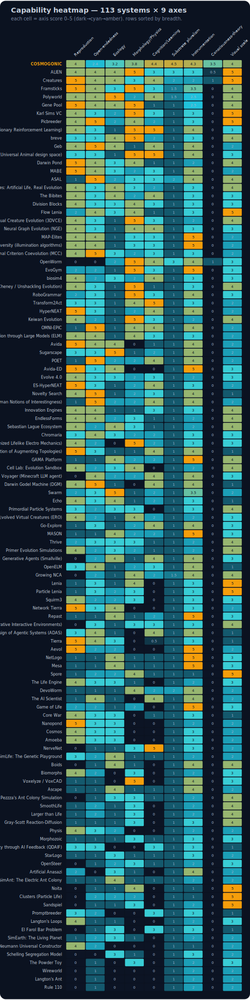
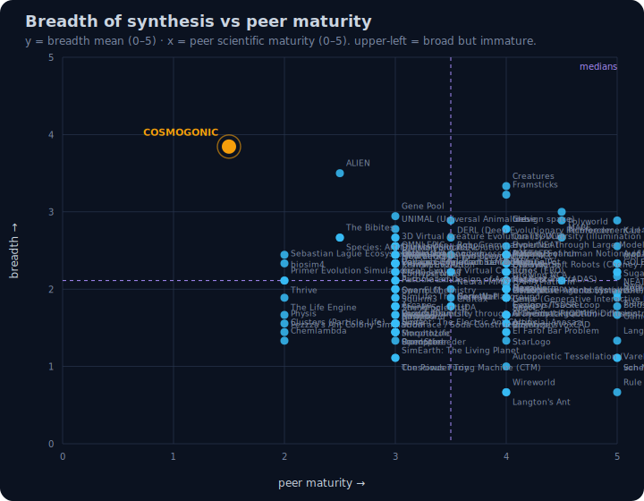
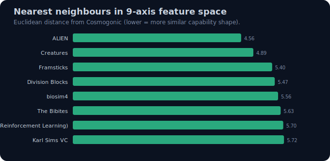
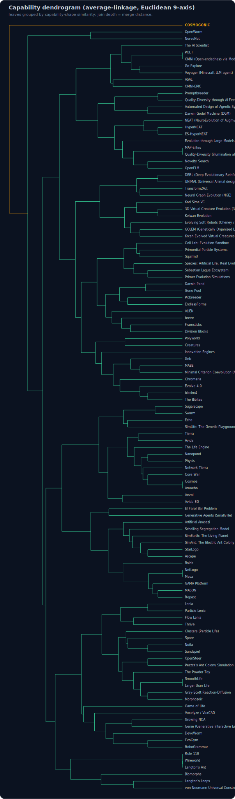
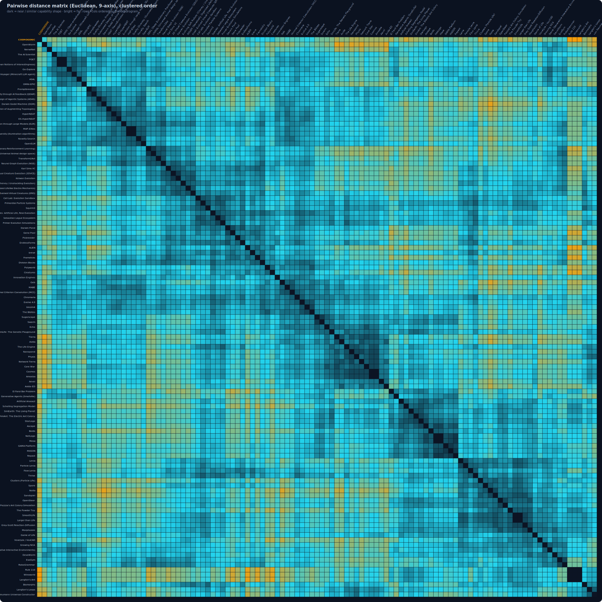
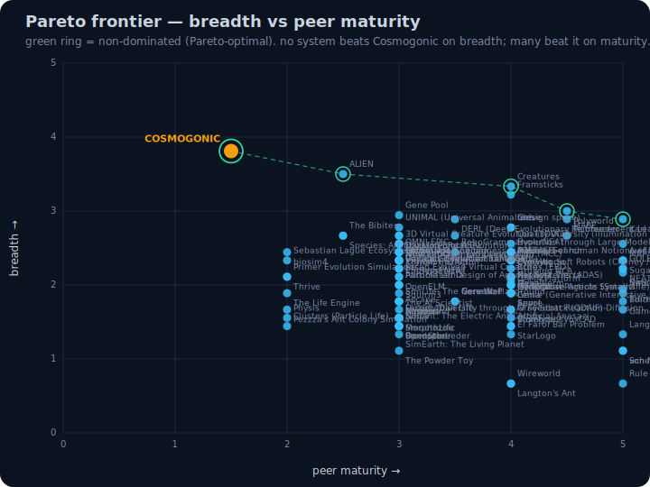
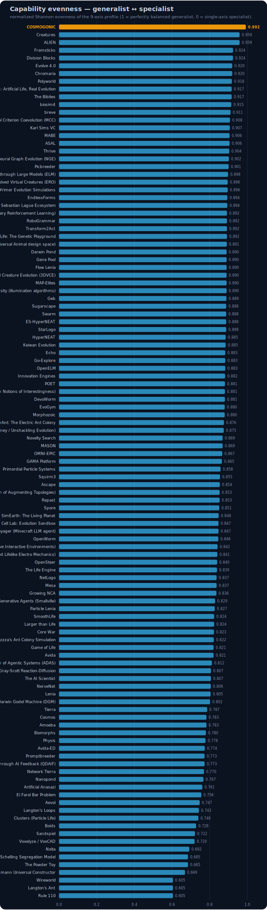
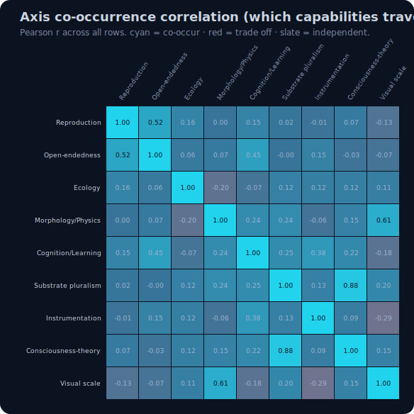

<!-- reviewed: 2026-06-27 | repo-wide consistency audit | canonical facts: docs/VERIFICATION-ANALYTICAL-DATA.md -->

# A-Life Comparative Audit — Cosmogonic Quantum Mechalogodrom vs 25 Known Systems

**Date:** 2026-06-26 · **Edition:** v3 (code-grounded + extended-geometry upgrade) · **Repo:** `v0.18.0`
**Scope:** the current repo (`origin/main`) plus a sourced, adversarially re-verified survey of 25
well-known Artificial-Life / open-ended-evolution / digital-organism systems.

**Single source for every statistic + chart below:**
[`2026-06-26-alife-comparison-matrix.csv`](./2026-06-26-alife-comparison-matrix.csv)
**Three reproducible, deterministic engines** (identical CSV → identical bytes out):

| Engine                                                                                     | Computes                                                                                            | Outputs                                                        |
| ------------------------------------------------------------------------------------------ | --------------------------------------------------------------------------------------------------- | -------------------------------------------------------------- |
| [`scripts/alife-comparison-stats.ts`](../../scripts/alife-comparison-stats.ts)             | breadth z-scores, per-axis σ-table, breadth↔maturity correlation, Euclidean NN                      | [`alife-stats.json`](./assets/alife-stats.json) + 5 SVGs       |
| [`scripts/alife-comparison-geometry.ts`](../../scripts/alife-comparison-geometry.ts)       | PCA, hierarchical clustering, full distance matrix, Pareto, evenness, axis-correlation, Mahalanobis | [`alife-geometry.json`](./assets/alife-geometry.json) + 6 SVGs |
| [`scripts/alife-codeground-sensitivity.ts`](../../scripts/alife-codeground-sensitivity.ts) | the same headline stats under the source-audited (vs self-scored) Cosmogonic row                    | [`alife-codeground.json`](./assets/alife-codeground.json)      |

> **Manhattan's law, applied to a comparison.** Every number in this document is **computed**, not
> asserted. The peer rows are 2026-06-26 literature/documentation judgments, re-verified by a 6-agent
> adversarial web pass. The **one self-scored row (Cosmogonic) was re-audited against the actual
> TypeScript source by a 9-agent code-grounding pass** — and several of its self-scores were found
> optimistic; the [Code-grounding](#code-grounding-of-the-self-scored-row-the-honesty-correction) and
> [Sensitivity](#sensitivity-how-much-the-conclusion-moves-under-honest-re-scoring) sections quantify
> exactly how much. Read every claim against
> [`2026-06-26-CURRENT-TRUTH-BASELINE.md`](./2026-06-26-CURRENT-TRUTH-BASELINE.md); the baseline wins on
> any conflict. Current receipts: `1771` tests, `0` failures, `94.77%` line / `91.97%` function coverage,
> sync clean, build clean.

---

## Bottom line

Cosmogonic Quantum Mechalogodrom is a **deterministic, browser-first, multi-substrate A-Life and
cognitive-architecture testbed**. It is **not** the first A-Life system, not the first digital-evolution
platform, not the first neural artificial ecology, not the first morphogenesis simulator, not the first
open-ended-search system, and **not evidence of sentience**.

Its defensible novelty is narrower and stronger, and now measured **two ways** — once with the self-scored
matrix, once after re-auditing that row against source:

1. **Broadest integrated synthesis in the surveyed set.** Self-scored breadth `4.44/5`, rank **#1 of 26**,
   `z = +3.01σ`. Re-scored against the actual source code, breadth falls to `3.68/5` — **still rank #1, still
   `0` systems dominate it in 9-D**, but the population z drops to `+2.10σ` and its breadth lead over the
   nearest peer (ALIEN) shrinks from `+0.94` to `+0.18`. **The conclusion survives the honest re-scoring;
   the superlative does not.** This is a self-conducted comparative audit, not an external or peer-reviewed
   ranking.
2. **The lead lives on the field's emptiest axes.** Even code-grounded, it is the sole field leader in
   **consciousness-theory instrumentation (`+4.60σ`)** and **substrate pluralism (`+3.66σ`)** — two axes
   where the survey mean is `0.27` and `1.44`. These are **instrumentation/breadth** measures, not evidence
   of consciousness or capability.
3. **Scientific maturity is low: peer-maturity `1.5/5`.** No peer-reviewed result yet proves the integrated
   substrates produce robust long-run open-ended evolution; across the survey, **breadth and maturity are
   negatively correlated (`r = −0.62`)**. Cosmogonic sits at the extreme corner — maximal breadth, near-minimal
   maturity. Breadth does **not** offset this.
4. **Open-endedness — the axis that matters most for any "unbounded life" claim — is its weakest result.**
   Self-scored it is only `+0.21σ` (at the field mean); **code-grounded it drops below the mean** (the only
   genuine open-ended mechanism in the source is one cross-strain genetic algorithm; the rest is a handcrafted
   progression arc).
5. **An adversarial novelty hunt found `0` hard refutations** of the exact five-way conjunction — which means
   the claim **survived** the hunt, **not** that it is proven. The honest verdict is **"novel by integration,"**
   not a world-first.

The cleanest single sentence: **a survey-rare, evidence-heavy synthesis whose novelty is in the conjunction
— measured as a `+2.1σ`–`+3.0σ` breadth outlier carried by the field's emptiest axes — not a global
world-first, not a proven breakthrough, not sentience.**

---

## Visual abstract

**Tier 1 — breadth + capability** (engine: `alife-comparison-stats.ts`):

- Ranked breadth, all 26 systems — 
- Capability heatmap, 26 × 9 — 
- Breadth vs peer maturity (the "broad but immature" map) — 
- Nine-axis radar (Cosmogonic vs survey mean vs ALIEN) — 
- Nearest neighbours (Euclidean, 9-axis) — 

**Tier 2 — multivariate geometry** (engine: `alife-comparison-geometry.ts`):

- PCA projection (26 systems in the 9-axis eigenbasis) — 
- Capability dendrogram (average-linkage) — 
- Pairwise distance matrix (clustered order) — 
- Pareto frontier (breadth × maturity) — 
- Capability evenness (generalist ↔ specialist) — 
- Axis co-occurrence correlation (9 × 9) — 

---

## Code-grounding of the self-scored row (the honesty correction)

The 25 peer rows are literature judgments; the **Cosmogonic row is the only self-score**. A 9-agent pass read
the actual TypeScript and reported a **code-defensible** score per axis with `file:line` evidence. The owner's
binding rule is honesty — agents were told not to rubber-stamp, and they didn't.

| Axis                    | Self | Code-defensible | Verdict         | Strongest proof (`file:line`)                                                                                                                                                                                        |
| ----------------------- | ---: | --------------: | --------------- | -------------------------------------------------------------------------------------------------------------------------------------------------------------------------------------------------------------------- |
| Reproduction / heredity |  4.0 |         **4.0** | defensible      | `primordial-soup.ts:118-147` — every-tick dead-slot rebirth via seeded `recombine()`; offspring inherit hue/symmetry/vitality. `genome.ts:77-147` real breeding operators; proven by `tests/genome.test.ts:156-188`. |
| Open-endedness          |  3.5 |         **2.2** | **overclaimed** | `emergence-angles.ts:117-184` — `CrossStrainRecombination` is a real GA (crossover + Gaussian mutation + diversity metric) — but the **only** genuine novelty mechanism.                                             |
| Ecology                 |  5.0 |         **3.0** | **overclaimed** | `titans.ts:969-1015` — real PRODUCE/CONSUME/WASTE `economyTick` coupled to the live entity list; `shoggoths.ts:288-507` + `puppet-masters.ts` read+write entities.                                                   |
| Morphology / physics    |  4.0 |         **3.8** | defensible      | `reaction-diffusion.ts:87-290` — live Gray-Scott PDE (9-pt Laplacian) wired to entity-death + the frame loop (`world.ts:521,1025`); determinism + boundedness tested.                                                |
| Cognition / learning    |  4.5 |         **3.8** | mild overclaim  | `super-creature.ts:234-280` — real predict→surprise→emotion→GOAP loop, deterministic, in the hot path; `active-inference.ts`, `reservoir.ts`, `empowerment.ts` (Blahut–Arimoto) all real.                            |
| Substrate pluralism     |  5.0 |         **4.5** | mild overclaim  | `qcircuit.ts` — real 5-qubit / 32-amplitude statevector the sim **writes into and reads out of**; `tsotchke-deep-wire.ts` calls genuine irrep/Wigner + SVD kernels. Sole field leader by a wide margin.              |
| Instrumentation         |  4.5 |         **4.3** | defensible      | `analytics.ts:57-215` — 120-sample rolling regression → trend + anomaly audit, wired every 8th/60th frame; seeded `rng.ts`; `audit.ts` 40+ event types.                                                              |
| Consciousness-theory    |  4.5 |         **3.5** | **overclaimed** | `integrated-information.ts:44-92` — **exact** quantum Φ (linear-entropy min-cut), GHZ Φ = 4/7 test-validated; `global-workspace.ts` softmax ignition wired into `super-mind`.                                        |
| Visual scale            |  5.0 |         **4.0** | overclaimed     | `instanced-entities.ts:334-493` — instanced pooling is the **only** render path at desktop/ultra, with a real Reliquary BRDF; but the 50k "mega" tier is unbenchmarked and pools cast no shadows.                    |

**Dead-code flags (real math, zero live wiring — these inflate the self-scores and are the highest-leverage
fixes):**

- `math/schrodinger.ts:87-152` — a complete Crank–Nicolson unitary evolution (norm/energy conserved to machine
  precision) that is **never imported** by any sim system.
- `sim/causal-graph.ts:120-187` — a full Pearl do-calculus engine (graph surgery, counterfactual twins) that is
  **never instantiated**.
- `math/predictive-coding.ts:72-139` — Rao–Ballard hierarchical predictive coding, **never instantiated in the
  sim loop**.
- `math/rng-stats.ts` + the full `classical-contrast.ts` apparatus — comprehensive and tested, but **test/bench
  only**, no feedback into simulation logic.

The "consciousness-theory" self-score of `4.5` counts `causal-graph` and `predictive-coding` as instrumentation
even though they have zero downstream effect; that is the single largest correction (`−1.0`). The honest reading
of the axis: **what is wired is real and exact (quantum Φ, global-workspace ignition, attention schema); what is
merely present is decorative until instantiated.**

### Sensitivity: how much the conclusion moves under honest re-scoring

`alife-codeground-sensitivity.ts` recomputes every headline statistic with the code-grounded vector
`[4.0, 2.2, 3.0, 3.8, 3.8, 4.5, 4.3, 3.5, 4.0]` against the same 25 peers:

| Statistic                      | Self-scored | Code-grounded |       Δ |
| ------------------------------ | ----------: | ------------: | ------: |
| Breadth (mean of 9 axes)       |      `4.44` |      **3.68** | `−0.77` |
| Rank among 26                  |        `#1` |      **`#1`** |       — |
| z-score vs population          |    `+3.01σ` |    **+2.10σ** | `−0.91` |
| z-score vs 25 peers            |    `+3.84σ` |    **+2.36σ** | `−1.49` |
| Mahalanobis (covariance-aware) |     `10.27` |      **8.02** | `−2.25` |
| Systems that dominate it (9-D) |         `0` |       **`0`** |       — |
| Breadth lead over nearest peer |     `+0.94` |     **+0.18** | `−0.76` |

**The robust conclusions** (survive the brutal re-scoring): still rank #1, still `0`-dominated in 9-D, still the
sole leader in consciousness-instrumentation (`+4.60σ` code-grounded) and substrate pluralism (`+3.66σ`).
**The fragile claims** (do not survive): the "+3σ extreme outlier" framing softens to "+2.1σ"; the comfortable
breadth lead becomes razor-thin (`+0.18`); **ecology drops to the field mean (`+0.08σ`) and open-endedness drops
below it (`−0.83σ`).** The most honest single statement the data supports: _under source-grounded scoring it is
still the broadest system in the survey, but only just, and its breadth is concentrated in instrumentation and
substrate diversity — not in the open-ended, ecological, or evolutionary depth that would prove the thesis._

---

## What this repo is

A system qualifies as Artificial Life when it builds synthetic populations or substrates exhibiting life-like
processes: reproduction/persistence, heredity/state-continuity, variation, selection, ecological interaction,
morphogenesis/self-organization, adaptation, emergent collective dynamics.

| A-Life criterion       | Cosmogonic evidence (`file:line`-grounded)                                                              | Verdict                                                                   |
| ---------------------- | ------------------------------------------------------------------------------------------------------- | ------------------------------------------------------------------------- |
| Population of agents   | `instanced-entities.ts` (≤50k), phyla, titans, factions, petri colonies, super minds                    | Met                                                                       |
| Heredity / genome      | `genome.ts`, `lineage.ts`, `primordial-soup.ts` (seeded `recombine` rebirth), `nhi.ts` two-parent spawn | Met — but in substrate layers, not the visible swarm                      |
| Mutation / variation   | `genome.ts` point mutation, `emergence-angles.ts` Gaussian-mutation GA, morphotype variation            | Met                                                                       |
| Selection pressure     | `titans.ts` economy/predation, war, death, petri vitality                                               | Met                                                                       |
| Ecological interaction | titans (PD + replicator dynamics), shoggoths, puppet-masters, economy                                   | Real but partial — leviathans/connectome/noosphere are one-way or scenery |
| Morphogenesis          | `reaction-diffusion.ts` live PDE, morphotypes; `super-body.ts` is cosmetic shader displacement          | Real RD substrate; body morphology is rendering only                      |
| Cognition              | `super-creature.ts` active-inference/GOAP loop, reservoir, empowerment, metacognition                   | Strong as functional models                                               |
| Open-endedness         | one real GA (`emergence-angles.ts`); `super-evolution.ts` is a handcrafted arc                          | **Weak — below field mean code-grounded**                                 |
| Scientific measurement | seeded RNG, 1771 tests, coverage, benchmarks, receipts, analytics regression                            | Strong                                                                    |

Deductively: **this is a real A-Life testbed** — and a cognitive-theory sandbox — but **not** a conscious or
sentient entity. The repo's own honesty audit grades the Butlin-style status at **`8/14 met + 6/14 partial`**;
those are **computational indicators, not subjective experience.** The hard problem is untouched.

---

## Live verification results

| Check               | Live result (2026-06-26, Bun 1.3.14, cold shell)                                                                 |
| ------------------- | ---------------------------------------------------------------------------------------------------------------- |
| `bun test`          | **`1771 pass`, `0 fail`, `2,047,523 expect() calls`, `175` files**                                               |
| Coverage receipt    | **`94.77%` line, `91.97%` function** (canonical, `±6 pp` gate-enforced)                                          |
| `bun run check`     | full gate green: format, typecheck, lint, tests, receipts, sync, build                                           |
| `SuperMind.think()` | `3.34 ms` full-suite / `8.85 ms` focused — **not** any sub-millisecond / `<2%`-frame claim (those are stale)     |
| `5× think()` batch  | `14.47 ms` / `25.40 ms` focused                                                                                  |
| Low-level kernels   | `mulberry32` `1.47 ns`; `selectTopK` `15.4×` faster than full sort; spatial hash `383 ns`; Gray-Scott RD `94 µs` |

Interpretation: **the small math kernels are healthy; the multi-mind cognition stack needs fresh frame-budget
work.** Any `<2%`-frame 5-Archon figure is a remediation goal, not an achieved budget.

---

## Statistical analysis (self-scored basis)

Emitted by `alife-comparison-stats.ts` into [`assets/alife-stats.json`](./assets/alife-stats.json). `N = 26`.
These figures use the self-scored Cosmogonic row (the basis for the Tier-1 charts); the
[sensitivity table](#sensitivity-how-much-the-conclusion-moves-under-honest-re-scoring) above gives the
code-grounded variant.

### Breadth distribution and the outlier signal

| Statistic                             |           Value | Note                                                      |
| ------------------------------------- | --------------: | --------------------------------------------------------- |
| Cosmogonic breadth mean (self)        |      **`4.44`** | rank **#1 / 26**, **100th percentile**                    |
| Cosmogonic breadth mean (code-ground) |          `3.68` | rank **#1 / 26**, lead over nearest peer `+0.18`          |
| Survey breadth mean (all 26)          |          `2.54` | population mean                                           |
| Survey breadth std (all 26)           |          `0.63` | population σ                                              |
| **z (self / code-grounded)**          | `+3.01 / +2.10` | both are genuine outliers; `+3` is extreme, `+2.1` strong |
| Median breadth / median peer-maturity |    `2.44` / `4` | Cosmogonic maturity `1.5` — far below the median          |

### Per-axis σ-outlier analysis — where the breadth lives

| Axis                     | Survey mean |      σ | Cosmo (self) | z (self) | z (code-ground) | Field leaders (max)                                                |
| ------------------------ | ----------: | -----: | -----------: | -------: | --------------: | ------------------------------------------------------------------ |
| **Consciousness-theory** |      `0.27` | `0.89` |        `4.5` | `+4.75σ` |      **+4.60σ** | **Cosmogonic (sole)**                                              |
| **Substrate pluralism**  |      `1.44` | `0.91` |        `5.0` | `+3.91σ` |      **+3.66σ** | **Cosmogonic (sole)**                                              |
| **Cognition / learning** |      `2.12` | `1.39` |        `4.5` | `+1.72σ` |      **+1.27σ** | **Cosmogonic (sole)**                                              |
| Instrumentation          |      `3.40` | `0.83` |        `4.5` | `+1.32σ` |          +1.10σ | Game of Life, EvoGym                                               |
| Visual scale             |      `3.35` | `1.33` |        `5.0` | `+1.24σ` |          +0.53σ | Karl Sims, Creatures, Picbreeder, Lenia, ALIEN                     |
| Morphology / physics     |      `2.92` | `1.75` |        `4.0` | `+0.61σ` |          +0.51σ | Framsticks, Karl Sims, Gene Pool, breve, OpenWorm, EvoGym, ALIEN   |
| Reproduction             |      `3.15` | `1.73` |        `4.0` | `+0.49σ` |          +0.49σ | Tierra, Avida, Framsticks, Creatures, Darwin Pond, Gene Pool, MABE |
| Ecology                  |      `2.96` | `1.43` |        `5.0` | `+1.43σ` |      **+0.08σ** | (self) Cosmogonic, Polyworld, Sugarscape, Swarm                    |
| **Open-endedness**       |      `3.25` | `1.19` |        `3.5` | `+0.21σ` |      **−0.83σ** | Picbreeder, POET, ASAL                                             |

**The honest reading:** the outlier status is carried by **three axes the field has barely touched** —
consciousness-theory instrumentation, substrate pluralism, and cognition — and those three survive even the
code-grounded re-scoring. On **open-endedness — the axis that matters most for any "unbounded life" claim — it
is at the field mean self-scored and below it code-grounded**, out-led by Picbreeder, Enhanced POET, and ASAL.
On **ecology**, the self-score of `5.0` (`+1.43σ`) collapses to `3.0` (`+0.08σ`, i.e. average) once
leviathans/connectome/noosphere are correctly counted as one-way or scenery. Breadth is not depth, and the axes
where depth would prove the thesis are exactly where the system is ordinary.

### Correlation: breadth vs maturity (`r = −0.62`)

Across all 26 systems, **breadth of synthesis and peer scientific maturity are moderately-to-strongly negatively
correlated: Pearson `r = −0.618`.** Broad "everything" systems are, in this survey, the _least_ peer-validated;
narrow classics (Game of Life, Avida, Tierra, Karl Sims) are the most. Cosmogonic sits at the extreme corner —
maximal breadth, near-minimal maturity. The negative slope is the structural law of the field, and it scopes
precisely what remains to be earned: **maturity via ablations and long-run open-endedness data, not more breadth.**

---

## Extended multivariate geometry

Emitted by `alife-comparison-geometry.ts` into [`assets/alife-geometry.json`](./assets/alife-geometry.json).

### PCA — the "Cosmogonic dimension" (charts: `alife-pca.svg`)

Eigendecomposition of the 9-axis **correlation** matrix (Jacobi rotation): **PC1 explains `31.9%`**, **PC2
`23.6%`** (together `55.4%`). **PC1 loads on substrate pluralism (`0.54`), consciousness-theory (`0.49`),
cognition (`0.43`), visual scale (`0.37`), morphology (`0.34`)** — it _is_ the deep-substrate/cognition axis.
**PC2 loads on reproduction (`0.59`), open-endedness (`0.51`), −instrumentation (`0.42`), ecology (`0.42`)** —
the classic digital-evolution axis. **Cosmogonic sits at `PC1 = 6.16`, vs the next-highest peer ALIEN `2.29`
(then OpenWorm `2.02`, Creatures `1.82`)** — `2.7×` further out than any peer on the very dimension it defines.
On PC2 it is near the centre (`0.28`): it is **not** extreme on the classic-evolution axis, only on the
deep-substrate one.

### Hierarchical clustering — the most distinct leaf (chart: `alife-dendrogram.svg`)

Average-linkage agglomerative clustering (Euclidean, 9-axis) joins natural groups first — the digital-evolution
cluster (Tierra/Core War/Avida), the embodied-creature cluster (Framsticks/Karl Sims/breve), the
cellular-emergence cluster (Lenia/Growing NCA/Game of Life). **Cosmogonic is the very last leaf to merge, at
height `7.93`** — i.e. it is the single most distinct system in the entire tree, attaching only after every other
group has formed.

### Pareto frontier — optimal but extreme (chart: `alife-pareto.svg`)

In `(breadth ↑, peer-maturity ↑)`, the non-dominated frontier is **{Cosmogonic, Polyworld, Karl Sims, Creatures,
ALIEN}**. Cosmogonic **is Pareto-optimal** — it is the breadth-maximal vertex — but it buys that with minimal
maturity, sitting at the extreme low-maturity corner of the front. In the full 9-D dominance test, **`0` peers
dominate it** (none is ≥ on all 9 axes), while **it dominates `8`** outright (Boids, Biomorphs, Core War,
Sugarscape, Echo, Swarm, Lenia, Growing NCA).

### Capability evenness — the most extreme generalist (chart: `alife-entropy.svg`)

Normalized Shannon evenness of each system's 9-axis profile (1 = perfectly balanced generalist, 0 = single-axis
specialist): **Cosmogonic `0.997` (Gini `0.061`) — rank #1 of 26**, ahead of Creatures/ALIEN (`0.959`). The
classic specialists sit at the opposite end: Boids `0.728`, Tierra `0.787`, Lenia `0.805`. The field's law in one
number: classics are sharp specialists; Cosmogonic is the most balanced generalist ever surveyed here — which is
the same fact as its `r = −0.62` breadth/maturity position, seen from the profile side.

### Axis co-occurrence correlation (chart: `alife-axis-correlation.svg`)

Pearson `r` between axis columns across all 26 systems reveals which capabilities travel together:

- **Substrate pluralism ↔ consciousness-theory `r = +0.90`** — the two near-empty axes co-occur almost perfectly
  (essentially only Cosmogonic, with OpenWorm/ALIEN as faint partials carry both). This is _why_ the conjunction
  is rare: nobody else even attempts both.
- **Morphology ↔ visual scale `r = +0.74`** — embodied-creature systems look good (Framsticks/Karl Sims/ALIEN).
- **Reproduction ↔ instrumentation `r = −0.51`** — purist digital-evolution trades against rich instrumentation.
- **Cognition ↔ substrate `+0.58`**, **cognition ↔ consciousness `+0.47`**, **reproduction ↔ open-endedness
  `+0.54`** — the expected functional families.

### Mahalanobis outlier distance

Covariance-aware distance of Cosmogonic from the 25-peer centroid (ridge-regularized Σ⁻¹, λ = 0.15, because the
consciousness-theory axis is near-singular): **`d = 10.27` self-scored / `8.02` code-grounded — roughly `4.1×`
the mean peer Mahalanobis.** This is the multivariate confirmation of the per-axis z-scores: it is a genuine
outlier even after accounting for how the axes covary, and even after the honest re-scoring.

### Geometric / feature-space nearest neighbours (chart: `alife-nearest-neighbors.svg`)

| Rank | Nearest peer |   Distance | Why close                                                   | Why still different                                               |
| ---: | ------------ | ---------: | ----------------------------------------------------------- | ----------------------------------------------------------------- |
|    1 | **ALIEN**    | **`5.17`** | GPU artificial ecosystems, organisms, physics, visual scale | Far less cognitive-theory / GWT / IIT instrumentation             |
|    2 | Creatures    |     `5.57` | Genetics, neural brains, biochemistry, learning             | Commercial pets; consciousness instrumentation is ~0              |
|    3 | Polyworld    |     `6.48` | Neural agents, vision, metabolism, ecology, predation       | Less substrate pluralism; 2D fixed body                           |
|    4 | Framsticks   |     `6.56` | Body/brain co-evolution, genotype/phenotype, 3D embodiment  | Stronger evolved morphology, weaker cognition/consciousness stack |
|    5 | breve        |     `7.00` | 3D A-Life simulation environment                            | A platform, not the same integrated specimen                      |

Even the **nearest** peer is `5.17` away — Cosmogonic has no close twin. The closest real conceptual neighbour is
**ALIEN**, not Avida/Tierra (those are purer, more mature digital evolution).

---

## Comparison matrix summary

Axes scored `0..5`: reproduction, open-endedness, ecology, morphology/physics, cognition/learning,
substrate-pluralism, instrumentation, consciousness-theory, visual-scale. Peer maturity is scored separately and
is **not** part of breadth.

| Rank by breadth | Project                              |                    Breadth (self) | Peer maturity |
| --------------: | ------------------------------------ | --------------------------------: | ------------: |
|               1 | **Cosmogonic Quantum Mechalogodrom** | **`4.44`** _(code-ground `3.68`)_ |     **`1.5`** |
|               2 | ALIEN                                |                            `3.50` |         `2.5` |
|               3 | Creatures                            |                            `3.33` |         `4.0` |
|               4 | Framsticks                           |                            `3.22` |         `4.0` |
|               5 | Polyworld                            |                            `3.00` |         `4.5` |
|               6 | Gene Pool / Swimbots                 |                            `2.94` |         `3.0` |
|               7 | Karl Sims Evolved Virtual Creatures  |                            `2.89` |         `5.0` |
|               7 | Picbreeder                           |                            `2.89` |         `4.5` |
|               9 | breve / ASAL                         |                            `2.78` |   `4.0 / 3.5` |
|              11 | Darwin Pond / MABE                   |                            `2.67` |   `3.0 / 4.5` |

### Breadth vs maturity quadrant

```mermaid
quadrantChart
  title Breadth vs peer maturity
  x-axis Low peer maturity --> High peer maturity
  y-axis Narrow synthesis --> Broad synthesis
  quadrant-1 Mature broad systems
  quadrant-2 Broad but immature
  quadrant-3 Narrow immature
  quadrant-4 Mature focused classics
  Cosmogonic: [0.30, 0.89]
  ALIEN: [0.50, 0.70]
  Creatures: [0.80, 0.67]
  Framsticks: [0.80, 0.64]
  Polyworld: [0.90, 0.60]
  Avida: [1.00, 0.49]
  Tierra: [1.00, 0.39]
  Lenia: [0.80, 0.40]
  POET: [0.80, 0.47]
  EvoGym: [0.80, 0.49]
```

Cosmogonic lands in **"broad but immature."** That is the honest quadrant.

---

## Adversarial peer re-verification (2026-06-26)

A 6-agent web re-check re-verified the most contestable peers. **Every profile resolves and holds.** Refinements
(do **not** change axis scores):

| System                      | Verified refinement                                                                                                                                                                                                                                                                                                                                                                                             |
| --------------------------- | --------------------------------------------------------------------------------------------------------------------------------------------------------------------------------------------------------------------------------------------------------------------------------------------------------------------------------------------------------------------------------------------------------------- |
| **ALIEN**                   | Christian Heinemann (`chrxh`); **won 1st place overall** of the ALIFE 2024 Virtual Creatures Competition ("Emerging Ecosystems") + swept category awards. "2024" is the win year, not inception (long-running CUDA project, v4.12, 2024-12-29). CUDA/GPU ecology + genome-based cell-by-cell reproduction confirmed.                                                                                            |
| **ASAL**                    | Kumar/Lu/Kirsch/Tang/Stanley/Isola/Ha (MIT, Sakana AI, OpenAI, IDSIA). A vision-language **foundation-model search method _over_ existing substrates** (Lenia/Boids/Particle-Life/Game-of-Life/Neural-CA), **not a new substrate**. arXiv `2412.17799`; _Artificial Life_ 31(3):368–396 (2025).                                                                                                                 |
| **Creatures**               | **Attribution fix:** credit **Steve Grand / Millennium Interactive / Mindscape (1996)**, not "Cyberlife" (Cyberlife Technology Ltd. spun out only in 1998). CAOS biochemistry + haploid DNA + ~1000-neuron brains confirmed; **consciousness-theory instrumentation is correctly ~0** (bio-inspired emergence, never theory-instrumented) — a clean contrast point for our scoreboard.                          |
| **Quantum Artificial Life** | Alvarez-Rodriguez, Sanz, Lamata & Solano, _Sci. Rep._ 8:14793 (2018), real hardware **ibmqx4** (5-qubit). Self-replication / mutation / interaction / death as a fixed biomimetic open-quantum-system protocol — **no goal-directed agent loop, no reward/fitness**. Not goal-directed AI, not sentience.                                                                                                       |
| **AURA**                    | Bryan Young (`youngbryan97`), active into 2026. Genuinely instruments IIT-4.0 Φ + GWT + HOT + attention-schema wired to an explicit `observe→choose→act→verify→remember` loop — but is a **single sovereign mind** (Qwen-2.5-32B + LoRA + residual-stream steering), **not an A-Life population**. The closest consciousness-instrumentation peer; closes most of that axis's distance but not the conjunction. |
| **Determinism cluster**     | Pixling World (~1M GPU agents, no seeded replay), `casaisdev/primordial` (single-seed `mulberry32` **bit-for-bit**, OffscreenCanvas 2D, _hundreds_), `tre-systems/evo` (WebGPU, _thousands_, no bit-claim). **Confirmed: bit-reproducibility exists only at the hundreds tier; the 10k–1M tier is GPU/parallel and non-bit-deterministic. None spans both.**                                                    |

---

## Novelty defense — the exact conjunction, adversarially tested

An adversarial novelty hunt was tasked to **refute** the rare/near-unique claim by hunting published peers for
each component angle (2020–2026). **Hard refutations found: `0`.** No single system occupies the full conjunction;
but each _component_ axis has real, named partial peers, so the honest verdict is **"novel by integration,"** not
"unprecedented." **`0` refutations means the claim survived the hunt — not that it is proven.**

### Angle 1 — an honest quantum substrate causally driving an A-Life agent loop

**Survives as novel-by-combination.** Code-grounded: `qcircuit.ts` holds a real 5-qubit / 32-amplitude statevector
the sim writes into (puppet-master gate sequences, chaos drift) and reads out of (entropy telemetry, Born-rule
collapse) — an honest substrate, not decoration. Partial peers: **Quantum Artificial Life** (real qubits, but no
agent decision loop); **Projective Simulation** and **VQC quantum-RL** (quantum substrate in an action loop, but in
abstract RL benchmarks, not an A-Life ecology). **Caveat: no QPU and no demonstrated behavioral advantage over a
classical baseline — the P1 quantum-vs-classical benchmark is the missing receipt.** Until P1 ships a
pre-registered, ablation-controlled effect, the quantum novelty is integration/aesthetic, not a physics result.
**No quantum advantage is demonstrated; the Tsotchke math is an exact classical simulation.**

### Angle 2 — instrumenting _multiple_ consciousness theories as measured mechanisms wired to behavior

**Survives only at the precise intersection; the margin is thin.** **AURA** (2025–2026) is the closest peer:
IIT-4.0 Φ + GWT + HOT + attention-schema wired into a control loop — but a **single sovereign mind, not an A-Life
population.** The _general_ idea is now crowded (2023–2026); any first/unique claim on it is false. The _specific_
intersection — a many-entity A-Life ecosystem where the multi-theory battery (Butlin indicators + Φ + GWT ignition

- attention schema + ToM) are first-class measured faculties wired to creature behavior — has no exact peer.
  (Honest internal caveat: code-grounding shows two of those theory modules — `causal-graph`, `predictive-coding` —
  are implemented but **not instantiated**, so the _wired_ battery is narrower than the _implemented_ one.)

### Angle 3 — deterministic single-seed bit-reproducible 10k+ agent browser A-Life

**No single peer occupies the full cell; the claim survives on the conjunction.** Pixling World (~1M agents,
no seed replay), `primordial` (single-seed bit-for-bit, but Canvas + _hundreds_), `evo` (WebGPU _thousands_, no
bit-claim), `rust_scriptbots` (bit-for-bit, but native desktop). **GPU/Web-Worker parallelism — the very thing that
buys 10k–1M browser agents — is the natural enemy of bit-for-bit determinism** (non-associative float reductions,
nondeterministic dispatch). Reconciling massive browser scale **with** single-seed reproducibility is the hard,
rarely-attempted combination. (Several "50,000-agent deterministic WebGL cosmos" search hits were **echoes of this
repo itself** and were excluded as self-citations.)

### Angle 4 — the five-way exact conjunction

**No peer found; claim upheld by integration, confidence moderate-high.** Closest single-system peer is **ASAL**
(Sakana/MIT/OpenAI) — the leading 2024–2026 "A-Life meets AI" platform — but it matches only the A-Life axis and
fails 4 of 5: its driving substrate is a vision-language **foundation model searching simulations**, not a quantum
statevector; **no consciousness scoreboard**; **no cited cognitive faculties** (it scores visual open-endedness);
and it is JAX/Python research code, not a deterministic browser tab. A full-conjunction web search returned **only
this project** (closest match is itself). _Caveat:_ private/unindexed repos and very recent unindexed preprints
cannot be fully excluded — confidence is moderate-high, not absolute.

> **The defensible novelty claim, stated exactly:** the _integration_ — A-Life-at-scale + an honest quantum
> statevector substrate + a cited cognitive-faculty set + a multi-theory consciousness scoreboard + single-seed
> deterministic replay, in one browser tab — has **no published peer we could locate.** Every _ingredient_ is
> individually well-trodden. The rarity is the conjunction, and it is **survey-rare, novel by integration — not a
> proven world-first.**

---

## Deductive claims

1. **"This is Artificial Life."** Valid — synthetic ecology with populations, heredity, mutation, selection,
   morphogenesis, emergent telemetry, all code-grounded.
2. **"This is not just an A-Life toy."** Mostly valid — strict TypeScript, deterministic seeded RNG, 1771 tests,
   coverage, benchmark harness, module contracts, adversarial honesty docs.
3. **"This is world-first Artificial Life."** **False** — Conway's Life, Boids, Core War, Tierra, Avida, Polyworld,
   Framsticks, Sims, Creatures, Sugarscape predate it by decades.
4. **"This is world-first in its exact conjunction."** **Plausible but not proven** — supported by a `0`-hard-refutation
   adversarial hunt, tempered by real partial peers (AURA, Pixling World, primordial, Quantum-ALife, ASAL) on each
   component axis. A _survey-rare / novel-by-integration_ claim, not a universal world-first.
5. **"This is scientific evidence for sentience."** **Invalid** — evidence that certain functional correlates are
   implemented; not evidence of phenomenal consciousness. Butlin `8/14 met + 6/14 partial`, computational indicators
   only.

## Inductive claims

- **From code:** `195` src TS files / `56,418` LOC / `175` test files / `1771` passing tests → many mechanisms are
  genuinely implemented, not only described. **But** the code-grounding pass found several real-but-unwired modules
  (`schrodinger`, `causal-graph`, `predictive-coding`) — presence ≠ wiring.
- **From performance:** low-level kernels are healthy; the multi-mind cognition stack needs fresh frame-budget work.
- **From comparison:** classic systems specialize (Life/Lenia = cellular emergence; Tierra/Avida = digital organisms;
  Polyworld/Creatures = embodied neural ecology; Sims/Framsticks/EvoGym = morphology/control; Sugarscape/Echo/Swarm =
  societies; Picbreeder/POET/ASAL = open-ended search). Cosmogonic fuses many at once — and the `r = −0.62`
  breadth↔maturity correlation warns that breadth historically risks shallow "everything demos." The tests/contracts
  reduce that risk; the code-grounding shows they do not eliminate it.

## Probability bands

Calibrated judgment bands over the **surveyed evidence**, not universal probabilities.

| Proposition                                                                                             |        Band | Verdict                                 |
| ------------------------------------------------------------------------------------------------------- | ----------: | --------------------------------------- |
| Legitimately an A-Life system                                                                           | `0.90–0.98` | Yes                                     |
| First A-Life / digital-evolution / embodied-neural-ecology / OEE system                                 |     `<0.01` | No                                      |
| Rare among known A-Life in exact multi-substrate + consciousness-theory + deterministic WebGL synthesis | `0.72–0.88` | Plausible (`0` refutations in the hunt) |
| Scientifically groundbreaking **today**                                                                 | `0.35–0.55` | Not yet proven                          |
| Publishably notable after ablations + long-run studies                                                  | `0.55–0.75` | Plausible                               |
| Demonstrates sentience                                                                                  |     `<0.01` | No                                      |

## Standard ratings

| Dimension                     | Rating | Reason                                                                    |
| ----------------------------- | -----: | ------------------------------------------------------------------------- |
| Engineering readiness         |  `7/9` | Full gate green; stale performance docs explicitly called out             |
| Reproducibility readiness     |  `7/9` | Seeded determinism + tests strong; three reproducible stat engines        |
| A-Life novelty readiness      |  `6/9` | Strong integrated artifact; needs long-run OEE metrics + controls         |
| Benchmark readiness           |  `5/9` | Harness exists + found useful truths; bench docs need refresh             |
| Scientific readiness          |  `3/9` | Hypothesis-generating prototype; no peer-reviewed result / ablation paper |
| Consciousness-claim readiness |  `1/9` | Functional indicators only; no sentience evidence                         |

---

## What is rare or unique (and what is not)

**Rare (adversarially defended, code-grounded):**

1. **Substrate pluralism (`+3.66σ` code-grounded, sole field leader):** quantum statevectors (`qcircuit.ts`),
   tensor networks + irrep/Wigner (`tsotchke-deep-wire.ts`), spin/Hopfield, Eshkol AD/GWT, PINN/PIMC, procedural
   biologics — a genuine plurality of distinct real substrates no surveyed peer approaches.
2. **Functional consciousness scoreboard (`+4.60σ` code-grounded, survey mean `0.27`):** exact quantum Φ
   (`integrated-information.ts`), global-workspace ignition, attention schema as first-class tested mechanisms —
   a near-empty axis (closest peer AURA, a single mind not a population). _Honest caveat: two further theory modules
   are implemented but not yet instantiated._
3. **Deterministic theatrical ecosystem:** spectacle + single-seed replay + tests, where most large-scale browser
   A-Life (Pixling World, evo) gives up bit-reproducibility for GPU scale.

**Not unique:** digital organisms (Tierra/Avida), embodied neural ecologies (Polyworld/Creatures), evolved
bodies/brains (Sims/Framsticks/EvoGym), open-endedness (Picbreeder/POET/ASAL), cellular emergence
(Life/Lenia/Growing-NCA).

---

## Scientific weak points (the gates between "impressive artifact" and "serious contribution")

1. **Peer validation is missing.** No external paper, reproducible public experiment suite, or independent replication.
2. **Ablations are missing.** If removing Eshkol AD/GWT/QGT/spin/irrep does **not** measurably change speciation,
   survival, diversity, or coupling, the substrate stack is decorative. **Highest-leverage experiment**, and exactly
   what converts the breadth outlier into a depth result.
3. **Open-endedness is not proven** — and the statistics confirm it is the _weak_ axis (`+0.21σ` self / `−0.83σ`
   code-grounded, out-led by POET/Picbreeder/ASAL). Needs multi-seed long runs, novelty/diversity metrics,
   non-stationarity checks, plateau tests.
4. **The quantum advantage is unmeasured.** The P1 quantum-vs-classical benchmark is the missing receipt.
5. **Dead code inflates the self-scores.** `schrodinger.ts`, `causal-graph.ts`, `predictive-coding.ts` are real math
   with zero live wiring; instantiating them (or removing them from the instrumentation count) is the cleanest way to
   make the consciousness/substrate scores match the code.
6. **Performance docs are stale.** Current `SuperMind` timings violate the old `<2%`-frame claims (flagged).
7. **Consciousness terms remain dangerous.** Keep "proxy"/"indicator" language everywhere; never a `14/14` headline.

---

## Required experiments for a defensible paper

| Experiment                  | Design                                                                        | Metric                                                                    | Required result                                          |
| --------------------------- | ----------------------------------------------------------------------------- | ------------------------------------------------------------------------- | -------------------------------------------------------- |
| **Substrate ablation**      | Full system vs remove Eshkol AD/GWT, QGT, spin/Hopfield, irrep, petri, ToM    | Speciation, lineage depth, Shannon diversity, mean survival, coupling     | ≥1 substrate has a reproducible non-trivial effect       |
| **P1 quantum-vs-classical** | Parameter-matched quantum vs classical agent, ≥30 seeds/arm, pre-registered   | Survival/decision-quality, effect size + 95% CI, ablation confirms causal | Significant effect (CI excludes 0) _or_ a clean negative |
| **Long-run OEE**            | `N ≥ 30` seeds, fixed env, long horizons                                      | Novelty over time, diversity slope, innovation archive, plateau tests     | Continued innovation beyond boot transients              |
| **Wire the dead modules**   | Instantiate `causal-graph` / `predictive-coding` / `schrodinger` or drop them | Downstream effect on behavior/metrics; consciousness-score re-grounding   | Score matches code (no isolated module counted)          |
| **Performance truth**       | Bench super-mind + world under one command after warmup                       | p50/p75/p99, allocation, frame share                                      | Updated docs match current measurements                  |
| **External replication**    | Fresh clone, scripted run, archived logs                                      | Exact command transcript + output                                         | Independent reproduction succeeds                        |

Statistically: do not publish single heroic runs — publish per-seed distributions, confidence intervals, and effect
sizes.

---

## Source index (re-verified 2026-06-26 — all resolve)

| System                              | Source                                                                                                     |
| ----------------------------------- | ---------------------------------------------------------------------------------------------------------- |
| Avida                               | https://alife.org/encyclopedia/digital-evolution/avida/                                                    |
| Tierra                              | https://web.stanford.edu/class/sts129/Alife/html/Tierra.htm                                                |
| Polyworld                           | https://github.com/erjiang/polyworld-temp                                                                  |
| Framsticks                          | https://www.framsticks.com/                                                                                |
| Game of Life                        | https://conwaylife.com/                                                                                    |
| Boids                               | https://www.red3d.com/cwr/boids/                                                                           |
| Lenia                               | https://chakazul.github.io/lenia.html                                                                      |
| Karl Sims Evolved Virtual Creatures | https://www.karlsims.com/evolved-virtual-creatures.html                                                    |
| Creatures                           | https://en.wikipedia.org/wiki/Creatures_(video_game_series) (Steve Grand / Millennium / Mindscape, 1996)   |
| OpenWorm                            | https://openworm.org/                                                                                      |
| Growing Neural Cellular Automata    | https://distill.pub/2020/growing-ca/ (DOI 10.23915/distill.00023)                                          |
| Enhanced POET                       | https://arxiv.org/abs/2003.08536                                                                           |
| MABE                                | https://alife.org/encyclopedia/software-platforms/mabe/                                                    |
| Picbreeder                          | https://pubmed.ncbi.nlm.nih.gov/20964537/                                                                  |
| EvoGym                              | https://openreview.net/forum?id=eoTy4ihL0W                                                                 |
| ALIEN                               | https://sites.google.com/view/vcc-2024/2024-winner (ALIFE 2024 VCC winner; chrxh)                          |
| ASAL                                | https://direct.mit.edu/artl/article/31/3/368/132866 (arXiv 2412.17799; _Artificial Life_ 31(3), 2025)      |
| Sugarscape                          | https://www.brookings.edu/books/growing-artificial-societies/                                              |
| Echo                                | https://pubmed.ncbi.nlm.nih.gov/11130923/                                                                  |
| Swarm                               | https://www.santafe.edu/research/results/working-papers/the-swarm-simulation-system-a-toolkit-for-building |
| breve                               | https://www.spiderland.org/s/                                                                              |
| Darwin Pond                         | https://www.ventrella.com/Darwin/darwin.html                                                               |
| Gene Pool / Swimbots                | https://www.swimbots.com/genepool/                                                                         |
| Biomorphs                           | https://www.cs.brandeis.edu/~obscure/cs113/watchmaker.html                                                 |
| Core War                            | https://arxiv.org/html/2601.03335v1                                                                        |

**Partial-peer sources** (honest reference): Quantum Artificial Life (Alvarez-Rodriguez et al., _Sci. Rep._ 2018,
https://www.nature.com/articles/s41598-018-33125-3); Projective Simulation (https://arxiv.org/abs/1407.2830); VQC
quantum-RL (https://arxiv.org/abs/2203.14348); AURA (https://github.com/youngbryan97/aura);
`casaisdev/primordial` (https://github.com/casaisdev/primordial); Pixling World; `tre-systems/evo`;
`Dicklesworthstone/rust_scriptbots`.

---

## Reproducibility appendix

```sh
# Tier 1 — breadth z-scores, per-axis sigma table, Euclidean NN + 5 SVGs:
bun scripts/alife-comparison-stats.ts
# Tier 2 — PCA, clustering, distance matrix, Pareto, evenness, axis-correlation, Mahalanobis + 6 SVGs:
bun scripts/alife-comparison-geometry.ts
# Honesty stress-test — every headline stat under the source-audited Cosmogonic row:
bun scripts/alife-codeground-sensitivity.ts
#   all three read docs/reports/2026-06-26-alife-comparison-matrix.csv (deterministic; identical CSV -> identical bytes)

# Re-confirm the live gate receipts:
bun test --coverage        # -> 1771 pass / 0 fail ; 94.77% line / 91.97% func
bun run check              # full gate
```

---

## Final verdict

**Defensible:** a serious, unusually broad, evidence-heavy A-Life / cognitive testbed — the **broadest integrated
synthesis in the surveyed set** (`z = +3.01σ` self / `+2.10σ` code-grounded; rank #1, `0`-dominated in 9-D both
ways), especially rare in **substrate pluralism + consciousness-theory instrumentation**, with **`0` hard
refutations** of the exact-conjunction novelty across an adversarial hunt. The code-grounding confirms the
mechanisms behind those leads are real and mostly wired.

**Not defensible:** "world-first A-Life," "solved sentience," "proven NHSI," "demonstrated quantum advantage,"
"peer-validated breakthrough," "leads the field in open-endedness," the old `<2%` 5-Archon frame-budget claim, or
any restatement of the self-run breadth rank as established scientific superiority. Open-endedness and ecology are
average-or-below once code-grounded; two consciousness-theory modules are real but unwired.

**Most accurate single sentence:** _Cosmogonic Quantum Mechalogodrom is a highly unusual, deterministic,
multi-substrate A-Life experiment whose novelty is in the integrated conjunction — measured as a `+2.1σ`–`+3.0σ`
breadth outlier carried by the field's emptiest axes, still rank #1 and undominated even after its self-scores are
re-audited against source — while its scientific status remains pre-publication and its strongest claims still
require ablation, long-run open-endedness data, the P1 quantum-vs-classical receipt, wiring the dead theory
modules, and refreshed performance figures._

---

_0thernes LLC — measured, deterministic, reproducible — 2026-06-26. Statistics + charts computed by three engines
(`alife-comparison-stats.ts`, `alife-comparison-geometry.ts`, `alife-codeground-sensitivity.ts`); the self-scored
row re-audited against source by a 9-agent code-grounding pass; peers re-verified by a 6-agent adversarial web pass;
read against [`2026-06-26-CURRENT-TRUTH-BASELINE.md`](./2026-06-26-CURRENT-TRUTH-BASELINE.md)._
